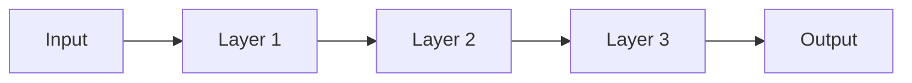

                 

**AI大模型创业：如何应对未来市场挑战？**

**作者：禅与计算机程序设计艺术 / Zen and the Art of Computer Programming**

## 1. 背景介绍

当前，人工智能（AI）大模型正在各个领域引发革命，从自然语言处理到计算机视觉，再到生物信息学，AI大模型的应用无处不在。然而，创业者面临着巨大的挑战，包括如何应对未来市场的变化，如何在激烈的竞争中脱颖而出，以及如何将AI大模型商业化。本文将深入探讨这些挑战，并提供一些建议，帮助AI创业者成功应对未来市场。

## 2. 核心概念与联系

### 2.1 AI大模型的定义

AI大模型是指具有数十亿甚至数千亿参数的模型，能够在各种任务上表现出强大的泛化能力。它们通过在大规模数据集上进行训练，学习到丰富的表示，从而能够在未见过的数据上做出准确的预测。

### 2.2 AI大模型的架构

AI大模型通常由多层神经网络组成，每层包含数百万甚至数十亿个神经元。这些神经元通过权重连接，权重通过训练过程学习得到。下图是一个简单的AI大模型架构示例：

### 2.3 AI大模型的训练

AI大模型的训练需要大量的计算资源和数据。通常，训练过程包括以下步骤：

1. 数据预处理：对数据进行清洗、标记和分割。
2. 模型初始化：随机初始化模型的权重。
3. 训练：使用反向传播算法和优化器（如Adam）更新模型的权重。
4. 验证：在验证集上评估模型的性能，并调整超参数。
5. 测试：在测试集上评估模型的最终性能。

## 3. 核心算法原理 & 具体操作步骤

### 3.1 算法原理概述

AI大模型的核心算法是深度学习，它是一种基于神经网络的机器学习方法。深度学习算法的原理是学习数据的表示，从而能够在未见过的数据上做出准确的预测。

### 3.2 算法步骤详解

深度学习算法的步骤如下：

1. 数据预处理：对数据进行清洗、标记和分割。
2. 模型构建：构建神经网络模型，包括输入层、隐藏层和输出层。
3. 权重初始化：随机初始化模型的权重。
4. 训练：使用反向传播算法和优化器（如Adam）更新模型的权重。
5. 验证：在验证集上评估模型的性能，并调整超参数。
6. 测试：在测试集上评估模型的最终性能。

### 3.3 算法优缺点

深度学习算法的优点包括：

* 具有强大的泛化能力，能够在未见过的数据上做出准确的预测。
* 能够学习到丰富的表示，从而能够在各种任务上表现出强大的性能。
* 可以自动学习特征，无需人工特征工程。

深度学习算法的缺点包括：

* 需要大量的计算资源和数据。
* 训练过程复杂，需要调整多个超参数。
* 存在过拟合的风险，需要进行正则化处理。

### 3.4 算法应用领域

AI大模型的应用领域非常广泛，包括自然语言处理、计算机视觉、生物信息学、金融、医疗保健等。例如，AI大模型可以用于构建智能助手，进行图像和语音识别，预测疾病风险，以及进行金融交易。

## 4. 数学模型和公式 & 详细讲解 & 举例说明

### 4.1 数学模型构建

AI大模型的数学模型是神经网络，它由多层神经元组成。每层神经元接收前一层神经元的输出，并通过激活函数生成自己的输出。神经网络的数学模型可以表示为：

$$y = f(x; W, b)$$

其中，$x$是输入，$y$是输出，$W$和$b$是模型的权重和偏置，$f$是激活函数。

### 4.2 公式推导过程

神经网络的训练过程是基于反向传播算法的。反向传播算法的目标是最小化损失函数，即模型的预测与真实值之间的差异。损失函数通常是均方误差（MSE）或交叉熵（CE）函数。反向传播算法的推导过程如下：

1. 正向传播：计算模型的输出$y$。
2. 计算损失函数$L(y, \hat{y})$，其中$\hat{y}$是真实值。
3. 计算梯度$\nabla_W L$和$\nabla_b L$。
4. 更新权重和偏置：$W := W - \eta \nabla_W L$和$b := b - \eta \nabla_b L$，其中$\eta$是学习率。

### 4.3 案例分析与讲解

例如，假设我们要构建一个简单的神经网络模型，用于预测房价。我们的输入$x$是房屋的面积，输出$y$是房屋的价格。我们的模型是一个单层神经网络，激活函数是线性函数。我们的损失函数是均方误差（MSE）函数。我们的训练数据是一个包含房屋面积和价格的数据集。

我们的数学模型是：

$$y = Wx + b$$

我们的损失函数是：

$$L = \frac{1}{n}\sum_{i=1}^{n}(y_i - \hat{y}_i)^2$$

其中，$y_i$是模型的预测，$

