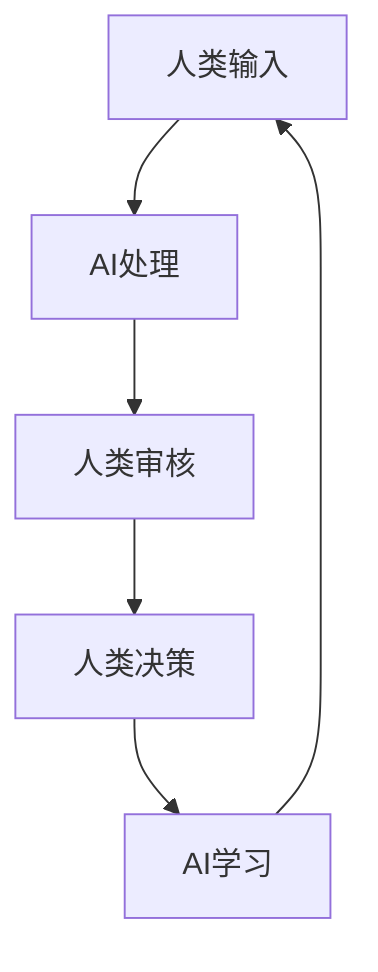

                 

**AI驱动的创新：人类计算在政府治理中的作用**

**作者：禅与计算机程序设计艺术 / Zen and the Art of Computer Programming**

## 1. 背景介绍

人工智能（AI）的发展正在各行各业引发革命，政府治理也不例外。AI驱动的创新为政府提供了新的工具，帮助其更有效地治理国家，提高公共服务质量，并增强对公民的支持。本文将探讨AI在政府治理中的作用，重点关注人类计算（Human-in-the-Loop）的概念，即人类和AI密切合作，共同驱动创新和决策。

## 2. 核心概念与联系

### 2.1 人类计算（Human-in-the-Loop）概念

人类计算是指人类和AI密切合作，共同驱动创新和决策的过程。在这个过程中，AI提供分析和预测，帮助人类做出更明智的决策。人类计算强调人类的判断和控制，确保AI的结果得到人类的理解和批准。



### 2.2 AI在政府治理中的作用

AI在政府治理中的作用包括：

- **预测和分析**：AI可以分析大量数据，预测趋势，帮助政府做出更明智的决策。
- **自动化**：AI可以自动化重复性任务，提高政府部门的效率。
- **公共服务**：AI可以改善公共服务，如智能客服、自动化审批等。
- **监控和预防**：AI可以监控系统，预防问题的发生，如交通拥堵、自然灾害等。

## 3. 核心算法原理 & 具体操作步骤

### 3.1 算法原理概述

人类计算中常用的算法包括机器学习算法（如决策树、神经网络）、规则引擎、推荐系统等。本文重点关注**解释性AI算法**，如决策树，因为它们可以帮助人类理解AI的决策过程。

### 3.2 算法步骤详解

1. **数据收集**：收集相关数据，如公共服务数据、公民数据等。
2. **数据预处理**：清洗、转换数据，并将其转换为机器学习算法可以处理的格式。
3. **模型训练**：使用收集的数据训练解释性AI算法。
4. **人类审核**：人类审核AI的结果，并提供反馈。
5. **模型优化**：根据人类反馈优化模型。
6. **决策**：人类根据AI的结果做出决策。

### 3.3 算法优缺点

**优点**：

- **决策支持**：AI可以提供数据驱动的决策支持。
- **效率**：AI可以自动化重复性任务，提高政府部门的效率。
- **透明度**：解释性AI算法可以帮助人类理解AI的决策过程。

**缺点**：

- **依赖数据质量**：AI的性能取决于数据质量。
- **解释性限制**：虽然解释性AI算法可以帮助人类理解AI的决策过程，但它们的解释能力有限。
- **伦理和隐私问题**：AI在政府治理中的应用可能会涉及伦理和隐私问题。

### 3.4 算法应用领域

人类计算在政府治理中的应用领域包括：

- **公共服务**：如智能客服、自动化审批等。
- **预测和分析**：如预测交通拥堵、自然灾害等。
- **监控**：如监控系统性能、公共服务质量等。
- **决策支持**：如支持政策制定、预算分配等。

## 4. 数学模型和公式 & 详细讲解 & 举例说明

### 4.1 数学模型构建

在人类计算中，常用的数学模型包括线性回归模型、决策树模型、神经网络模型等。本文重点关注**决策树模型**。

决策树模型是一种解释性模型，它使用树形结构表示决策规则。决策树的每个内部节点表示一个特征的测试，每个分支表示测试的结果，每个叶子节点表示一个类或决策。

### 4.2 公式推导过程

决策树模型的目标是最小化预测误差。给定一组训练数据，决策树算法的目标是找到一棵树，使得对每个训练实例，从根节点到叶子节点的路径上，每个测试的结果都与该实例的类相关。

决策树算法通常使用信息增益或Gain Ratio作为选择特征的标准。信息增益是指在当前节点选择特征后，对训练数据的信息熵的减少。Gain Ratio是信息增益与特征的固有值的比值，它考虑了特征的可取值数目。

### 4.3 案例分析与讲解

假设我们要构建一个决策树模型，预测公民是否会使用政府提供的在线服务。我们的特征包括年龄、性别、教育水平、互联网使用频率等。我们的目标是找到一棵树，使得对每个公民，从根节点到叶子节点的路径上，每个测试的结果都与该公民是否会使用在线服务相关。

我们可以使用信息增益或Gain Ratio选择特征，构建决策树。例如，如果互联网使用频率是最好的特征，我们可以在根节点测试互联网使用频率。如果公民的互联网使用频率高，我们可以进一步测试其他特征，如教育水平。如果公民的互联网使用频率低，我们可以预测公民不会使用在线服务。

## 5. 项目实践：代码实例和详细解释说明

### 5.1 开发环境搭建

我们将使用Python和scikit-learn库构建决策树模型。我们需要安装Python和scikit-learn库，并导入必要的模块。

```python
import pandas as pd
from sklearn.model_selection import train_test_split
from sklearn.tree import DecisionTreeClassifier
from sklearn.metrics import accuracy_score
```

### 5.2 源代码详细实现

假设我们已经收集了公民数据，并将其存储在CSV文件中。我们可以使用pandas库读取数据，并将其分为特征和目标变量。

```python
data = pd.read_csv('public_service_data.csv')
X = data.drop('use_online_service', axis=1)
y = data['use_online_service']
```

我们可以使用train_test_split函数将数据分为训练集和测试集。

```python
X_train, X_test, y_train, y_test = train_test_split(X, y, test_size=0.2, random_state=42)
```

我们可以使用DecisionTreeClassifier类构建决策树模型，并使用fit方法训练模型。

```python
clf = DecisionTreeClassifier(random_state=42)
clf.fit(X_train, y_train)
```

我们可以使用predict方法预测测试集的结果，并使用accuracy_score函数计算模型的准确性。

```python
y_pred = clf.predict(X_test)
accuracy = accuracy_score(y_test, y_pred)
print('Accuracy:', accuracy)
```

### 5.3 代码解读与分析

在本例中，我们使用scikit-learn库构建了一个决策树模型，预测公民是否会使用政府提供的在线服务。我们首先读取公民数据，并将其分为特征和目标变量。然后，我们将数据分为训练集和测试集。我们使用DecisionTreeClassifier类构建决策树模型，并使用fit方法训练模型。最后，我们使用predict方法预测测试集的结果，并使用accuracy_score函数计算模型的准确性。

### 5.4 运行结果展示

运行上述代码后，我们可以得到模型的准确性。例如，如果模型的准确性为0.85，我们可以预测公民是否会使用在线服务的准确率为85%。

## 6. 实际应用场景

### 6.1 政府治理中的应用

人类计算在政府治理中的应用包括：

- **公共服务**：如智能客服、自动化审批等。
- **预测和分析**：如预测交通拥堵、自然灾害等。
- **监控**：如监控系统性能、公共服务质量等。
- **决策支持**：如支持政策制定、预算分配等。

### 6.2 未来应用展望

未来，人类计算在政府治理中的应用将会更加广泛。AI可以帮助政府更好地理解公民需求，提供更好的公共服务。AI还可以帮助政府预测趋势，做出更明智的决策。然而，政府必须注意AI的伦理和隐私问题，确保AI的应用符合法律法规和道德标准。

## 7. 工具和资源推荐

### 7.1 学习资源推荐

- **书籍**：《人工智能：一种现代 Approach》作者：Stuart Russell、Peter Norvig
- **在线课程**：Coursera上的“人工智能”课程，由斯坦福大学提供
- **博客**： Towards Data Science（https://towardsdatascience.com/）

### 7.2 开发工具推荐

- **编程语言**：Python
- **库**：scikit-learn、TensorFlow、PyTorch
- **开发环境**：Jupyter Notebook、Google Colab

### 7.3 相关论文推荐

- **人类计算**：“Human-in-the-Loop Machine Learning for Government”作者：David G. Robinson、Tim M. O'Shea
- **AI在政府治理中的应用**：“Artificial Intelligence in Government: A Survey”作者：M. H. Alshammari、M. A. Aldutaibah、M. A. Aldutaibah

## 8. 总结：未来发展趋势与挑战

### 8.1 研究成果总结

本文介绍了人类计算在政府治理中的作用，重点关注了决策树模型。我们构建了一个决策树模型，预测公民是否会使用政府提供的在线服务。我们还讨论了人类计算在政府治理中的应用，以及未来的发展趋势。

### 8.2 未来发展趋势

未来，人类计算在政府治理中的应用将会更加广泛。AI可以帮助政府更好地理解公民需求，提供更好的公共服务。AI还可以帮助政府预测趋势，做出更明智的决策。然而，政府必须注意AI的伦理和隐私问题，确保AI的应用符合法律法规和道德标准。

### 8.3 面临的挑战

人类计算在政府治理中的应用面临的挑战包括：

- **数据质量**：AI的性能取决于数据质量。政府必须收集高质量的数据，并对其进行清洗和转换。
- **解释性限制**：虽然解释性AI算法可以帮助人类理解AI的决策过程，但它们的解释能力有限。政府必须注意AI的“黑箱”问题，确保AI的决策是可解释的。
- **伦理和隐私问题**：AI在政府治理中的应用可能会涉及伦理和隐私问题。政府必须注意AI的伦理和隐私问题，确保AI的应用符合法律法规和道德标准。

### 8.4 研究展望

未来，人类计算在政府治理中的研究将会集中在以下领域：

- **数据质量**：如何收集、清洗和转换高质量的数据。
- **解释性AI**：如何构建更好的解释性AI算法，帮助人类理解AI的决策过程。
- **伦理和隐私问题**：如何确保AI的应用符合法律法规和道德标准。

## 9. 附录：常见问题与解答

**Q：人类计算是什么？**

A：人类计算是指人类和AI密切合作，共同驱动创新和决策的过程。在这个过程中，AI提供分析和预测，帮助人类做出更明智的决策。人类计算强调人类的判断和控制，确保AI的结果得到人类的理解和批准。

**Q：AI在政府治理中的作用是什么？**

A：AI在政府治理中的作用包括预测和分析、自动化、公共服务、监控和预防等。

**Q：人类计算在政府治理中的应用领域是什么？**

A：人类计算在政府治理中的应用领域包括公共服务、预测和分析、监控、决策支持等。

**Q：人类计算在政府治理中的未来发展趋势是什么？**

A：未来，人类计算在政府治理中的应用将会更加广泛。AI可以帮助政府更好地理解公民需求，提供更好的公共服务。AI还可以帮助政府预测趋势，做出更明智的决策。然而，政府必须注意AI的伦理和隐私问题，确保AI的应用符合法律法规和道德标准。

**Q：人类计算在政府治理中的挑战是什么？**

A：人类计算在政府治理中的挑战包括数据质量、解释性限制、伦理和隐私问题等。

**Q：人类计算在政府治理中的研究展望是什么？**

A：未来，人类计算在政府治理中的研究将会集中在数据质量、解释性AI、伦理和隐私问题等领域。

**Q：如何构建决策树模型？**

A：我们可以使用scikit-learn库构建决策树模型。我们首先读取公民数据，并将其分为特征和目标变量。然后，我们将数据分为训练集和测试集。我们使用DecisionTreeClassifier类构建决策树模型，并使用fit方法训练模型。最后，我们使用predict方法预测测试集的结果，并使用accuracy_score函数计算模型的准确性。

**Q：如何评估决策树模型的性能？**

A：我们可以使用accuracy_score函数计算决策树模型的准确性。准确性是指模型预测正确的实例数与总实例数的比值。我们还可以使用其他指标，如精确度、召回率、F1分数等，评估模型的性能。

**Q：如何解释决策树模型的结果？**

A：决策树模型是一种解释性模型，它使用树形结构表示决策规则。我们可以通过查看决策树的结构，理解模型的决策过程。我们还可以使用特征重要性来理解模型的决策过程。特征重要性是指模型在决策过程中使用特征的频率和影响力的度量。

**Q：如何处理决策树模型的过拟合问题？**

A：决策树模型容易过拟合，即模型过于复杂，无法泛化到新数据上。我们可以使用以下方法处理决策树模型的过拟合问题：

- **剪枝**：剪枝是指删除决策树的分支，减小模型的复杂度。
- **正则化**：正则化是指在模型训练过程中添加惩罚项，限制模型的复杂度。
- **数据增强**：数据增强是指生成新的训练数据，扩大训练数据的规模。

**Q：如何处理决策树模型的“黑箱”问题？**

A：决策树模型虽然是一种解释性模型，但它的决策过程仍然可能是“黑箱”的，即人类无法理解模型的决策过程。我们可以使用以下方法处理决策树模型的“黑箱”问题：

- **特征重要性**：我们可以使用特征重要性来理解模型的决策过程。特征重要性是指模型在决策过程中使用特征的频率和影响力的度量。
- **局部解释**：我们可以使用局部解释方法，如LIME（Local Interpretable Model-Agnostic Explanations），帮助人类理解模型的局部决策过程。
- **对抗样本**：我们可以使用对抗样本，即故意设计的样本，帮助人类理解模型的决策过程。对抗样本是指模型预测错误的样本，我们可以通过分析对抗样本，理解模型的决策过程。

**Q：如何处理决策树模型的伦理和隐私问题？**

A：决策树模型在政府治理中的应用可能会涉及伦理和隐私问题。我们可以使用以下方法处理决策树模型的伦理和隐私问题：

- **数据匿名化**：我们可以使用数据匿名化技术，如K-匿名化，帮助保护公民的隐私。
- **伦理审查**：我们可以进行伦理审查，确保AI的应用符合法律法规和道德标准。
- **公开透明**：我们可以公开AI的决策过程，帮助公民理解AI的决策过程，并提供反馈。

**Q：如何处理决策树模型的偏见问题？**

A：决策树模型在政府治理中的应用可能会涉及偏见问题，即模型的决策结果存在偏见。我们可以使用以下方法处理决策树模型的偏见问题：

- **公平性约束**：我们可以添加公平性约束，确保模型的决策结果公平。
- **偏见检测**：我们可以使用偏见检测方法，如Demographic Parity、Equal Opportunity、Equalized Odds，检测模型的偏见。
- **偏见修正**：我们可以使用偏见修正方法，如Adversarial Debiasing、Reweighing、Preprocessing，修正模型的偏见。

**Q：如何处理决策树模型的可解释性问题？**

A：决策树模型虽然是一种解释性模型，但它的决策过程仍然可能是不可解释的，即人类无法理解模型的决策过程。我们可以使用以下方法处理决策树模型的可解释性问题：

- **特征重要性**：我们可以使用特征重要性来理解模型的决策过程。特征重要性是指模型在决策过程中使用特征的频率和影响力的度量。
- **局部解释**：我们可以使用局部解释方法，如LIME（Local Interpretable Model-Agnostic Explanations），帮助人类理解模型的局部决策过程。
- **对抗样本**：我们可以使用对抗样本，即故意设计的样本，帮助人类理解模型的决策过程。对抗样本是指模型预测错误的样本，我们可以通过分析对抗样本，理解模型的决策过程。

**Q：如何处理决策树模型的可靠性问题？**

A：决策树模型在政府治理中的应用可能会涉及可靠性问题，即模型的决策结果不可靠。我们可以使用以下方法处理决策树模型的可靠性问题：

- **模型评估**：我们可以使用模型评估方法，如交叉验证、A/B测试，评估模型的可靠性。
- **模型集成**：我们可以使用模型集成方法，如Bagging、Boosting、Stacking，提高模型的可靠性。
- **模型监控**：我们可以使用模型监控方法，如Concept Drift Detection、Anomaly Detection，监控模型的可靠性。

**Q：如何处理决策树模型的可用性问题？**

A：决策树模型在政府治理中的应用可能会涉及可用性问题，即模型的决策结果不可用。我们可以使用以下方法处理决策树模型的可用性问题：

- **模型部署**：我们可以使用模型部署方法，如容器化、云部署，提高模型的可用性。
- **模型优化**：我们可以使用模型优化方法，如模型压缩、模型量化，提高模型的可用性。
- **模型监控**：我们可以使用模型监控方法，如模型性能监控、模型可用性监控，监控模型的可用性。

**Q：如何处理决策树模型的可持续性问题？**

A：决策树模型在政府治理中的应用可能会涉及可持续性问题，即模型的决策结果不可持续。我们可以使用以下方法处理决策树模型的可持续性问题：

- **模型更新**：我们可以使用模型更新方法，如在线学习、模型更新策略，更新模型的决策结果。
- **模型评估**：我们可以使用模型评估方法，如长期评估、模型评估指标，评估模型的可持续性。
- **模型监控**：我们可以使用模型监控方法，如模型性能监控、模型可持续性监控，监控模型的可持续性。

**Q：如何处理决策树模型的可扩展性问题？**

A：决策树模型在政府治理中的应用可能会涉及可扩展性问题，即模型的决策结果不可扩展。我们可以使用以下方法处理决策树模型的可扩展性问题：

- **模型扩展**：我们可以使用模型扩展方法，如模型扩展策略、模型集成，扩展模型的决策结果。
- **模型评估**：我们可以使用模型评估方法，如扩展评估、模型评估指标，评估模型的可扩展性。
- **模型监控**：我们可以使用模型监控方法，如模型性能监控、模型可扩展性监控，监控模型的可扩展性。

**Q：如何处理决策树模型的可靠性和可用性问题？**

A：决策树模型在政府治理中的应用可能会涉及可靠性和可用性问题，即模型的决策结果不可靠或不可用。我们可以使用以下方法处理决策树模型的可靠性和可用性问题：

- **模型评估**：我们可以使用模型评估方法，如交叉验证、A/B测试，评估模型的可靠性和可用性。
- **模型集成**：我们可以使用模型集成方法，如Bagging、Boosting、Stacking，提高模型的可靠性和可用性。
- **模型监控**：我们可以使用模型监控方法，如Concept Drift Detection、Anomaly Detection，监控模型的可靠性和可用性。
- **模型部署**：我们可以使用模型部署方法，如容器化、云部署，提高模型的可用性。
- **模型优化**：我们可以使用模型优化方法，如模型压缩、模型量化，提高模型的可用性。
- **模型监控**：我们可以使用模型监控方法，如模型性能监控、模型可用性监控，监控模型的可用性。

**Q：如何处理决策树模型的可持续性和可扩展性问题？**

A：决策树模型在政府治理中的应用可能会涉及可持续性和可扩展性问题，即模型的决策结果不可持续或不可扩展。我们可以使用以下方法处理决策树模型的可持续性和可扩展性问题：

- **模型更新**：我们可以使用模型更新方法，如在线学习、模型更新策略，更新模型的决策结果。
- **模型评估**：我们可以使用模型评估方法，如长期评估、模型评估指标，评估模型的可持续性和可扩展性。
- **模型监控**：我们可以使用模型监控方法，如模型性能监控、模型可持续性监控、模型可扩展性监控，监控模型的可持续性和可扩展性。
- **模型扩展**：我们可以使用模型扩展方法，如模型扩展策略、模型集成，扩展模型的决策结果。

**Q：如何处理决策树模型的伦理和隐私问题？**

A：决策树模型在政府治理中的应用可能会涉及伦理和隐私问题，即模型的决策结果存在伦理和隐私问题。我们可以使用以下方法处理决策树模型的伦理和隐私问题：

- **数据匿名化**：我们可以使用数据匿名化技术，如K-匿名化，帮助保护公民的隐私。
- **伦理审查**：我们可以进行伦理审查，确保AI的应用符合法律法规和道德标准。
- **公开透明**：我们可以公开AI的决策过程，帮助公民理解AI的决策过程，并提供反馈。
- **偏见检测**：我们可以使用偏见检测方法，如Demographic Parity、Equal Opportunity、Equalized Odds，检测模型的偏见。
- **偏见修正**：我们可以使用偏见修正方法，如Adversarial Debiasing、Reweighing、Preprocessing，修正模型的偏见。

**Q：如何处理决策树模型的可解释性问题？**

A：决策树模型在政府治理中的应用可能会涉及可解释性问题，即模型的决策结果不可解释。我们可以使用以下方法处理决策树模型的可解释性问题：

- **特征重要性**：我们可以使用特征重要性来理解模型的决策过程。特征重要性是指模型在决策过程中使用特征的频率和影响力的度量。
- **局部解释**：我们可以使用局部解释方法，如LIME（Local Interpretable Model-Agnostic Explanations），帮助人类理解模型的局部决策过程。
- **对抗样本**：我们可以使用对抗样本，即故意设计的样本，帮助人类理解模型的决策过程。对抗样本是指模型预测错误的样本，我们可以通过分析对抗样本，理解模型的决策过程。

**Q：如何处理决策树模型的可靠性、可用性、可持续性和可扩展性问题？**

A：决策树模型在政府治理中的应用可能会涉及可靠性、可用性、可持续性和可扩展性问题，即模型的决策结果不可靠、不可用、不可持续或不可扩展。我们可以使用以下方法处理决策树模型的可靠性、可用性、可持续性和可扩展性问题：

- **模型评估**：我们可以使用模型评估方法，如交叉验证、A/B测试，评估模型的可靠性、可用性、可持续性和可扩展性。
- **模型集成**：我们可以使用模型集成方法，如Bagging、Boosting、Stacking，提高模型的可靠性、可用性、可持续性和可扩展性。
- **模型监控**：我们可以使用模型监控方法，如Concept Drift Detection、Anomaly Detection，监控模型的可靠性、可用性、可持续性和可扩展性。
- **模型部署**：我们可以使用模型部署方法，如容器化、云部署，提高模型的可用性。
- **模型优化**：我们可以使用模型优化方法，如模型压缩、模型量化，提高模型的可用性。
- **模型监控**：我们可以使用模型监控方法，如模型性能监控、模型可用性监控，监控模型的可用性。
- **模型更新**：我们可以使用模型更新方法，如在线学习、模型更新策略，更新模型的决策结果。
- **模型评估**：我们可以使用模型评估方法，如长期评估、模型评估指标，评估模型的可持续性和可扩展性。
- **模型监控**：我们可以使用模型监控方法，如模型性能监控、模型可持续性监控、模型可扩展性监控，监控模型的可持续性和可扩展性。
- **模型扩展**：我们可以使用模型扩展方法，如模型扩展策略、模型集成，扩展模型的决策结果。

**Q：如何处理决策树模型的伦理、隐私、可解释性、可靠性、可用性、可持续性和可扩展性问题？**

A：决策树模型在政府治理中的应用可能会涉及伦理、隐私、可解释性、可靠性、可用性、可持续性和可扩展性问题，即模型的决策结果存在伦理和隐私问题，不可解释，不可靠、不可用、不可持续或不可扩展。我们可以使用以下方法处理决策树模型的伦理、隐私、可解释性、可靠性、可用性、可持续性和可扩展性问题：

- **数据匿名化**：我们可以使用数据匿名化技术，如K-匿名化，帮助保护公民的隐私。
- **伦理审查**：我们可以进行伦理审查，确保AI的应用符合法律法规和道德标准。
- **公开透明**：我们可以公开AI的决策过程，帮助公民理解AI的决策过程，并提供反馈。
- **偏见检测**：我们可以使用偏见检测方法，如Demographic Parity、Equal Opportunity、Equalized Odds，检测模型的偏见。
- **偏见修正**：我们可以使用偏见修正方法，如Adversarial Debiasing、Reweighing、Preprocessing，修正模型的偏见。
- **特征重要性**：我们可以使用特征重要性来理解模型的决策过程。特征重要性是指模型在决策过程中使用特征的频率和影响力的度量。
- **局部解释**：我们可以使用局部解释方法，如LIME（Local Interpretable Model-Agnostic Explanations），帮助人类理解模型的局部决策过程。
- **对抗样本**：我们可以使用对抗样本，即故意设计的样本，帮助人类理解模型的决策过程。对抗样本是指模型预测错误

