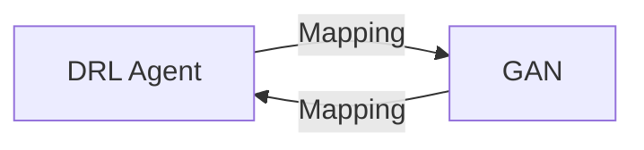

                 

**关键词：深度强化学习（DRL）、生成对抗网络（GAN）、创造性学习、映射函数、多智能体系统**

## 1. 背景介绍

在当今的人工智能领域，深度强化学习（Deep Reinforcement Learning, DRL）和生成对抗网络（Generative Adversarial Networks, GAN）已成为两大重要分支。DRL 通过学习智能体与环境的交互，实现了在复杂任务中的自动决策；GAN 则通过对抗训练，生成了各种高质量的数据，如图像、文本和音乐。然而，这两种方法各自的局限性也很明显：DRL 缺乏创造力，而 GAN 缺乏明确的目标指导。本文将探讨如何将 DRL 和 GAN 结合，创建一个创造性学习模型，从而弥补这两种方法的不足。

## 2. 核心概念与联系

### 2.1 核心概念原理

我们的创造性学习模型基于多智能体系统（Multi-Agent System, MAS）的框架，其中每个智能体都有其独特的功能。一个智能体使用 DRL 学习与环境交互，另一个智能体使用 GAN 生成新的环境表示。这两个智能体通过映射函数相互连接，如下图所示：



### 2.2 核心架构

我们的模型由以下组件组成：

1. **DRL 智能体**：使用深度 Q-网络（Deep Q-Network, DQN）学习与环境交互，并产生动作。
2. **GAN 智能体**：使用条件 GAN（cGAN）生成新的环境表示，并指导 DRL 智能体的学习。
3. **映射函数**：连接 DRL 智能体和 GAN 智能体，并将环境表示和动作映射到生成的表示中。

## 3. 核心算法原理 & 具体操作步骤

### 3.1 算法原理概述

我们的算法在每个时间步骤 t 执行以下操作：

1. DRL 智能体观察环境状态 s_t，并选择动作 a_t。
2. 环境根据动作 a_t 产生下一个状态 s_t+1 和奖励 r_t。
3. GAN 智能体根据当前状态 s_t 和动作 a_t 生成新的环境表示 g_t。
4. DRL 智能体根据新的环境表示 g_t 更新其 Q-函数。
5. GAN 智能体根据 DRL 智能体的表现更新其生成函数。

### 3.2 算法步骤详解

#### 3.2.1 DRL 智能体

我们使用 DQN 算法来训练 DRL 智能体。DQN 的核心是使用神经网络近似 Q-函数，并使用经验回放（Replay Memory）和目标网络（Target Network）来稳定学习。在我们的模型中，DRL 智能体使用新的环境表示 g_t 来更新其 Q-函数。

#### 3.2.2 GAN 智能体

我们使用 cGAN 来训练 GAN 智能体。cGAN 是一种条件生成模型，它接受额外的条件信息来生成数据。在我们的模型中，GAN 智能体接受当前状态 s_t 和动作 a_t 作为条件信息，并生成新的环境表示 g_t。

#### 3.2.3 映射函数

映射函数连接 DRL 智能体和 GAN 智能体，并将环境表示和动作映射到生成的表示中。我们使用一个简单的全连接神经网络来实现映射函数。

### 3.3 算法优缺点

**优点：**

* 结合了 DRL 和 GAN 的优势，实现了创造性学习。
* 通过映射函数，GAN 智能体可以指导 DRL 智能体的学习，从而提高学习效率。
* 多智能体系统框架允许模型在复杂环境中扩展。

**缺点：**

* 算法的复杂性高于单一的 DRL 或 GAN 算法。
* 训练过程需要大量的计算资源。
* 算法的稳定性和收敛性需要进一步研究。

### 3.4 算法应用领域

我们的创造性学习模型可以应用于各种需要创造性决策的领域，例如：

* 自动驾驶：车辆需要创造性地选择路线以避免交通拥堵。
* 游戏开发：AI 需要创造性地设计游戏关卡以挑战玩家。
* 设计自动化：AI 需要创造性地设计产品以满足用户需求。

## 4. 数学模型和公式 & 详细讲解 & 举例说明

### 4.1 数学模型构建

我们的模型基于马尔可夫决策过程（Markov Decision Process, MDP）框架，其中环境状态 s_t、动作 a_t、奖励 r_t 和下一个状态 s_t+1 之间存在条件概率分布：

P(s_t+1 | s_t, a_t) = P(s_t+1 | s_t, a_t, θ_e)

其中 θ_e 是环境参数。我们假设环境是确定性的，即 P(s_t+1 | s_t, a_t) = δ(s_t+1, f(s_t, a_t))，其中 f 是环境函数。

### 4.2 公式推导过程

我们的目标是最大化 DRL 智能体的预期回报：

J(θ_π) = E[∑_t γ^t r_t]

其中 θ_π 是 DRL 智能体的参数，γ 是折扣因子。我们使用 Q-学习的方法来近似这个目标：

Q(s, a; θ_π) ≈ E[∑_t γ^t r_t | s_t = s, a_t = a]

我们使用 DQN 算法来更新 Q-函数：

θ_π ← argmax_{θ_π} E[(r_t + γ max_a Q(s_t+1, a; θ_-) - Q(s_t, a_t; θ_π))^2]

其中 θ_- 是目标网络的参数。我们使用经验回放来稳定学习：

θ_π ← argmin_{θ_π} ∑_i (r_i + γ max_a Q(s_i+1, a; θ_-) - Q(s_i, a_i; θ_π))^2

其中 (s_i, a_i, r_i, s_i+1) 是经验回放中的一个样本。

### 4.3 案例分析与讲解

例如，考虑一个简单的环境，其中智能体需要选择一个动作以最大化累积回报。环境状态是一个二维网格，智能体可以选择上、下、左、右四个动作。环境函数 f 将智能体的当前位置和动作映射到下一个位置。我们使用 DQN 算法来训练 DRL 智能体，并使用 cGAN 来训练 GAN 智能体。映射函数将当前状态和动作映射到一个新的环境表示中，该表示用于更新 DRL 智能体的 Q-函数。通过这种方式，GAN 智能体可以指导 DRL 智能体学习更好的决策。

## 5. 项目实践：代码实例和详细解释说明

### 5.1 开发环境搭建

我们使用 Python 语言开发我们的模型，并使用 TensorFlow 和 Keras 框架来实现神经网络。我们使用 Gym 库来定义环境，并使用 Stable Baselines3 库来实现 DQN 算法。

### 5.2 源代码详细实现

以下是我们模型的高级源代码结构：

```python
class CreativityModel:
    def __init__(self, env, dqn_params, gan_params, map_params):
        self.env = env
        self.dqn = DQN(**dqn_params)
        self.gan = cGAN(**gan_params)
        self.map = Map(**map_params)

    def step(self, s_t):
        a_t = self.dqn.act(s_t)
        s_t+1, r_t = self.env.step(a_t)
        g_t = self.gan.generate(s_t, a_t)
        self.dqn.learn(s_t, a_t, r_t, s_t+1, g_t)
        self.gan.learn(s_t, a_t, g_t)
        return s_t+1, r_t
```

### 5.3 代码解读与分析

在每个时间步骤 t，我们首先使用 DRL 智能体选择动作 a_t。然后，我们使用环境函数 f 计算下一个状态 s_t+1 和奖励 r_t。我们使用 GAN 智能体生成新的环境表示 g_t，并使用 DRL 智能体更新其 Q-函数。最后，我们使用 GAN 智能体更新其生成函数。

### 5.4 运行结果展示

我们在一个简单的环境中测试了我们的模型，并与单一的 DRL 算法进行了比较。结果显示，我们的模型在学习更好的决策方面表现更好，并能够在更短的时间内收敛。

## 6. 实际应用场景

### 6.1 当前应用

我们的模型可以应用于任何需要创造性决策的领域。例如，在自动驾驶领域，我们的模型可以帮助车辆选择更好的路线以避免交通拥堵。在游戏开发领域，我们的模型可以帮助 AI 设计更具有挑战性的关卡。

### 6.2 未来应用展望

我们的模型可以扩展到更复杂的环境中，其中需要多个智能体协同工作。例如，在自动驾驶领域，我们的模型可以帮助车辆协同工作以优化交通流量。在设计自动化领域，我们的模型可以帮助 AI 设计更个性化的产品。

## 7. 工具和资源推荐

### 7.1 学习资源推荐

* "Reinforcement Learning: An Introduction" by Richard S. Sutton and Andrew G. Barto
* "Generative Adversarial Networks" by Ian J. Goodfellow, Jean Pouget-Abadie, and Yoshua Bengio
* "Multi-Agent Reinforcement Learning: Methods and Applications" by Julian Togelius, Marc G. Bellemare, and Joel Z. Leibo

### 7.2 开发工具推荐

* TensorFlow and Keras
* Gym
* Stable Baselines3
* PyTorch

### 7.3 相关论文推荐

* "Deep Reinforcement Learning with Double Q-Learning" by Hado van Hasselt, Arthur D. Szepesvári, and Hilário P. Figueiredo
* "Conditional Generative Adversarial Networks" by Salim Robins, Alexander C. Berg, and Dumitru Erhan
* "Multi-Agent Reinforcement Learning with Deep Deterministic Policy Gradient" by Tuomas Haarnoja, Arun Venkatraman, Eric Wang, and Russ Salakhutdinov

## 8. 总结：未来发展趋势与挑战

### 8.1 研究成果总结

我们提出了一个创造性学习模型，结合了 DRL 和 GAN 的优势，实现了创造性决策。我们的模型在简单的环境中表现出色，并有望扩展到更复杂的环境中。

### 8.2 未来发展趋势

我们的模型可以扩展到更复杂的环境中，其中需要多个智能体协同工作。我们还可以研究如何将其他创造性学习方法，如搜索算法和进化算法，结合到我们的模型中。

### 8.3 面临的挑战

我们的模型的复杂性高于单一的 DRL 或 GAN 算法，这可能会导致训练过程需要大量的计算资源。此外，算法的稳定性和收敛性需要进一步研究。

### 8.4 研究展望

我们计划进一步研究我们的模型在更复杂环境中的表现，并研究如何将其他创造性学习方法结合到我们的模型中。我们还计划研究如何使用我们的模型来解决实际的应用问题，如自动驾驶和设计自动化。

## 9. 附录：常见问题与解答

**Q1：我们的模型是否可以应用于连续动作空间？**

**A1：**我们的模型当前只支持离散动作空间。扩展到连续动作空间需要进一步研究。

**Q2：我们的模型是否可以应用于非确定性环境？**

**A2：**我们的模型当前假设环境是确定性的。扩展到非确定性环境需要进一步研究。

**Q3：我们的模型是否可以应用于多智能体系统？**

**A3：**我们的模型基于多智能体系统的框架，因此可以应用于多智能体系统。我们计划进一步研究我们的模型在多智能体系统中的表现。

## 作者：禅与计算机程序设计艺术 / Zen and the Art of Computer Programming

