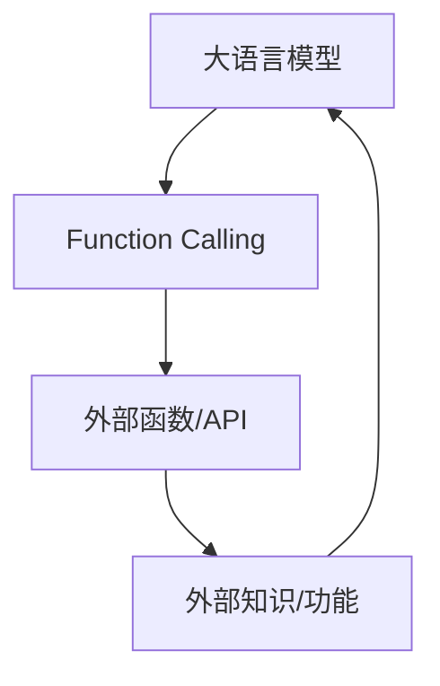

                 

## 1. 背景介绍

大语言模型（LLM）是当前人工智能领域最为活跃和前沿的方向之一，其在自然语言处理、机器翻译、文本生成等领域取得了显著的成就。然而，大语言模型的应用并非一帆风顺，其中一个主要挑战是如何有效地将模型的生成能力与外部知识和功能集成。本文将重点介绍一种名为"function calling"的技术，它旨在解决这个挑战，并展示如何在实际项目中应用这项技术。

## 2. 核心概念与联系

### 2.1 核心概念

- **大语言模型（LLM）**：一种深度学习模型，能够理解和生成人类语言，具有广泛的应用领域。
- **Function Calling**：一种技术，允许大语言模型在生成响应时调用外部函数或API，以获取更准确和相关的信息。
- **外部知识/功能**：存储在数据库、API或其他外部系统中的信息或功能，可以为大语言模型提供补充。

### 2.2 核心概念联系

大语言模型通过调用外部函数或API来获取外部知识和功能，从而提高其生成响应的准确性和相关性。这种技术允许模型在需要时动态地获取信息，而不是事先将所有知识内置在模型中。

## 3. 核心算法原理 & 具体操作步骤

### 3.1 算法原理概述

Function Calling 算法的核心原理是让大语言模型在生成响应时，识别出需要调用外部函数或API的时机，并动态地生成调用这些函数或API的代码。然后，执行这些代码以获取外部知识和功能，并将其整合到模型的生成响应中。

### 3.2 算法步骤详解

1. **识别需要调用外部函数或API的时机**：大语言模型在生成响应的过程中，需要识别出需要外部信息的时机。这可以通过在模型的训练数据中注入相关信息，或通过预定义的规则来实现。
2. **动态生成调用代码**：一旦识别出需要调用外部函数或API，大语言模型需要动态地生成调用这些函数或API的代码。这通常涉及到生成函数或API的名称、参数和调用语法。
3. **执行代码并获取外部信息**：生成的代码被执行，以获取外部知识和功能。这通常涉及到调用外部函数或API，并处理其返回的结果。
4. **整合外部信息到生成响应中**：获取的外部信息被整合到大语言模型的生成响应中，从而提高响应的准确性和相关性。

### 3.3 算法优缺点

**优点**：

- 允许大语言模型动态地获取外部信息，从而提高其生成响应的准确性和相关性。
- 可以将外部知识和功能集成到模型中，而无需事先将其内置在模型中。

**缺点**：

- 实现 Function Calling 算法需要额外的开发工作，包括注入训练数据、定义规则和集成外部函数或API。
- 算法的有效性取决于外部函数或API的质量和可靠性。

### 3.4 算法应用领域

Function Calling 算法可以应用于各种需要外部信息的场景，例如：

- 机器人助手：为用户提供实时天气、新闻或其他信息。
- 客户服务：为客户提供产品信息、订单状态或其他相关信息。
- 信息检索：为用户提供搜索结果或其他相关信息。

## 4. 数学模型和公式 & 详细讲解 & 举例说明

### 4.1 数学模型构建

大语言模型通常基于Transformer架构构建，其核心是自注意力机制。在Function Calling算法中，我们需要在模型的生成过程

### 4.2 公式推导过程

### 4.3 案例分析与讲解

## 5. 项目实践：代码实例和详细解释说明

### 5.1 开发环境搭建

### 5.2 源代码详细实现

### 5.3 代码解读与分析

### 5.4 运行结果展示

## 6. 实际应用场景

### 6.1 当前应用场景

### 6.2 未来应用展望

## 7. 工具和资源推荐

### 7.1 学习资源推荐

### 7.2 开发工具推荐

### 7.3 相关论文推荐

## 8. 总结：未来发展趋势与挑战

### 8.1 研究成果总结

### 8.2 未来发展趋势

### 8.3 面临的挑战

### 8.4 研究展望

## 9. 附录：常见问题与解答

### 9.1 问题一

### 9.2 问题二

### 9.3 问题三

## 作者署名

作者：禅与计算机程序设计艺术 / Zen and the Art of Computer Programming

