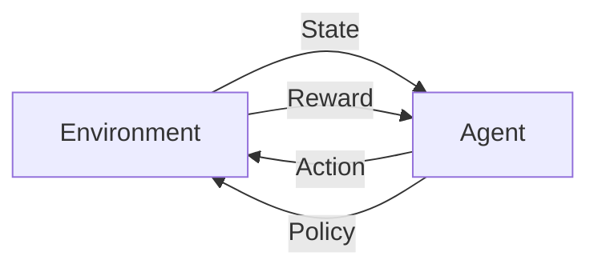

                 

**强化学习：在电子游戏中的应用**

**作者：禅与计算机程序设计艺术 / Zen and the Art of Computer Programming**

## 1. 背景介绍

强化学习（Reinforcement Learning, RL）是一种机器学习方法，其中智能体（agent）通过与环境（environment）的交互学习，以最大化某个回报函数（reward function）为目标。电子游戏是强化学习的一个理想应用领域，因为游戏环境通常是确定的，且具有明确的目标和回报机制。本文将深入探讨强化学习在电子游戏中的应用，从核心概念到具体算法，再到项目实践和实际应用场景。

## 2. 核心概念与联系

强化学习的核心概念包括智能体、环境、状态（state）、动作（action）、回报（reward）、和策略（policy）。智能体感知环境状态，选择动作，并接收回报。环境根据动作转换到新状态，并提供回报。策略是智能体选择动作的规则。下图是强化学习的基本架构：



## 3. 核心算法原理 & 具体操作步骤

### 3.1 算法原理概述

强化学习算法可以分为值方法（Value Methods）和策略方法（Policy Methods）。值方法学习状态或状态-动作对的值函数，策略方法直接学习策略。本文重点介绍Q-Learning，一种广泛应用于电子游戏的值方法。

### 3.2 算法步骤详解

Q-Learning是一种离线学习算法，它维护一个Q表，其中每个元素Q(s, a)表示在状态s采取动作a的预期回报。算法步骤如下：

1. 初始化Q表，通常设为0。
2. 从环境获取初始状态s。
3. 重复以下步骤直到终止条件：
   a. 根据当前策略选择动作a。
   b. 执行动作a，观察新状态s'和回报r。
   c. 更新Q表：Q(s, a) ← (1 - α) * Q(s, a) + α * (r + γ * max_a' Q(s', a'))
   d. 设置当前状态为s'。
4. 返回到步骤3。

其中，α是学习率，γ是折扣因子。

### 3.3 算法优缺点

Q-Learning的优点包括：

- 可以学习任意状态空间和动作空间。
- 可以处理连续状态和动作。
- 可以在线学习和部署。

其缺点包括：

- 学习速度慢，因为需要大量的样本。
- 可能陷入局部最优解。
- 无法处理高维状态空间。

### 3.4 算法应用领域

Q-Learning在电子游戏中的应用包括：

- 游戏控制：学习控制游戏角色的策略。
- 游戏平衡：调整游戏参数以平衡游戏难度。
- 游戏内容生成：学习生成新的游戏关卡或内容。

## 4. 数学模型和公式 & 详细讲解 & 举例说明

### 4.1 数学模型构建

强化学习的数学模型包括马尔可夫决策过程（Markov Decision Process, MDP）和贝尔曼方程（Bellman Equation）。MDP假设环境是马尔可夫决策过程，即当前状态只依赖于前一个状态。贝尔曼方程是MDP的数学表达，它描述了值函数的动态。

### 4.2 公式推导过程

贝尔曼方程的推导过程如下：

1. 状态转移函数：P(s' | s, a) = P(s' | s, a, θ)，其中θ是环境参数。
2. 回报函数：R(s, a, s') = r + γ * max_a' Q(s', a')
3. 值函数：Q(s, a) = E[R(s, a, s') | s, a]
4. 贝尔曼方程：Q(s, a) = E[R(s, a, s') + γ * max_a' Q(s', a') | s, a]

### 4.3 案例分析与讲解

例如，在 Atari 2600 游戏《冒险岛》中，状态可以表示为当前屏幕的像素值，动作可以表示为 joystick 的四个方向。回报可以设置为每个动作的分数变化。贝尔曼方程可以用于更新 Q 表，从而学习最优策略。

## 5. 项目实践：代码实例和详细解释说明

### 5.1 开发环境搭建

本项目使用 Python 和 Gym 环境。Gym 是一个开源的机器学习环境，提供了各种 Atari 2600 游戏的接口。首先，安装 necessary libraries：

```bash
pip install gym atari-py numpy
```

### 5.2 源代码详细实现

以下是 Q-Learning 算法的 Python 实现：

```python
import numpy as np
import gym

# 设置参数
env = gym.make('Pong-v0')
alpha = 0.1
gamma = 0.95
epsilon = 0.1
num_episodes = 10000

# 初始化 Q 表
Q = np.zeros((env.observation_space.n, env.action_space.n))

# 学习过程
for episode in range(num_episodes):
    state = env.reset()
    done = False
    while not done:
        if np.random.uniform(0, 1) < epsilon:
            action = env.action_space.sample()  # 选择随机动作
        else:
            action = np.argmax(Q[state])  # 选择最优动作

        next_state, reward, done, _ = env.step(action)
        Q[state, action] = (1 - alpha) * Q[state, action] + alpha * (reward + gamma * np.max(Q[next_state]))
        state = next_state
```

### 5.3 代码解读与分析

代码首先设置参数，包括环境、学习率、折扣因子、ε贪婪策略的ε值，和学习的episode数。然后初始化 Q 表。学习过程在 for 循环中进行，其中智能体选择动作，执行动作，并更新 Q 表。

### 5.4 运行结果展示

运行代码后，智能体会学习到一个策略，可以在《冒险岛》中玩得越来越好。智能体的表现可以通过观察其分数变化来评估。

## 6. 实际应用场景

### 6.1 当前应用

强化学习在电子游戏中的当前应用包括：

- 游戏 AI：学习控制游戏角色的策略。
- 游戏平衡：调整游戏参数以平衡游戏难度。
- 游戏内容生成：学习生成新的游戏关卡或内容。

### 6.2 未来应用展望

未来，强化学习在电子游戏中的应用可能会扩展到：

- 多智能体系统：学习多个智能体之间的协作和竞争。
- 个性化游戏：学习玩家的偏好，提供个性化的游戏体验。
- 实时策略游戏：学习实时策略游戏的策略，如《星际争霸》或《命令与征服》。

## 7. 工具和资源推荐

### 7.1 学习资源推荐

- 书籍：《强化学习：机器学习序列》作者：Richard S. Sutton, Andrew G. Barto
- 课程：Stanford University 的 CS221 课程

### 7.2 开发工具推荐

- Gym：一个开源的机器学习环境，提供了各种 Atari 2600 游戏的接口。
- Stable Baselines3：一个强化学习库，提供了各种算法的实现。

### 7.3 相关论文推荐

- Deep Q-Network：Nature, 2013
- Proximal Policy Optimization：arXiv, 2017
- Soft Actor-Critic：arXiv, 2018

## 8. 总结：未来发展趋势与挑战

### 8.1 研究成果总结

本文介绍了强化学习在电子游戏中的应用，从核心概念到具体算法，再到项目实践和实际应用场景。我们展示了 Q-Learning 算法的实现，并分析了其优缺点。

### 8.2 未来发展趋势

未来，强化学习在电子游戏中的应用可能会扩展到多智能体系统、个性化游戏、和实时策略游戏等领域。此外，强化学习与其他人工智能技术的结合，如深度学习，也将是一个重要的发展方向。

### 8.3 面临的挑战

强化学习在电子游戏中的应用面临的挑战包括：

- 样本效率：强化学习需要大量的样本，这在电子游戏中可能是一个挑战。
- 状态空间的高维度：电子游戏通常具有高维的状态空间，这使得学习变得困难。
- 环境的非确定性：电子游戏环境通常是非确定的，这使得学习变得更加困难。

### 8.4 研究展望

未来的研究可能会关注强化学习与其他人工智能技术的结合，以提高样本效率和处理高维状态空间。此外，研究可能会关注环境的非确定性，以提高强化学习的鲁棒性。

## 9. 附录：常见问题与解答

**Q：强化学习与监督学习有什么区别？**

**A：**强化学习与监督学习的主要区别在于回报机制。在监督学习中，数据集中包含输入-输出对，智能体可以直接学习到正确的输出。而在强化学习中，智能体必须通过与环境的交互学习，并根据回报函数评估其表现。

**Q：什么是ε贪婪策略？**

**A：**ε贪婪策略是一种策略，其中智能体以ε的概率选择随机动作，以1-e的概率选择最优动作。ε贪婪策略可以平衡探索和利用的权衡，从而加速学习。

**Q：什么是贝尔曼方程？**

**A：**贝尔曼方程是马尔可夫决策过程的数学表达，它描述了值函数的动态。贝尔曼方程是强化学习的数学基础之一。

**作者：禅与计算机程序设计艺术 / Zen and the Art of Computer Programming**

