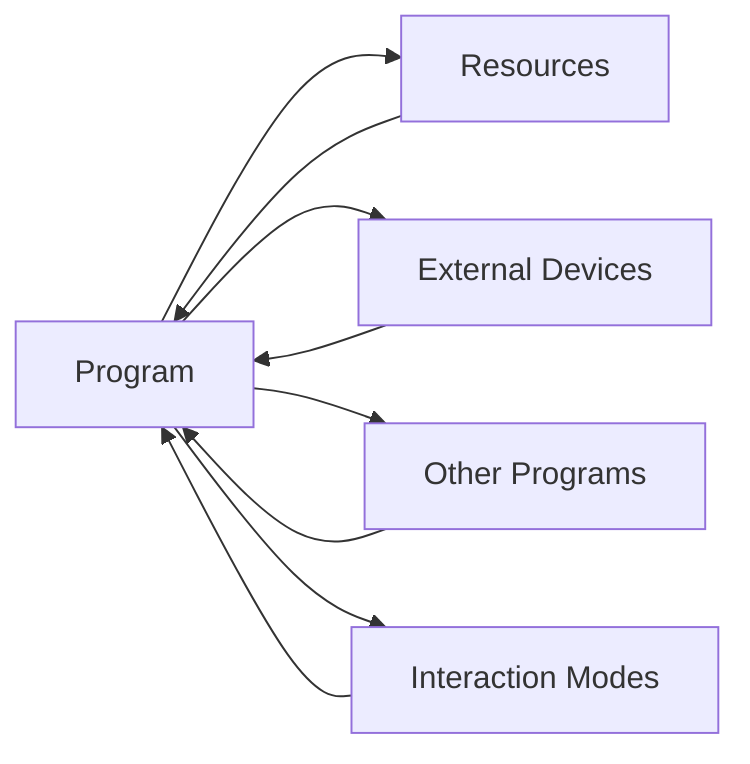

                 

**环境 (Environment)**

## 1. 背景介绍

在计算机科学领域，环境（Environment）是一个抽象的概念，用于描述程序运行的上下文。它包括了程序可以访问的资源、外部设备、其他程序，以及程序与外界交互的方式。环境的设计和管理是软件架构和系统设计的关键部分，直接影响着系统的可靠性、灵活性和性能。

## 2. 核心概念与联系

### 2.1 环境的组成

环境可以分为以下几个主要组成部分：

- **资源（Resources）**：环境中可供程序使用的硬件和软件资源，如CPU、内存、文件系统、网络连接等。
- **外部设备（External Devices）**：环境中连接的外部设备，如显示器、键盘、鼠标、打印机等。
- **其他程序（Other Programs）**：环境中运行的其他程序，它们可以与当前程序交互。
- **交互方式（Interaction Modes）**：程序与环境交互的方式，如命令行、图形用户界面（GUI）、网络通信等。

### 2.2 环境的类型

环境可以分为以下几种类型：

- **物理环境（Physical Environment）**：指计算机硬件和外部设备组成的环境。
- **软件环境（Software Environment）**：指操作系统、库、框架等软件组成的环境。
- **虚拟环境（Virtual Environment）**：指模拟物理环境或软件环境的软件系统，如虚拟机、容器等。

### 2.3 环境与程序的关系

程序与环境的关系如下图所示：



## 3. 核心算法原理 & 具体操作步骤

### 3.1 算法原理概述

环境管理的核心是资源管理，常用的资源管理算法包括：

- **先到先服务（First Come First Served, FCFS）**：按资源请求的顺序进行服务。
- **短作业优先（Shortest Job First, SJF）**：优先服务估计运行时间最短的作业。
- **高响应比优先（Highest Response Ratio First, HRRF）**：优先服务估计响应时间最长的作业。

### 3.2 算法步骤详解

以FCFS算法为例，其步骤如下：

1. 维护一个资源请求队列，按请求顺序排列。
2. 当有资源可用时，从队列头取出请求，分配资源。
3. 当资源被释放时，将其加入可用资源池。
4. 重复步骤2和3，直到所有请求都得到服务。

### 3.3 算法优缺点

- **FCFS**：优点是简单易实现，缺点是可能导致短作业等待时间过长。
- **SJF**：优点是可以减少平均等待时间，缺点是可能导致长作业等待时间过长。
- **HRRF**：优点是可以平衡短作业和长作业的等待时间，缺点是需要预估作业运行时间，可能导致不公平。

### 3.4 算法应用领域

资源管理算法广泛应用于操作系统、数据库系统、云计算等领域。

## 4. 数学模型和公式 & 详细讲解 & 举例说明

### 4.1 数学模型构建

资源管理可以建模为一个队列系统，其中资源请求者到达队列的速率为λ，资源服务速率为μ。则系统的利用率ρ = λ / μ。

### 4.2 公式推导过程

系统的等待时间W可以由Little's Law推导得出：

W = ρ / (μ - λ)

### 4.3 案例分析与讲解

假设有100个资源请求者以λ = 10个/秒的速率到达队列，每个请求需要μ = 0.5秒的服务时间。则系统的利用率ρ = 0.2，等待时间W = 0.4秒。

## 5. 项目实践：代码实例和详细解释说明

### 5.1 开发环境搭建

本项目使用Python语言，需要安装以下库：queue、random、time。

### 5.2 源代码详细实现

```python
import queue
import random
import time

class ResourceManager:
    def __init__(self, num_resources):
        self.resources = queue.Queue(num_resources)
        for i in range(num_resources):
            self.resources.put(i)

    def request(self):
        if self.resources.empty():
            print("No resources available, waiting...")
            time.sleep(random.random())
            self.request()
        else:
            resource = self.resources.get()
            print(f"Resource {resource} allocated.")
            time.sleep(random.random())
            self.resources.put(resource)

    def run(self, num_requests):
        for i in range(num_requests):
            print(f"Request {i}...")
            self.request()

if __name__ == "__main__":
    manager = ResourceManager(5)
    manager.run(20)
```

### 5.3 代码解读与分析

代码实现了一个简单的资源管理器，使用队列存储可用资源，当有资源请求时，从队列中取出资源，当资源被释放时，将其放回队列。

### 5.4 运行结果展示

运行代码会输出资源请求和分配的过程。

## 6. 实际应用场景

资源管理在各种计算机系统中广泛应用，如：

- **操作系统**：管理CPU、内存等硬件资源。
- **数据库系统**：管理数据库连接、文件描述符等资源。
- **云计算**：管理虚拟机、容器等软件资源。

### 6.4 未来应用展望

未来，随着边缘计算、物联网等技术的发展，资源管理将面临更多挑战，需要考虑资源的动态性、弹性和安全性。

## 7. 工具和资源推荐

### 7.1 学习资源推荐

- 书籍：《操作系统概念》第10版，Silberschatz、Galvin、Gagne著
- 在线课程：Coursera上的“操作系统”课程

### 7.2 开发工具推荐

- Python：一个简单易用的编程语言，适合学习和实践资源管理算法。
- Docker：一个容器化平台，可以用于模拟资源管理环境。

### 7.3 相关论文推荐

- “A Comparative Study of CPU Scheduling Algorithms” - S. K. Singh and A. K. Singh
- “Resource Management in Cloud Computing: A Survey” - M. Buyya, C. S. Yeo, and S. Ramamritham

## 8. 总结：未来发展趋势与挑战

### 8.1 研究成果总结

本文介绍了环境的概念、资源管理算法、数学模型和实践项目。这些内容为理解和设计环境管理系统提供了基础。

### 8.2 未来发展趋势

未来，环境管理将朝着动态、弹性和安全的方向发展，以适应边缘计算、物联网等新技术的需求。

### 8.3 面临的挑战

未来，环境管理面临的挑战包括资源动态性、弹性和安全性的平衡，以及新技术的快速发展。

### 8.4 研究展望

未来的研究方向包括资源动态分配算法、弹性资源管理、安全资源管理等。

## 9. 附录：常见问题与解答

**Q：什么是环境？**

**A**：环境是程序运行的上下文，包括程序可以访问的资源、外部设备、其他程序，以及程序与外界交互的方式。

**Q：什么是资源管理算法？**

**A**：资源管理算法是一种用于管理资源请求和分配的算法，常用的算法包括FCFS、SJF和HRRF。

**Q：什么是利用率和等待时间？**

**A**：利用率是系统的利用率，等待时间是资源请求者等待资源的时间。它们可以由数学模型推导得出。

## 作者：禅与计算机程序设计艺术 / Zen and the Art of Computer Programming

