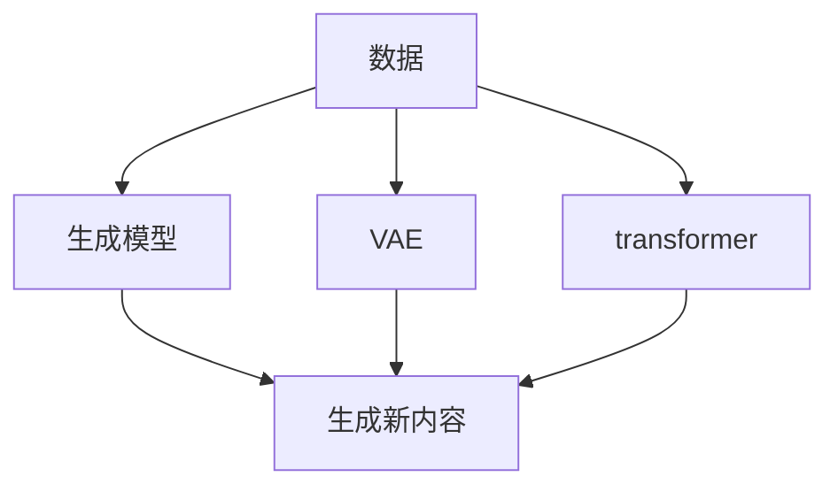

                 

**关键词：生成式AI、AIGC、商业智能、生成模型、变分自编码器、transformer、文本生成、图像生成、多模式生成**

## 1. 背景介绍

当前，人工智能（AI）技术正在各行各业中得到广泛应用，其中商业智能（BI）领域更是 AI 的重要组成部分。然而，传统的 BI 系统主要侧重于数据分析和可视化，无法直接生成有价值的新内容。生成式人工智能（Generative AI）的出现，为商业智能带来了新的可能性，开启了商业智能的新方向。

生成式 AI 旨在创建新的、原创的内容，如文本、图像、音乐等。它利用机器学习算法从数据中学习模式，然后根据这些模式生成新的内容。生成式 AI 的应用领域非常广泛，从图像和视频生成到文本生成，再到音乐和语音合成，无所不包。

本文将深入探讨生成式 AI 在商业智能领域的应用，重点介绍生成模型、变分自编码器和 transformer 等关键技术。我们还将提供项目实践和实际应用场景，并讨论未来发展趋势和挑战。

## 2. 核心概念与联系

### 2.1 生成式 AI 的定义

生成式 AI 是一种人工智能技术，旨在创建新的、原创的内容。它利用机器学习算法从数据中学习模式，然后根据这些模式生成新的内容。生成式 AI 的目标是创建看起来、听起来或感觉起来像是由人类创作的内容。

### 2.2 生成模型、变分自编码器和 transformer

生成模型、变分自编码器（VAE）和 transformer 是生成式 AI 的三种关键技术。它们的工作原理和联系如下图所示：

#### 2.2.1 生成模型

生成模型旨在学习数据分布，然后从该分布中生成新的、原创的内容。生成模型的目标是最大化数据 likelihood，即最大化数据在模型生成的分布中的可能性。

#### 2.2.2 变分自编码器

变分自编码器（VAE）是一种生成模型，它学习编码数据的表示，然后从该表示中重构数据。VAE 使用重参数化技巧和 KL-散度来学习数据分布。VAE 的目标是最小化重构误差和 KL-散度。

#### 2.2.3 transformer

transformer 是一种注意力机制，它允许模型在处理序列数据时考虑到上下文信息。transformer 使用自注意力机制和位置编码来处理序列数据，并使用编码器-解码器架构来生成新的序列数据。

## 3. 核心算法原理 & 具体操作步骤

### 3.1 算法原理概述

生成式 AI 的核心算法原理是学习数据分布，然后从该分布中生成新的、原创的内容。生成模型、VAE 和 transformer 等技术都旨在学习数据分布，然后根据该分布生成新的内容。

### 3.2 算法步骤详解

#### 3.2.1 生成模型

1. 数据预处理：收集和预处理数据，使其适合于机器学习算法。
2. 模型训练：使用最大化数据 likelihood 的目标函数训练生成模型。
3. 生成新内容：从模型生成的分布中采样，生成新的、原创的内容。

#### 3.2.2 变分自编码器

1. 数据预处理：收集和预处理数据，使其适合于机器学习算法。
2. 编码器训练：使用重参数化技巧和 KL-散度训练编码器，学习数据表示。
3. 解码器训练：使用重构误差训练解码器，学习从数据表示中重构数据。
4. 生成新内容：从编码器生成的数据表示中采样，然后使用解码器生成新的、原创的内容。

#### 3.2.3 transformer

1. 数据预处理：收集和预处理序列数据，使其适合于机器学习算法。
2. 位置编码：为序列数据添加位置信息，以便模型能够区分序列中的位置。
3. 自注意力机制：使用自注意力机制处理序列数据，考虑到上下文信息。
4. 编码器-解码器架构：使用编码器-解码器架构生成新的序列数据。

### 3.3 算法优缺点

#### 3.3.1 生成模型

优点：

* 可以生成新的、原创的内容。
* 可以学习复杂的数据分布。

缺点：

* 训练过程可能需要大量的计算资源。
* 生成的内容可能缺乏多样性。

#### 3.3.2 变分自编码器

优点：

* 可以学习数据表示，并从该表示中重构数据。
* 可以生成新的、原创的内容。
* 可以学习复杂的数据分布。

缺点：

* 训练过程可能需要大量的计算资源。
* 生成的内容可能缺乏多样性。
* KL-散度可能导致模型生成的内容缺乏多样性。

#### 3.3.3 transformer

优点：

* 可以考虑到上下文信息，处理序列数据。
* 可以生成新的、原创的序列数据。
* 可以学习复杂的序列数据分布。

缺点：

* 训练过程可能需要大量的计算资源。
* 处理长序列数据时可能会面临挑战。
* 可能会面临过拟合问题。

### 3.4 算法应用领域

生成式 AI 的应用领域非常广泛，从图像和视频生成到文本生成，再到音乐和语音合成，无所不包。在商业智能领域，生成式 AI 可以用于生成报告、预测分析结果、创建可视化内容等。

## 4. 数学模型和公式 & 详细讲解 & 举例说明

### 4.1 数学模型构建

生成式 AI 的数学模型旨在学习数据分布，然后从该分布中生成新的、原创的内容。生成模型、VAE 和 transformer 等技术都旨在学习数据分布，然后根据该分布生成新的内容。

### 4.2 公式推导过程

#### 4.2.1 生成模型

生成模型的目标是最大化数据 likelihood，即最大化数据在模型生成的分布中的可能性。给定数据 $x$ 和模型参数 $\theta$，数据 likelihood 可以表示为：

$$p(x|\theta) = \prod_{i=1}^{n}p(x_i|\theta)$$

其中，$n$ 是数据的维数，$x_i$ 是数据的第 $i$ 维，$p(x_i|\theta)$ 是模型生成的分布的概率密度函数。

#### 4.2.2 变分自编码器

变分自编码器（VAE）使用重参数化技巧和 KL-散度来学习数据分布。给定数据 $x$ 和模型参数 $\theta$，VAE 的目标函数可以表示为：

$$L(\theta) = -\mathbb{E}_{q(z|x,\phi)}[\log p(x|z,\theta)] + \beta D_{KL}(q(z|x,\phi)||p(z))$$

其中，$q(z|x,\phi)$ 是编码器生成的数据表示的分布，$p(x|z,\theta)$ 是解码器生成数据的分布，$p(z)$ 是先验分布，$D_{KL}(q(z|x,\phi)||p(z))$ 是 KL-散度，$

