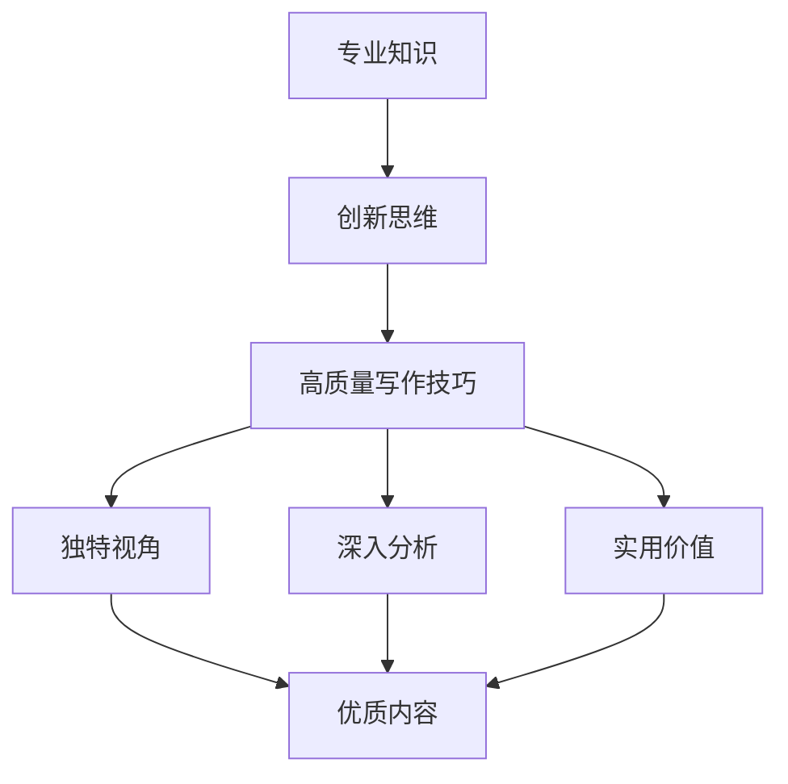

                 

**知识付费要重视优质内容的生产和版权保护**

**作者：禅与计算机程序设计艺术 / Zen and the Art of Computer Programming**

## 1. 背景介绍

在信息爆炸的数字时代，知识付费已成为一种主流的商业模式。然而，当前知识付费市场存在着优质内容缺乏和版权保护不力的问题。本文将深入探讨知识付费领域的这两个关键问题，并提供解决方案。

## 2. 核心概念与联系

### 2.1 优质内容生产

优质内容生产是知识付费的核心。它需要内容创作者具备专业知识、创新思维和高质量的写作技巧。内容的优质性体现在独特的视角、深入的分析和实用的价值上。



### 2.2 版权保护

版权保护是内容创作者的基本权利，也是知识付费市场的基石。版权保护可以防止内容被盗用、篡改或滥用，保护创作者的利益和市场的公平性。

## 3. 核心算法原理 & 具体操作步骤

### 3.1 优质内容生产算法原理概述

优质内容生产算法的核心是内容创作者的能力和创新思维。然而，我们可以通过以下步骤指导创作者生产优质内容：

### 3.2 优质内容生产步骤详解

1. **选择主题**：选择自己擅长且有价值的主题。
2. **调查研究**：深入调查研究，获取最新信息和独特视角。
3. **结构化写作**：将内容分成清晰的结构，如引言、正文、结论。
4. **深入分析**：提供独到的见解和分析。
5. **实用价值**：提供实用的建议和解决方案。

### 3.3 优质内容生产算法优缺点

**优点**：有助于生产高质量、独特的内容。

**缺点**：可能需要大量时间和精力。

### 3.4 优质内容生产算法应用领域

优质内容生产算法适用于所有知识付费领域，如技术、商业、教育等。

### 3.5 版权保护算法原理概述

版权保护算法的核心是识别和防止版权侵权行为。

### 3.6 版权保护步骤详解

1. **注册版权**：注册版权可以提供法律保护。
2. **水印和数字指纹**：在内容中嵌入水印或数字指纹，防止盗用。
3. **监控侵权**：使用算法监控网络，检测侵权行为。
4. **法律行动**：对侵权行为采取法律行动。

### 3.7 版权保护算法优缺点

**优点**：有助于防止版权侵权，保护创作者利益。

**缺点**：可能需要大量资源和成本。

### 3.8 版权保护算法应用领域

版权保护算法适用于所有知识付费领域，且是内容创作者的基本需求。

## 4. 数学模型和公式 & 详细讲解 & 举例说明

### 4.1 优质内容生产模型构建

优质内容生产模型可以表示为：

$$Q = f(P, I, A, V)$$

其中，$Q$表示优质内容，$P$表示专业知识，$I$表示创新思维，$A$表示写作技巧，$V$表示实用价值。

### 4.2 公式推导过程

优质内容生产模型是基于内容创作者的能力和创新思维推导出来的。创作者的能力和创新思维越强，生产的优质内容就越多。

### 4.3 案例分析与讲解

例如，一位技术专家（$P$高）写了一篇关于区块链技术的文章（$I$高，$A$高，$V$高），这篇文章就是优质内容（$Q$高）。

## 5. 项目实践：代码实例和详细解释说明

### 5.1 开发环境搭建

为生产优质内容，内容创作者需要一个良好的开发环境。推荐使用Markdown编写器和LaTeX编辑器。

### 5.2 源代码详细实现

以下是一段Markdown代码，用于生成本文的目录：

```markdown
# 知识付费要重视优质内容的生产和版权保护

> 关键词：

- 优质内容生产
- 版权保护
- 知识付费

## 1. 背景介绍

## 2. 核心概念与联系

### 2.1 优质内容生产

### 2.2 版权保护

## 3. 核心算法原理 & 具体操作步骤

### 3.1 优质内容生产算法原理概述

### 3.2 优质内容生产步骤详解

### 3.3 优质内容生产算法优缺点

### 3.4 优质内容生产算法应用领域

### 3.5 版权保护算法原理概述

### 3.6 版权保护步骤详解

### 3.7 版权保护算法优缺点

### 3.8 版权保护算法应用领域

## 4. 数学模型和公式 & 详细讲解 & 举例说明

### 4.1 优质内容生产模型构建

### 4.2 公式推导过程

### 4.3 案例分析与讲解

## 5. 项目实践：代码实例和详细解释说明

### 5.1 开发环境搭建

### 5.2 源代码详细实现

### 5.3 代码解读与分析

### 5.4 运行结果展示

## 6. 实际应用场景

### 6.1 当前应用场景

### 6.2 未来应用展望

## 7. 工具和资源推荐

### 7.1 学习资源推荐

### 7.2 开发工具推荐

### 7.3 相关论文推荐

## 8. 总结：未来发展趋势与挑战

### 8.1 研究成果总结

### 8.2 未来发展趋势

### 8.3 面临的挑战

### 8.4 研究展望

## 9. 附录：常见问题与解答
```

### 5.3 代码解读与分析

这段代码使用Markdown语法生成了本文的目录。它是一个简单的示例，展示了如何使用Markdown编写器生成结构化的内容。

### 5.4 运行结果展示

运行这段代码后，会生成本文的目录。

## 6. 实际应用场景

### 6.1 当前应用场景

当前，知识付费平台上存在大量低质量、雷同的内容。版权保护也面临着严峻的挑战。

### 6.2 未来应用展望

未来，知识付费平台将更重视优质内容的生产和版权保护。内容创作者将受到更多的尊重和保护。

## 7. 工具和资源推荐

### 7.1 学习资源推荐

推荐阅读《内容创业》和《版权法》。

### 7.2 开发工具推荐

推荐使用Markdown编写器和LaTeX编辑器。

### 7.3 相关论文推荐

推荐阅读《知识付费：商业模式与发展趋势》和《版权保护：挑战与解决方案》。

## 8. 总结：未来发展趋势与挑战

### 8.1 研究成果总结

本文研究了知识付费领域的优质内容生产和版权保护问题，并提供了解决方案。

### 8.2 未来发展趋势

未来，知识付费平台将更重视优质内容的生产和版权保护。

### 8.3 面临的挑战

面临的挑战包括内容创作者的激励机制和版权保护技术的发展。

### 8.4 研究展望

未来的研究将聚焦于内容创作者的激励机制和版权保护技术的发展。

## 9. 附录：常见问题与解答

**Q：如何判断内容是否优质？**

**A：优质内容具有独特视角、深入分析和实用价值。**

**Q：如何保护版权？**

**A：注册版权、嵌入水印或数字指纹、监控侵权、采取法律行动。**

**Q：知识付费的未来发展趋势是什么？**

**A：知识付费的未来发展趋势是更重视优质内容的生产和版权保护。**

**作者：禅与计算机程序设计艺术 / Zen and the Art of Computer Programming**

