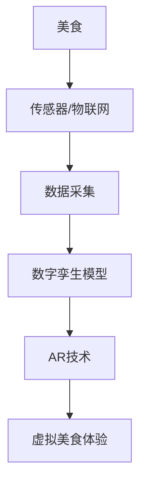

                 

**关键词：数字化转型、虚拟美食、增强现实、人工智能、美食行业、数字孪生**

## 1. 背景介绍

随着技术的发展，美食行业也开始了数字化转型之路。传统的美食体验正在被虚拟美食所取代，增强现实（AR）和人工智能（AI）技术的应用，为美食行业带来了颠覆性的变化。本文将深入探讨虚拟美食背后的核心概念与算法原理，并通过项目实践和实际应用场景，展示数字化升级的可能性。

## 2. 核心概念与联系

### 2.1 虚拟美食与数字孪生

虚拟美食是指利用数字技术，将美食的外观、口感、香气等特征数字化，并通过AR技术还原出来的美食体验。数字孪生是虚拟美食的基础，它是利用物联网、传感器、AI等技术，对美食进行实时监测、采集数据，并建立数字模型的过程。

### 2.2 增强现实与虚拟美食

增强现实技术将数字信息叠加到真实世界中，为用户提供更丰富的体验。在虚拟美食中，AR技术将数字孪生模型投射到真实世界中，用户可以通过AR设备（如AR眼镜、AR手机）看到并体验虚拟美食。

## 3. 核心算法原理 & 具体操作步骤

### 3.1 算法原理概述

虚拟美食的核心算法包括数据采集、特征提取、模型建立、渲染等步骤。数据采集通过传感器和物联网技术实现，特征提取则需要利用AI技术对采集到的数据进行分析，提取美食的关键特征。模型建立则是基于提取的特征，构建美食的数字孪生模型。最后，利用渲染算法，将数字孪生模型还原为虚拟美食。

### 3.2 算法步骤详解

1. **数据采集**：利用传感器和物联网技术，对美食进行实时监测，采集美食的外观、口感、香气等数据。
2. **特征提取**：利用AI技术（如深度学习）对采集到的数据进行分析，提取美食的关键特征。
3. **模型建立**：基于提取的特征，构建美食的数字孪生模型。模型需要包含美食的外观、口感、香气等信息。
4. **渲染**：利用渲染算法，将数字孪生模型还原为虚拟美食。渲染算法需要考虑美食的外观、口感、香气等特征，并将其还原为用户可以体验的虚拟美食。

### 3.3 算法优缺点

**优点**：虚拟美食算法可以还原美食的真实体验，为用户提供更丰富的美食体验。此外，虚拟美食可以帮助美食行业节省成本，提高效率。

**缺点**：虚拟美食算法对数据采集和特征提取的要求很高，需要大量的数据和计算资源。此外，虚拟美食还需要解决真实美食体验和虚拟美食体验之间的差异问题。

### 3.4 算法应用领域

虚拟美食算法可以应用于美食行业的各个领域，如餐饮业、美食广告、美食教育等。虚拟美食可以为用户提供更丰富的美食体验，帮助美食行业提高竞争力。

## 4. 数学模型和公式 & 详细讲解 & 举例说明

### 4.1 数学模型构建

数学模型是虚拟美食的基础，它需要包含美食的外观、口感、香气等信息。数学模型可以使用三维模型、神经网络等技术构建。

### 4.2 公式推导过程

数学模型的构建需要利用公式对美食的特征进行描述。例如，美食的外观可以使用三维模型描述，公式如下：

$$X = (x, y, z)$$

其中，$x$, $y$, $z$分别表示美食的长度、宽度、高度。美食的口感可以使用神经网络描述，公式如下：

$$f(x) = \sigma(\sum_{i=1}^{n} w_i x_i + b)$$

其中，$x_i$表示美食的口感特征，$w_i$表示权重，$b$表示偏置，$n$表示特征的数量，$\sigma$表示激活函数。

### 4.3 案例分析与讲解

例如，构建一款虚拟美食应用，需要对美食的外观、口感、香气等特征进行描述。数学模型可以使用三维模型描述美食的外观，神经网络描述美食的口感，香气则可以使用香气分子的浓度描述。

## 5. 项目实践：代码实例和详细解释说明

### 5.1 开发环境搭建

虚拟美食项目需要搭建开发环境，环境包括传感器、物联网技术、AI技术、渲染技术等。开发环境可以使用云平台（如AWS、Google Cloud）搭建，也可以使用本地服务器搭建。

### 5.2 源代码详细实现

源代码需要实现数据采集、特征提取、模型建立、渲染等步骤。数据采集可以使用物联网技术实现，特征提取可以使用深度学习技术实现，模型建立可以使用三维模型技术实现，渲染可以使用渲染技术实现。

### 5.3 代码解读与分析

代码需要对数据采集、特征提取、模型建立、渲染等步骤进行解读和分析。例如，数据采集代码需要解读传感器和物联网技术的工作原理，特征提取代码需要解读深度学习技术的工作原理，模型建立代码需要解读三维模型技术的工作原理，渲染代码需要解读渲染技术的工作原理。

### 5.4 运行结果展示

运行结果需要展示虚拟美食的外观、口感、香气等特征。例如，可以使用AR技术将虚拟美食投射到真实世界中，并通过AR设备（如AR眼镜、AR手机）展示给用户。

## 6. 实际应用场景

### 6.1 餐饮业

虚拟美食可以应用于餐饮业，为用户提供更丰富的美食体验。例如，用户可以通过AR技术体验虚拟美食，并根据虚拟美食选择真实美食。

### 6.2 美食广告

虚拟美食可以应用于美食广告，为用户提供更真实的美食体验。例如，用户可以通过AR技术体验虚拟美食，并根据虚拟美食选择真实美食。

### 6.3 美食教育

虚拟美食可以应用于美食教育，为用户提供更丰富的美食体验。例如，用户可以通过AR技术体验虚拟美食，并学习美食的烹饪技巧。

### 6.4 未来应用展望

虚拟美食的未来应用前景广阔，它可以应用于美食行业的各个领域。例如，虚拟美食可以应用于美食旅游，为用户提供更真实的异国美食体验。虚拟美食也可以应用于美食医疗，为病人提供更丰富的美食体验。

## 7. 工具和资源推荐

### 7.1 学习资源推荐

虚拟美食的学习资源包括美食行业的相关文献、AI技术的相关文献、渲染技术的相关文献等。例如，可以阅读美食行业的相关期刊（如《美食评论》《美食研究》），AI技术的相关期刊（如《Nature》《Science》），渲染技术的相关期刊（如《计算机图形学》《渲染》）

### 7.2 开发工具推荐

虚拟美食的开发工具包括传感器、物联网技术、AI技术、渲染技术等。例如，可以使用物联网技术（如MQTT、CoAP）实现数据采集，使用深度学习技术（如TensorFlow、PyTorch）实现特征提取，使用三维模型技术（如Blender、3ds Max）实现模型建立，使用渲染技术（如Unity、Unreal Engine）实现渲染。

### 7.3 相关论文推荐

虚拟美食的相关论文包括美食行业的相关论文、AI技术的相关论文、渲染技术的相关论文等。例如，可以阅读美食行业的相关论文（如《虚拟美食：美食行业的数字化升级》《虚拟美食：增强现实技术在美食行业的应用》），AI技术的相关论文（如《深度学习在美食行业的应用》《神经网络在美食行业的应用》），渲染技术的相关论文（如《虚拟美食渲染技术的研究》《虚拟美食渲染技术的应用》）

## 8. 总结：未来发展趋势与挑战

### 8.1 研究成果总结

虚拟美食的研究成果包括美食行业的数字化升级、增强现实技术在美食行业的应用、深度学习技术在美食行业的应用等。虚拟美食的研究成果为美食行业的数字化转型提供了新的方向和可能性。

### 8.2 未来发展趋势

虚拟美食的未来发展趋势包括美食行业的数字化升级、增强现实技术的发展、AI技术的发展等。随着技术的发展，虚拟美食将会为美食行业带来更多的可能性，为用户提供更丰富的美食体验。

### 8.3 面临的挑战

虚拟美食面临的挑战包括数据采集和特征提取的难度、真实美食体验和虚拟美食体验之间的差异等。虚拟美食需要解决这些挑战，才能为美食行业带来真正的数字化升级。

### 8.4 研究展望

虚拟美食的研究展望包括美食行业的数字化升级、增强现实技术的发展、AI技术的发展等。虚拟美食的研究需要不断地探索新的可能性，为美食行业带来更多的创新和发展。

## 9. 附录：常见问题与解答

**Q1：虚拟美食与真实美食有什么区别？**

A1：虚拟美食与真实美食的区别在于，虚拟美食是通过数字技术还原出来的美食体验，而真实美食则是真实存在的美食。虚拟美食无法提供真实美食的口感和香气，但可以提供美食的外观和部分口感。

**Q2：虚拟美食需要什么样的硬件设备？**

A2：虚拟美食需要AR设备（如AR眼镜、AR手机）来还原虚拟美食体验。此外，还需要传感器和物联网技术来采集美食的数据，AI技术来提取美食的特征，渲染技术来还原虚拟美食。

**Q3：虚拟美食的未来发展方向是什么？**

A3：虚拟美食的未来发展方向包括美食行业的数字化升级、增强现实技术的发展、AI技术的发展等。虚拟美食将会为美食行业带来更多的可能性，为用户提供更丰富的美食体验。

**作者：禅与计算机程序设计艺术 / Zen and the Art of Computer Programming**

