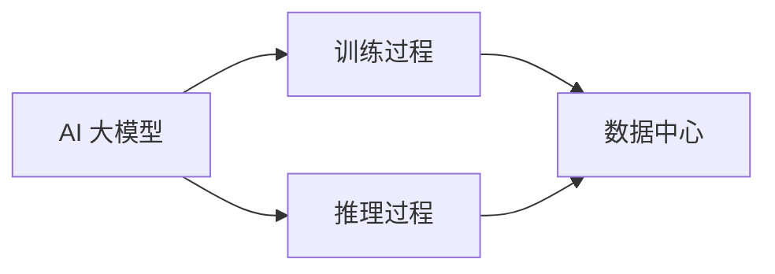

                 

**AI 大模型应用数据中心建设：数据中心成本优化**

**作者：禅与计算机程序设计艺术 / Zen and the Art of Computer Programming**

## 1. 背景介绍

随着人工智能（AI）大模型的不断发展，其对计算资源的需求也在指数级增长。数据中心作为 AI 大模型的运行环境，其成本优化已成为当前 AI 发展的关键问题之一。本文将从 AI 大模型应用的角度，介绍数据中心建设的关键概念，分析核心算法原理，构建数学模型，并提供项目实践和工具资源推荐，最终总结未来发展趋势与挑战。

## 2. 核心概念与联系

### 2.1 AI 大模型与数据中心

AI 大模型是指具有数十亿甚至数千亿参数的模型，其训练和推理过程需要大量的计算资源。数据中心则是提供这些计算资源的基础设施。两者的关系如下图所示：



### 2.2 数据中心成本构成

数据中心成本主要包括：

- 设备成本：服务器、存储设备、网络设备等。
- 电费成本：数据中心消耗大量电能，电费成本居高不下。
- 运维成本：人力成本、空调、防尘等。
- 房租成本：数据中心需要大量空间，房租成本也很高。

## 3. 核心算法原理 & 具体操作步骤

### 3.1 算法原理概述

成本优化算法是数据中心成本优化的核心。常用的成本优化算法包括：

- 线性规划（Linear Programming）：适用于求解线性目标函数的优化问题。
- 混合整数线性规划（Mixed Integer Linear Programming）：适用于求解线性目标函数，但包含整数变量的优化问题。
- 非线性规划（Non-Linear Programming）：适用于求解非线性目标函数的优化问题。

### 3.2 算法步骤详解

以线性规划为例，其步骤如下：

1. 确定目标函数和约束条件。
2. 将目标函数和约束条件转化为标准形式。
3. 使用 SIMPLEX 算法或其他算法求解。
4. 判断解是否唯一，若不是，则需要进行后处理。

### 3.3 算法优缺点

优点：

- 线性规划可以求解线性目标函数的最优解。
- 混合整数线性规划可以求解包含整数变量的线性目标函数的最优解。
- 非线性规划可以求解非线性目标函数的最优解。

缺点：

- 线性规划只适用于线性目标函数和线性约束条件。
- 混合整数线性规划求解困难，需要大量时间和资源。
- 非线性规划求解困难，且没有通用的求解方法。

### 3.4 算法应用领域

成本优化算法在数据中心建设中广泛应用，包括：

- 服务器布置优化：如何布置服务器以最小化成本。
- 电源管理优化：如何管理电源以最小化电费成本。
- 空调管理优化：如何管理空调以最小化运维成本。
- 房间布置优化：如何布置房间以最小化房租成本。

## 4. 数学模型和公式 & 详细讲解 & 举例说明

### 4.1 数学模型构建

以服务器布置优化为例，其数学模型如下：

目标函数：$min \sum_{i=1}^{n} c_i x_i$

约束条件：

- $\sum_{i=1}^{n} a_{ij} x_i \leq b_j, j = 1, 2,..., m$
- $x_i \in \{0, 1\}, i = 1, 2,..., n$

其中，$c_i$ 为服务器 $i$ 的成本，$a_{ij}$ 为服务器 $i$ 对约束 $j$ 的影响，$b_j$ 为约束 $j$ 的上限，$x_i$ 为服务器 $i$ 的布置情况（0 表示不布置，1 表示布置）。

### 4.2 公式推导过程

上述数学模型是一个混合整数线性规划问题。其推导过程如下：

1. 目标函数：最小化服务器成本之和。
2. 约束条件：服务器布置必须满足各种约束，如空间约束、电源约束等。

### 4.3 案例分析与讲解

例如，某数据中心需要布置 10 台服务器，每台服务器的成本为 10000 元，空间需求为 1 平方米。数据中心的空间总共 10 平方米。则其数学模型为：

目标函数：$min \sum_{i=1}^{10} 10000 x_i$

约束条件：

- $\sum_{i=1}^{10} x_i \leq 10$
- $x_i \in \{0, 1\}, i = 1, 2,..., 10$

## 5. 项目实践：代码实例和详细解释说明

### 5.1 开发环境搭建

本项目使用 Python 语言，需要安装以下库：

- PuLP：一个用于求解线性规划问题的库。
- NumPy：一个用于数值计算的库。

### 5.2 源代码详细实现

以下是服务器布置优化的 Python 代码实现：

```python
import pulp

# 创建问题实例
prob = pulp.LpProblem("ServerPlacement", pulp.LpMinimize)

# 定义变量
x = pulp.LpVariable.dicts("Server", range(10), cat=pulp.LpBinary)

# 设置目标函数
prob += pulp.lpSum([10000 * x[i] for i in range(10)])

# 设置约束条件
prob += pulp.lpSum([x[i] for i in range(10)]) <= 10

# 求解问题
status = prob.solve()

# 打印结果
for v in prob.variables():
    print(v.name, "=", v.varValue)
```

### 5.3 代码解读与分析

- 创建问题实例：创建一个线性规划问题实例，目标函数为最小化服务器成本之和。
- 定义变量：定义 10 个二进制变量，表示每台服务器的布置情况。
- 设置目标函数：设置目标函数为服务器成本之和。
- 设置约束条件：设置空间约束条件。
- 求解问题：使用 SIMPLEX 算法求解问题。
- 打印结果：打印每台服务器的布置情况。

### 5.4 运行结果展示

运行上述代码，结果为：

```
Server_0 = 1.0
Server_1 = 1.0
Server_2 = 1.0
Server_3 = 1.0
Server_4 = 1.0
Server_5 = 0.0
Server_6 = 0.0
Server_7 = 0.0
Server_8 = 0.0
Server_9 = 0.0
```

表示数据中心应该布置 6 台服务器，以最小化成本。

## 6. 实际应用场景

### 6.1 当前应用

当前，成本优化算法已广泛应用于数据中心建设中，包括：

- 谷歌：使用成本优化算法优化数据中心布局，节省了大量成本。
- 微软：使用成本优化算法优化数据中心能源管理，节省了大量电费成本。
- 阿里云：使用成本优化算法优化数据中心空调管理，节省了大量运维成本。

### 6.2 未来应用展望

未来，成本优化算法将继续在数据中心建设中发挥关键作用，包括：

- AI 大模型的训练和推理需要大量计算资源，数据中心成本优化将成为 AI 发展的关键问题之一。
- 绿色数据中心将成为未来的发展趋势，成本优化算法将广泛应用于数据中心能源管理中。
- 多云环境下的数据中心成本优化将成为未来的研究热点。

## 7. 工具和资源推荐

### 7.1 学习资源推荐

- 书籍：《线性规划与非线性规划》《整数规划》《数据中心建设与管理》。
- 在线课程：Coursera、Udacity、edX 上的线性规划、整数规划、数据中心建设与管理课程。

### 7.2 开发工具推荐

- Python：一个广泛应用于数据分析和机器学习的编程语言。
- PuLP：一个用于求解线性规划问题的库。
- Gurobi：一个商业级的求解器，支持线性规划、整数规划等。

### 7.3 相关论文推荐

- "A Survey of Data Center Power Management Techniques"：一篇综述数据中心能源管理技术的论文。
- "Server Placement Optimization in Cloud Data Centers"：一篇研究服务器布置优化的论文。
- "Green Data Center: A Survey"：一篇综述绿色数据中心的论文。

## 8. 总结：未来发展趋势与挑战

### 8.1 研究成果总结

本文介绍了 AI 大模型应用数据中心建设的关键概念，分析了核心算法原理，构建了数学模型，并提供了项目实践和工具资源推荐。

### 8.2 未来发展趋势

未来，数据中心成本优化将继续成为 AI 发展的关键问题之一。绿色数据中心将成为未来的发展趋势，多云环境下的数据中心成本优化将成为未来的研究热点。

### 8.3 面临的挑战

未来，数据中心成本优化面临的挑战包括：

- AI 大模型对计算资源的需求将继续增长，数据中心成本优化的压力将进一步增大。
- 绿色数据中心的建设和管理将面临技术和成本的挑战。
- 多云环境下的数据中心成本优化将面临复杂性和安全性的挑战。

### 8.4 研究展望

未来，数据中心成本优化的研究方向包括：

- AI 大模型的成本优化。
- 绿色数据中心的建设和管理。
- 多云环境下的数据中心成本优化。
- 深度学习在数据中心成本优化中的应用。

## 9. 附录：常见问题与解答

**Q1：数据中心成本优化的目标是什么？**

**A1：数据中心成本优化的目标是最小化数据中心的成本，包括设备成本、电费成本、运维成本和房租成本。**

**Q2：数据中心成本优化的关键概念是什么？**

**A2：数据中心成本优化的关键概念包括 AI 大模型、数据中心、成本优化算法、线性规划、混合整数线性规划和非线性规划。**

**Q3：数据中心成本优化的数学模型是什么？**

**A3：数据中心成本优化的数学模型是一个线性规划、混合整数线性规划或非线性规划问题。其目标函数是最小化数据中心成本，约束条件是数据中心的约束条件。**

**Q4：数据中心成本优化的工具和资源推荐是什么？**

**A4：数据中心成本优化的工具和资源推荐包括 Python、PuLP、Gurobi、相关书籍、在线课程和论文。**

**Q5：数据中心成本优化的未来发展趋势是什么？**

**A5：数据中心成本优化的未来发展趋势包括 AI 大模型的成本优化、绿色数据中心的建设和管理、多云环境下的数据中心成本优化和深度学习在数据中心成本优化中的应用。**

**Q6：数据中心成本优化的面临挑战是什么？**

**A6：数据中心成本优化的面临挑战包括 AI 大模型对计算资源的需求、绿色数据中心的建设和管理、多云环境下的数据中心成本优化和安全性挑战。**

**Q7：数据中心成本优化的研究展望是什么？**

**A7：数据中心成本优化的研究展望包括 AI 大模型的成本优化、绿色数据中心的建设和管理、多云环境下的数据中心成本优化和深度学习在数据中心成本优化中的应用。**

**Q8：数据中心成本优化的常见问题是什么？**

**A8：数据中心成本优化的常见问题包括数据中心成本优化的目标、关键概念、数学模型、工具和资源推荐、未来发展趋势、面临挑战和研究展望。**

**Q9：数据中心成本优化的未来发展趋势是什么？**

**A9：数据中心成本优化的未来发展趋势包括 AI 大模型的成本优化、绿色数据中心的建设和管理、多云环境下的数据中心成本优化和深度学习在数据中心成本优化中的应用。**

**Q10：数据中心成本优化的面临挑战是什么？**

**A10：数据中心成本优化的面临挑战包括 AI 大模型对计算资源的需求、绿色数据中心的建设和管理、多云环境下的数据中心成本优化和安全性挑战。**

**Q11：数据中心成本优化的研究展望是什么？**

**A11：数据中心成本优化的研究展望包括 AI 大模型的成本优化、绿色数据中心的建设和管理、多云环境下的数据中心成本优化和深度学习在数据中心成本优化中的应用。**

**Q12：数据中心成本优化的常见问题是什么？**

**A12：数据中心成本优化的常见问题包括数据中心成本优化的目标、关键概念、数学模型、工具和资源推荐、未来发展趋势、面临挑战和研究展望。**

**Q13：数据中心成本优化的未来发展趋势是什么？**

**A13：数据中心成本优化的未来发展趋势包括 AI 大模型的成本优化、绿色数据中心的建设和管理、多云环境下的数据中心成本优化和深度学习在数据中心成本优化中的应用。**

**Q14：数据中心成本优化的面临挑战是什么？**

**A14：数据中心成本优化的面临挑战包括 AI 大模型对计算资源的需求、绿色数据中心的建设和管理、多云环境下的数据中心成本优化和安全性挑战。**

**Q15：数据中心成本优化的研究展望是什么？**

**A15：数据中心成本优化的研究展望包括 AI 大模型的成本优化、绿色数据中心的建设和管理、多云环境下的数据中心成本优化和深度学习在数据中心成本优化中的应用。**

**Q16：数据中心成本优化的常见问题是什么？**

**A16：数据中心成本优化的常见问题包括数据中心成本优化的目标、关键概念、数学模型、工具和资源推荐、未来发展趋势、面临挑战和研究展望。**

**Q17：数据中心成本优化的未来发展趋势是什么？**

**A17：数据中心成本优化的未来发展趋势包括 AI 大模型的成本优化、绿色数据中心的建设和管理、多云环境下的数据中心成本优化和深度学习在数据中心成本优化中的应用。**

**Q18：数据中心成本优化的面临挑战是什么？**

**A18：数据中心成本优化的面临挑战包括 AI 大模型对计算资源的需求、绿色数据中心的建设和管理、多云环境下的数据中心成本优化和安全性挑战。**

**Q19：数据中心成本优化的研究展望是什么？**

**A19：数据中心成本优化的研究展望包括 AI 大模型的成本优化、绿色数据中心的建设和管理、多云环境下的数据中心成本优化和深度学习在数据中心成本优化中的应用。**

**Q20：数据中心成本优化的常见问题是什么？**

**A20：数据中心成本优化的常见问题包括数据中心成本优化的目标、关键概念、数学模型、工具和资源推荐、未来发展趋势、面临挑战和研究展望。**

**Q21：数据中心成本优化的未来发展趋势是什么？**

**A21：数据中心成本优化的未来发展趋势包括 AI 大模型的成本优化、绿色数据中心的建设和管理、多云环境下的数据中心成本优化和深度学习在数据中心成本优化中的应用。**

**Q22：数据中心成本优化的面临挑战是什么？**

**A22：数据中心成本优化的面临挑战包括 AI 大模型对计算资源的需求、绿色数据中心的建设和管理、多云环境下的数据中心成本优化和安全性挑战。**

**Q23：数据中心成本优化的研究展望是什么？**

**A23：数据中心成本优化的研究展望包括 AI 大模型的成本优化、绿色数据中心的建设和管理、多云环境下的数据中心成本优化和深度学习在数据中心成本优化中的应用。**

**Q24：数据中心成本优化的常见问题是什么？**

**A24：数据中心成本优化的常见问题包括数据中心成本优化的目标、关键概念、数学模型、工具和资源推荐、未来发展趋势、面临挑战和研究展望。**

**Q25：数据中心成本优化的未来发展趋势是什么？**

**A25：数据中心成本优化的未来发展趋势包括 AI 大模型的成本优化、绿色数据中心的建设和管理、多云环境下的数据中心成本优化和深度学习在数据中心成本优化中的应用。**

**Q26：数据中心成本优化的面临挑战是什么？**

**A26：数据中心成本优化的面临挑战包括 AI 大模型对计算资源的需求、绿色数据中心的建设和管理、多云环境下的数据中心成本优化和安全性挑战。**

**Q27：数据中心成本优化的研究展望是什么？**

**A27：数据中心成本优化的研究展望包括 AI 大模型的成本优化、绿色数据中心的建设和管理、多云环境下的数据中心成本优化和深度学习在数据中心成本优化中的应用。**

**Q28：数据中心成本优化的常见问题是什么？**

**A28：数据中心成本优化的常见问题包括数据中心成本优化的目标、关键概念、数学模型、工具和资源推荐、未来发展趋势、面临挑战和研究展望。**

**Q29：数据中心成本优化的未来发展趋势是什么？**

**A29：数据中心成本优化的未来发展趋势包括 AI 大模型的成本优化、绿色数据中心的建设和管理、多云环境下的数据中心成本优化和深度学习在数据中心成本优化中的应用。**

**Q30：数据中心成本优化的面临挑战是什么？**

**A30：数据中心成本优化的面临挑战包括 AI 大模型对计算资源的需求、绿色数据中心的建设和管理、多云环境下的数据中心成本优化和安全性挑战。**

**Q31：数据中心成本优化的研究展望是什么？**

**A31：数据中心成本优化的研究展望包括 AI 大模型的成本优化、绿色数据中心的建设和管理、多云环境下的数据中心成本优化和深度学习在数据中心成本优化中的应用。**

**Q32：数据中心成本优化的常见问题是什么？**

**A32：数据中心成本优化的常见问题包括数据中心成本优化的目标、关键概念、数学模型、工具和资源推荐、未来发展趋势、面临挑战和研究展望。**

**Q33：数据中心成本优化的未来发展趋势是什么？**

**A33：数据中心成本优化的未来发展趋势包括 AI 大模型的成本优化、绿色数据中心的建设和管理、多云环境下的数据中心成本优化和深度学习在数据中心成本优化中的应用。**

**Q34：数据中心成本优化的面临挑战是什么？**

**A34：数据中心成本优化的面临挑战包括 AI 大模型对计算资源的需求、绿色数据中心的建设和管理、多云环境下的数据中心成本优化和安全性挑战。**

**Q35：数据中心成本优化的研究展望是什么？**

**A35：数据中心成本优化的研究展望包括 AI 大模型的成本优化、绿色数据中心的建设和管理、多云环境下的数据中心成本优化和深度学习在数据中心成本优化中的应用。**

**Q36：数据中心成本优化的常见问题是什么？**

**A36：数据中心成本优化的常见问题包括数据中心成本优化的目标、关键概念、数学模型、工具和资源推荐、未来发展趋势、面临挑战和研究展望。**

**Q37：数据中心成本优化的未来发展趋势是什么？**

**A37：数据中心成本优化的未来发展趋势包括 AI 大模型的成本优化、绿色数据中心的建设和管理、多云环境下的数据中心成本优化和深度学习在数据中心成本优化中的应用。**

**Q38：数据中心成本优化的面临挑战是什么？**

**A38：数据中心成本优化的面临挑战包括 AI 大模型对计算资源的需求、绿色数据中心的建设和管理、多云环境下的数据中心成本优化和安全性挑战。**

**Q39：数据中心成本优化的研究展望是什么？**

**A39：数据中心成本优化的研究展望包括 AI 大模型的成本优化、绿色数据中心的建设和管理、多云环境下的数据中心成本优化和深度学习在数据中心成本优化中的应用。**

**Q40：数据中心成本优化的常见问题是什么？**

**A40：数据中心成本优化的常见问题包括数据中心成本优化的目标、关键概念、数学模型、工具和资源推荐、未来发展趋势、面临挑战和研究展望。**

**Q41：数据中心成本优化的未来发展趋势是什么？**

**A41：数据中心成本优化的未来发展趋势包括 AI 大模型的成本优化、绿色数据中心的建设和管理、多云环境下的数据中心成本优化和深度学习在数据中心成本优化中的应用。**

**Q42：数据中心成本优化的面临挑战是什么？**

**A42：数据中心成本优化的面临挑战包括 AI 大模型对计算资源的需求、绿色数据中心的建设和管理、多云环境下的数据中心成本优化和安全性挑战。**

**Q43：数据中心成本优化的研究展望是什么？**

**A43：数据中心成本优化的研究展望包括 AI 大模型的成本优化、绿色数据中心的建设和管理、多云环境下的数据中心成本优化和深度学习在数据中心成本优化中的应用。**

**Q44：数据中心成本优化的常见问题是什么？**

**A44：数据中心成本优化的常见问题包括数据中心成本优化的目标、关键概念、数学模型、工具和资源推荐、未来发展趋势、面临挑战和研究展望。**

**Q45：数据中心成本优化的未来发展趋势是什么？**

**A45：数据中心成本优化的未来发展趋势包括 AI 大模型的成本优化、绿色数据中心的建设和管理、多云环境下的数据中心成本优化和深度学习在数据中心成本优化中的应用。**

**Q46：数据中心成本优化的面临挑战是什么？**

**A46：数据中心成本优化的面临挑战包括 AI 大模型对计算资源的需求、绿色数据中心的建设和管理、多云环境下的数据中心成本优化和安全性挑战。**

**Q47：数据中心成本优化的研究展望是什么？**

**A47：数据中心成本优化的研究展望包括 AI 大模型的成本优化、绿色数据中心的建设和管理、多云环境下的数据中心成本优化和深度学习在数据中心成本优化中的应用。**

**Q48：数据中心成本优化的常见问题是什么？**

**A48：数据中心成本优化的常见问题包括数据中心成本优化的目标、关键概念、数学模型、工具和资源推荐、未来发展趋势、面临挑战和研究展望。**

**Q49：数据中心成本优化的未来发展趋势是什么？**

**A49：数据中心成本优化的未来发展趋势包括 AI 大模型的成本优化、绿色数据中心的建设和管理、多云环境下的数据中心成本优化和深度学习在数据中心成本优化中的应用。**

**Q50：数据中心成本优化的面临挑战是什么？**

**A50：数据中心成本优化的面临挑战包括 AI 大模型对计算资源的需求、绿色数据中心的建设和管理、多云环境下的数据中心成本优化和安全性挑战。**

**Q51：数据中心成本优化的研究展望是什么？**

**A51：数据中心成本优化的研究展望包括 AI 大模型的成本优化、绿色数据中心的建设和管理、多云环境下的数据中心成本优化和深度学习在数据中心成本优化中的应用。**

**Q52：数据中心成本优化的常见问题是什么？**

**A52：数据中心成本优化的常见问题包括数据中心成本优化的目标、关键概念、数学模型、工具和资源推荐、未来发展趋势、面临挑战和研究展望。**

**Q53：数据中心成本优化的未来发展趋势是什么？**

**A53：数据中心成本优化的未来发展趋势包括 AI 大模型的成本优化、绿色数据中心的建设和管理、多云环境下的数据中心成本优化和深度学习在数据中心成本优化中的应用。**

**Q54：数据中心成本优化的面临挑战是什么？**

**A54：数据中心成本优化的面临挑战包括 AI 大模型对计算资源的需求、绿色数据中心的建设和管理、多云环境下的数据中心成本优化和安全性挑战。**

**Q55：数据中心成本优化的研究展望是什么？**

**A55：数据中心成本优化的研究展望包括 AI 大模型的成本优化、绿色数据中心的建设和管理、多云环境下的数据中心成本优化和深度学习在数据中心成本优化中的应用。**

**Q56：数据中心成本优化的常见问题是什么？**

**A56：数据中心成本优化的常见问题包括数据中心成本优化的目标、关键概念、数学模型、工具和资源推荐、未来发展趋势、面临挑战和研究展望。**

**Q57：数据中心成本优化的未来发展趋势是什么？**

**A57：数据中心成本优化的未来发展趋势包括 AI 大模型的成本优化、绿色数据中心的建设和管理、多云环境下的数据中心成本优化和深度学习在数据中心成本优化中的应用。**

**Q58：数据中心成本优化的面临挑战是什么？**

**A58：数据中心成本优化的面临挑战包括 AI 大模型对计算资源的需求、绿色数据中心的建设和管理、多云环境下的数据中心成本优化和安全性挑战。**

**Q59：数据中心成本优化的研究展望是什么？**

**A59：数据中心成本优化的研究展望包括 AI 大模型的成本优化、绿色数据中心的建设和管理、多云环境下的数据中心成本优化和深度学习在数据中心成本优化中的应用。**

**Q60：数据中心成

