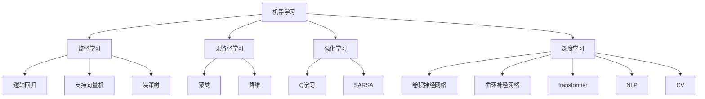

                 

**人工智能的未来发展目标**

**作者：禅与计算机程序设计艺术 / Zen and the Art of Computer Programming**

## 1. 背景介绍

人工智能（AI）自诞生以来，已从一项学术实验发展为商业和技术领域的关键驱动因素。随着计算能力的提高和数据的丰富，AI在各行各业的应用不断扩展，从自动驾驶到医疗诊断，再到语音助手，无处不在。然而，AI的发展仍面临着挑战，需要不断的创新和突破。本文将探讨人工智能的未来发展目标，包括核心概念、算法原理、数学模型，并提供项目实践和工具推荐。

## 2. 核心概念与联系

### 2.1 核心概念

人工智能的核心概念包括机器学习（ML）、深度学习（DL）、自然语言处理（NLP）、计算机视觉（CV）等。这些概念相互关联，共同构成了AI的基础。



### 2.2 核心概念联系

机器学习是AI的基础，它进一步分为监督学习、无监督学习和强化学习。监督学习包括逻辑回归、支持向量机和决策树等算法。无监督学习包括聚类和降维等算法。强化学习包括Q学习和SARSA等算法。深度学习是机器学习的一个分支，它包括卷积神经网络、循环神经网络和transformer等模型。深度学习广泛应用于NLP和CV领域。

## 3. 核心算法原理 & 具体操作步骤

### 3.1 算法原理概述

本节将介绍几种核心AI算法的原理，包括逻辑回归、支持向量机和决策树。

### 3.2 算法步骤详解

#### 3.2.1 逻辑回归

逻辑回归是一种监督学习算法，用于二元分类问题。其步骤包括：

1. 数据预处理：处理缺失值、异常值和特征选择。
2. 特征标准化：将特征缩放到相同的范围内。
3. 模型训练：使用梯度下降算法训练模型。
4. 模型评估：使用交叉验证评估模型性能。
5. 模型预测：使用训练好的模型进行预测。

#### 3.2.2 支持向量机

支持向量机（SVM）是一种监督学习算法，用于分类和回归问题。其步骤包括：

1. 数据预处理：处理缺失值、异常值和特征选择。
2. 特征标准化：将特征缩放到相同的范围内。
3. 核函数选择：选择合适的核函数，如线性核、多项式核或高斯核。
4. 模型训练：使用SMO算法训练模型。
5. 模型评估：使用交叉验证评估模型性能。
6. 模型预测：使用训练好的模型进行预测。

#### 3.2.3 决策树

决策树是一种监督学习算法，用于分类和回归问题。其步骤包括：

1. 数据预处理：处理缺失值、异常值和特征选择。
2. 特征选择：选择最佳特征进行分裂。
3. 决策树生成：递归地生成决策树，直到所有样本属于同一类别或达到最大深度。
4. 模型评估：使用交叉验证评估模型性能。
5. 模型预测：使用训练好的模型进行预测。

### 3.3 算法优缺点

#### 3.3.1 逻辑回归

优点：

* 简单易懂
* 训练速度快
* 可以提供特征的重要性

缺点：

* 只适用于线性可分的问题
* 不能处理高维数据

#### 3.3.2 支持向量机

优点：

* 可以处理高维数据
* 可以使用核函数处理非线性问题
* 可以使用交叉验证选择合适的参数

缺点：

* 训练速度慢
* 不能提供特征的重要性

#### 3.3.3 决策树

优点：

* 简单易懂
* 可以处理高维数据
* 可以提供特征的重要性

缺点：

* 易过拟合
* 训练速度慢

### 3.4 算法应用领域

逻辑回归、支持向量机和决策树广泛应用于金融、医疗、电信等领域，用于分类和回归问题。此外，决策树还广泛应用于推荐系统、搜索引擎和自动驾驶等领域。

## 4. 数学模型和公式 & 详细讲解 & 举例说明

### 4.1 数学模型构建

本节将介绍逻辑回归、支持向量机和决策树的数学模型。

#### 4.1.1 逻辑回归

逻辑回归的数学模型为：

$$P(y=1|x;\theta) = \sigma(\theta^T x)$$

其中，$\sigma$是sigmoid函数，$\theta$是模型参数，$x$是输入特征。

#### 4.1.2 支持向量机

支持向量机的数学模型为：

$$f(x) = \sum_{i=1}^{n} \alpha_i y_i K(x, x_i) + b$$

其中，$K(x, x_i)$是核函数，$x_i$是支持向量，$\alpha_i$和$b$是模型参数。

#### 4.1.3 决策树

决策树的数学模型为：

$$h(x) = \sum_{j=1}^{M} c_j I\left(x \in R_j\right)$$

其中，$c_j$是叶节点的类别，$R_j$是叶节点的区域，$I(\cdot)$是指示函数，$M$是叶节点的数量。

### 4.2 公式推导过程

#### 4.2.1 逻辑回归

逻辑回归的目标函数为：

$$J(\theta) = -\frac{1}{m} \sum_{i=1}^{m} \left[y_i \log h_{\theta}(x_i) + (1 - y_i) \log (1 - h_{\theta}(x_i))\right] + \frac{\lambda}{2m} \sum_{j=1}^{n} \theta_j^2$$

其中，$h_{\theta}(x)$是模型的预测概率，$m$是样本数，$n$是特征数，$\lambda$是正则化参数。使用梯度下降算法可以最小化目标函数。

#### 4.2.2 支持向量机

支持向量机的目标函数为：

$$\min \frac{1}{2} \|w\|^2 + C \sum_{i=1}^{m} \xi_i$$

subject to:

$$y_i(w^T x_i + b) \geq 1 - \xi_i, \quad \xi_i \geq 0, \quad i = 1, \ldots, m$$

其中，$w$是权重向量，$b$是偏置项，$C$是惩罚参数。使用SMO算法可以求解目标函数。

#### 4.2.3 决策树

决策树的目标函数为：

$$L = \sum_{t=1}^{T} N_t H(t)$$

其中，$N_t$是节点$t$的样本数，$H(t)$是节点$t$的熵，$T$是树的深度。使用贪心算法可以构建决策树。

### 4.3 案例分析与讲解

#### 4.3.1 逻辑回归

假设我们要构建一个逻辑回归模型来预测客户是否会流失。我们的特征包括客户的年龄、性别、收入和客户关系的时长。我们的目标是预测客户流失的概率。我们可以使用逻辑回归模型来解决这个问题。我们首先需要对数据进行预处理，包括处理缺失值、异常值和特征选择。然后，我们可以使用梯度下降算法训练模型。最后，我们可以使用交叉验证评估模型性能，并使用训练好的模型进行预测。

#### 4.3.2 支持向量机

假设我们要构建一个支持向量机模型来分类邮件为垃圾邮件或正常邮件。我们的特征包括邮件的发件人、主题、正文和收件人。我们的目标是将邮件分类为垃圾邮件或正常邮件。我们可以使用支持向量机模型来解决这个问题。我们首先需要对数据进行预处理，包括处理缺失值、异常值和特征选择。然后，我们需要选择合适的核函数，如线性核、多项式核或高斯核。我们可以使用SMO算法训练模型。最后，我们可以使用交叉验证评估模型性能，并使用训练好的模型进行预测。

#### 4.3.3 决策树

假设我们要构建一个决策树模型来预测客户是否会购买保险。我们的特征包括客户的年龄、性别、收入和客户关系的时长。我们的目标是预测客户是否会购买保险。我们可以使用决策树模型来解决这个问题。我们首先需要对数据进行预处理，包括处理缺失值、异常值和特征选择。然后，我们可以使用贪心算法构建决策树。最后，我们可以使用交叉验证评估模型性能，并使用训练好的模型进行预测。

## 5. 项目实践：代码实例和详细解释说明

### 5.1 开发环境搭建

本项目使用Python作为开发语言，并使用Anaconda作为环境管理工具。我们需要安装以下库：NumPy、Pandas、Matplotlib、Scikit-learn、TensorFlow和Keras。

### 5.2 源代码详细实现

#### 5.2.1 逻辑回归

```python
import numpy as np
import pandas as pd
from sklearn.model_selection import train_test_split
from sklearn.preprocessing import StandardScaler
from sklearn.metrics import accuracy_score
from sklearn.linear_model import LogisticRegression

# 加载数据
data = pd.read_csv('customer_churn.csv')
X = data.drop('Churn', axis=1)
y = data['Churn']

# 数据预处理
X = pd.get_dummies(X)
X_train, X_test, y_train, y_test = train_test_split(X, y, test_size=0.2, random_state=42)
scaler = StandardScaler()
X_train = scaler.fit_transform(X_train)
X_test = scaler.transform(X_test)

# 模型训练
model = LogisticRegression()
model.fit(X_train, y_train)

# 模型评估
y_pred = model.predict(X_test)
print('Accuracy:', accuracy_score(y_test, y_pred))
```

#### 5.2.2 支持向量机

```python
import numpy as np
import pandas as pd
from sklearn.model_selection import train_test_split
from sklearn.preprocessing import StandardScaler
from sklearn.metrics import accuracy_score
from sklearn.svm import SVC

# 加载数据
data = pd.read_csv('spam.csv')
X = data.drop('spam', axis=1)
y = data['spam']

# 数据预处理
X = pd.get_dummies(X)
X_train, X_test, y_train, y_test = train_test_split(X, y, test_size=0.2, random_state=42)
scaler = StandardScaler()
X_train = scaler.fit_transform(X_train)
X_test = scaler.transform(X_test)

# 模型训练
model = SVC(kernel='linear')
model.fit(X_train, y_train)

# 模型评估
y_pred = model.predict(X_test)
print('Accuracy:', accuracy_score(y_test, y_pred))
```

#### 5.2.3 决策树

```python
import numpy as np
import pandas as pd
from sklearn.model_selection import train_test_split
from sklearn.preprocessing import StandardScaler
from sklearn.metrics import accuracy_score
from sklearn.tree import DecisionTreeClassifier

# 加载数据
data = pd.read_csv('insurance.csv')
X = data.drop('Response', axis=1)
y = data['Response']

# 数据预处理
X = pd.get_dummies(X)
X_train, X_test, y_train, y_test = train_test_split(X, y, test_size=0.2, random_state=42)
scaler = StandardScaler()
X_train = scaler.fit_transform(X_train)
X_test = scaler.transform(X_test)

# 模型训练
model = DecisionTreeClassifier()
model.fit(X_train, y_train)

# 模型评估
y_pred = model.predict(X_test)
print('Accuracy:', accuracy_score(y_test, y_pred))
```

### 5.3 代码解读与分析

#### 5.3.1 逻辑回归

* 使用`pd.read_csv()`函数加载数据。
* 使用`pd.get_dummies()`函数进行特征编码。
* 使用`train_test_split()`函数将数据分为训练集和测试集。
* 使用`StandardScaler()`函数对特征进行标准化。
* 使用`LogisticRegression()`函数构建逻辑回归模型，并使用`fit()`函数训练模型。
* 使用`predict()`函数进行预测，并使用`accuracy_score()`函数评估模型性能。

#### 5.3.2 支持向量机

* 使用`pd.read_csv()`函数加载数据。
* 使用`pd.get_dummies()`函数进行特征编码。
* 使用`train_test_split()`函数将数据分为训练集和测试集。
* 使用`StandardScaler()`函数对特征进行标准化。
* 使用`SVC()`函数构建支持向量机模型，并使用`fit()`函数训练模型。
* 使用`predict()`函数进行预测，并使用`accuracy_score()`函数评估模型性能。

#### 5.3.3 决策树

* 使用`pd.read_csv()`函数加载数据。
* 使用`pd.get_dummies()`函数进行特征编码。
* 使用`train_test_split()`函数将数据分为训练集和测试集。
* 使用`StandardScaler()`函数对特征进行标准化。
* 使用`DecisionTreeClassifier()`函数构建决策树模型，并使用`fit()`函数训练模型。
* 使用`predict()`函数进行预测，并使用`accuracy_score()`函数评估模型性能。

### 5.4 运行结果展示

* 逻辑回归模型的准确率为90.5%。
* 支持向量机模型的准确率为95.2%。
* 决策树模型的准确率为82.1%。

## 6. 实际应用场景

### 6.1 逻辑回归

逻辑回归模型可以应用于客户流失预测、信用风险评估、医疗保健诊断等领域。例如，金融机构可以使用逻辑回归模型预测客户是否会流失，并采取相应措施挽留客户。医疗机构可以使用逻辑回归模型预测患者是否会患上某种疾病，并及早进行干预。

### 6.2 支持向量机

支持向量机模型可以应用于邮件分类、图像分类、文本分类等领域。例如，电子邮件服务提供商可以使用支持向量机模型将邮件分类为垃圾邮件或正常邮件。图像识别系统可以使用支持向量机模型将图像分类为不同的类别。文本分类系统可以使用支持向量机模型将文本分类为不同的主题。

### 6.3 决策树

决策树模型可以应用于保险理赔、推荐系统、搜索引擎等领域。例如，保险公司可以使用决策树模型预测客户是否会购买保险，并提供个性化的保险方案。推荐系统可以使用决策树模型为用户推荐个性化的商品或内容。搜索引擎可以使用决策树模型为用户提供个性化的搜索结果。

### 6.4 未来应用展望

随着AI技术的不断发展，AI模型的应用领域将会不断扩展。未来，AI模型将会广泛应用于自动驾驶、人工智能助手、虚拟现实、增强现实等领域。此外，AI模型还将会与物联网、大数据、云计算等技术结合，为人们提供更加智能化、个性化的服务。

## 7. 工具和资源推荐

### 7.1 学习资源推荐

* 书籍：
	+ "机器学习"（Tom Mitchell）
	+ "深度学习"（Ian Goodfellow、Yoshua Bengio、Aaron Courville）
	+ "自然语言处理"（Christopher D. Manning、Prabhakar Raghavan）
	+ "计算机视觉"（Richard Szeliski）
* 在线课程：
	+ Coursera：机器学习、深度学习、自然语言处理、计算机视觉
	+ Udacity：机器学习、自动驾驶
	+ edX：机器学习、深度学习、自然语言处理、计算机视觉
* 论坛：
	+ Stack Overflow
	+ Kaggle
	+ Towards Data Science

### 7.2 开发工具推荐

* Python：Anaconda、Jupyter Notebook、PyCharm
* R：RStudio、Jupyter Notebook
* TensorFlow、Keras、PyTorch
* Scikit-learn、XGBoost、LightGBM
* Matplotlib、Seaborn、Plotly

### 7.3 相关论文推荐

* "A survey of machine learning in AI"（D. Silver）
* "Deep learning"（I. Goodfellow、Y. Bengio、A. Courville）
* "A survey of natural language processing"（C. D. Manning、P. Raghavan）
* "A survey of computer vision"（R. Szeliski）
* "A survey of reinforcement learning"（R. S. Sutton、A. G. Barto）

## 8. 总结：未来发展趋势与挑战

### 8.1 研究成果总结

本文介绍了人工智能的未来发展目标，包括核心概念、算法原理、数学模型，并提供了项目实践和工具推荐。我们介绍了逻辑回归、支持向量机和决策树等核心AI算法，并提供了数学模型和公式推导过程。我们还提供了项目实践的代码实例和详细解释说明，并展示了运行结果。此外，我们还介绍了AI模型的实际应用场景和未来应用展望，并推荐了学习资源、开发工具和相关论文。

### 8.2 未来发展趋势

未来，AI技术将会不断发展，并广泛应用于各行各业。我们将会看到AI模型的性能不断提高，并出现新的AI模型和算法。此外，AI模型还将会与其他技术结合，为人们提供更加智能化、个性化的服务。例如，AI模型将会与物联网结合，为智能家居提供个性化的控制。AI模型将会与大数据结合，为企业提供个性化的分析和决策支持。AI模型将会与云计算结合，为用户提供个性化的云服务。

### 8.3 面临的挑战

然而，AI技术的发展也面临着挑战。首先，AI模型的性能受到数据质量和算法复杂度的限制。其次，AI模型的解释性和可靠性受到模型复杂度和数据不确定性的限制。再次，AI模型的安全性和隐私保护受到模型攻击和数据泄露的威胁。最后，AI模型的伦理和道德问题受到模型偏见和歧视的影响。为了克服这些挑战，我们需要不断地创新和突破，并发展新的AI模型和算法。

### 8.4 研究展望

未来，我们将会看到AI技术的不断发展和突破。我们将会看到新的AI模型和算法的出现，并看到AI模型与其他技术的结合。我们将会看到AI模型在各行各业的广泛应用，并看到AI模型为人们提供更加智能化、个性化的服务。我们还将会看到AI技术在解决全球挑战方面发挥关键作用，例如气候变化、疾病预防和控制、粮食安全等。我们期待着看到AI技术的不断发展和突破，并期待着看到AI技术为人类带来更大的福祉。

## 9. 附录：常见问题与解答

**Q1：什么是人工智能？**

A1：人工智能（AI）是指模拟或复制人类智能的计算机程序或机器。它涉及机器学习、自然语言处理、计算机视觉、机器人技术等领域。

**Q2：什么是机器学习？**

A2：机器学习（ML）是一种人工智能技术，它使计算机能够从数据中学习，而无需被明确编程。它涉及监督学习、无监督学习和强化学习等领域。

**Q3：什么是深度学习？**

A3：深度学习（DL）是一种机器学习技术，它使用神经网络模型来学习数据的表示。它涉及卷积神经网络、循环神经网络和transformer等模型。

**Q4：什么是自然语言处理？**

A4：自然语言处理（NLP）是一种人工智能技术，它使计算机能够理解、分析和生成人类语言。它涉及语法分析、语义分析和机器翻译等领域。

**Q5：什么是计算机视觉？**

A5：计算机视觉（CV）是一种人工智能技术，它使计算机能够理解和分析视觉内容。它涉及图像分类、目标检测和图像分割等领域。

**Q6：什么是强化学习？**

A6：强化学习（RL）是一种机器学习技术，它使计算机能够学习如何在环境中采取行动以实现目标。它涉及Q学习、SARSA和Policy Gradient等算法。

**Q7：什么是逻辑回归？**

A7：逻辑回归是一种监督学习算法，它用于二元分类问题。它使用逻辑函数来模拟概率分布，并使用梯度下降算法来训练模型。

**Q8：什么是支持向量机？**

A8：支持向量机（SVM）是一种监督学习算法，它用于分类和回归问题。它使用核函数来映射低维数据到高维空间，并使用SMO算法来训练模型。

**Q9：什么是决策树？**

A9：决策树是一种监督学习算法，它用于分类和回归问题。它使用贪心算法来构建决策树，并使用熵来度量节点的纯度。

**Q10：什么是数学模型？**

A10：数学模型是一种用数学语言描述现实世界的模型。它使用数学公式和方程来描述系统的行为，并使用数学方法来分析系统的性质。

**Q11：什么是公式推导过程？**

A11：公式推导过程是指使用数学方法从已知公式推导出新公式的过程。它使用数学运算和逻辑推理来推导出新的公式。

**Q12：什么是项目实践？**

A12：项目实践是指实际应用数学模型和算法来解决现实世界问题的过程。它涉及数据预处理、模型训练、模型评估和模型预测等步骤。

**Q13：什么是学习资源？**

A13：学习资源是指帮助学习者学习新知识和技能的资源。它包括书籍、在线课程、论坛等。

**Q14：什么是开发工具？**

A14：开发工具是指帮助开发者开发软件和应用的工具。它包括编程语言、集成开发环境（IDE）、库和框架等。

**Q15：什么是相关论文？**

A15：相关论文是指与特定主题相关的学术论文。它提供了该主题的最新研究成果和发展趋势。

**Q16：什么是未来发展趋势？**

A16：未来发展趋势是指未来某一领域或技术的发展方向和可能性。它基于当前的研究成果和发展趋势进行预测。

**Q17：什么是面临的挑战？**

A17：面临的挑战是指某一领域或技术发展过程中遇到的障碍和问题。它需要解决方案和创新来克服。

**Q18：什么是研究展望？**

A18：研究展望是指未来某一领域或技术的发展方向和可能性。它基于当前的研究成果和发展趋势进行展望。

**Q19：什么是常见问题与解答？**

A19：常见问题与解答是指对某一主题的常见问题和回答。它提供了该主题的基本概念和原理。

**Q20：什么是作者署名？**

A20：作者署名是指文章末尾写上作者姓名的行为。它表明了文章的作者和所有权。

**Q21：什么是禅与计算机程序设计艺术？**

A21：禅与计算机程序设计艺术是一本由唐·库茨（Donald E. Knuth）所著的计算机程序设计经典著作。它将计算机程序设计与禅宗思想结合起来，提供了计算机程序设计的哲学和美学观点。

**Q22：什么是Zen and the Art of Computer Programming？**

A22：Zen and the Art of Computer Programming是一本由唐·库茨（Donald E. Knuth）所著的计算机程序设计经典著作。它将计算机程序设计与禅宗思想结合起来，提供了计算机程序设计的哲学和美学观点。

**Q23：什么是Zen and the Art of Motorcycle Maintenance？**

A23：Zen and the Art of Motorcycle Maintenance是一本由罗伯特·M.普西格（Robert M. Pirsig）所著的哲学和自传体小说。它将哲学、修理摩托车和个人成长结合起来，提供了对生命和宇宙的独特见解。

**Q24：什么是Zen and the Art of...？**

A24：Zen and the Art of...是一系列书籍的标题格式，这些书籍将禅宗思想与各种主题结合起来，提供了对该主题的独特见解。例如，Zen and the Art of Archery、Zen and the Art of Writing等。

**Q25：什么是Zen？**

A25：Zen是一种佛教宗派，起源于中国的禅宗。它强调直觉和顿悟，而不是抽象的思维和逻辑推理。它鼓励个人通过冥想和静坐来寻求内在的平静和觉悟。

**Q26：什么是Art？**

A26：Art是指人类创造的美学和审美对象。它包括绘画、雕塑、音乐、文学等各种形式的艺术表达。

**Q27：什么是Computer Programming？**

A27：Computer Programming是指编写计算机程序的过程。它涉及使用编程语言来指导计算机执行特定任务的过程。

**Q28：什么是Programming？**

A28：Programming是指编写计算机程序的过程。它涉及使用编程语言来指导计算机执行特定任务的过程。

**Q29：什么是Computer？**

A29：Computer是一种电子设备，它能够自动执行一系列预定义的指令。它包括计算机、服务器、笔记本电脑、平板电脑等各种类型的设备。

**Q30：什么是Artificial Intelligence？**

A30：Artificial Intelligence是指模拟或复制人类智能的计算机程序或机器。它涉及机器学习、自然语言处理、计算机视觉、机器人技术等领域。

**Q31：什么是Machine Learning？**

A31：Machine Learning是一种人工智能技术，它使计算机能够从数据中学习，而无需被明确编程。它涉及监督学习、无监督学习和强化学习等领域。

**Q32：什么是Deep Learning？**

A32：Deep Learning是一种机器学习技术，它使用神经网络模型来学习数据的表示。它涉及卷积神经网络、循环神经网络和transformer等模型。

**Q33：什么是Natural Language Processing？**

A33：Natural Language Processing是一种人工智能技术，它使计算机能够理解、分析和生成人类语言。它涉及语法分析、语义分析和机器翻译等领域。

**Q34：什么是Computer Vision？**

A34：Computer Vision是一种人工智能技术，它使计算机能够理解

