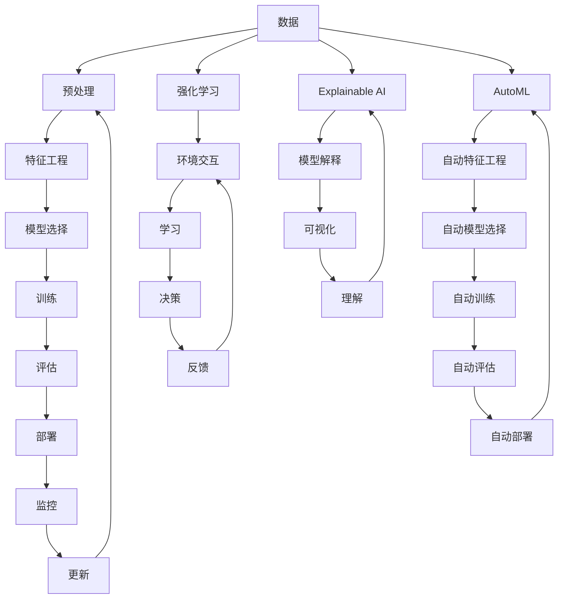

                 

**人工智能的未来发展趋势**

**作者：禅与计算机程序设计艺术 / Zen and the Art of Computer Programming**

## 1. 背景介绍

人工智能（AI）自诞生以来，已从一项科学幻想变为现实，渗透到我们的日常生活中。从搜索引擎到自动驾驶汽车，AI无处不在。然而，AI的发展仍处于初级阶段，未来的发展趋势将如何？本文将从技术、应用和挑战等方面，探讨人工智能的未来发展趋势。

## 2. 核心概念与联系

### 2.1 关键概念

- **深度学习（Deep Learning）**：一种机器学习方法，模仿人脑神经元网络结构，具有强大的特征学习能力。
- **强化学习（Reinforcement Learning）**：一种学习方法，智能体通过与环境的交互，学习做出有利于目标的行为。
- ** Explainable AI (XAI) **：一种AI方法，旨在使AI模型的决策过程更易于理解。
- **AutoML (Automated Machine Learning) **：一种自动化机器学习方法，旨在简化机器学习过程。

### 2.2 关键概念联系

## 3. 核心算法原理 & 具体操作步骤

### 3.1 算法原理概述

- **深度学习**：通过多层神经网络，自动学习数据的特征。
- **强化学习**：通过试错学习，智能体在环境中学习最优行为。
- **Explainable AI**：通过模型可解释性指标，帮助理解模型决策过程。
- **AutoML**：通过自动化流程，简化机器学习过程。

### 3.2 算法步骤详解

- **深度学习**：数据预处理→特征工程→模型选择→训练→评估→部署→监控→更新。
- **强化学习**：环境交互→学习→决策→反馈。
- **Explainable AI**：模型解释→可视化→理解。
- **AutoML**：自动特征工程→自动模型选择→自动训练→自动评估→自动部署。

### 3.3 算法优缺点

- **深度学习**：优点：强大的特征学习能力；缺点：计算资源消耗大，易陷入局部最优。
- **强化学习**：优点：能学习复杂任务；缺点：训练时间长，不稳定。
- **Explainable AI**：优点：提高模型可解释性；缺点：解释能力有限。
- **AutoML**：优点：简化机器学习过程；缺点：自动化程度有限。

### 3.4 算法应用领域

- **深度学习**：图像识别，自然语言处理，推荐系统等。
- **强化学习**：游戏AI，无人驾驶，机器人控制等。
- **Explainable AI**：金融风控，医疗诊断，公平性评估等。
- **AutoML**：业务人员自助式机器学习，小样本学习等。

## 4. 数学模型和公式 & 详细讲解 & 举例说明

### 4.1 数学模型构建

- **深度学习**：构建神经网络模型，使用反向传播优化权重。
- **强化学习**：构建马尔可夫决策过程模型，使用动态规划或时序差分学习最优策略。
- **Explainable AI**：构建模型可解释性指标，如LIME，SHAP等。
- **AutoML**：构建自动化流程，如自动特征工程，自动模型选择等。

### 4.2 公式推导过程

- **深度学习**：使用链式法则推导梯度，更新权重。
- **强化学习**：使用贝尔曼方程推导最优策略。
- **Explainable AI**：使用指标函数推导模型可解释性。
- **AutoML**：使用搜索算法推导最优超参数。

### 4.3 案例分析与讲解

- **深度学习**：使用卷积神经网络（CNN）识别猫狗图像。
- **强化学习**：使用Q学习玩 Atari 2600 游戏。
- **Explainable AI**：使用SHAP解释信用卡风险评分模型。
- **AutoML**：使用H2O.ai AutoML 进行自动化机器学习。

## 5. 项目实践：代码实例和详细解释说明

### 5.1 开发环境搭建

- **深度学习**：使用TensorFlow，PyTorch等框架。
- **强化学习**：使用Stable Baselines3，RLlib等库。
- **Explainable AI**：使用SHAP，ELI5等库。
- **AutoML**：使用H2O.ai，TPOT等工具。

### 5.2 源代码详细实现

- **深度学习**：构建CNN，使用反向传播训练模型。
- **强化学习**：构建Q学习算法，学习最优策略。
- **Explainable AI**：使用SHAP解释模型决策。
- **AutoML**：使用自动化流程进行机器学习。

### 5.3 代码解读与分析

- **深度学习**：分析网络结构，激活函数，优化器等。
- **强化学习**：分析状态，动作，奖励等。
- **Explainable AI**：分析模型可解释性指标。
- **AutoML**：分析自动化流程，超参数搜索等。

### 5.4 运行结果展示

- **深度学习**：展示模型在测试集上的准确率。
- **强化学习**：展示智能体在环境中的表现。
- **Explainable AI**：展示模型决策的解释结果。
- **AutoML**：展示最优模型的性能。

## 6. 实际应用场景

### 6.1 当前应用

- **深度学习**：图像识别，自然语言处理，推荐系统等。
- **强化学习**：游戏AI，无人驾驶，机器人控制等。
- **Explainable AI**：金融风控，医疗诊断，公平性评估等。
- **AutoML**：业务人员自助式机器学习，小样本学习等。

### 6.2 未来应用展望

- **深度学习**：更强大的特征学习能力，更广泛的应用领域。
- **强化学习**：更复杂任务的学习，更稳定的训练。
- **Explainable AI**：更强大的解释能力，更广泛的应用领域。
- **AutoML**：更高程度的自动化，更广泛的应用领域。

## 7. 工具和资源推荐

### 7.1 学习资源推荐

- **深度学习**：Andrew Ng的机器学习课程，Fast.ai的深度学习课程。
- **强化学着**：UC Berkeley的强化学习课程，DeepMind的强化学习教程。
- **Explainable AI**：University of Waikato的可解释AI课程，ProMDA的可解释AI教程。
- **AutoML**：University of Waikato的自动机器学习课程，H2O.ai的AutoML文档。

### 7.2 开发工具推荐

- **深度学习**：TensorFlow，PyTorch，Keras。
- **强化学习**：Stable Baselines3，RLlib，Garage。
- **Explainable AI**：SHAP，ELI5，Alibi。
- **AutoML**：H2O.ai，TPOT，Auto-sklearn。

### 7.3 相关论文推荐

- **深度学习**：LeCun et al.的"Gradient-Based Learning Applied to Document Recognition"，Hinton et al.的"Reducing the Dimensionality of Data with Neural Networks"。
- **强化学习**：Sutton & Barto的"Reinforcement Learning: An Introduction"，Mnih et al.的"Human-level control through deep reinforcement learning"。
- **Explainable AI**：Ribeiro et al.的"Why Should I Trust You?: Explaining the Predictions of Any Classifier"，Lundberg & Lee的"A Unified Approach to Interpreting Model Predictions"。
- **AutoML**：Feurer et al.的"Efficient and Robust Automated Machine Learning"，Hutter et al.的"Automated Machine Learning: Methods, Systems, Challenges"。

## 8. 总结：未来发展趋势与挑战

### 8.1 研究成果总结

- **深度学习**：取得了显著的成就，但仍面临过拟合，计算资源消耗等挑战。
- **强化学习**：取得了显著的成就，但仍面临训练时间长，不稳定等挑战。
- **Explainable AI**：取得了显著的成就，但仍面临解释能力有限等挑战。
- **AutoML**：取得了显著的成就，但仍面临自动化程度有限等挑战。

### 8.2 未来发展趋势

- **深度学习**：更强大的特征学习能力，更广泛的应用领域。
- **强化学习**：更复杂任务的学习，更稳定的训练。
- **Explainable AI**：更强大的解释能力，更广泛的应用领域。
- **AutoML**：更高程度的自动化，更广泛的应用领域。

### 8.3 面临的挑战

- **深度学习**：过拟合，计算资源消耗，模型可解释性等。
- **强化学习**：训练时间长，不稳定，样本效率等。
- **Explainable AI**：解释能力有限，模型可解释性指标的选择等。
- **AutoML**：自动化程度有限，泛化能力等。

### 8.4 研究展望

- **深度学习**：研究更强大的特征学习方法，提高模型可解释性。
- **强化学习**：研究更稳定的训练方法，提高样本效率。
- **Explainable AI**：研究更强大的解释方法，提高模型可解释性。
- **AutoML**：研究更高程度的自动化，提高泛化能力。

## 9. 附录：常见问题与解答

- **Q1：什么是人工智能？**
  - A1：人工智能是指模拟或复制人类智能的机器或软件。
- **Q2：人工智能的发展趋势是什么？**
  - A2：人工智能的发展趋势包括更强大的特征学习能力，更广泛的应用领域，更稳定的训练，更强大的解释能力，更高程度的自动化等。
- **Q3：人工智能面临的挑战是什么？**
  - A3：人工智能面临的挑战包括过拟合，计算资源消耗，模型可解释性，训练时间长，不稳定，样本效率，解释能力有限，模型可解释性指标的选择，自动化程度有限，泛化能力等。

**作者：禅与计算机程序设计艺术 / Zen and the Art of Computer Programming**

