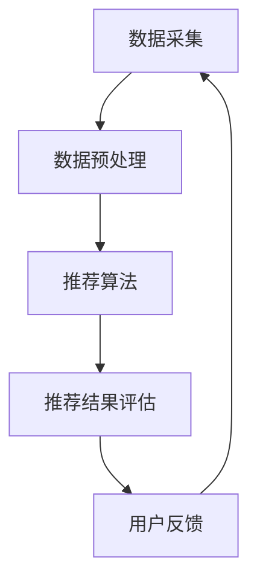

                 

**大语言模型（LLM）在个性化推荐系统中的应用**

## 1. 背景介绍

个性化推荐系统（Recommender System）是一种信息过滤技术，旨在为用户提供个性化的信息或产品推荐。随着互联网的发展，海量的信息和产品让用户面临着信息过载的问题，个性化推荐系统因此应运而生。大语言模型（LLM）是一种自然语言处理（NLP）模型，能够理解、生成和翻译人类语言。本文将探讨LLM在个性化推荐系统中的应用，展示其如何帮助系统更好地理解用户需求，提供更准确的推荐。

## 2. 核心概念与联系

### 2.1 个性化推荐系统架构

个性化推荐系统的核心是推荐算法，其通常基于用户-物品交互数据进行推荐。如下图所示，个性化推荐系统的架构包括数据采集、数据预处理、推荐算法、推荐结果评估和用户反馈等模块。

### 2.2 大语言模型在推荐系统中的作用

LLM可以在个性化推荐系统的多个模块发挥作用。例如，在数据预处理模块，LLM可以用于文本数据的清洗、分类和标注。在推荐算法模块，LLM可以帮助系统更好地理解用户需求，生成更准确的推荐。在推荐结果评估模块，LLM可以用于生成推荐结果的解释，提高用户的信任度。

## 3. 核心算法原理 & 具体操作步骤

### 3.1 算法原理概述

LLM在个性化推荐系统中的应用通常基于嵌入（Embedding）和注意力（Attention）机制。嵌入机制将用户和物品表示为向量，注意力机制则帮助系统关注用户需求相关的物品。LLM结合这两种机制，生成用户需求的嵌入，并基于注意力机制关注相关物品，从而提供个性化推荐。

### 3.2 算法步骤详解

1. **数据预处理**：使用LLM对文本数据进行清洗、分类和标注。
2. **嵌入生成**：使用LLM生成用户需求的嵌入向量。
3. **注意力机制**：基于注意力机制关注相关物品。
4. **推荐生成**：基于关注物品生成推荐结果。
5. **评估和反馈**：使用LLM生成推荐结果的解释，并基于用户反馈优化推荐算法。

### 3.3 算法优缺点

**优点**：LLM可以帮助系统更好地理解用户需求，提供更准确的推荐。此外，LLM可以生成推荐结果的解释，提高用户的信任度。

**缺点**：LLM模型本身的复杂性和计算开销可能会导致推荐系统的性能下降。此外，LLM模型可能会受到数据偏见的影响，导致推荐结果不公平。

### 3.4 算法应用领域

LLM在个性化推荐系统中的应用可以广泛应用于电子商务、视频推荐、音乐推荐等领域。例如，电子商务平台可以基于LLM提供个性化的商品推荐，视频平台可以基于LLM提供个性化的视频推荐。

## 4. 数学模型和公式 & 详细讲解 & 举例说明

### 4.1 数学模型构建

设用户需求为文本序列$X = \{x_1, x_2,..., x_n\}$, 物品集为$Y = \{y_1, y_2,..., y_m\}$, LLM生成的用户需求嵌入向量为$h = LLM(X)$, 注意力权重为$w = Attention(h, Y)$, 则推荐结果为$R = \{y_i | w_i > \theta, i = 1, 2,..., m\}$, 其中$\theta$为注意力权重阈值。

### 4.2 公式推导过程

LLM生成用户需求嵌入向量的过程可以基于 Transformer 模型进行推导。设用户需求文本序列$X$的词汇表为$V$, 则文本序列$X$可以表示为词汇表$V$中的索引序列$X' = \{x'_1, x'_2,..., x'_n\}$. Transformer 模型的编码器可以表示为：

$$h = Encoder(X') = f_1(f_2(...f_k(x'_1, x'_2,..., x'_n)...))$$

其中$f_k$为第$k$层的子层，通常为多头自注意力（Multi-Head Self-Attention）和前馈网络（Feed-Forward Network）的组合。注意力机制的推导过程可以参考 Vaswani et al. (2017) 的论文。

### 4.3 案例分析与讲解

例如，在电子商务平台中，用户输入需求为"一双舒适的跑鞋"，物品集为所有商品。LLM生成用户需求嵌入向量$h = LLM("一双舒适的跑鞋")$, 注意力权重$w = Attention(h, Y)$, 则推荐结果$R = \{y_i | w_i > \theta, i = 1, 2,..., m\}$为舒适的跑鞋。

## 5. 项目实践：代码实例和详细解释说明

### 5.1 开发环境搭建

本项目使用 Python 语言开发，需要安装以下库：Transformers、Torch、Numpy、Pandas。

### 5.2 源代码详细实现

以下是 LL

