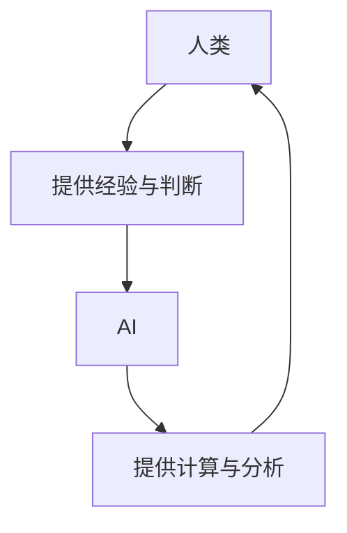

                 

**人类计算：AI时代的未来就业市场与技能培训发展**

## 1. 背景介绍

在人工智能（AI）迅速发展的今天，AI技术已经渗透到各行各业，从自动驾驶到医疗诊断，再到客户服务，AI正在改变我们的生活和工作方式。然而，AI的崛起也引发了人们对未来就业市场和技能培训的担忧。本文将探讨AI时代的未来就业市场和技能培训发展，并提供一些建议，帮助读者适应和利用AI带来的变化。

## 2. 核心概念与联系

### 2.1 AI与人类计算

人类计算（Human-in-the-Loop）是指人类和AI共同协作，发挥各自优势，共同完成任务的计算模式。在AI时代，人类计算是一种必需的模式，因为AI在某些领域仍然无法取代人类的创造力、判断力和经验。



### 2.2 AI驱动的就业市场变化

AI的发展导致了就业市场的结构性变化。一些岗位由于自动化而消失，但同时也创造了新的岗位。根据世界经济论坛的报告，到2025年，AI将创造出9700万个新岗位，但也会消失8.5%的工作岗位。

## 3. 核心算法原理 & 具体操作步骤

### 3.1 算法原理概述

人类计算中，AI通常执行计算密集型任务，而人类则提供判断和创造力。常用的AI算法包括神经网络、决策树和支持向量机等。

### 3.2 算法步骤详解

以神经网络为例，其训练步骤包括：

1. 数据预处理：清洗数据，并将其转换为神经网络可以处理的格式。
2. 模型构建：选择合适的神经网络架构，并初始化权重和偏置。
3. 训练：使用反向传播算法，调整权重和偏置，以最小化损失函数。
4. 测试：使用测试数据评估模型的性能。

### 3.3 算法优缺点

神经网络等深度学习算法在处理复杂任务时表现出色，但它们也有缺点，如训练需要大量数据和计算资源，并且缺乏解释性。

### 3.4 算法应用领域

人类计算在医疗、金融、制造等领域都有广泛应用。例如，在医疗领域，AI可以帮助医生分析大量数据，做出更准确的诊断。

## 4. 数学模型和公式 & 详细讲解 & 举例说明

### 4.1 数学模型构建

在人类计算中，数学模型通常用于描述AI的输入输出关系。例如，在回归问题中，线性回归模型可以表示为：

$$y = wx + b$$

其中，$y$是输出，$x$是输入，$w$和$b$是模型参数。

### 4.2 公式推导过程

在训练模型时，参数$w$和$b$通常通过最小化均方误差（MSE）来学习：

$$MSE = \frac{1}{n}\sum_{i=1}^{n}(y_i - \hat{y}_i)^2$$

其中，$y_i$是真实输出，$hat{y}_i$是模型预测输出。

### 4.3 案例分析与讲解

例如，在预测房价的回归问题中，输入$x$可以是房屋的面积，输出$y$是房屋的价格。通过收集数据并训练模型，我们可以预测给定面积的房屋价格。

## 5. 项目实践：代码实例和详细解释说明

### 5.1 开发环境搭建

在开始编写代码之前，我们需要安装必要的软件和库。例如，在使用Python编写神经网络时，我们需要安装NumPy、TensorFlow或PyTorch等库。

### 5.2 源代码详细实现

以下是一个简单的线性回归模型的Python实现：

```python
import numpy as np

def linear_regression(x, y):
    n = len(x)
    w = (n * np.sum(x * y) - np.sum(x) * np.sum(y)) / (n * np.sum(x**2) - (np.sum(x))**2)
    b = (np.sum(y) - w * np.sum(x)) / n
    return w, b
```

### 5.3 代码解读与分析

这段代码使用了最小二乘法来计算线性回归模型的参数$w$和$b$. 它首先计算一些中间值，然后使用这些值计算$w$和$b$.

### 5.4 运行结果展示

运行这段代码后，我们可以得到模型的参数$w$和$b$. 这些参数可以用于预测新数据的输出。

## 6. 实际应用场景

### 6.1 当前应用

人类计算已经在各行各业得到应用。例如，在金融领域，AI可以帮助风险评估和欺诈检测。在制造业，AI可以帮助预测设备故障和优化生产过程。

### 6.2 未来应用展望

未来，人类计算将继续渗透到更多领域。例如，在医疗领域，AI可以帮助开发个性化治疗方案。在教育领域，AI可以提供个性化学习路径。

## 7. 工具和资源推荐

### 7.1 学习资源推荐

推荐阅读《人工智能：一种现代方法》一书，这是一本经典的AI教科书。此外，还有许多在线课程和资源可以学习AI，如Coursera和Udacity等。

### 7.2 开发工具推荐

推荐使用Python作为AI开发的编程语言。此外，还有许多开源库和框架可以使用，如TensorFlow和PyTorch等。

### 7.3 相关论文推荐

推荐阅读《人类计算：AI时代的未来就业市场与技能培训发展》一文，这是一篇综述性文章，介绍了人类计算的概念和应用。

## 8. 总结：未来发展趋势与挑战

### 8.1 研究成果总结

本文介绍了人类计算的概念，并讨论了其在AI时代的应用。我们还介绍了人类计算中的核心算法和数学模型，并提供了一个简单的代码实例。

### 8.2 未来发展趋势

未来，人类计算将继续发展，并渗透到更多领域。AI将继续改变就业市场，创造新的岗位，但也会消失一些岗位。因此，技能培训将变得越来越重要。

### 8.3 面临的挑战

人类计算面临的挑战包括数据隐私和安全问题，以及AI算法的解释性问题。此外，AI的发展也引发了对就业市场和技能培训的担忧。

### 8.4 研究展望

未来的研究将关注人类计算中的解释性AI，以及AI在更多领域的应用。此外，还需要开发新的技能培训方法，帮助人们适应AI带来的变化。

## 9. 附录：常见问题与解答

**Q：人类计算是什么？**

A：人类计算是指人类和AI共同协作，发挥各自优势，共同完成任务的计算模式。

**Q：AI会取代人类的工作吗？**

A：AI会改变就业市场，创造新的岗位，但也会消失一些岗位。技能培训将变得越来越重要。

**Q：如何适应AI带来的变化？**

A：学习新技能，关注人类计算中的解释性AI，并开发新的技能培训方法。

**作者：禅与计算机程序设计艺术 / Zen and the Art of Computer Programming**

