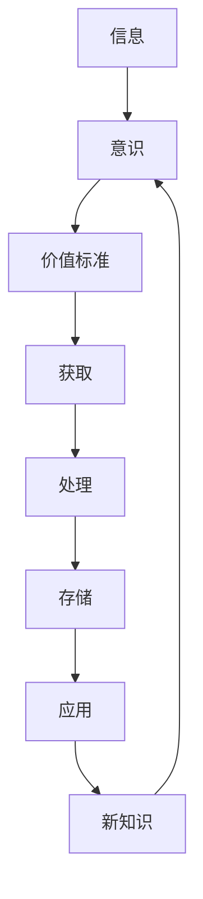

                 

## 1. 背景介绍

在当今信息爆炸的时代，我们每天都面临着海量的信息，如何有效地获取、处理和积累这些信息，并将其转化为有价值的知识，是每个人都需要面对的挑战。本文将从意识的角度出发，探讨如何在信息的海洋中建立自己的价值标准，并通过有效的方法和工具，实现知识的积累和提升。

## 2. 核心概念与联系

### 2.1 意识与价值标准

意识是人类区别于其他生物的显著特征之一，它赋予我们主动获取和处理信息的能力。在信息爆炸的时代，我们的意识需要建立一套价值标准，帮助我们筛选和过滤无用信息，获取有价值的信息。价值标准是主观的，它取决于个人的兴趣、目标和需求。建立清晰的价值标准，是有效获取和积累知识的前提。

### 2.2 知识积累的过程

知识积累是一个动态的过程，它包括获取、处理、存储和应用信息的各个环节。在这个过程中，我们需要不断地获取新信息，并将其与已有的知识结合起来，形成新的理解和见解。这个过程是循环往复的，它需要我们不断地学习和成长。

### 2.3 核心概念联系图



## 3. 核心算法原理 & 具体操作步骤

### 3.1 算法原理概述

在信息获取和处理的过程中，我们需要使用一些算法和工具来帮助我们筛选和过滤信息。本文将介绍一种基于主题模型的算法，它可以帮助我们从海量信息中提取有价值的信息，并将其转化为可理解和可应用的知识。

### 3.2 算法步骤详解

#### 3.2.1 数据预处理

在开始信息处理之前，我们需要对数据进行预处理，包括去除停用词、分词、去除标点符号等。

#### 3.2.2 主题模型构建

主题模型是一种统计模型，它可以从文本数据中提取主题。我们可以使用LDA（Latent Dirichlet Allocation）算法构建主题模型。LDA假设每个文档都是由几个主题组成的，每个主题又是由一组词汇组成的。

#### 3.2.3 主题提取

通过主题模型，我们可以提取出文本数据中的主题。每个主题都是一组相关的词汇，它们可以帮助我们理解文本数据的内容。

#### 3.2.4 信息筛选

我们可以根据提取出的主题，筛选出与我们的价值标准相关的信息。例如，如果我们的价值标准是“机器学习”，我们可以筛选出与机器学习相关的主题。

#### 3.2.5 信息整合

筛选出的信息需要进行整合，将相关的信息组合起来，形成一个完整的知识点。

### 3.3 算法优缺点

主题模型算法的优点是可以从海量信息中提取有价值的信息，并将其转化为可理解和可应用的知识。其缺点是需要大量的计算资源，并且构建主题模型需要一定的专业知识。

### 3.4 算法应用领域

主题模型算法可以应用于各种需要从海量信息中提取有价值信息的领域，例如新闻分类、文档检索、市场调查等。

## 4. 数学模型和公式 & 详细讲解 & 举例说明

### 4.1 数学模型构建

LDA算法是一种贝叶斯模型，它假设每个文档都是由几个主题组成的，每个主题又是由一组词汇组成的。我们可以使用Dirichlet分布来表示主题的分布，使用Multinomial分布来表示词汇的分布。

### 4.2 公式推导过程

LDA算法的推导过程如下：

1. 初始化主题-词汇分布和文档-主题分布。
2. 为每个文档和每个词汇采样主题，并更新主题-词汇分布和文档-主题分布。
3. 重复步骤2，直到收敛。

### 4.3 案例分析与讲解

例如，我们想要从一批新闻文章中提取有关“机器学习”的信息。我们可以使用LDA算法构建主题模型，并筛选出与“机器学习”相关的主题。然后，我们可以整合这些信息，形成一个完整的知识点，例如“机器学习在金融领域的应用”。

## 5. 项目实践：代码实例和详细解释说明

### 5.1 开发环境搭建

我们需要安装Python和一些必要的库，例如Gensim、Numpy、Scipy等。

### 5.2 源代码详细实现

```python
from gensim import corpora, models

# 数据预处理
documents = ["...", "..."]  # 这里是一批新闻文章
dictionary = corpora.Dictionary(documents)
corpus = [dictionary.doc2bow(doc) for doc in documents]

# 主题模型构建
lda_model = models.LdaModel(corpus=corpus, id2word=dictionary, num_topics=10)

# 主题提取
topics = lda_model.print_topics(num_words=4)

# 信息筛选
selected_topics = ["..."]  # 这里是我们感兴趣的主题

# 信息整合
knowledge_points = []
for topic in selected_topics:
    knowledge_points.append("...")  # 这里是我们整合出的知识点
```

### 5.3 代码解读与分析

在代码中，我们首先对数据进行预处理，然后构建LDA主题模型。我们可以通过`print_topics`方法查看提取出的主题。然后，我们筛选出感兴趣的主题，并整合信息，形成知识点。

### 5.4 运行结果展示

运行结果将显示提取出的主题和整合出的知识点。

## 6. 实际应用场景

### 6.1 信息过滤

在信息爆炸的时代，我们每天都面临着海量的信息。主题模型算法可以帮助我们筛选出有价值的信息，过滤掉无用的信息。

### 6.2 知识管理

主题模型算法可以帮助我们将信息转化为可理解和可应用的知识，从而实现知识管理。我们可以将提取出的知识点存储起来，并与其他知识点建立联系，形成自己的知识网络。

### 6.3 未来应用展望

随着信息技术的发展，主题模型算法将会有更广泛的应用。例如，它可以应用于自动化新闻分类，帮助新闻机构提高工作效率。它也可以应用于市场调查，帮助企业更好地理解消费者需求。

## 7. 工具和资源推荐

### 7.1 学习资源推荐

* "Natural Language Processing with Python" by Steven Bird, Ewan Klein, and Edward Loper
* "Python for Data Analysis" by Wes McKinney
* "Hands-On Machine Learning with Scikit-Learn, Keras, and TensorFlow" by Aurélien Géron

### 7.2 开发工具推荐

* Jupyter Notebook
* PyCharm
* Anaconda

### 7.3 相关论文推荐

* "Latent Dirichlet Allocation" by David Blei, Andrew Ng, and Michael Jordan
* "Topic Modeling for Humanistic Data" by David Blei and John W. Miller

## 8. 总结：未来发展趋势与挑战

### 8.1 研究成果总结

本文介绍了如何使用主题模型算法从信息的海洋中提取有价值的信息，并将其转化为可理解和可应用的知识。我们还介绍了算法的原理、步骤、优缺点和应用领域。

### 8.2 未来发展趋势

随着信息技术的发展，主题模型算法将会有更广泛的应用。它将会与其他技术结合起来，例如深度学习，从而实现更高水平的信息处理和知识积累。

### 8.3 面临的挑战

主题模型算法面临的挑战包括计算资源的限制、构建主题模型的专业知识要求等。此外，如何将提取出的知识转化为有效的行动，也是一个需要解决的问题。

### 8.4 研究展望

未来的研究可以从以下几个方向展开：

* 研究更高效的主题模型算法，例如基于深度学习的主题模型算法。
* 研究如何将提取出的知识转化为有效的行动，例如基于知识图谱的决策支持系统。
* 研究如何将主题模型算法应用于更广泛的领域，例如医疗领域、金融领域等。

## 9. 附录：常见问题与解答

* **Q：如何选择主题模型的参数？**
  A：主题模型的参数选择取决于具体的应用场景。通常，我们需要通过实验来选择合适的参数。
* **Q：如何评估主题模型的性能？**
  A：我们可以使用Perplexity指标来评估主题模型的性能。Perplexity越低，模型的性能越好。
* **Q：如何处理主题模型中的噪声数据？**
  A：我们可以使用数据预处理技术来处理噪声数据，例如去除停用词、分词等。

## 作者：禅与计算机程序设计艺术 / Zen and the Art of Computer Programming

