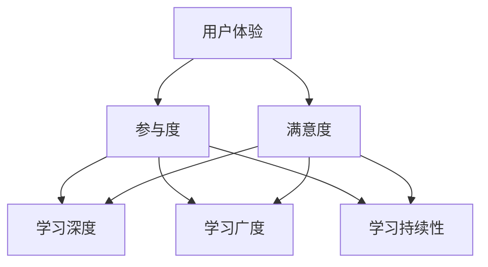
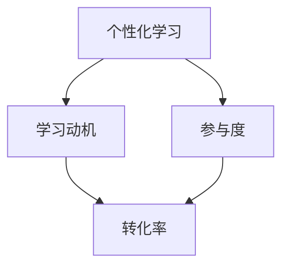
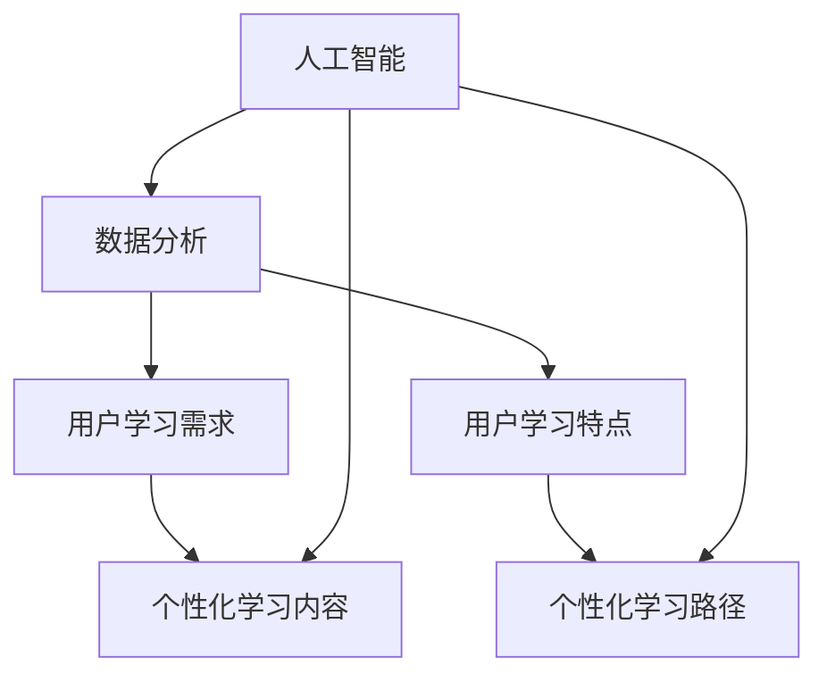

                 

**关键词：**知识付费、学习效果、转化率、用户体验、个性化学习、数据分析、人工智能

## 1. 背景介绍

随着互联网的发展，知识付费行业迅速崛起，为用户提供了海量的学习资源。然而，在知识付费的浪潮中，我们发现了一个亟待解决的问题：如何提高用户的学习效果和转化率？本文将从用户体验、个性化学习、数据分析和人工智能等角度出发，探讨知识付费平台提高用户学习效果和转化率的策略。

## 2. 核心概念与联系

### 2.1 用户体验与学习效果

用户体验是影响学习效果的关键因素。良好的用户体验能够提高用户的参与度和满意度，从而提高学习效果。学习效果则是用户体验的直接反映，它包括用户学习的深度、广度和持续性。

### 2.2 个性化学习与转化率

个性化学习是指根据用户的学习需求和特点，提供定制化的学习内容和路径。个性化学习能够提高用户的学习动机和参与度，从而提高转化率。转化率是衡量知识付费平台成功的关键指标，它反映了用户从注册到付费的转化过程。

### 2.3 数据分析与人工智能

数据分析和人工智能是提高用户学习效果和转化率的有效手段。通过分析用户的学习行为数据，可以获取用户的学习需求和特点，从而提供个性化的学习内容和路径。人工智能则可以帮助平台自动化地分析数据和提供个性化推荐。

## 3. 核心算法原理 & 具体操作步骤

### 3.1 算法原理概述

本文提出的核心算法是基于用户行为数据的个性化学习推荐算法。该算法包括三个主要模块：用户画像构建、内容推荐和路径推荐。

### 3.2 算法步骤详解

#### 3.2.1 用户画像构建

1. 收集用户的注册信息、学习行为数据和互动数据。
2. 使用聚类算法（如K-means）将用户分成不同的群组。
3. 为每个用户群组构建画像，包括学习动机、学习风格和学习水平等特征。

#### 3.2.2 内容推荐

1. 为每个用户推荐一组相关的学习内容。
2. 使用协同过滤算法（如基于用户的协同过滤）或内容相似度算法（如余弦相似度）计算用户与内容的相关性。
3. 根据相关性排序推荐内容，并提供给用户。

#### 3.2.3 路径推荐

1. 为每个用户推荐一条学习路径。
2. 使用路径规划算法（如A\*算法）计算最优学习路径。
3. 根据用户的学习水平和学习动机调整学习路径，提供给用户。

### 3.3 算法优缺点

优点：

* 个性化学习内容和路径能够提高用户的学习动机和参与度。
* 数据驱动的算法能够提高推荐的准确性和有效性。
* 自动化的推荐过程能够节省平台的人力成本。

缺点：

* 数据收集和处理的成本较高。
* 算法的复杂性可能会导致推荐的延迟。
* 个性化学习路径可能会导致用户之间的学习差异扩大。

### 3.4 算法应用领域

该算法适用于各种知识付费平台，包括在线课程平台、MOOC平台、学习社区和企业培训平台等。它可以帮助平台提高用户的学习效果和转化率，从而提高平台的竞争力。

## 4. 数学模型和公式 & 详细讲解 & 举例说明

### 4.1 数学模型构建

设用户集为$U = \{u_1, u_2,..., u_m\}$, 学习内容集为$C = \{c_1, c_2,..., c_n\}$, 用户学习行为数据集为$D = \{d_{ij}\}$, 其中$d_{ij}$表示用户$u_i$对学习内容$c_j$的学习行为数据。

用户画像可以表示为向量$P_u = \{p_{u1}, p_{u2},..., p_{uk}\}$, 其中$p_{uk}$表示用户$u$的第$k$个特征。学习内容可以表示为向量$F_c = \{f_{c1}, f_{c2},..., f_{cl}\}$, 其中$f_{cl}$表示学习内容$c$的第$l$个特征。

学习路径可以表示为序列$R_u = \{r_{u1}, r_{u2},..., r_{um}\}$, 其中$r_{um}$表示用户$u$的第$m$个学习内容。

### 4.2 公式推导过程

#### 4.2.1 用户画像构建

用户画像可以通过聚类算法构建。设聚类算法的目标函数为$J = \sum_{i=1}^{k}\sum_{u\in C_i}||P_u - \mu_i||^2$, 其中$C_i$表示第$i$个用户群组，$

