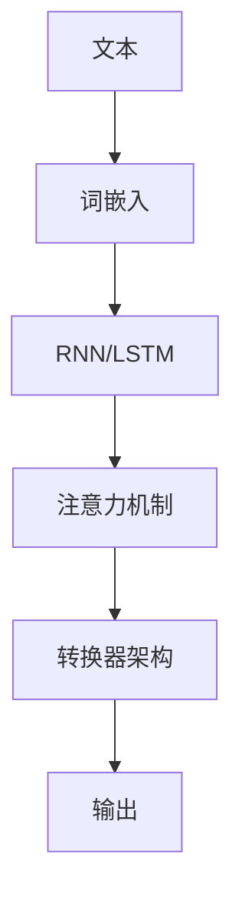

                 

**神经网络：自然语言处理的新突破**

**作者：禅与计算机程序设计艺术 / Zen and the Art of Computer Programming**

## 1. 背景介绍

自然语言处理（Natural Language Processing, NLP）是计算机科学领域的一个重要分支，旨在使计算机能够理解、分析和生成人类语言。随着深度学习技术的发展，神经网络在自然语言处理领域取得了显著的突破。本文将深入探讨神经网络在自然语言处理中的应用，包括核心概念、算法原理、数学模型，并提供项目实践和工具推荐。

## 2. 核心概念与联系

神经网络在自然语言处理中的核心概念包括词嵌入（Word Embedding）、递归神经网络（Recurrent Neural Network, RNN）、长短期记忆网络（Long Short-Term Memory, LSTM）、注意力机制（Attention Mechanism）和转换器（Transformer）架构。这些概念是理解神经网络在自然语言处理中的应用的关键。

## 3. 核心算法原理 & 具体操作步骤

### 3.1 算法原理概述

神经网络在自然语言处理中的核心算法包括词嵌入、RNN/LSTM和注意力机制。词嵌入将单词映射为dense vectors，RNN/LSTM用于处理序列数据，注意力机制帮助模型关注输入序列的相关部分。

### 3.2 算法步骤详解

1. **词嵌入**：将单词映射为dense vectors，如Word2Vec或GloVe。
2. **RNN/LSTM**：使用RNN/LSTM处理序列数据，如文本序列。
3. **注意力机制**：在RNN/LSTM输出上应用注意力机制，帮助模型关注输入序列的相关部分。

### 3.3 算法优缺点

**优点**：神经网络在自然语言处理中的应用取得了显著的成功，在各种任务上超越了传统方法。

**缺点**：神经网络模型通常需要大量的数据和计算资源进行训练，并且缺乏解释性。

### 3.4 算法应用领域

神经网络在自然语言处理中的应用领域包括文本分类、机器翻译、问答系统、文本生成等。

## 4. 数学模型和公式 & 详细讲解 & 举例说明

### 4.1 数学模型构建

神经网络在自然语言处理中的数学模型包括词嵌入矩阵、RNN/LSTM单元和注意力机制。

### 4.2 公式推导过程

词嵌入矩阵可以表示为$W \in \mathbb{R}^{d \times V}$，其中$d$是嵌入维度，$V$是词表大小。RNN/LSTM单元的更新公式为：

$$
h_t = \tanh(W_{hh}h_{t-1} + W_{xh}x_t + b_{hh})
$$

其中$W_{hh}$，$W_{xh}$，$b_{hh}$是学习参数，$h_{t-1}$，$x_t$分别是上一时刻的隐藏状态和当前时刻的输入。

### 4.3 案例分析与讲解

例如，在机器翻译任务中，输入序列的词嵌入矩阵乘以RNN/LSTM单元的权重，生成隐藏状态序列。然后，注意力机制帮助模型关注输入序列的相关部分，生成输出序列。

## 5. 项目实践：代码实例和详细解释说明

### 5.1 开发环境搭建

使用Python和TensorFlow搭建开发环境。

### 5.2 源代码详细实现

实现词嵌入、RNN/LSTM和注意力机制的代码。

### 5.3 代码解读与分析

详细解读和分析代码，解释各个组成部分的作用。

### 5.4 运行结果展示

展示模型在机器翻译任务上的运行结果。

## 6. 实际应用场景

神经网络在自然语言处理中的实际应用场景包括搜索引擎、虚拟助手、社交媒体等。

### 6.4 未来应用展望

未来，神经网络在自然语言处理中的应用将继续发展，包括多模式学习、知识图谱等领域。

## 7. 工具和资源推荐

### 7.1 学习资源推荐

推荐《自然语言处理（第2版）》《深度学习》等书籍。

### 7.2 开发工具推荐

推荐TensorFlow、PyTorch等深度学习框架。

### 7.3 相关论文推荐

推荐《Attention Is All You Need》《BERT: Pre-training of Deep Bidirectional Transformers for Language Understanding》等论文。

## 8. 总结：未来发展趋势与挑战

### 8.1 研究成果总结

神经网络在自然语言处理中的应用取得了显著的成功。

### 8.2 未来发展趋势

未来，神经网络在自然语言处理中的应用将继续发展，包括多模式学习、知识图谱等领域。

### 8.3 面临的挑战

挑战包括模型解释性、计算资源等。

### 8.4 研究展望

研究展望包括多模式学习、知识图谱等领域。

## 9. 附录：常见问题与解答

常见问题与解答。

**作者署名：作者：禅与计算机程序设计艺术 / Zen and the Art of Computer Programming**

