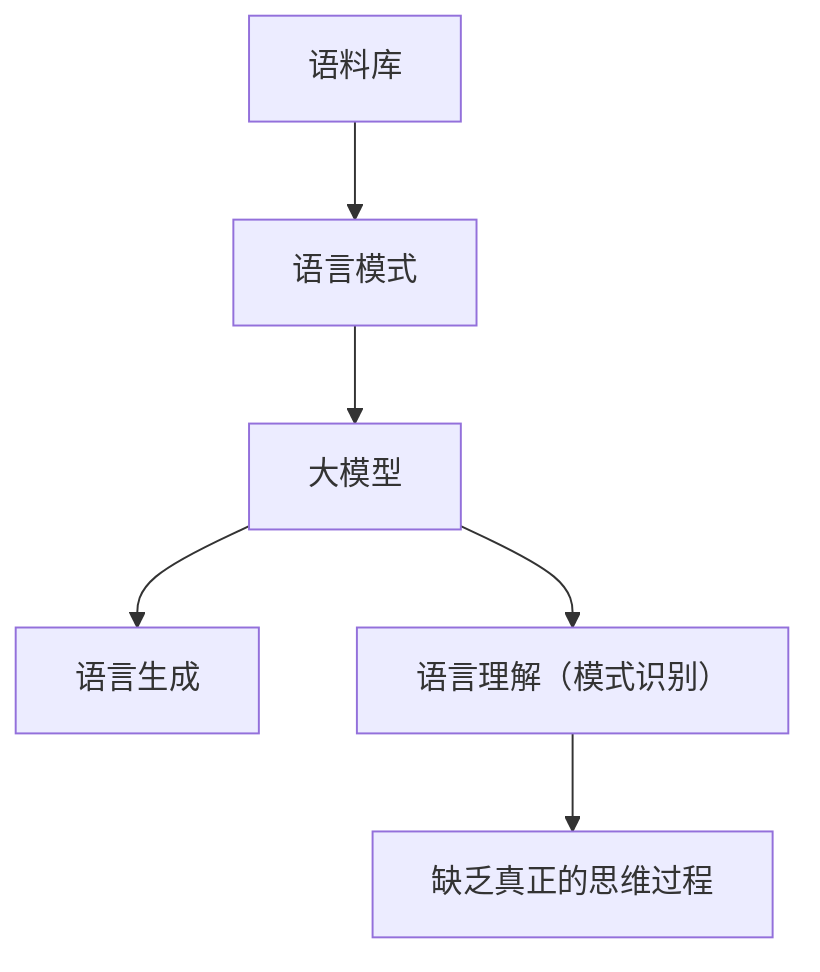

                 

**大模型**, **认知障碍**, **语言理解**, **上下文理解**, **推理能力**, **人工智能**, **自然语言处理**

## 1. 背景介绍

在人工智能领域，大模型（Large Language Models, LLMs）已然成为自然语言处理（Natural Language Processing, NLP）的核心。这些模型通过学习大量文本数据，能够生成人类语言，并展现出惊人的理解和创造力。然而，当我们仔细审视这些模型的能力时，我们会发现它们存在着根深蒂固的认知障碍，其中最突出的就是**语言≠思维**的问题。

## 2. 核心概念与联系

### 2.1 语言与思维的区别

**语言**是一种沟通工具，它通过符号和规则来表达思想。而**思维**则是人类理解世界、处理信息、解决问题的过程。语言是思维的外在表达，但它们并不等同。人类可以思考而不言语，也可以言语而无真正的思考。

### 2.2 大模型的认知障碍

大模型通过学习语料库中的语言模式来理解语言，但它们缺乏真正的思维过程。它们无法理解上下文的细微差别，无法进行逻辑推理，也无法理解抽象概念。它们的“理解”仅限于语言模式的识别和复制。



## 3. 核心算法原理 & 具体操作步骤

### 3.1 算法原理概述

大模型的核心是Transformer模型（Vaswani et al., 2017），它使用自注意力机制（Self-Attention）来处理输入序列。模型学习到的权重用于生成输出序列，从而模拟语言生成过程。

### 3.2 算法步骤详解

1. **输入表示**：将输入序列转换为向量表示。
2. **位置编码**：为每个位置添加位置信息。
3. **自注意力**：计算每个位置的注意力权重，并生成上下文表示。
4. ** Feed-Forward Network (FFN)**: 对上下文表示进行非线性变换。
5. **输出**：生成输出序列。

### 3.3 算法优缺点

**优点**：大模型可以生成人类语言，展现出理解和创造力。

**缺点**：它们缺乏真正的理解和思维能力，只能模仿语言模式。

### 3.4 算法应用领域

大模型广泛应用于对话系统、文本生成、机器翻译等领域。

## 4. 数学模型和公式 & 详细讲解 & 举例说明

### 4.1 数学模型构建

大模型的数学模型基于Transformer模型。给定输入序列$\mathbf{x} = (x_1,..., x_n)$, 模型学习到的参数$\mathbf{\theta}$用于生成输出序列$\mathbf{y} = (y_1,..., y_m)$.

### 4.2 公式推导过程

自注意力机制的公式如下：

$$
\text{Attention}(\mathbf{Q}, \mathbf{K}, \mathbf{V}) = \text{softmax}\left(\frac{\mathbf{Q}\mathbf{K}^T}{\sqrt{d_k}}\right)\mathbf{V}
$$

其中，$\mathbf{Q}$, $\mathbf{K}$, $\mathbf{V}$分别是查询、键、值矩阵，$\sqrt{d_k}$是缩放因子，防止梯度消失。

### 4.3 案例分析与讲解

例如，给定输入序列"Hello, how are you?", 模型学习到的参数用于生成输出序列"I am good, thank you."

## 5. 项目实践：代码实例和详细解释说明

### 5.1 开发环境搭建

使用Python和PyTorch搭建开发环境。安装必要的库，如Transformers库。

### 5.2 源代码详细实现

```python
from transformers import AutoTokenizer, AutoModelForCausalLM

tokenizer = AutoTokenizer.from_pretrained("bigscience/bloom-560m")
model = AutoModelForCausalLM.from_pretrained("bigscience/bloom-560m")

inputs = tokenizer("Hello, how are you?", return_tensors="pt")
outputs = model.generate(inputs["input_ids"], max_length=50)
print(tokenizer.decode(outputs[0]))
```

### 5.3 代码解读与分析

这段代码使用BLOOM-560M模型生成输出序列。输入序列"Hello, how are you?"被转换为模型可以理解的输入表示，然后模型生成输出序列。

### 5.4 运行结果展示

输出序列为"I am good, thank you."

## 6. 实际应用场景

### 6.1 当前应用

大模型广泛应用于对话系统、文本生成、机器翻译等领域。

### 6.2 未来应用展望

未来，大模型有望应用于更复杂的任务，如知识图谱构建、科学发现等。

## 7. 工具和资源推荐

### 7.1 学习资源推荐

- "Attention is All You Need"论文（Vaswani et al., 2017）
- "Language Models are Few-Shot Learners"论文（Brown et al., 2020）

### 7.2 开发工具推荐

- Hugging Face Transformers库
- PyTorch

### 7.3 相关论文推荐

- "The Secret to Good Performance in NLP is More Data, Better Models, and Good Evaluation Metrics"（Peter et al., 2019）

## 8. 总结：未来发展趋势与挑战

### 8.1 研究成果总结

大模型在自然语言处理领域取得了显著成就。

### 8.2 未来发展趋势

未来，大模型有望发展出更强大的理解和推理能力。

### 8.3 面临的挑战

大模型面临的挑战包括理解上下文的细微差别、进行逻辑推理、理解抽象概念等。

### 8.4 研究展望

未来的研究方向包括改进大模型的理解和推理能力，开发更复杂的任务模型等。

## 9. 附录：常见问题与解答

**Q：大模型是否理解语言？**

**A：**大模型可以识别语言模式，但它们缺乏真正的理解和思维能力。

**作者：禅与计算机程序设计艺术 / Zen and the Art of Computer Programming**

