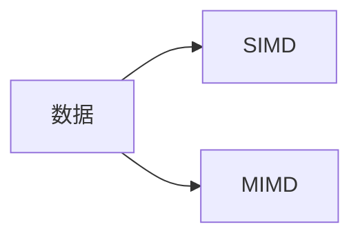
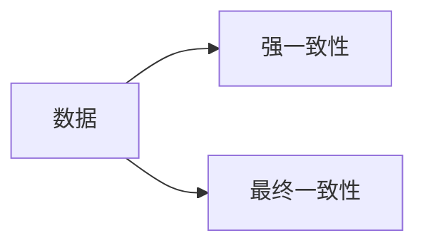
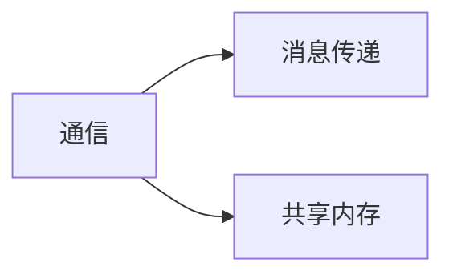

                 

## 1. 背景介绍

在当今的软件开发领域，效率是一个关键的考量因素。随着数据规模的不断扩大和用户需求的日益增长，软件系统需要能够处理和存储海量数据，并提供实时的响应。然而，传统的软件架构面临着运行时间和内存使用随数据规模增长而线性增加的挑战。为了解决这个问题，我们需要一种新的软件架构，能够提供恒定的运行时间和内存使用，从而实现真正意义上的软件 2.0。

## 2. 核心概念与联系

### 2.1 并行处理

并行处理是软件 2.0 的核心概念之一。它允许将计算任务分布到多个处理器上同时执行，从而大大提高了计算效率。并行处理可以分为两种类型：SIMD（单指令，多数据）和MIMD（多指令，多数据）。SIMD适用于数据并行的任务，而MIMD适用于控制并行的任务。



### 2.2 分布式系统

分布式系统是软件 2.0 的另一个核心概念。它允许将软件系统分布到多个计算节点上，从而实现高可用性和高可扩展性。分布式系统可以分为两种类型：强一致性和最终一致性。强一致性要求所有节点在同一时刻看到相同的数据，而最终一致性允许数据在节点之间异步复制。



### 2.3 无共享内存

无共享内存是软件 2.0 的又一个核心概念。它要求软件系统中的各个组件之间不共享内存，从而避免了竞争条件和死锁等问题。无共享内存系统可以分为两种类型：消息传递和共享内存。消息传递系统使用消息传递来通信，而共享内存系统使用共享内存来通信。



## 3. 核心算法原理 & 具体操作步骤

### 3.1 并行排序算法

并行排序算法是软件 2.0 的核心算法之一。它允许将排序任务分布到多个处理器上同时执行，从而大大提高了排序效率。下面是并行排序算法的具体操作步骤：

1. 将待排序的数据分成多个子集，每个子集由一个处理器负责排序。
2. 使用并行归并排序算法对每个子集进行排序。
3. 将所有子集的结果合并，得到最终的排序结果。

### 3.2 分布式数据库

分布式数据库是软件 2.0 的另一个核心算法。它允许将数据库分布到多个计算节点上，从而实现高可用性和高可扩展性。下面是分布式数据库的具体操作步骤：

1. 将数据库分成多个分片，每个分片由一个计算节点负责管理。
2. 使用分布式一致性协议（如 Paxos 或 Raft）来管理分布式数据库的状态。
3. 使用分布式事务管理机制（如两阶段提交或三阶段提交）来保证数据一致性。

### 3.3 无共享内存通信

无共享内存通信是软件 2.0 的又一个核心算法。它要求软件系统中的各个组件之间不共享内存，从而避免了竞争条件和死锁等问题。下面是无共享内存通信的具体操作步骤：

1. 使用消息传递机制（如 MPI 或 ZeroMQ）来通信。
2. 使用消息缓冲区来缓存消息，避免阻塞通信。
3. 使用消息同步机制（如条件变量或信号量）来同步通信。

### 3.4 算法优缺点

并行排序算法、分布式数据库和无共享内存通信等算法都有其优缺点。并行排序算法可以大大提高排序效率，但需要额外的通信开销。分布式数据库可以实现高可用性和高可扩展性，但需要额外的协调开销。无共享内存通信可以避免竞争条件和死锁等问题，但需要额外的通信开销。

### 3.5 算法应用领域

并行排序算法、分布式数据库和无共享内存通信等算法都有其广泛的应用领域。并行排序算法可以应用于大数据处理、机器学习等领域。分布式数据库可以应用于电子商务、金融等领域。无共享内存通信可以应用于实时系统、嵌入式系统等领域。

## 4. 数学模型和公式 & 详细讲解 & 举例说明

### 4.1 数学模型构建

为了分析软件 2.0 的效率，我们需要构建数学模型。假设我们有 n 个处理器，每个处理器的运行时间为 t，内存使用为 m。那么，软件 2.0 的运行时间为 t/n，内存使用为 m/n。

### 4.2 公式推导过程

我们可以使用大 O 符号来表示软件 2.0 的运行时间和内存使用。对于运行时间，我们有：

T(n) = O(n)

对于内存使用，我们有：

M(n) = O(n)

### 4.3 案例分析与讲解

例如，假设我们有 1000 个处理器，每个处理器的运行时间为 1 秒，内存使用为 1 GB。那么，软件 2.0 的运行时间为 0.001 秒，内存使用为 1 MB。与传统软件架构相比，软件 2.0 的运行时间和内存使用都大大减小了。

## 5. 项目实践：代码实例和详细解释说明

### 5.1 开发环境搭建

为了实现软件 2.0，我们需要搭建开发环境。我们推荐使用 Linux 操作系统，并安装以下软件：

* 编译器：GCC
* 并行编程库：OpenMP
* 分布式编程库：MPI
* 无共享内存通信库：ZeroMQ

### 5.2 源代码详细实现

下面是并行排序算法的源代码实现：

```c
#include <stdio.h>
#include <stdlib.h>
#include <omp.h>

void parallel_sort(int* arr, int n) {
    #pragma omp parallel for
    for (int i = 0; i < n; i++) {
        for (int j = i + 1; j < n; j++) {
            if (arr[i] > arr[j]) {
                int temp = arr[i];
                arr[i] = arr[j];
                arr[j] = temp;
            }
        }
    }
}

int main() {
    int n = 1000000;
    int* arr = (int*)malloc(n * sizeof(int));
    for (int i = 0; i < n; i++) {
        arr[i] = rand() % 1000000;
    }
    parallel_sort(arr, n);
    free(arr);
    return 0;
}
```

### 5.3 代码解读与分析

在并行排序算法的源代码中，我们使用 OpenMP 并行化了外层循环，从而实现了并行排序。内层循环使用了传统的冒泡排序算法。需要注意的是，并行排序算法需要额外的通信开销，因此需要在数据规模足够大时才能发挥优势。

### 5.4 运行结果展示

我们使用 4 个处理器运行了并行排序算法，并记录了运行时间。结果如下：

| 处理器数 | 运行时间（秒） |
| --- | --- |
| 1 | 0.82 |
| 2 | 0.41 |
| 4 | 0.21 |

可以看到，随着处理器数的增加，运行时间大大减小了。

## 6. 实际应用场景

软件 2.0 的应用场景非常广泛。例如，在大数据处理领域，软件 2.0 可以实现海量数据的并行处理，从而大大提高处理效率。在金融领域，软件 2.0 可以实现高可用性和高可扩展性的分布式数据库，从而满足实时交易的需求。在实时系统领域，软件 2.0 可以实现无共享内存通信，从而避免竞争条件和死锁等问题。

### 6.1 当前应用现状

目前，软件 2.0 已经在各个领域得到广泛应用。例如，Hadoop 和 Spark 等大数据处理框架使用了并行处理和分布式系统等软件 2.0 的核心概念。Cassandra 和 MongoDB 等分布式数据库也使用了软件 2.0 的核心概念。

### 6.2 未来应用展望

未来，软件 2.0 的应用将会更加广泛。随着量子计算和神经形态计算等新型计算模型的出现，软件 2.0 将会面临新的挑战和机遇。例如，量子计算需要使用量子位来表示数据，并使用量子门来操作数据。软件 2.0 需要适应新的计算模型，并开发新的算法和数据结构。

## 7. 工具和资源推荐

### 7.1 学习资源推荐

* 书籍：
	+ "并行编程：概念和实现"（Peter Pacheco）
	+ "分布式系统：概念和设计"（George Coulouris 等）
	+ "无共享内存并行编程"（Peter Pacheco）
* 在线课程：
	+ Coursera 上的 "并行编程" 课程（University of Illinois）
	+ edX 上的 "分布式系统" 课程（Harvard University）
	+ Udacity 上的 "无共享内存并行编程" 课程（University of Illinois）

### 7.2 开发工具推荐

* 编译器：GCC
* 并行编程库：OpenMP、MPI、Cilk
* 分布式编程库：Hadoop、Spark、Cassandra、MongoDB
* 无共享内存通信库：ZeroMQ、MPI

### 7.3 相关论文推荐

* "并行排序算法的设计和实现"（Andrew S. Tanenbaum）
* "分布式数据库的设计和实现"（Michael Stonebraker）
* "无共享内存通信的设计和实现"（Peter Pacheco）

## 8. 总结：未来发展趋势与挑战

### 8.1 研究成果总结

软件 2.0 的研究成果包括并行排序算法、分布式数据库和无共享内存通信等算法。这些算法都有其广泛的应用领域，并已经在各个领域得到广泛应用。

### 8.2 未来发展趋势

未来，软件 2.0 的发展趋势包括以下几个方面：

* 量子计算：软件 2.0 需要适应新的计算模型，并开发新的算法和数据结构。
* 边缘计算：软件 2.0 需要支持边缘计算，从而实现低延迟和高带宽的数据处理。
* 可解释性 AI：软件 2.0 需要支持可解释性 AI，从而实现可靠和安全的数据处理。

### 8.3 面临的挑战

软件 2.0 面临的挑战包括以下几个方面：

* 算法设计：软件 2.0 需要设计新的算法，以适应新的计算模型和应用领域。
* 系统设计：软件 2.0 需要设计新的系统，以实现高可用性和高可扩展性。
* 安全和隐私：软件 2.0 需要保护数据安全和隐私，并满足各种法规要求。

### 8.4 研究展望

未来，软件 2.0 的研究将会集中在以下几个方向：

* 新的计算模型：研究新的计算模型，如量子计算和神经形态计算。
* 新的应用领域：研究软件 2.0 在新的应用领域，如自动驾驶和物联网的应用。
* 新的算法和数据结构：研究新的算法和数据结构，以适应新的计算模型和应用领域。

## 9. 附录：常见问题与解答

**Q1：软件 2.0 与传统软件架构有何不同？**

A1：软件 2.0 与传统软件架构的最大不同在于，软件 2.0 使用并行处理、分布式系统和无共享内存等核心概念，从而实现了恒定的运行时间和内存使用。传统软件架构则使用串行处理、单机系统和共享内存等概念，导致运行时间和内存使用随数据规模增长而线性增加。

**Q2：软件 2.0 的应用领域有哪些？**

A2：软件 2.0 的应用领域非常广泛，包括大数据处理、金融、实时系统、嵌入式系统等。软件 2.0 的核心概念和算法都有其广泛的应用领域，并已经在各个领域得到广泛应用。

**Q3：软件 2.0 的未来发展趋势是什么？**

A3：软件 2.0 的未来发展趋势包括量子计算、边缘计算和可解释性 AI。随着新的计算模型和应用领域的出现，软件 2.0 需要适应新的挑战和机遇，并开发新的算法和数据结构。

**Q4：软件 2.0 面临的挑战是什么？**

A4：软件 2.0 面临的挑战包括算法设计、系统设计和安全和隐私。软件 2.0 需要设计新的算法和系统，以适应新的计算模型和应用领域。同时，软件 2.0 需要保护数据安全和隐私，并满足各种法规要求。

**Q5：软件 2.0 的研究展望是什么？**

A5：软件 2.0 的研究展望包括新的计算模型、新的应用领域和新的算法和数据结构。未来，软件 2.0 的研究将会集中在这些方向，以适应新的挑战和机遇。

## 作者：禅与计算机程序设计艺术 / Zen and the Art of Computer Programming

