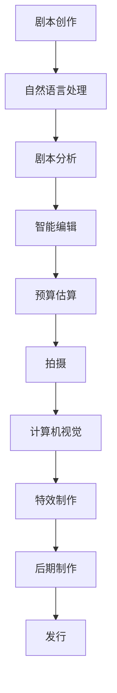

                 

AI, 电影制作, 计算机视觉, 深度学习, 自然语言处理, 特效, 机器学习, 数字人, 智能编辑

## 1. 背景介绍

电影制作是一个复杂的过程，涉及多个阶段，从剧本创作到后期特效。随着人工智能（AI）技术的发展，AI在电影制作中的应用变得越来越广泛，为电影制作带来了革命性的变化。本文将探讨AI在电影制作中的应用，从剧本创作到特效制作，展示AI如何改变电影制作的各个环节。

## 2. 核心概念与联系

### 2.1 核心概念

在电影制作中，AI的应用涉及多个领域，包括计算机视觉、自然语言处理、机器学习等。其中，计算机视觉用于分析和理解视频内容，自然语言处理用于分析和生成剧本文本，机器学习用于训练模型以实现各种任务。

### 2.2 核心架构

下图是AI在电影制作中的核心架构，展示了AI在电影制作各个阶段的应用。

## 3. 核心算法原理 & 具体操作步骤

### 3.1 算法原理概述

在电影制作中，AI的应用涉及多种算法，包括神经网络、深度学习、强化学习等。其中，神经网络用于建模和学习电影制作中的各种任务，深度学习用于提取和表示电影制作中的高级特征，强化学习用于优化电影制作中的决策过程。

### 3.2 算法步骤详解

下面是AI在电影制作中的几个关键算法的操作步骤：

#### 3.2.1 自然语言处理

1. 数据预处理：清洗、标记化、分词等。
2. 特征提取：使用词向量、文本表示等方法提取文本特征。
3. 模型训练：使用神经网络、循环神经网络等模型训练文本分类、生成等任务。
4. 模型评估：使用准确率、召回率等指标评估模型性能。

#### 3.2.2 计算机视觉

1. 数据预处理：图像增强、标记等。
2. 特征提取：使用卷积神经网络、循环神经网络等方法提取图像特征。
3. 模型训练：使用神经网络、循环神经网络等模型训练图像分类、检测等任务。
4. 模型评估：使用准确率、召回率等指标评估模型性能。

#### 3.2.3 强化学习

1. 状态表示：使用神经网络等方法表示当前状态。
2. 动作选择：使用策略网络等方法选择动作。
3. 回报计算：使用神经网络等方法计算回报。
4. 策略更新：使用梯度下降等方法更新策略。

### 3.3 算法优缺点

AI在电影制作中的算法优点包括：

* 自动化：AI可以自动化电影制作中的各种任务，提高效率和准确性。
* 个性化：AI可以根据用户偏好提供个性化的电影推荐和建议。
* 创造力：AI可以帮助电影制作者创造出新颖独特的内容。

然而，AI在电影制作中的算法也存在一些缺点：

* 成本高：AI技术需要大量的计算资源和数据，成本高昂。
* 可解释性差：AI模型的决策过程往往难以解释，这对电影制作者来说是一个挑战。
* 伦理问题：AI在电影制作中的应用涉及到隐私、偏见等伦理问题，需要慎重考虑。

### 3.4 算法应用领域

AI在电影制作中的应用领域包括：

* 剧本创作：AI可以帮助电影制作者创作剧本，提供建议和灵感。
* 智能编辑：AI可以帮助电影制作者编辑视频，提供建议和优化。
* 特效制作：AI可以帮助电影制作者创造出新颖独特的特效。
* 发行：AI可以帮助电影制作者分析市场，提供个性化的电影推荐和建议。

## 4. 数学模型和公式 & 详细讲解 & 举例说明

### 4.1 数学模型构建

在电影制作中，AI的应用涉及到多种数学模型，包括神经网络模型、深度学习模型、强化学习模型等。其中，神经网络模型用于建模和学习电影制作中的各种任务，深度学习模型用于提取和表示电影制作中的高级特征，强化学习模型用于优化电影制作中的决策过程。

### 4.2 公式推导过程

下面是AI在电影制作中的几个关键数学模型的公式推导过程：

#### 4.2.1 自然语言处理

给定一段文本，我们可以使用循环神经网络（RNN）模型来预测下一个单词。RNN模型的公式如下：

$$h_t = \tanh(W_{hh}h_{t-1} + W_{xh}x_t + b_h)$$
$$y_t = \text{softmax}(W_{hy}h_t + b_y)$$

其中，$h_t$是当前时刻的隐藏状态，$x_t$是当前时刻的输入，$y_t$是当前时刻的输出，$W_{hh}$，$W_{xh}$，$W_{hy}$，$b_h$，$b_y$是模型参数。

#### 4.2.2 计算机视觉

给定一张图像，我们可以使用卷积神经网络（CNN）模型来分类图像。CNN模型的公式如下：

$$a^{[l]} = \sigma(W^{[l]}a^{[l-1]} + b^{[l]})$$

其中，$a^{[l]}$是第$l$层的激活值，$W^{[l]}$，$b^{[l]}$是第$l$层的权重和偏置，$

