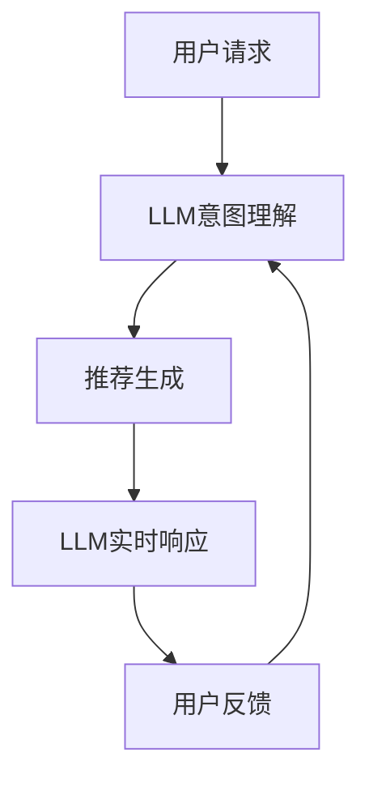

                 

**大语言模型（LLM）对推荐系统实时性能的优化策略**

## 1. 背景介绍

随着互联网的发展，推荐系统已成为用户获取信息的主要渠道之一。然而，传统的推荐系统面临着实时性能的挑战，无法满足用户对即时、个性化推荐的需求。大语言模型（LLM）的出现为推荐系统的实时性能优化带来了新的可能性。本文将深入探讨LLM在推荐系统实时性能优化中的应用，并提供具体的优化策略和实践指南。

## 2. 核心概念与联系

### 2.1 大语言模型（LLM）

大语言模型是一种通过学习大量文本数据来理解和生成人类语言的模型。LLM可以理解上下文，生成人类语言，并具有强大的推理能力。在推荐系统中，LLM可以用于理解用户意图、生成个性化推荐，并提供实时响应。

### 2.2 推荐系统

推荐系统是一种信息过滤系统，旨在为用户提供个性化的信息或商品推荐。推荐系统可以根据用户的历史行为、偏好、兴趣等信息，为用户提供相关的推荐。推荐系统的实时性能是指系统能够在用户请求时快速响应并提供个性化推荐的能力。

### 2.3 LLM在推荐系统中的应用

LLM可以在推荐系统的各个环节发挥作用，如用户意图理解、个性化推荐生成、实时响应等。图1展示了LLM在推荐系统中的应用架构。

## 3. 核心算法原理 & 具体操作步骤

### 3.1 算法原理概述

LLM在推荐系统中的应用主要基于以下两种算法原理：

1. **序列到序列（Seq2Seq）模型**：Seq2Seq模型是一种端到端的神经网络架构，可以将输入序列转换为输出序列。在推荐系统中，输入序列可以是用户的历史行为、偏好等信息，输出序列则是个性化推荐结果。
2. **Transformer模型**：Transformer模型是一种基于注意力机制的神经网络架构，可以处理长序列数据。在推荐系统中，Transformer模型可以用于理解用户意图、生成个性化推荐，并提供实时响应。

### 3.2 算法步骤详解

LLM在推荐系统中的应用步骤如下：

1. **意图理解**：使用LLM理解用户的意图，如搜索关键词、偏好等。可以使用Seq2Seq模型或Transformer模型来实现。
2. **推荐生成**：根据用户意图，生成个性化推荐结果。可以使用Seq2Seq模型或Transformer模型来实现。
3. **实时响应**：使用LLM提供实时响应，如推荐结果的解释、推荐结果的调整等。可以使用Seq2Seq模型或Transformer模型来实现。

### 3.3 算法优缺点

**优点**：

* LLM可以理解上下文，生成人类语言，并具有强大的推理能力，可以为用户提供个性化、实时的推荐。
* LLM可以学习大量文本数据，可以为推荐系统提供丰富的信息源。

**缺点**：

* LLM的训练和部署成本高，需要大量的计算资源和数据。
* LLM的实时性能受限于模型的大小和复杂度，需要进行优化以满足实时响应的需求。

### 3.4 算法应用领域

LLM在推荐系统中的应用领域包括但不限于：

* 电子商务推荐系统：为用户提供个性化的商品推荐。
* 视频推荐系统：为用户提供个性化的视频推荐。
* 新闻推荐系统：为用户提供个性化的新闻推荐。
* 个性化搜索：为用户提供个性化的搜索结果。

## 4. 数学模型和公式 & 详细讲解 & 举例说明

### 4.1 数学模型构建

在推荐系统中，我们可以使用如下数学模型来表示用户、项目和推荐关系：

* 用户表示：$u \in U$, $U$是用户集合。
* 项目表示：$i \in I$, $I$是项目集合。
* 推荐关系表示：$r_{ui} \in R$, $R$是推荐关系集合，表示用户$u$对项目$i$的偏好程度。

### 4.2 公式推导过程

在推荐系统中，我们可以使用如下公式来计算用户$u$对项目$i$的推荐分数：

$$s_{ui} = f(u, i; \theta)$$

其中，$f$是推荐函数，$theta$是模型参数。推荐函数$f$可以是任意的函数，如线性函数、非线性函数等。在LLM中，推荐函数$f$可以是Seq2Seq模型或Transformer模型。

### 4.3 案例分析与讲解

例如，在电子商务推荐系统中，我们可以使用如下公式来计算用户$u$对商品$i$的推荐分数：

$$s_{ui} = \text{LLM}(u, i)$$

其中，$\text{LLM}$是大语言模型，输入是用户$u$和商品$i$的表示，输出是推荐分数$

