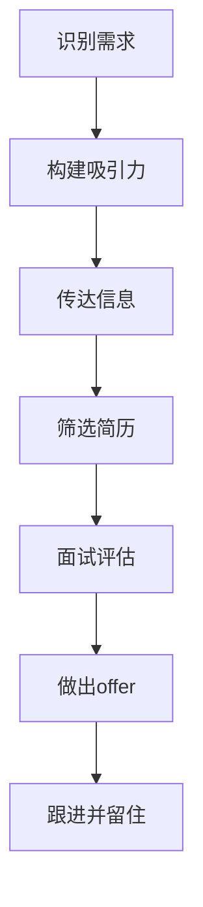

                 

**人才争夺战中的Lepton AI：如何吸引顶尖AI工程师**

**作者：禅与计算机程序设计艺术 / Zen and the Art of Computer Programming**

## 1. 背景介绍

在当今快速发展的AI领域，人才竞争异常激烈。作为一家初创AI公司，Lepton AI如何吸引顶尖AI工程师并留住他们，是一项关键的挑战。本文将探讨吸引和留住顶尖AI工程师的策略，并提供实用的建议，帮助Lepton AI在人才争夺战中脱颖而出。

## 2. 核心概念与联系

### 2.1 吸引顶尖AI工程师的关键因素

吸引顶尖AI工程师的关键因素包括：

- **挑战性项目**：顶尖工程师渴望参与具有挑战性和创新性的项目。
- **学习机会**：他们期望不断学习和成长，提高自己的技能和知识。
- **工作环境**：良好的工作环境，包括协作文化、灵活的工作安排和舒适的办公空间。
- **薪酬福利**：竞争力的薪酬和福利待遇。
- **使命感**：对公司使命和目标的认同感。

### 2.2 吸引顶尖AI工程师的策略流程图



## 3. 核心算法原理 & 具体操作步骤

### 3.1 吸引顶尖AI工程师的算法原理概述

吸引顶尖AI工程师的算法可以总结为：

**输入**：公司需求、市场趋势、工程师期望
**输出**：一套吸引并留住顶尖AI工程师的策略
**步骤**：识别需求、构建吸引力、传达信息、筛选简历、面试评估、做出offer、跟进并留住

### 3.2 吸引顶尖AI工程师的算法步骤详解

1. **识别需求**：分析公司的需求，包括技能要求、项目需求和文化匹配。
2. **构建吸引力**：根据需求，构建吸引力，包括挑战性项目、学习机会、工作环境、薪酬福利和使命感。
3. **传达信息**：通过各种渠道传达信息，包括公司网站、社交媒体、招聘网站和行业活动。
4. **筛选简历**：根据需求筛选简历，寻找技术能力强、与公司文化匹配的候选人。
5. **面试评估**：设计有效的面试流程，评估候选人的技术能力、解决问题的能力和与公司文化的匹配度。
6. **做出offer**：根据评估结果，做出竞争力的offer。
7. **跟进并留住**：跟进候选人的进展，提供持续的学习机会和职业发展路径，帮助他们在公司长期发展。

### 3.3 算法优缺点

**优点**：系统化的方法，有助于吸引和留住顶尖AI工程师。

**缺点**：可能需要大量时间和资源，并且结果可能因个人偏好和市场变化而异。

### 3.4 算法应用领域

本算法适用于任何初创AI公司或AI部门，需要吸引和留住顶尖AI工程师的情况。

## 4. 数学模型和公式 & 详细讲解 & 举例说明

### 4.1 数学模型构建

构建吸引顶尖AI工程师的数学模型可以表示为：

**S = f(P, L, W, M, C)**

其中：

- **S** 是吸引力指数
- **P** 是挑战性项目指数
- **L** 是学习机会指数
- **W** 是工作环境指数
- **M** 是使命感指数
- **C** 是薪酬福利指数

每个指数的取值范围为0-1，表示从不吸引到非常吸引。

### 4.2 公式推导过程

吸引力指数 **S** 的推导过程如下：

**S = w1\*P + w2\*L + w3\*W + w4\*M + w5\*C**

其中 **w1, w2, w3, w4, w5** 是各指数的权重，根据公司需求和市场趋势调整。

### 4.3 案例分析与讲解

例如，一家初创AI公司需要吸引顶尖AI工程师，根据市场调查和公司需求，各指数的权重为：

**w1 = 0.3, w2 = 0.2, w3 = 0.2, w4 = 0.2, w5 = 0.1**

根据公司情况，各指数的取值为：

**P = 0.8, L = 0.7, W = 0.6, M = 0.9, C = 0.8**

则吸引力指数 **S** 为：

**S = 0.3\*0.8 + 0.2\*0.7 + 0.2\*0.6 + 0.2\*0.9 + 0.1\*0.8 = 0.74**

## 5. 项目实践：代码实例和详细解释说明

### 5.1 开发环境搭建

本项目使用Python和NumPy进行数学模型的实现。

### 5.2 源代码详细实现

```python
import numpy as np

def calculate_attractiveness(P, L, W, M, C, w1, w2, w3, w4, w5):
    S = w1 * P + w2 * L + w3 * W + w4 * M + w5 * C
    return S

# 示例数据
P = 0.8
L = 0.7
W = 0.6
M = 0.9
C = 0.8
w1 = 0.3
w2 = 0.2
w3 = 0.2
w4 = 0.2
w5 = 0.1

# 计算吸引力指数
S = calculate_attractiveness(P, L, W, M, C, w1, w2, w3, w4, w5)
print("吸引力指数：", S)
```

### 5.3 代码解读与分析

代码定义了一个函数 `calculate_attractiveness`，接受各指数的取值和权重作为输入，计算吸引力指数 **S**。

### 5.4 运行结果展示

运行代码，输出吸引力指数 **S** 的值。

## 6. 实际应用场景

### 6.1 当前应用

Lepton AI可以应用本文所述策略和数学模型，吸引和留住顶尖AI工程师。

### 6.2 未来应用展望

随着AI技术的发展，本文所述策略和数学模型可以扩展到其他AI相关岗位，如数据科学家、AI产品经理等。

## 7. 工具和资源推荐

### 7.1 学习资源推荐

- "人才管理：如何吸引、激励和留住优秀人才" - 彼得·德鲁克
- "高效能人士的七个习惯" - 史蒂芬·柯维

### 7.2 开发工具推荐

- Python：用于数学模型的实现
- LinkedIn Recruiter：用于寻找和联系顶尖AI工程师

### 7.3 相关论文推荐

- "What Do Top Tech Talent Want?" - Harvard Business Review

## 8. 总结：未来发展趋势与挑战

### 8.1 研究成果总结

本文提供了吸引和留住顶尖AI工程师的策略和数学模型，帮助Lepton AI在人才争夺战中脱颖而出。

### 8.2 未来发展趋势

随着AI技术的发展，对顶尖AI工程师的需求将持续增长。吸引和留住顶尖AI工程师将成为AI公司的关键挑战。

### 8.3 面临的挑战

- **市场竞争**：AI技术的发展吸引了大量初创公司和大型企业，竞争激烈。
- **薪酬福利**：顶尖AI工程师的薪酬福利要求高，对初创公司是一项挑战。

### 8.4 研究展望

未来的研究可以扩展到吸引和留住其他AI相关岗位的顶尖人才，并研究薪酬福利和工作环境对吸引和留住顶尖AI工程师的影响。

## 9. 附录：常见问题与解答

**Q：如何筛选简历？**

**A**：根据公司需求，筛选简历时应关注技术能力、解决问题的能力和与公司文化的匹配度。

**Q：如何设计有效的面试流程？**

**A**：设计面试流程时，应包括技术面试、行为面试和文化面试，帮助评估候选人的技术能力、解决问题的能力和与公司文化的匹配度。

**Q：如何提供持续的学习机会？**

**A**：提供内部培训、外部培训、项目轮换和导师制等学习机会，帮助顶尖AI工程师不断学习和成长。

**作者：禅与计算机程序设计艺术 / Zen and the Art of Computer Programming**

