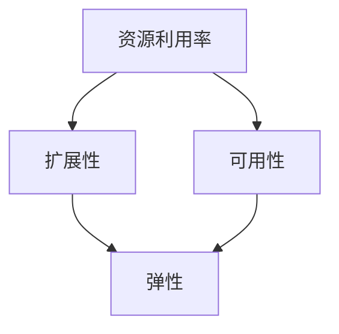

                 

**优化计算基础设施的详细策略**

**作者：禅与计算机程序设计艺术 / Zen and the Art of Computer Programming**

## 1. 背景介绍

在当今的数字化世界，计算基础设施是各行各业的关键支柱。然而，随着数据量的激增和业务需求的提高，传统的基础设施已无法满足需求。因此，优化计算基础设施变得至关重要。本文将深入探讨优化计算基础设施的详细策略，从核心概念到实践应用，为读者提供全面的指南。

## 2. 核心概念与联系

### 2.1 关键概念

- **资源利用率**：基础设施中各组件（如CPU、内存、存储）的有效使用情况。
- **扩展性**：系统在负载增加时的性能表现。
- **可用性**：系统在故障或维护期间的连续运行能力。
- **弹性**：系统在需求变化时自动调整资源的能力。

### 2.2 关键概念联系



## 3. 核心算法原理 & 具体操作步骤

### 3.1 算法原理概述

优化计算基础设施的关键在于平衡资源利用率、扩展性、可用性和弹性。我们将介绍一种基于自适应控制的算法，该算法使用反馈机制动态调整资源分配。

### 3.2 算法步骤详解

1. **监控**：实时监控系统的关键指标，如CPU使用率、内存使用情况、请求响应时间等。
2. **分析**：根据监控数据，分析系统的当前状态，判断是否需要调整资源分配。
3. **调整**：根据需求变化，动态调整资源分配。这可以通过水平扩展（增加更多实例）或垂直扩展（增加单个实例的资源）来实现。
4. **验证**：验证调整后的资源分配是否满足系统需求。如果不满足，则重复步骤2和3。

### 3.3 算法优缺点

**优点**：自适应控制算法可以根据需求动态调整资源分配，从而提高资源利用率和系统性能。

**缺点**：该算法可能会导致频繁的资源调整，从而增加系统开销。此外，算法的有效性取决于监控数据的准确性和及时性。

### 3.4 算法应用领域

自适应控制算法适用于各种计算基础设施，包括云平台、大数据系统和物联网。它特别适合于需求变化频繁的系统，如电子商务平台和实时分析系统。

## 4. 数学模型和公式

### 4.1 数学模型构建

我们可以使用控制论中的比例-积分-微分（PID）控制器模型来建模自适应控制算法。该模型将系统的当前状态（e(t)）与期望状态（r(t)）进行比较，并根据误差（e(t) - r(t)）调整控制变量（u(t)）。

### 4.2 公式推导过程

PID控制器的公式如下：

u(t) = Kp \* e(t) + Ki \* ∫e(t) dt + Kd \* de(t)/dt

其中：

- u(t) 是控制变量（资源分配），
- e(t) 是误差（当前状态与期望状态的差异），
- Kp 是比例系数，
- Ki 是积分系数，
- Kd 是微分系数，
- ∫e(t) dt 是误差的积分，
- de(t)/dt 是误差的导数。

### 4.3 案例分析与讲解

假设我们要控制CPU使用率。我们可以设置期望CPU使用率为70%。如果当前CPU使用率高于70%（即e(t) > 0），我们需要增加资源（即增加实例数或增加单个实例的CPU资源）。PID控制器的公式可以帮助我们计算出需要增加的资源量。

## 5. 项目实践：代码实例和详细解释说明

### 5.1 开发环境搭建

我们将使用Python和Prometheus/Grafana来实现自适应控制算法。Prometheus是一个开源的监控和警报工具，Grafana是一个开源的可视化工具。

### 5.2 源代码详细实现

以下是自适应控制算法的Python实现：

```python
import time
from prometheus_api_client import PrometheusConnect

# 连接Prometheus
prom = PrometheusConnect(url='http://localhost:9090')

# 设置参数
Kp = 0.5
Ki = 0.1
Kd = 0.01
r = 70  # 期望CPU使用率

# 初始化误差和积分
e prev = 0
I = 0

while True:
    # 获取当前CPU使用率
    cpu_usage = prom.custom_query_api('node_cpu_seconds_total{mode="idle"}')

    # 计算误差
    e = 100 - cpu_usage[0]['value'][1]

    # 计算控制变量
    P = Kp * e
    I += Ki * e
    D = Kd * (e - e_prev) / (time.time() - prev_time)
    u = P + I + D

    # 根据控制变量调整资源
    # TODO: 实现资源调整逻辑

    # 更新误差和积分
    e_prev = e
    prev_time = time.time()

    # 等待一段时间后再次运行循环
    time.sleep(60)
```

### 5.3 代码解读与分析

代码首先连接到Prometheus，然后设置PID控制器的参数。它每分钟运行一次，获取当前CPU使用率，计算误差，并根据PID控制器公式计算控制变量。然后，它根据控制变量调整资源（这部分逻辑需要根据具体的资源管理系统实现）。最后，它更新误差和积分，等待一分钟后再次运行循环。

### 5.4 运行结果展示

通过运行该代码，我们可以实时监控系统的CPU使用率，并根据需求动态调整资源分配。我们可以使用Grafana来可视化CPU使用率和资源调整情况。

## 6. 实际应用场景

### 6.1 当前应用

自适应控制算法可以应用于各种计算基础设施，包括云平台、大数据系统和物联网。例如，它可以应用于Amazon EC2 Auto Scaling，动态调整实例数以满足需求变化。

### 6.2 未来应用展望

随着边缘计算和5G技术的发展，自适应控制算法将变得越来越重要。它可以应用于边缘计算设备，动态调整资源分配以满足实时应用的需求。

## 7. 工具和资源推荐

### 7.1 学习资源推荐

- "Control Systems Engineering" by Stephen P. Boyd
- "Practical PID Control" by Stephen P. Boyd and Craig H. Barratt

### 7.2 开发工具推荐

- Prometheus：<https://prometheus.io/>
- Grafana：<https://grafana.com/>
- Python：<https://www.python.org/>

### 7.3 相关论文推荐

- "Adaptive Control of Chaotic Systems" by A. H. Nayfeh and L. A. Mook
- "Adaptive Control of Nonlinear Systems" by A. H. Nayfeh and L. A. Mook

## 8. 总结：未来发展趋势与挑战

### 8.1 研究成果总结

本文介绍了优化计算基础设施的详细策略，包括核心概念、算法原理、数学模型和实践应用。我们展示了如何使用自适应控制算法动态调整资源分配，从而提高资源利用率和系统性能。

### 8.2 未来发展趋势

未来，计算基础设施将变得越来越分布式和弹性。自适应控制算法将变得越来越重要，以满足这些系统的需求变化。

### 8.3 面临的挑战

然而，自适应控制算法面临着几个挑战。首先，监控数据的准确性和及时性至关重要。其次，算法的复杂性可能会导致系统开销。最后，算法的有效性取决于系统的可观测性和可控性。

### 8.4 研究展望

未来的研究将关注如何在分布式系统中实现自适应控制算法，如何处理不确定性和模糊性，以及如何在保证系统性能的同时最小化系统开销。

## 9. 附录：常见问题与解答

**Q：自适应控制算法如何处理突发需求？**

**A**：自适应控制算法可以动态调整资源分配，从而满足突发需求。然而，它需要足够的时间来感知需求变化并调整资源。因此，它可能无法立即满足突发需求。为了解决这个问题，我们可以在算法中添加一个预测器，预测需求变化并提前调整资源。

**Q：自适应控制算法如何处理故障？**

**A**：自适应控制算法可以检测故障并调整资源分配以恢复系统的正常运行。然而，它需要足够的时间来感知故障并调整资源。因此，它可能无法立即恢复系统的正常运行。为了解决这个问题，我们可以在算法中添加一个故障检测器，及早检测故障并提前调整资源。

**Q：自适应控制算法如何处理安全问题？**

**A**：自适应控制算法需要访问系统的关键指标，这可能会导致安全问题。为了解决这个问题，我们需要确保算法只能访问必要的指标，并对指标的访问进行严格控制。此外，我们需要确保算法的实现是安全的，不会导致系统的漏洞或故障。

## 结束语

优化计算基础设施是当今计算领域的关键挑战。本文介绍了优化计算基础设施的详细策略，包括核心概念、算法原理、数学模型和实践应用。我们展示了如何使用自适应控制算法动态调整资源分配，从而提高资源利用率和系统性能。我们相信，本文将为读者提供有价值的指南，帮助他们优化自己的计算基础设施。

**作者：禅与计算机程序设计艺术 / Zen and the Art of Computer Programming**

