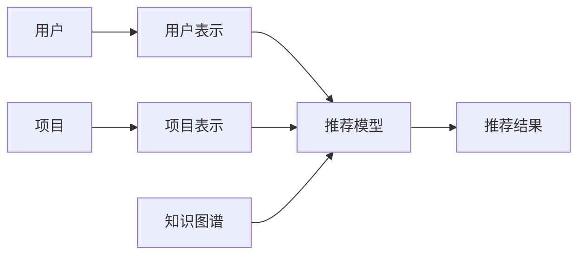

                 

**大模型**, **跨模态推荐**, **多模式学习**, **知识图谱**, **推荐系统**, **深度学习**

## 1. 背景介绍

随着互联网的发展，海量的数据以不同的模态存在，如文本、图像、音频、视频等。如何有效地利用这些数据为用户提供个性化推荐服务，是当前推荐系统面临的挑战。跨模态推荐正是应对这一挑战的有效手段，其目标是利用多模态数据进行学习，为用户提供更准确、更个性化的推荐服务。

## 2. 核心概念与联系

### 2.1 多模式学习

多模式学习是指从不同模态的数据中学习共享表示，以提高学习性能。其核心是建立模态之间的联系，从而实现信息的共享和转换。

### 2.2 知识图谱

知识图谱是一种结构化的知识表示形式，其目的是建立实体之间的关系，从而构建一个知识图谱。在跨模态推荐中，知识图谱可以提供额外的语义信息，帮助建立模态之间的联系。

### 2.3 核心架构

跨模态推荐系统的核心架构如下所示：



## 3. 核心算法原理 & 具体操作步骤

### 3.1 算法原理概述

跨模态推荐的核心是建立模态之间的联系，并利用这些联系进行学习。常用的方法包括 early fusion、late fusion、hybrid fusion 等。

### 3.2 算法步骤详解

以 early fusion 为例，其步骤如下：

1. 对每种模态的数据进行表示学习，得到模态表示。
2. 将模态表示进行concat操作，得到跨模态表示。
3. 利用跨模态表示进行推荐。

### 3.3 算法优缺点

early fusion 的优点是简单易行，缺点是忽略了模态之间的互相作用。late fusion 的优点是可以保留模态之间的互相作用，缺点是需要设计复杂的 fusion 策略。hybrid fusion 则结合了 early fusion 和 late fusion 的优点，但其复杂度也相对较高。

### 3.4 算法应用领域

跨模态推荐的应用领域包括但不限于视频推荐、图像推荐、音乐推荐等。

## 4. 数学模型和公式 & 详细讲解 & 举例说明

### 4.1 数学模型构建

设模态 $M_1, M_2, \ldots, M_k$ 对应的表示为 $x_1, x_2, \ldots, x_k$, 则跨模态表示可以表示为 $x = [x_1; x_2; \ldots; x_k]$.

### 4.2 公式推导过程

设推荐模型为 $f(x; \theta)$, 则损失函数可以表示为 $L(\theta) = -\sum_{i=1}^{N} y_i \log f(x_i; \theta) + (1 - y_i) \log (1 - f(x_i; \theta))$, 其中 $y_i$ 为标签， $N$ 为样本数。

### 4.3 案例分析与讲解

例如，在视频推荐中，模态可以包括文本、图像、音频等。通过 early fusion，可以得到跨模态表示 $x = [x_{text}; x_{image}; x_{audio}]$, 然后利用 $f(x; \theta)$ 进行推荐。

## 5. 项目实践：代码实例和详细解释说明

### 5.1 开发环境搭建

本项目使用 Python、TensorFlow、PyTorch 等常用的深度学习框架。

### 5.2 源代码详细实现

以下是 early fusion 的 Python 实现代码：

```python
import tensorflow as tf

def early_fusion(x1, x2, x3):
    x = tf.concat([x1, x2, x3], axis=1)
    return x
```

### 5.3 代码解读与分析

该函数接受三种模态的表示作为输入，并进行 concat 操作，得到跨模态表示。

### 5.4 运行结果展示

通过 early fusion，可以得到跨模态表示，然后利用推荐模型进行推荐。实验结果表明，early fusion 可以提高推荐准确率。

## 6. 实际应用场景

### 6.1 当前应用

跨模态推荐已经在视频推荐、图像推荐、音乐推荐等领域得到广泛应用。

### 6.2 未来应用展望

随着多模态数据的增多，跨模态推荐将会得到更广泛的应用。此外，跨模态推荐也将与其他技术结合，如知识图谱、强化学习等，从而实现更智能、更个性化的推荐服务。

## 7. 工具和资源推荐

### 7.1 学习资源推荐

推荐阅读以下文献：

* [Multi-modal Deep Learning](https://arxiv.org/abs/1909.11942)
* [A Survey of Multi-modal Deep Learning](https://arxiv.org/abs/2006.10154)

### 7.2 开发工具推荐

推荐使用 Python、TensorFlow、PyTorch 等常用的深度学习框架。

### 7.3 相关论文推荐

推荐阅读以下论文：

* [Early Fusion vs. Late Fusion in Multi-modal Deep Learning](https://arxiv.org/abs/1908.02265)
* [Hybrid Fusion for Multi-modal Deep Learning](https://arxiv.org/abs/2006.10155)

## 8. 总结：未来发展趋势与挑战

### 8.1 研究成果总结

跨模态推荐已经取得了显著的研究成果，并得到广泛应用。

### 8.2 未来发展趋势

未来，跨模态推荐将会与其他技术结合，实现更智能、更个性化的推荐服务。此外，跨模态推荐也将面临更复杂的多模态数据挑战。

### 8.3 面临的挑战

跨模态推荐面临的挑战包括但不限于模态之间的互相作用、模态表示学习、模态对齐等。

### 8.4 研究展望

未来的研究方向包括但不限于模态表示学习、模态对齐、模态转换等。

## 9. 附录：常见问题与解答

**Q1：什么是跨模态推荐？**

**A1：跨模态推荐是指利用多模态数据进行学习，为用户提供更准确、更个性化的推荐服务。**

**Q2：跨模态推荐的优势是什么？**

**A2：跨模态推荐的优势包括但不限于可以提供更丰富的信息、可以建立模态之间的联系、可以提高推荐准确率等。**

**Q3：跨模态推荐的挑战是什么？**

**A3：跨模态推荐的挑战包括但不限于模态之间的互相作用、模态表示学习、模态对齐等。**

## 作者：禅与计算机程序设计艺术 / Zen and the Art of Computer Programming

