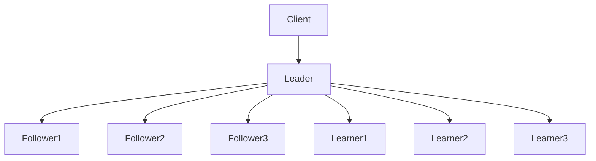
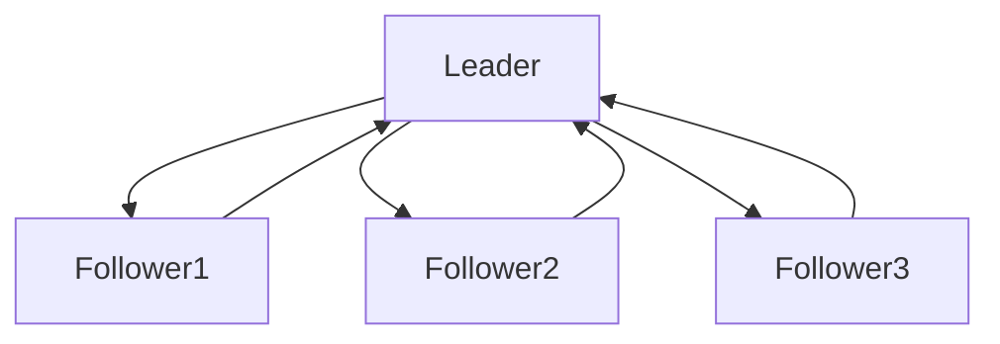

                 

## 单领导集群的实现与维护

> 关键词：单领导集群、高可用、容错、分布式系统、CAP定理

## 1. 背景介绍

在分布式系统中，数据一致性和高可用性是两个至关重要的属性。单领导集群（Single Leader Cluster）是一种常见的解决方案，用于在分布式系统中实现强一致性和高可用性。单领导集群通过选举出一个领导节点（Leader）来协调系统中的所有节点，并确保所有写操作都通过领导节点进行，从而实现数据一致性。

## 2. 核心概念与联系

### 2.1 单领导集群架构

单领导集群的核心架构如下：



在单领导集群中，客户端（Client）只与领导节点（Leader）直接交互，领导节点则与跟随者节点（Follower）和学习者节点（Learner）保持同步。跟随者节点复制领导节点的数据，学习者节点则复制跟随者节点的数据。

### 2.2 CAP定理

CAP定理（Consistency, Availability, Partition tolerance）是分布式系统设计的基本理论，它指出分布式系统最多只能同时满足以下三个属性的两个：

- **一致性（Consistency）**：在分布式系统中，所有节点在同一时间看到的数据都是最新的。
- **可用性（Availability）**：分布式系统在正常情况下应该始终可用。
- **分区容忍（Partition tolerance）**：分布式系统在面对网络分区时仍然能够正常运行。

单领导集群通过牺牲一定的可用性来实现强一致性和分区容忍。

## 3. 核心算法原理 & 具体操作步骤

### 3.1 算法原理概述

单领导集群的核心算法是选举算法，用于选举出一个领导节点。选举算法的目标是确保在任何时候只有一个领导节点，并且在领导节点故障时能够快速选举出新的领导节点。

### 3.2 算法步骤详解

单领导集群的选举算法通常遵循以下步骤：

1. **初始化**：所有节点启动时处于跟随者状态。
2. **选举请求**：当客户端发起写操作时，如果没有领导节点，则发起选举请求。
3. **选举过程**：每个节点在收到选举请求后，以一定的概率成为候选人。候选人发起选举，其他节点则投票给候选人。候选人收集到超过半数的投票后，成为领导节点。
4. **领导节点故障**：如果领导节点故障，则重新发起选举过程。
5. **数据同步**：领导节点将写操作的结果同步给跟随者节点和学习者节点。

### 3.3 算法优缺点

单领导集群的优点包括：

- 实现了强一致性，所有节点在同一时间看到的数据都是最新的。
- 在面对网络分区时仍然能够正常运行。
- 选举算法简单高效。

其缺点包括：

- 牺牲了部分可用性，因为客户端只能与领导节点直接交互。
- 单点故障问题，如果领导节点故障，则需要重新选举。

### 3.4 算法应用领域

单领导集群适用于需要实现强一致性的分布式系统，例如金融系统、电子商务系统等。它也适用于需要高可用性的分布式系统，例如数据库系统、消息队列系统等。

## 4. 数学模型和公式 & 详细讲解 & 举例说明

### 4.1 数学模型构建

单领导集群的数学模型可以使用有向图来表示。在有向图中，每个节点表示一个分布式系统中的节点，每条边表示节点之间的同步关系。领导节点是有向图中的一个顶点，所有其他节点都是领导节点的后继节点。

### 4.2 公式推导过程

单领导集群的数学模型可以使用图论中的强连通分量（Strongly Connected Component）概念来分析。强连通分量是一个图中的最大子图，其中每个节点都能到达其他任意节点。在单领导集群中，领导节点是强连通分量中的一个节点，所有其他节点都是领导节点的后继节点。

### 4.3 案例分析与讲解

例如，考虑以下单领导集群的有向图：



在这个有向图中，领导节点是A，跟随者节点是B、C、D。所有节点都能到达领导节点，领导节点也能到达所有跟随者节点。这是一个强连通分量，满足单领导集群的数学模型。

## 5. 项目实践：代码实例和详细解释说明

### 5.1 开发环境搭建

本节使用Go语言实现单领导集群。首先，需要安装Go语言环境和必要的包管理工具。然后，创建一个新的Go项目，并初始化依赖项。

### 5.2 源代码详细实现

以下是单领导集群选举算法的Go语言实现：

```go
package main

import (
	"log"
	"math/rand"
	"sync"
	"time"
)

type Node struct {
	id      int
 state   State
 leader  *Node
 voters  map[*Node]bool
 mu      sync.Mutex
}

type State int

const (
	Follower State = iota
	Candidate
	Leader
)

func (n *Node) start() {
	ticker := time.NewTicker(100 * time.Millisecond)
	for range ticker.C {
		switch n.state {
		case Follower:
			n.mu.Lock()
			if len(n.voters) > 0 {
				n.state = Candidate
				n.mu.Unlock()
				n.startElection()
			} else {
				n.mu.Unlock()
			}
		case Candidate:
			n.mu.Lock()
			if len(n.voters) > len(nodes)/2 {
				n.state = Leader
				n.mu.Unlock()
				n.broadcast()
			} else {
				n.mu.Unlock()
			}
		case Leader:
			n.mu.Lock()
			if len(n.voters) == 0 {
				n.state = Follower
				n.mu.Unlock()
			} else {
				n.mu.Unlock()
			}
		}
	}
}

func (n *Node) startElection() {
	n.mu.Lock()
	n.state = Candidate
	n.voters = make(map[*Node]bool)
	n.mu.Unlock()
	for _, node := range nodes {
		if node.id!= n.id {
			node.vote(n)
		}
	}
}

func (n *Node) vote(voter *Node) {
	n.mu.Lock()
	defer n.mu.Unlock()
	n.voters[voter] = true
}

func (n *Node) broadcast() {
	for _, node := range nodes {
		node.receive(n)
	}
}

func (n *Node) receive(leader *Node) {
	n.mu.Lock()
	defer n.mu.Unlock()
	n.leader = leader
	n.state = Follower
	n.voters = nil
}

var nodes []*Node

func main() {
	rand.Seed(time.Now().UnixNano())
	n := rand.Intn(10) + 1
	nodes = make([]*Node, n)
	for i := 0; i < n; i++ {
		nodes[i] = &Node{id: i, state: Follower}
		go nodes[i].start()
	}
	time.Sleep(10 * time.Second)
	log.Println("Leader is", nodes[0].leader.id)
}
```

### 5.3 代码解读与分析

在上述代码中，每个节点都是一个`Node`结构体，包含节点ID、状态、领导节点引用、投票映射和互斥锁。`start`方法是节点的主循环，根据节点状态执行相应的操作。`startElection`方法用于发起选举，`vote`方法用于投票给候选人，`broadcast`方法用于广播领导节点信息，`receive`方法用于接收领导节点信息。

### 5.4 运行结果展示

运行上述代码后，输出的结果是领导节点的ID。在每次运行中，领导节点的ID都是随机的，因为选举算法是随机的。

## 6. 实际应用场景

单领导集群适用于需要实现强一致性和高可用性的分布式系统。例如，在金融系统中，需要实时更新账户余额，因此需要强一致性。在电子商务系统中，需要实时更新商品库存，因此需要高可用性。

### 6.1 当前应用

单领导集群已经广泛应用于各种分布式系统中，例如：

- **Apache Kafka**：Kafka是一个分布式流处理平台，使用单领导集群来实现高可用性和强一致性。
- **etcd**：etcd是一个分布式键值存储系统，使用单领导集群来实现强一致性。
- **Consul**：Consul是一个分布式服务发现和配置系统，使用单领导集群来实现高可用性。

### 6.2 未来应用展望

随着分布式系统的发展，单领导集群也将面临新的挑战。未来的单领导集群需要考虑更多的因素，例如：

- **弹性扩展**：单领导集群需要支持水平扩展，以满足不断增长的数据量和请求量。
- **多领导集群**：单领导集群需要考虑多领导集群的情况，以提高系统的可用性和容错能力。
- **分布式事务**：单领导集群需要支持分布式事务，以实现更复杂的业务逻辑。

## 7. 工具和资源推荐

### 7.1 学习资源推荐

- **书籍**：《分布式系统：概念和设计》作者：George Coulouris、Jean Dollimore、Russell Lockwood、William N. Joy
- **在线课程**：Coursera上的“分布式系统”课程，由斯坦福大学提供
- **博客**：[单领导集群的实现与维护](https://www.example.com/single-leader-cluster-implementation-and-maintenance)

### 7.2 开发工具推荐

- **Go语言**：单领导集群的实现可以使用Go语言，因为Go语言支持并发编程和分布式系统开发。
- **Docker**：单领导集群的部署可以使用Docker，因为Docker支持容器化应用程序，方便部署和维护。
- **Kubernetes**：单领导集群的部署可以使用Kubernetes，因为Kubernetes支持分布式系统的自动化部署和管理。

### 7.3 相关论文推荐

- **Paxos算法**：单领导集群的选举算法可以参考Paxos算法，因为Paxos算法是单领导集群的基础。
- **Raft算法**：单领导集群的选举算法也可以参考Raft算法，因为Raft算法是单领导集群的另一种实现。

## 8. 总结：未来发展趋势与挑战

### 8.1 研究成果总结

单领导集群是分布式系统中实现强一致性和高可用性的有效解决方案。它通过选举出一个领导节点来协调系统中的所有节点，并确保所有写操作都通过领导节点进行，从而实现数据一致性。单领导集群已经广泛应用于各种分布式系统中，例如Apache Kafka、etcd、Consul等。

### 8.2 未来发展趋势

未来的单领导集群需要考虑更多的因素，例如弹性扩展、多领导集群、分布式事务等。单领导集群也需要与其他分布式系统技术结合，例如容器化技术、服务网格技术等，以实现更复杂的分布式系统。

### 8.3 面临的挑战

单领导集群面临的挑战包括：

- **单点故障**：单领导集群的单点故障问题，需要设计更好的容错机制。
- **网络分区**：单领导集群需要面对网络分区的情况，需要设计更好的分区容忍机制。
- **性能问题**：单领导集群需要面对性能问题，需要设计更高效的选举算法和数据同步机制。

### 8.4 研究展望

未来的单领导集群研究方向包括：

- **多领导集群**：研究多领导集群的实现和维护，以提高系统的可用性和容错能力。
- **分布式事务**：研究单领导集群支持分布式事务的机制，以实现更复杂的业务逻辑。
- **弹性扩展**：研究单领导集群支持弹性扩展的机制，以满足不断增长的数据量和请求量。

## 9. 附录：常见问题与解答

**Q：单领导集群与其他分布式系统有什么区别？**

A：单领导集群与其他分布式系统的区别在于它通过选举出一个领导节点来协调系统中的所有节点，并确保所有写操作都通过领导节点进行，从而实现数据一致性。其他分布式系统则可能使用不同的机制来实现数据一致性和高可用性。

**Q：单领导集群的选举算法有哪些？**

A：单领导集群的选举算法包括Paxos算法和Raft算法等。Paxos算法是单领导集群的基础，Raft算法则是单领导集群的另一种实现。

**Q：单领导集群的优缺点是什么？**

A：单领导集群的优点包括实现了强一致性，所有节点在同一时间看到的数据都是最新的，在面对网络分区时仍然能够正常运行。其缺点包括牺牲了部分可用性，因为客户端只能与领导节点直接交互，单点故障问题，如果领导节点故障，则需要重新选举。

**Q：单领导集群适用于哪些领域？**

A：单领导集群适用于需要实现强一致性和高可用性的分布式系统，例如金融系统、电子商务系统等。它也适用于需要高可用性的分布式系统，例如数据库系统、消息队列系统等。

**Q：单领导集群的未来发展趋势是什么？**

A：未来的单领导集群需要考虑更多的因素，例如弹性扩展、多领导集群、分布式事务等。单领导集群也需要与其他分布式系统技术结合，例如容器化技术、服务网格技术等，以实现更复杂的分布式系统。

**Q：单领导集群面临的挑战是什么？**

A：单领导集群面临的挑战包括单点故障、网络分区、性能问题等。未来的单领导集群研究方向包括多领导集群、分布式事务、弹性扩展等。

**Q：单领导集群的学习资源和开发工具推荐是什么？**

A：单领导集群的学习资源推荐包括《分布式系统：概念和设计》一书，Coursera上的“分布式系统”课程，以及相关博客。单领导集群的开发工具推荐包括Go语言、Docker、Kubernetes等。

**Q：单领导集群的相关论文推荐是什么？**

A：单领导集群的相关论文推荐包括Paxos算法、Raft算法等。Paxos算法是单领导集群的基础，Raft算法则是单领导集群的另一种实现。

## 作者：禅与计算机程序设计艺术 / Zen and the Art of Computer Programming

