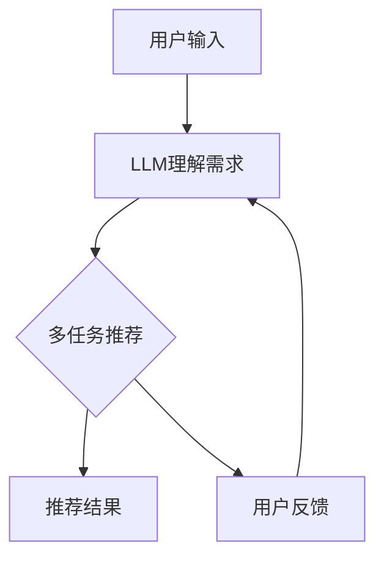

                 

**多任务推荐系统的发展：LLM的统一框架**

**作者：禅与计算机程序设计艺术 / Zen and the Art of Computer Programming**

## 1. 背景介绍

随着互联网的发展，用户面对海量信息时，需要推荐系统帮助他们发现感兴趣的内容。单一任务推荐系统已不能满足用户的多样化需求，多任务推荐系统应运而生。本文将介绍多任务推荐系统的发展，并提出基于大语言模型（LLM）的统一框架。

## 2. 核心概念与联系

### 2.1 多任务推荐系统

多任务推荐系统需要同时处理多个推荐任务，如点击预测、评分预测、用户画像等。这些任务可能有共享特征，也可能有独有特征。

### 2.2 大语言模型（LLM）

LLM是一种可以理解和生成人类语言的模型，它通过学习大量文本数据来理解语义，并能够根据上下文生成相关文本。LLM可以用于推荐系统，帮助理解用户需求和推荐相关内容。

### 2.3 Mermaid 流程图



## 3. 核心算法原理 & 具体操作步骤

### 3.1 算法原理概述

我们提出基于LLM的统一框架，将多任务推荐系统视为一个序列生成任务。LLM首先理解用户需求，然后根据需求生成推荐结果。

### 3.2 算法步骤详解

1. **需求理解**：LLM接收用户输入，理解用户需求。
2. **任务编码**：将多任务推荐系统视为一个序列生成任务，编码推荐任务。
3. **推荐生成**：LLM根据用户需求和编码的推荐任务生成推荐结果。
4. **反馈优化**：LLM接收用户反馈，优化推荐结果。

### 3.3 算法优缺点

**优点**：统一框架可以处理多种推荐任务，且可以利用LLM的理解能力提高推荐质量。

**缺点**：LLM模型本身的复杂性和计算成本可能会限制其应用。

### 3.4 算法应用领域

本框架适用于需要处理多任务推荐的场景，如电商推荐、内容推荐等。

## 4. 数学模型和公式 & 详细讲解 & 举例说明

### 4.1 数学模型构建

我们将多任务推荐系统视为一个序列生成任务，记为$P(Y|X; \theta)$, 其中$X$是用户输入，$Y$是推荐结果，$\theta$是模型参数。

### 4.2 公式推导过程

我们使用最大似然估计法估计模型参数$\theta$：

$$\theta^* = \arg\max_{\theta} \prod_{i=1}^{N} P(Y_i|X_i; \theta)$$

### 4.3 案例分析与讲解

例如，在电商推荐场景中，$X$可以是用户输入的关键词，如"运动鞋"，$Y$可以是推荐的商品列表。LLM首先理解用户需求，然后根据需求生成推荐结果。

## 5. 项目实践：代码实例和详细解释说明

### 5.1 开发环境搭建

我们使用Python开发环境，并安装必要的库，如Transformers库用于调用LLM模型。

### 5.2 源代码详细实现

```python
from transformers import AutoTokenizer, AutoModelForSeq2SeqLM

# 加载LLM模型
tokenizer = AutoTokenizer.from_pretrained("t5-base")
model = AutoModelForSeq2SeqLM.from_pretrained("t5-base")

# 用户输入
user_input = "运动鞋"

# 编码推荐任务
input_ids = tokenizer.encode("推荐" + user_input, return_tensors="pt")

# 生成推荐结果
outputs = model.generate(input_ids, max_length=50, num_beams=5, early_stopping=True)
recommendations = tokenizer.decode(outputs[0], skip_special_tokens=True)
```

### 5.3 代码解读与分析

我们首先加载LLM模型，然后接收用户输入。我们将推荐任务编码为"推荐"加上用户输入，并生成推荐结果。

### 5.4 运行结果展示

运行结果为推荐的商品列表。

## 6. 实际应用场景

### 6.1 当前应用

本框架可以应用于电商推荐、内容推荐等场景。

### 6.2 未来应用展望

随着LLM技术的发展，本框架可以应用于更复杂的推荐任务，如个性化推荐、跨平台推荐等。

## 7. 工具和资源推荐

### 7.1 学习资源推荐

推荐阅读相关论文，如"Multitask Learning Using Different Loss Functions for Deep Face Recognition"。

### 7.2 开发工具推荐

推荐使用Transformers库调用LLM模型。

### 7.3 相关论文推荐

推荐阅读"Multitask Learning with Deep Neural Networks"。

## 8. 总结：未来发展趋势与挑战

### 8.1 研究成果总结

本文提出了基于LLM的统一框架，可以处理多种推荐任务。

### 8.2 未来发展趋势

LLM技术的发展将推动多任务推荐系统的发展，本框架可以应用于更复杂的推荐任务。

### 8.3 面临的挑战

LLM模型的复杂性和计算成本可能会限制其应用。

### 8.4 研究展望

未来的研究可以探索如何优化LLM模型，降低计算成本，并应用于更复杂的推荐任务。

## 9. 附录：常见问题与解答

**Q：LLM模型的选择如何影响推荐结果？**

**A：LLM模型的选择会影响推荐结果的质量。更大、更复杂的模型可能会生成更准确的推荐结果，但计算成本也会更高。**

**Q：如何评估推荐系统的性能？**

**A：常用的评估指标包括精确度、召回率、F1分数等。**

**Q：如何处理用户反馈？**

**A：我们可以使用用户反馈优化推荐结果，如使用反向传播算法调整模型参数。**

**作者：禅与计算机程序设计艺术 / Zen and the Art of Computer Programming**

