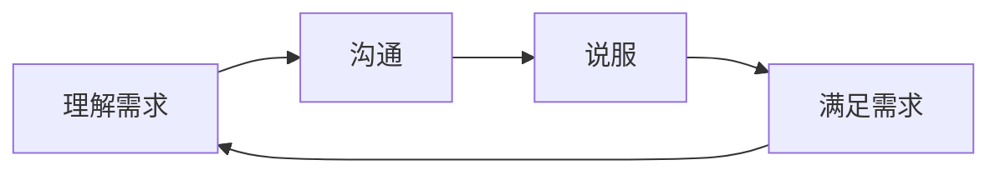
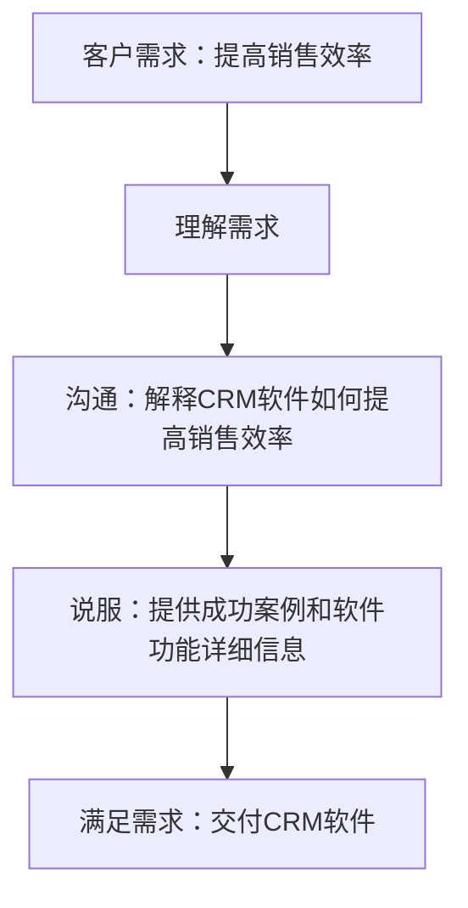

                 

## 1. 背景介绍

在当今竞争激烈的商业环境中，编程技能已经不再只是技术人员的专利。随着数字化转型的加速，企业对技术人员的需求日益增长，这些人员不仅需要具备出色的编程技能，还需要具备良好的沟通、说服和销售能力。本文将探讨如何将编程技能转化为销售能力，帮助技术人员在职业生涯中取得成功。

## 2. 核心概念与联系

将编程技能转化为销售能力的核心概念是**沟通、理解需求和说服**。这些概念是相互关联的，构成了一个循环的过程。我们可以使用Mermaid流程图来表示这个过程：



## 3. 核心算法原理 & 具体操作步骤

### 3.1 算法原理概述

将编程技能转化为销售能力的算法原理是基于**需求驱动**的。这意味着我们需要首先理解客户的需求，然后根据这些需求开发解决方案，并说服客户接受这些方案。

### 3.2 算法步骤详解

1. **理解需求**：收集客户的需求信息，并分析这些需求。这需要倾听、提问和观察的技能。
2. **沟通**：使用清晰简洁的语言解释技术解决方案，帮助客户理解这些解决方案如何满足他们的需求。
3. **说服**：提供证据和论点，说服客户接受你的解决方案。这可能需要回答客户的问题，解决他们的顾虑，并展示你的解决方案的优势。
4. **满足需求**：根据客户的需求开发解决方案，并交付这些解决方案。

### 3.3 算法优缺点

**优点**：

* 这种方法基于客户需求，因此更有可能满足客户的需求。
* 它鼓励技术人员发展沟通和说服技能，这有助于他们在职业生涯中取得成功。

**缺点**：

* 理解需求和说服客户需要时间和精力。
* 如果客户的需求不明确或不合理，这一方法可能会导致不必要的工作。

### 3.4 算法应用领域

这种方法适用于任何需要与客户沟通并说服客户接受技术解决方案的情况。这包括销售技术产品、咨询服务、项目管理和技术支持等领域。

## 4. 数学模型和公式 & 详细讲解 & 举例说明

### 4.1 数学模型构建

我们可以使用决策树模型来表示这个过程。决策树是一种有向无环图，用于表示决策的分支结构。在我们的情况下，决策树的根节点是客户的需求，分支节点是理解需求、沟通和说服的步骤，叶节点是满足需求的解决方案。

### 4.2 公式推导过程

 decision\_tree = create\_decision\_tree(
    root\_node = understand\_requirements(
        customer\_needs
    ),
    branches = [
        communicate(
            solution\_explanation
        ),
        convince(
            evidence,
            arguments
        )
    ],
    leaf\_nodes = [
        satisfy\_requirements(
            solution
        )
    ]
)

### 4.3 案例分析与讲解

假设我们是一名销售人员，正在销售一款新的客户关系管理（CRM）软件。客户的需求是提高销售团队的效率。我们可以使用决策树模型来表示这个过程：



## 5. 项目实践：代码实例和详细解释说明

### 5.1 开发环境搭建

我们将使用Python编写一个简单的命令行工具，帮助我们理解客户需求，并生成一份需求分析报告。我们需要安装Python和Jinja2模板引擎。

### 5.2 源代码详细实现

```python
from jinja2 import Environment, FileSystemLoader

def understand_requirements(customer_needs):
    # 这里是理解客户需求的逻辑
    # 我们假设客户需求是一个字符串
    # 实际情况可能需要更复杂的逻辑，如自然语言处理技术
    return customer_needs

def generate_report(customer_needs):
    env = Environment(loader=FileSystemLoader('templates'))
    template = env.get_template('report_template.md')
    report = template.render(customer_needs=customer_needs)
    with open('report.md', 'w') as f:
        f.write(report)

if __name__ == '__main__':
    customer_needs = input("请输入客户需求：")
    customer_needs = understand_requirements(customer_needs)
    generate_report(customer_needs)
```

### 5.3 代码解读与分析

这个工具接受客户需求作为输入，使用简单的逻辑理解客户需求，然后生成一份需求分析报告。报告使用Markdown格式，可以方便地转换为PDF或其他格式。

### 5.4 运行结果展示

运行这个工具后，我们会得到一份名为`report.md`的需求分析报告。报告包含客户的需求，以及我们如何理解这些需求的详细信息。

## 6. 实际应用场景

### 6.1 当前应用

这种方法已经在各种技术销售和咨询场景中得到广泛应用。例如，软件开发商使用这种方法与客户沟通，以理解客户的需求并销售其产品。技术咨询公司使用这种方法帮助客户理解其技术需求，并提供解决方案。

### 6.2 未来应用展望

随着技术的发展，这种方法的应用将会扩展到更多领域。例如，人工智能和机器学习技术可以帮助我们更好地理解客户需求，并提供个性化的解决方案。虚拟现实和增强现实技术可以帮助我们更好地展示我们的解决方案，并说服客户接受这些解决方案。

## 7. 工具和资源推荐

### 7.1 学习资源推荐

* " Influence: The Psychology of Persuasion" by Robert Cialdini
* "Crucial Conversations: Tools for Talking When Stakes Are High" by Kerry Patterson, Joseph Grenny, Ron McMillan, and Al Switzler
* "The Art of Charm" podcast

### 7.2 开发工具推荐

* Python：一个强大的编程语言，可以用于开发各种应用程序。
* Jinja2：一个模板引擎，可以用于生成动态文档。
* Markdown：一种轻量级标记语言，可以用于格式化文档。

### 7.3 相关论文推荐

* "The Customer-Centric Organization" by Peter Drucker
* "Customer-Driven Innovation" by Eric von Hippel
* "The Service-Dominant Logic of Marketing" by Stephen L. Vargo and Robert E. Lusch

## 8. 总结：未来发展趋势与挑战

### 8.1 研究成果总结

我们已经讨论了如何将编程技能转化为销售能力。我们介绍了需求驱动的方法，并使用决策树模型表示了这个过程。我们还提供了一个简单的命令行工具，帮助我们理解客户需求并生成需求分析报告。

### 8.2 未来发展趋势

未来，这种方法的应用将会扩展到更多领域。技术的发展将使我们能够更好地理解客户需求，并提供个性化的解决方案。同时，客户也将更加重视技术解决方案的价值，而不是价格。

### 8.3 面临的挑战

面临的挑战包括理解客户需求的复杂性，说服客户接受技术解决方案的难度，以及技术本身的不断变化。

### 8.4 研究展望

未来的研究将关注如何使用人工智能和机器学习技术更好地理解客户需求，如何使用虚拟现实和增强现实技术更好地展示技术解决方案，以及如何在不断变化的技术环境中保持竞争力。

## 9. 附录：常见问题与解答

**Q：如何理解客户需求？**

A：理解客户需求需要倾听、提问和观察的技能。你需要收集尽可能多的信息，并分析这些信息以理解客户的真正需求。

**Q：如何说服客户接受技术解决方案？**

A：说服客户需要提供证据和论点，并回答客户的问题。你需要展示你的解决方案的优势，并解决客户的顾虑。

**Q：如何保持竞争力？**

A：保持竞争力需要不断学习和适应。你需要跟踪技术的最新发展，并及时调整你的解决方案以满足客户的需求。

## 作者：禅与计算机程序设计艺术 / Zen and the Art of Computer Programming

