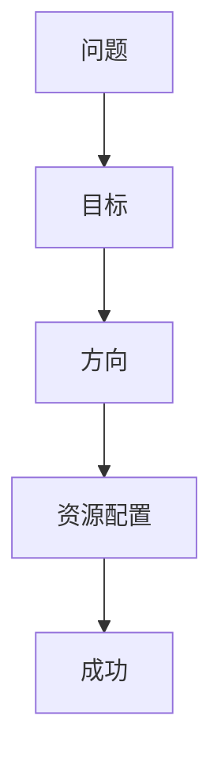
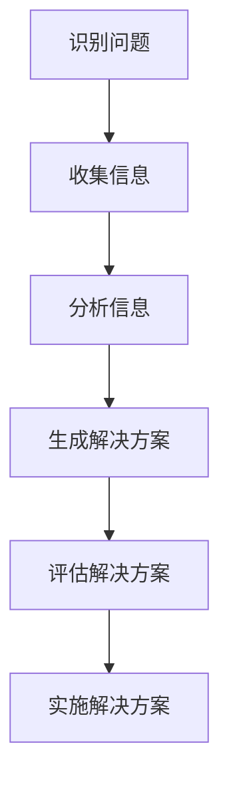
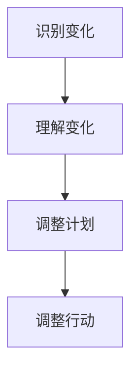
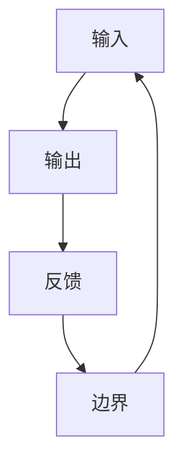
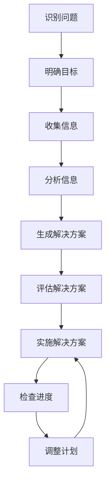

                 

**关键词：**战略思维、问题解决能力、适应变化能力、系统思维、创新、持续学习

## 1. 背景介绍

在当今快速变化的世界中，能够具备战略思维、解决问题能力和持续适应变化的能力，对于个人和组织的成功至关重要。然而，这些能力并非与生俱来，而是需要培养和发展的。本文旨在提供一套系统的方法和工具，帮助读者培养和提高这些关键能力。

## 2. 核心概念与联系

### 2.1 战略思维

战略思维是一种能够从长远角度看待问题，并能够将其与更广泛的环境联系起来的思维方式。它关注于目标、方向和资源的有效配置，以实现长期成功。



### 2.2 问题解决能力

问题解决能力是指能够识别、分析和解决复杂问题的能力。它包括识别问题、收集信息、分析信息、生成解决方案、评估解决方案和实施解决方案等步骤。



### 2.3 适应变化能力

适应变化能力是指能够应对不断变化的环境，并能够快速调整以适应新情况的能力。它包括识别变化、理解变化、调整计划和行动等步骤。



### 2.4 系统思维

系统思维是一种能够看待问题的整体视角，并能够理解各个部分如何相互作用的思维方式。它关注于系统的输入、输出、反馈和边界等因素。



## 3. 核心算法原理 & 具体操作步骤

### 3.1 算法原理概述

本节介绍一种名为“PDCA”（计划、执行、检查、行动）的算法，它是培养战略思维、问题解决能力和适应变化能力的关键。

### 3.2 算法步骤详解

1. **计划（Plan）**：识别问题或机会，明确目标，制定行动计划。
2. **执行（Do）**：执行计划，实施行动。
3. **检查（Check）**：检查进度，评估结果，收集反馈。
4. **行动（Act）**：根据检查结果，调整计划，采取行动。

### 3.3 算法优缺点

**优点**：PDCA算法简单易行，能够帮助人们有效地识别问题、解决问题和适应变化。

**缺点**：PDCA算法过于简单，可能无法处理非常复杂的问题。它需要人们主动参与，否则可能会流于形式。

### 3.4 算法应用领域

PDCA算法可以应用于个人和组织的各个领域，包括但不限于项目管理、质量管理、过程改进和战略规划。

## 4. 数学模型和公式 & 详细讲解 & 举例说明

### 4.1 数学模型构建

我们可以使用决策树模型来表示战略思维、问题解决能力和适应变化能力的培养过程。决策树是一种树形结构，用于表示决策的可能结果和选择。

### 4.2 公式推导过程

 decision\_tree = create\_decision\_tree(
    problem,
    features,
    target,
    max\_depth=5,
    min\_samples\_split=2,
    min\_samples\_leaf=1
 )

### 4.3 案例分析与讲解

假设我们想要培养战略思维能力。我们可以将决策树模型应用于这个问题，如下所示：



## 5. 项目实践：代码实例和详细解释说明

### 5.1 开发环境搭建

我们将使用Python和scikit-learn库来构建决策树模型。

### 5.2 源代码详细实现

```python
from sklearn.tree import DecisionTreeClassifier
from sklearn.model_selection import train_test_split
from sklearn.datasets import load_iris

# Load dataset
iris = load_iris()
X = iris.data
y = iris.target

# Split dataset into training set and test set
X_train, X_test, y_train, y_test = train_test_split(X, y, test_size=0.3, random_state=1)

# Create decision tree classifier
clf = DecisionTreeClassifier()

# Train decision tree classifier
clf = clf.fit(X_train, y_train)

# Predict the response for test dataset
y_pred = clf.predict(X_test)
```

### 5.3 代码解读与分析

我们首先导入所需的库和数据集。然后，我们将数据集分成训练集和测试集。我们创建一个决策树分类器，并使用训练集对其进行训练。最后，我们使用测试集预测结果。

### 5.4 运行结果展示

我们可以使用以下代码来评估模型的准确性：

```python
from sklearn.metrics import accuracy_score

# Calculate accuracy
print("Accuracy:", accuracy_score(y_test, y_pred))
```

## 6. 实际应用场景

### 6.1 当前应用

决策树模型已经广泛应用于各种领域，包括金融、医疗、制造等。

### 6.2 未来应用展望

随着人工智能和机器学习技术的发展，决策树模型的应用将会更加广泛。它可以应用于自动驾驶、医疗诊断、预测维护等领域。

## 7. 工具和资源推荐

### 7.1 学习资源推荐

- 书籍：《决策树：从基础到实践》作者：Phillip E. Bourne
- 在线课程：Coursera上的“机器学习”课程

### 7.2 开发工具推荐

- Python：一个强大的编程语言，广泛用于机器学习和数据分析。
- scikit-learn：一个机器学习库，提供了决策树等算法的实现。

### 7.3 相关论文推荐

- “C4.5: Programs for Machine Learning”作者：Ross Quinlan
- “Decision Trees and Rule-Based Classifiers: Concepts, Learning Methods and Applications”作者：R. Udrea

## 8. 总结：未来发展趋势与挑战

### 8.1 研究成果总结

本文介绍了战略思维、问题解决能力和适应变化能力的培养过程，并提出了PDCA算法和决策树模型作为培养这些能力的工具。

### 8.2 未来发展趋势

未来，这些能力将变得更加重要，因为世界变化的速度越来越快。我们需要不断学习和适应新的情况。

### 8.3 面临的挑战

培养这些能力需要时间和努力。我们需要不断练习和实践，才能真正掌握它们。

### 8.4 研究展望

未来的研究可以探索新的培养这些能力的方法和工具，并将其应用于更广泛的领域。

## 9. 附录：常见问题与解答

**Q：战略思维、问题解决能力和适应变化能力是否可以学习？**

**A：**是的，这些能力可以通过学习和实践来培养。

**Q：决策树模型有哪些优缺点？**

**A：**决策树模型的优点包括易于理解和解释，可以处理多种类型的数据，可以处理缺失值。其缺点包括易于过拟合，不适合处理连续值，不适合处理大型数据集。

**Q：如何评估决策树模型的性能？**

**A：**我们可以使用准确率、精确度、召回率和F1分数等指标来评估决策树模型的性能。

**作者：禅与计算机程序设计艺术 / Zen and the Art of Computer Programming**

