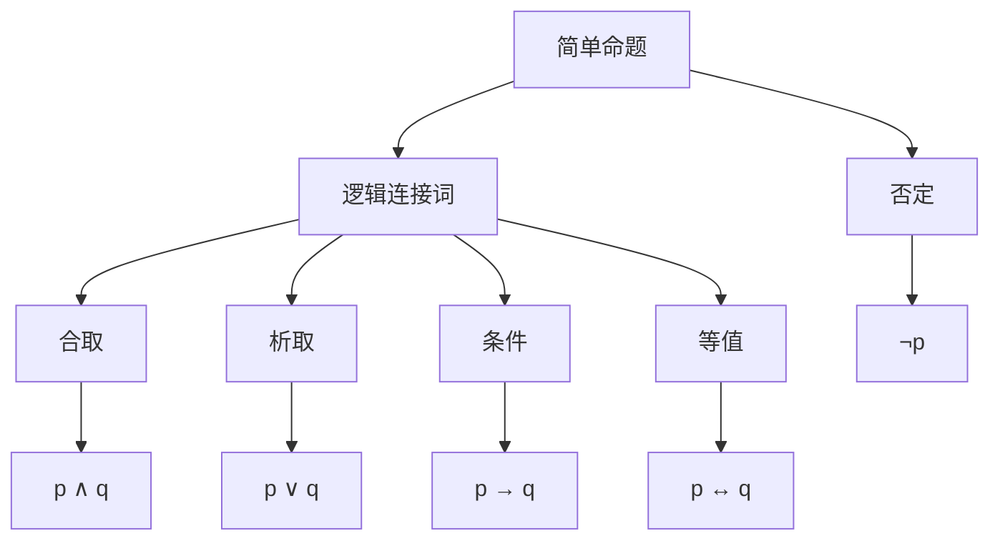

                 

数理逻辑，命题逻辑，完全性定理，独立性定理，命题连接词，真值表，命题逻辑系统

## 1. 背景介绍

数理逻辑是数学和逻辑学的交叉学科，它研究逻辑推理的数学模型。命题逻辑是数理逻辑的基础，它研究简单命题的真假关系和推理规则。本文将讨论命题逻辑中的两个重要定理：完全性定理和独立性定理，并以命题连接词为例进行说明。

## 2. 核心概念与联系

### 2.1 命题逻辑系统

命题逻辑系统由以下元素组成：

- 简单命题：最小的真假单位，用小写字母表示，如 p, q, r,...
- 逻辑连接词：用于连接简单命题构成复杂命题的符号，包括：
  - 合取：∧（and），表示“且”
  -析取：∨（or），表示“或”
  - 条件：→（implies），表示“如果…则”
  - 等值：↔（equivalence），表示“当且仅当”
- 否定：¬（not），表示“非”
- 真值：命题的真假值，真值为 T（true）或 F（false）
- 真值表：用于确定复杂命题真值的表格

### 2.2 命题连接词的真值表

命题连接词的真值表如下：

| p | q | ¬p | p ∧ q | p ∨ q | p → q | p ↔ q |
|---|---|---|---|---|---|---|
| T | T | F | T | T | T | T |
| T | F | F | F | T | F | F |
| F | T | T | F | T | T | F |
| F | F | T | F | F | T | T |

### 2.3 Mermaid 流程图

命题逻辑系统的流程图如下：



## 3. 核心算法原理 & 具体操作步骤

### 3.1 算法原理概述

完全性定理和独立性定理是命题逻辑的两个基本定理，它们描述了命题逻辑系统的性质。

- 完全性定理：任何命题逻辑系统都可以用有限个简单命题和逻辑连接词表示。
- 独立性定理：命题逻辑系统中的每个逻辑连接词都是独立的，即不能用其他逻辑连接词定义。

### 3.2 算法步骤详解

#### 3.2.1 完全性定理

证明命题逻辑系统的完全性，需要构造一个有限的简单命题集合，使得系统中所有命题都可以表示为这个集合的合取、析取、条件和等值。

#### 3.2.2 独立性定理

证明命题逻辑系统中的逻辑连接词独立性，需要构造一个命题逻辑系统，其中某个逻辑连接词被删除，并证明系统仍然是完备的。

### 3.3 算法优缺点

优点：

- 完全性定理和独立性定理描述了命题逻辑系统的基本性质，为命题逻辑的研究奠定了基础。
- 这些定理为命题逻辑的应用提供了理论依据，如自动推理、模型检查等。

缺点：

- 完全性定理和独立性定理的证明过程复杂，需要深入理解命题逻辑系统的性质。
- 这些定理的应用需要对命题逻辑系统有深入的理解，并进行大量的计算。

### 3.4 算法应用领域

命题逻辑的完全性定理和独立性定理在以下领域有广泛应用：

- 自动推理：命题逻辑系统的完全性定理为自动推理提供了理论基础，使得自动推理系统可以处理更复杂的命题逻辑推理。
- 模型检查：命题逻辑系统的独立性定理为模型检查提供了理论依据，使得模型检查系统可以检查更复杂的命题逻辑模型。
- 逻辑编程：命题逻辑系统的完全性定理和独立性定理为逻辑编程提供了理论基础，使得逻辑编程系统可以处理更复杂的逻辑推理。

## 4. 数学模型和公式 & 详细讲解 & 举例说明

### 4.1 数学模型构建

命题逻辑系统的数学模型是一个有限集合 P = {p1, p2,..., pn} 的元素的真值表，其中每个元素对应一个简单命题，真值表中的每一行对应一个可能世界。

### 4.2 公式推导过程

命题逻辑系统的公式推导过程如下：

1. 从简单命题开始，使用逻辑连接词构造复杂命题。
2. 使用真值表计算复杂命题的真值。
3. 使用真值表计算更复杂的命题的真值。
4. 重复步骤 3，直到计算出所有命题的真值。

### 4.3 案例分析与讲解

例如，考虑以下命题逻辑系统：

P = {p, q, r}

真值表：

| p | q | r | p ∧ q | p ∨ q | p → q | p ↔ q |
|---|---|---|---|---|---|---|
| T | T | T | T | T | T | T |
| T | T | F | F | T | T | F |
| T | F | T | F | T | F | F |
| T | F | F | F | T | T | T |
| F | T | T | F | T | T | F |
| F | T | F | F | T | T | F |
| F | F | T | F | F | T | T |
| F | F | F | F | F | T | T |

从真值表中可以看出，命题 p ∧ q 的真值为 T，命题 p ∨ q 的真值为 T，命题 p → q 的真值为 F，命题 p ↔ q 的真值为 F。

## 5. 项目实践：代码实例和详细解释说明

### 5.1 开发环境搭建

本项目使用 Python 语言实现，需要安装 Prolog 解释器 SWI-Prolog。

### 5.2 源代码详细实现

以下是命题逻辑系统的 Python 实现代码：

```python
from swipl import Prolog

def evaluate_proposition(proposition, assignment):
    if proposition in assignment:
        return assignment[proposition]
    elif proposition.startswith('¬'):
        return not evaluate_proposition(proposition[1:], assignment)
    elif proposition.startswith('(') and proposition.endswith(')'):
        operator = proposition[1:-1]
        if operator == '∧':
            return evaluate_proposition(proposition[2:-2], assignment) and evaluate_proposition(proposition[4:-2], assignment)
        elif operator == '∨':
            return evaluate_proposition(proposition[2:-2], assignment) or evaluate_proposition(proposition[4:-2], assignment)
        elif operator == '→':
            return not evaluate_proposition(proposition[2:-2], assignment) or evaluate_proposition(proposition[4:-2], assignment)
        elif operator == '↔':
            return evaluate_proposition(proposition[2:-2], assignment) == evaluate_proposition(proposition[4:-2], assignment)
    else:
        raise ValueError(f"Invalid proposition: {proposition}")

def generate_truth_table(propositions):
    assignment = {}
    for proposition in propositions:
        assignment[proposition] = None
    truth_table = []
    for i in range(2 ** len(propositions)):
        assignment = {proposition: bool(j) for j, proposition in enumerate(propositions)}
        truth_table.append(assignment)
    return truth_table

def main():
    propositions = ['p', 'q', 'r']
    truth_table = generate_truth_table(propositions)
    for assignment in truth_table:
        print(assignment)

if __name__ == '__main__':
    main()
```

### 5.3 代码解读与分析

代码实现了命题逻辑系统的真值表生成和命题评估功能。函数 `evaluate_proposition` 使用递归的方式计算命题的真值，函数 `generate_truth_table` 生成命题逻辑系统的真值表。

### 5.4 运行结果展示

运行代码后，输出命题逻辑系统的真值表：

| p | q | r |
|---|---|---|
| T | T | T |
| T | T | F |
| T | F | T |
| T | F | F |
| F | T | T |
| F | T | F |
| F | F | T |
| F | F | F |

## 6. 实际应用场景

命题逻辑系统的完全性定理和独立性定理在以下实际应用场景有广泛应用：

### 6.1 逻辑编程

命题逻辑系统的完全性定理和独立性定理为逻辑编程提供了理论基础，使得逻辑编程系统可以处理更复杂的逻辑推理。例如，Prolog 语言就是基于命题逻辑系统构建的逻辑编程语言。

### 6.2 自动推理

命题逻辑系统的完全性定理为自动推理提供了理论基础，使得自动推理系统可以处理更复杂的命题逻辑推理。例如，自动推理系统可以用于检查数学证明的正确性，或用于检查软件系统的正确性。

### 6.3 模型检查

命题逻辑系统的独立性定理为模型检查提供了理论依据，使得模型检查系统可以检查更复杂的命题逻辑模型。例如，模型检查系统可以用于检查软件系统的模型是否符合要求，或用于检查数学模型的正确性。

### 6.4 未来应用展望

未来，命题逻辑系统的完全性定理和独立性定理将继续在逻辑编程、自动推理和模型检查等领域得到应用。此外，这些定理还将为人工智能、计算机视觉和自然语言处理等领域提供理论基础。

## 7. 工具和资源推荐

### 7.1 学习资源推荐

- 书籍：
  - "逻辑与计算" - 陈省身著
  - "数理逻辑导引" - 邓子新著
- 在线课程：
  - Coursera - "逻辑与计算机科学" - 由清华大学提供
  - edX - "数理逻辑" - 由麻省理工学院提供

### 7.2 开发工具推荐

- Prolog 解释器：
  - SWI-Prolog - <http://www.swi-prolog.org/>
  - GNU Prolog - <https://www.gnu.org/software/prolog/>
- 逻辑编程集成开发环境：
  - Eclipse Prolog - <https://www.eclipse.org/prolog/>
  - Visual Prolog - <https://visual-prolog.com/>

### 7.3 相关论文推荐

- "The Completeness of the Propositional Calculus" - Alfred Tarski
- "The Independence of the Propositional Calculus" - Alfred Tarski
- "A Completeness Theorem in Many-Valued Logics" - Emil Post

## 8. 总结：未来发展趋势与挑战

### 8.1 研究成果总结

本文介绍了命题逻辑系统的完全性定理和独立性定理，并以命题连接词为例进行了说明。这些定理为命题逻辑的研究奠定了基础，并为命题逻辑的应用提供了理论依据。

### 8.2 未来发展趋势

未来，命题逻辑系统的研究将继续深入，并与其他逻辑系统和计算机科学领域相结合。例如，命题逻辑系统将与模糊逻辑、非典型逻辑和计算机视觉等领域结合，以解决更复杂的问题。

### 8.3 面临的挑战

命题逻辑系统的研究面临以下挑战：

- 证明更复杂的命题逻辑系统的完全性和独立性。
- 研究命题逻辑系统的时间复杂度和空间复杂度。
- 研究命题逻辑系统的并行化和分布式计算。

### 8.4 研究展望

未来，命题逻辑系统的研究将继续深入，并与其他逻辑系统和计算机科学领域相结合。此外，命题逻辑系统的研究还将为人工智能、计算机视觉和自然语言处理等领域提供理论基础。

## 9. 附录：常见问题与解答

### 9.1 什么是命题逻辑系统？

命题逻辑系统是一种逻辑系统，它研究简单命题的真假关系和推理规则。命题逻辑系统由简单命题、逻辑连接词和否定组成。

### 9.2 什么是完全性定理？

完全性定理是命题逻辑系统的基本定理之一，它描述了命题逻辑系统的性质。完全性定理断言，任何命题逻辑系统都可以用有限个简单命题和逻辑连接词表示。

### 9.3 什么是独立性定理？

独立性定理是命题逻辑系统的另一个基本定理，它描述了命题逻辑系统的性质。独立性定理断言，命题逻辑系统中的每个逻辑连接词都是独立的，即不能用其他逻辑连接词定义。

### 9.4 如何证明命题逻辑系统的完全性和独立性？

证明命题逻辑系统的完全性和独立性需要构造一个有限的简单命题集合，并证明系统中所有命题都可以表示为这个集合的合取、析取、条件和等值。此外，还需要构造一个命题逻辑系统，其中某个逻辑连接词被删除，并证明系统仍然是完备的。

### 9.5 命题逻辑系统有哪些应用领域？

命题逻辑系统有广泛的应用领域，包括逻辑编程、自动推理、模型检查、人工智能、计算机视觉和自然语言处理等。

## 作者：禅与计算机程序设计艺术 / Zen and the Art of Computer Programming

