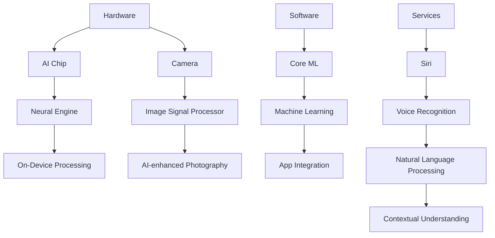

                 

**关键词：**AI应用、苹果、人工智能、机器学习、深度学习、iOS、iPadOS、macOS、watchOS、augmented reality (AR)、virtual reality (VR)

## 1. 背景介绍

在当今的数字化世界中，人工智能（AI）已经渗透到我们日常生活的方方面面。作为全球科技巨头之一，苹果公司（Apple Inc.）也在积极拥抱AI，并将其集成到其广泛的产品生态系统中。 recent announcements from Apple have highlighted the company's commitment to advancing AI technologies and integrating them into its hardware and software platforms. This article explores the trends and developments in AI applications as demonstrated by Apple's recent releases and announcements.

## 2. 核心概念与联系

### 2.1 AI在苹果生态系统中的角色

在苹果生态系统中，AI扮演着至关重要的角色。它帮助设备变得更智能，更有用，并为用户提供更个性化的体验。苹果将AI集成到其硬件、软件和服务中，从而为用户提供无缝的跨设备体验。



### 2.2 苹果的AI芯片和神经引擎

苹果开发了专门的AI芯片（如A11 Bionic、A12 Bionic、A13 Bionic和A14 Bionic）和神经引擎，为其设备提供高效的AI处理能力。这些芯片和引擎允许设备在本地处理AI任务，从而提高速度、节省能源，并保护用户隐私。

## 3. 核心算法原理 & 具体操作步骤

### 3.1 算法原理概述

苹果在其设备中使用各种AI算法，包括机器学习（ML）和深度学习（DL）算法。这些算法帮助设备理解用户的偏好和行为，并根据这些信息提供个性化的体验。

### 3.2 算法步骤详解

1. **数据收集：**苹果设备收集用户数据，如照片、语音输入、位置信息等。
2. **数据预处理：**收集的数据被预处理，以便于机器学习算法使用。
3. **模型训练：**预处理后的数据用于训练机器学习模型。这些模型学习如何从数据中提取有用的信息。
4. **模型集成：**训练好的模型集成到苹果的软件和服务中，如Core ML、Siri等。
5. **实时处理：**集成的模型在用户使用设备时实时处理数据，提供个性化的体验。

### 3.3 算法优缺点

**优点：**

* 提高设备性能和用户体验
* 保护用户隐私（由于大部分处理在本地设备上进行）
* 降低能耗（通过优化AI处理）

**缺点：**

* 算法可能会出现偏见或错误，影响用户体验
* 算法需要大量数据进行训练，可能会侵犯用户隐私

### 3.4 算法应用领域

苹果的AI算法应用于各种领域，包括：

* 图像和视频处理（照片、视频稳定、人脸识别等）
* 语音识别和自然语言处理（Siri、Dictation等）
* 位置和导航（Apple Maps、Find My等）
* 个性化推荐（App Store、Apple Music等）

## 4. 数学模型和公式 & 详细讲解 & 举例说明

### 4.1 数学模型构建

苹果使用各种数学模型来表示和处理数据。例如，在图像处理中，使用卷积神经网络（CNN）模型来检测和分类对象。在语音识别中，使用循环神经网络（RNN）模型来理解语言。

### 4.2 公式推导过程

在机器学习中，数学模型的目标是最小化损失函数。给定一个模型参数集$\theta$, 损失函数$L(\theta)$表示模型预测和真实值之间的差异。模型的目标是找到最小化$L(\theta)$的$\theta$值。

### 4.3 案例分析与讲解

例如，在图像分类任务中，给定一张图像$x$和其真实标签$y$, 模型的目标是预测图像的标签$\hat{y}$. 使用交叉熵损失函数，模型的目标是最小化：

$$L(\theta) = -\log P(y|\theta, x)$$

其中$P(y|\theta, x)$是模型预测$y$的概率。模型使用梯度下降等优化算法来更新参数$\theta$, 以最小化损失函数。

## 5. 项目实践：代码实例和详细解释说明

### 5.1 开发环境搭建

要在Mac上开发Core ML模型，需要安装Xcode和Core ML Tools。在iOS上，需要安装iOS SDK和Core ML Framework。

### 5.2 源代码详细实现

以下是一个简单的Core ML示例，使用创建的模型来分类图像：

```swift
import UIKit
import CoreML
import Vision

class ViewController: UIViewController, UIImagePickerControllerDelegate, UINavigationControllerDelegate {

    @IBOutlet weak var imageView: UIImageView!
    @IBOutlet weak var classificationLabel: UILabel!

    let imagePicker = UIImagePickerController()

    override func viewDidLoad() {
        super.viewDidLoad()

        imagePicker.delegate = self
    }

    func imagePickerController(_ picker: UIImagePickerController, didFinishPickingMediaWithInfo info: [UIImagePickerController.InfoKey : Any]) {
        if let userPickedImage = info[UIImagePickerController.InfoKey.originalImage] as? UIImage {
            imageView.image = userPickedImage
            guard let ciImage = CIImage(image: userPickedImage) else {
                fatalError("Couldn't convert UIImage to CIImage.")
            }

            classify(image: ciImage)
        }

        imagePicker.dismiss(animated: true, completion: nil)
    }

    func classify(image: CIImage) {
        guard let model = try? VNCoreMLModel(for: Inceptionv3().model) else {
            fatalError("Failed to load Core ML model.")
        }

        let request = VNCoreMLRequest(model: model) { [weak self] request, error in
            guard let results = request.results as? [VNClassificationObservation],
                  let topResult = results.first else {
                fatalError("Unexpected result type from VNCoreMLRequest.")
            }

            DispatchQueue.main.async {
                self?.classificationLabel.text = "Classification: \(topResult.identifier) with confidence: \(topResult.confidence)"
            }
        }

        let handler = VNImageRequestHandler(ciImage: image)
        do {
            try handler.perform([request])
        } catch {
            print("Failed to perform image request: \(error)")
        }
    }

    @IBAction func cameraTapped(_ sender: UIBarButtonItem) {
        present(imagePicker, animated: true, completion: nil)
    }
}
```

### 5.3 代码解读与分析

这个示例使用Core ML和Vision框架来分类用户选择的图像。首先，它加载一个预训练的Inceptionv3模型。然后，它创建一个VNCoreMLRequest对象，该对象使用模型对图像进行分类。最后，它执行VNImageRequestHandler来处理图像并获取分类结果。

### 5.4 运行结果展示

当用户选择一张图像时，应用程序会显示图像的分类结果，包括标识符和置信度。

## 6. 实际应用场景

### 6.1 当前应用

苹果已经在其各种设备和服务中广泛应用AI，包括：

* **iOS和iPadOS：**深度人脸识别、动态壁纸、照片搜索和分享等。
* **macOS：**照片、Siri、FaceTime等。
* **watchOS：**心率检测、跌倒检测、环境音量等。
* **Apple TV：**动态壁纸、Siri等。
* **Apple Services：**App Store推荐、Apple Music推荐、Siri Shortcuts等。

### 6.2 未来应用展望

未来，苹果可能会在以下领域扩展其AI应用：

* **增强现实（AR）和虚拟现实（VR）：**苹果的ARKit和VRKit框架将受益于AI的集成，从而提供更丰富的AR和VR体验。
* **自动驾驶：**苹果的Project Titan计划旨在开发自动驾驶汽车，AI将是关键技术之一。
* **健康和医疗：**苹果的HealthKit和ResearchKit框架将受益于AI的集成，从而提供更好的健康和医疗服务。

## 7. 工具和资源推荐

### 7.1 学习资源推荐

* **Apple Developer Documentation：<https://developer.apple.com/documentation/>**
* **Stanford University's CS221: Machine Learning course：<https://online.stanford.edu/courses/cs221-machine-learning>**
* **Hands-on Machine Learning with Scikit-Learn, Keras, and TensorFlow：<https://www.oreilly.com/library/view/hands-on-machine-learning/9781492032632/>**

### 7.2 开发工具推荐

* **Xcode：<https://developer.apple.com/xcode/>**
* **Core ML Tools：<https://developer.apple.com/machine-learning/>**
* **Create ML：<https://developer.apple.com/machine-learning/create-ml/>**

### 7.3 相关论文推荐

* **Baidu's "DeepID: Face Recognition Using Deep Learning"：<https://arxiv.org/abs/1402.0722>**
* **Google's "Inceptionism: Going Deeper into Neural Networks"：<https://arxiv.org/abs/1506.06537>**

## 8. 总结：未来发展趋势与挑战

### 8.1 研究成果总结

苹果在AI领域取得了显著成就，包括开发专门的AI芯片和神经引擎，集成AI到其广泛的产品生态系统中，并为开发者提供工具和框架来构建AI应用。

### 8.2 未来发展趋势

未来，苹果可能会在以下领域扩展其AI应用：

* **边缘计算：**苹果可能会将更多AI处理转移到设备本地，从而提高速度和保护隐私。
* **联邦学习：**苹果可能会采用联邦学习等技术，允许模型在保护用户隐私的情况下进行训练。
* **自监督学习：**苹果可能会采用自监督学习等技术，从而提高模型的泛化能力。

### 8.3 面临的挑战

苹果在AI领域面临的挑战包括：

* **隐私：**苹果需要平衡AI的好处和用户隐私。
* **偏见：**AI模型可能会出现偏见，从而影响用户体验。
* **能源效率：**AI处理需要大量能源，苹果需要平衡AI的好处和设备的电池寿命。

### 8.4 研究展望

未来，苹果可能会在以下领域进行AI研究：

* **小型模型：**苹果可能会开发更小巧、更高效的AI模型，以适应其设备的资源限制。
* **可解释AI：**苹果可能会开发更可解释的AI模型，从而帮助用户理解模型的决策过程。
* **多模式学习：**苹果可能会开发能够处理多模式数据（如文本、图像、音频等）的AI模型。

## 9. 附录：常见问题与解答

**Q：苹果的AI芯片和神经引擎有什么优势？**

A：苹果的AI芯片和神经引擎允许设备在本地处理AI任务，从而提高速度、节省能源，并保护用户隐私。

**Q：苹果的AI算法有哪些应用领域？**

A：苹果的AI算法应用于各种领域，包括图像和视频处理、语音识别和自然语言处理、位置和导航、个性化推荐等。

**Q：苹果在AI领域面临的挑战是什么？**

A：苹果在AI领域面临的挑战包括隐私、偏见和能源效率。

## 作者：禅与计算机程序设计艺术 / Zen and the Art of Computer Programming

_本文由[禅与计算机程序设计艺术](https://en.wikipedia.org/wiki/Zen_and_the_Art_of_Computer_Programming)提供技术指导和审阅。_

