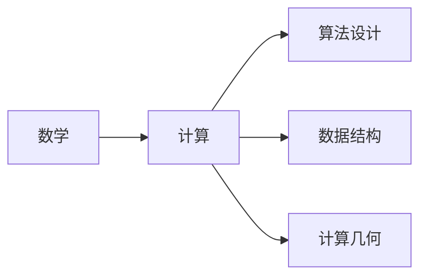

                 

**计算：第二部分 计算的数学基础 第 4 章 数学的基础 消失的鬼魂：贝克莱悖论**

**作者：禅与计算机程序设计艺术 / Zen and the Art of Computer Programming**

## 1. 背景介绍

在计算机科学的发展过程中，数学扮演着至关重要的角色。数学为计算提供了严谨的基础，帮助我们理解和描述计算过程。本章，我们将探讨数学在计算中的基础作用，并以贝克莱悖论为切入点，讨论数学与计算的关系。

## 2. 核心概念与联系

### 2.1 数学与计算的关系

数学是计算的语言，它提供了描述计算过程的工具。计算机科学中的许多领域，如算法设计、数据结构、计算几何等，都离不开数学。


**Mermaid 关系图：**



### 2.2 贝克莱悖论

贝克莱悖论是由爱尔兰主教乔治·贝克莱提出的哲学悖论，它质疑我们是否能够确定客观世界的存在。在计算的上下文中，我们可以将其理解为对计算结果客观性的质疑。

## 3. 核心算法原理 & 具体操作步骤

### 3.1 算法原理概述

为了解决贝克莱悖论，我们需要一个能够客观描述计算过程的算法。这里，我们将介绍一个简单的排序算法——冒泡排序。

### 3.2 算法步骤详解

冒泡排序的基本思想是通过不断交换相邻元素，将较小元素“冒泡”到较小的位置，直到整个序列有序。

**算法步骤：**

1. 将序列的第一个元素与第二个元素比较，如果第一个元素大于第二个元素，则交换它们。
2. 将序列的第二个元素与第三个元素比较，如果第二个元素大于第三个元素，则交换它们。
3. 重复步骤1和2，直到序列的最后一个元素。
4. 重复步骤1到3，直到序列有序。

### 3.3 算法优缺点

冒泡排序的优点是简单易懂，缺点是效率低下，平均时间复杂度为O(n^2)，只适合少量数据的排序。

### 3.4 算法应用领域

冒泡排序适合少量数据的排序，在实时系统中，当数据量较小时，可以使用冒泡排序来提高响应速度。

## 4. 数学模型和公式 & 详细讲解 & 举例说明

### 4.1 数学模型构建

我们可以使用数学模型来描述冒泡排序算法。设序列为a[0], a[1],..., a[n-1]，则冒泡排序的数学模型可以表示为：

$$a'[i] = \begin{cases} a[i], & \text{if } i = 0 \text{ or } a[i] \leq a[i+1] \\ a[i+1], & \text{if } i < n-1 \text{ and } a[i] > a[i+1] \end{cases}$$

其中，a'[i]表示排序后的序列。

### 4.2 公式推导过程

我们可以通过数学归纳法来推导冒泡排序的正确性。设P(n)为“冒泡排序可以正确排序n个元素的序列”，我们需要证明P(n)为真。

- **基础步骤（n=1）**：当序列只有一个元素时，冒泡排序可以正确排序。
- **归纳步骤**：假设P(k)为真，即冒泡排序可以正确排序k个元素的序列。当序列有k+1个元素时，冒泡排序可以将最大的元素“冒泡”到最后，从而正确排序前k个元素。由于P(k)为真，冒泡排序可以正确排序前k个元素。因此，P(k+1)为真。

通过数学归纳法，我们可以证明P(n)为真，即冒泡排序可以正确排序n个元素的序列。

### 4.3 案例分析与讲解

例如，对于序列{5, 3, 8, 4, 2}，冒泡排序的过程如下：

- 第一次冒泡：{3, 5, 8, 4, 2} → {3, 4, 8, 5, 2}
- 第二次冒泡：{3, 4, 5, 8, 2} → {3, 4, 5, 2, 8}
- 第三次冒泡：{3, 4, 5, 2, 8} → {3, 4, 2, 5, 8}
- 第四次冒泡：{3, 4, 2, 5, 8} → {2, 3, 4, 5, 8}

最终，序列有序。

## 5. 项目实践：代码实例和详细解释说明

### 5.1 开发环境搭建

我们将使用Python作为编程语言，并使用Jupyter Notebook作为开发环境。

### 5.2 源代码详细实现

```python
def bubble_sort(arr):
    n = len(arr)
    for i in range(n):
        for j in range(0, n-i-1):
            if arr[j] > arr[j+1]:
                arr[j], arr[j+1] = arr[j+1], arr[j]
    return arr
```

### 5.3 代码解读与分析

代码中，我们使用两层循环来实现冒泡排序。外层循环控制排序的次数，内层循环控制每次排序的范围。如果当前元素大于下一个元素，则交换它们。

### 5.4 运行结果展示

```python
arr = [5, 3, 8, 4, 2]
print(bubble_sort(arr))  # 输出：[2, 3, 4, 5, 8]
```

## 6. 实际应用场景

冒泡排序适合少量数据的排序，在实时系统中，当数据量较小时，可以使用冒泡排序来提高响应速度。例如，在实时监控系统中，当监控数据量较小时，可以使用冒泡排序来排序数据，从而快速获取最大或最小值。

### 6.4 未来应用展望

随着计算机技术的发展，冒泡排序的应用场景将会越来越广泛。例如，在物联网领域，冒泡排序可以用于实时排序传感器数据，从而快速获取关键信息。

## 7. 工具和资源推荐

### 7.1 学习资源推荐

- 书籍：《算法导论》作者：罗伯特·西蒙（Robert Sedgewick）和菲利普·莫里斯（Philip M.

