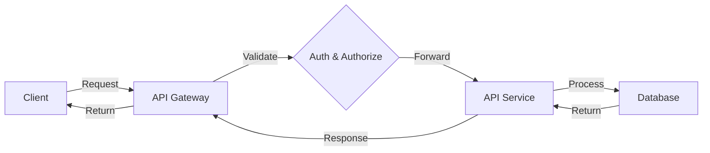

                 

## 1. 背景介绍

在当今的软件开发领域，API（Application Programming Interface）无处不在。API使得软件系统能够相互通信，共享数据和服务。调用外部 API 的重要性日益凸显，因为它可以帮助我们构建更强大、更灵活、更智能的应用程序。本文将深入探讨调用外部 API 的重要性，并提供实践指南和工具推荐。

## 2. 核心概念与联系

### 2.1 API 的定义与分类

API是一组预定义的请求和响应消息，用于在不同的软件系统之间进行通信。API可以分为以下几类：

- **Web API**：通过 HTTP 协议在 web 应用程序之间传输数据。
- **REST API**：基于 Representational State Transfer（表征状态转移）的 API，使用 HTTP 方法（GET、POST、PUT、DELETE 等）操作资源。
- **GraphQL API**：一种查询语言，允许客户端请求特定的数据，而不是固定的资源和关系模式。
- **gRPC API**：一种高性能、通用的 RPC（Remote Procedure Call）框架，使用 Protocol Buffers 进行序列化。

### 2.2 API 生命周期与版本控制

API通常遵循以下生命周期：

1. **开发**：设计和实现 API。
2. **发布**：发布 API 给开发者使用。
3. **维护**：更新、修复 bug 和添加新功能。
4. **弃用**：不再维护 API，并通知开发者迁移到新版本。

API 版本控制有助于管理 API 的变化，常见的方法包括：

- **版本号**：在 URL 中或请求头中包含版本号。
- **头信息**：使用 `Accept` 头信息指定客户端支持的 API 版本。
- **内容协商**：使用 `Accept` 头信息指定客户端支持的内容格式（如 JSON、XML）。

### 2.3 API 设计最佳实践

设计 API 时，应遵循以下最佳实践：

- **简单明确**：API 应该简单易用，文档清晰明确。
- **幂等**：多次发送相同请求的效果等同于发送一次。
- **安全**：API 应该提供身份验证和授权机制，保护数据安全。
- **可靠**：API 应该提供错误处理和异常情况处理机制。
- **高效**：API 应该提供缓存机制，减少不必要的请求。

### 2.4 API 通信流程图

以下是 API 通信的 Mermaid 流程图：



## 3. 核心算法原理 & 具体操作步骤

### 3.1 算法原理概述

调用外部 API 的核心算法原理是发送 HTTP 请求并处理响应。这个过程涉及到以下步骤：

1. **构建请求**：构建 HTTP 请求，包括 URL、请求方法（GET、POST 等）、请求头和请求体。
2. **发送请求**：使用 HTTP 客户端库发送请求到 API 服务器。
3. **接收响应**：接收服务器的响应，包括响应头和响应体。
4. **处理响应**：解析响应体，获取所需数据。

### 3.2 算法步骤详解

以下是调用外部 API 的详细步骤：

1. **导入依赖**：导入 HTTP 客户端库，如 `requests`（Python）或 `axios`（JavaScript）。
2. **构建请求**：构建 HTTP 请求，包括 URL、请求方法、请求头和请求体。示例：
```python
import requests

url = 'https://api.example.com/users'
headers = {'Authorization': 'Bearer <token>'}
params = {'limit': 10, 'offset': 0}
data = {'name': 'John Doe'}
```
3. **发送请求**：使用 HTTP 客户端库发送请求到 API 服务器。示例：
```python
response = requests.get(url, headers=headers, params=params)
```
4. **接收响应**：接收服务器的响应，包括响应头和响应体。示例：
```python
status_code = response.status_code
headers = response.headers
data = response.json()
```
5. **处理响应**：解析响应体，获取所需数据。示例：
```python
users = data['users']
total = data['total']
```
### 3.3 算法优缺点

**优点**：

- **灵活**：API 允许开发者集成不同系统的功能。
- **高效**：API 可以重复使用，节省开发时间。
- **可扩展**：API 可以轻松扩展新功能。

**缺点**：

- **依赖性**：API 的变化可能会影响依赖它的系统。
- **安全风险**：API 的不当使用可能会导致数据泄露或滥用。
- **性能开销**：频繁调用 API 可能会导致性能下降。

### 3.4 算法应用领域

调用外部 API 的应用领域包括：

- **数据聚合**：从多个数据源收集数据。
- **服务集成**：集成外部服务，如支付、物流等。
- **机器学习**：使用 API 获取预训练模型或进行模型训练。
- **实时数据**：获取实时数据，如股票行情、天气预报等。

## 4. 数学模型和公式 & 详细讲解 & 举例说明

### 4.1 数学模型构建

调用外部 API 的数学模型可以表示为以下函数：

`response = API_request(request_method, url, headers, params, data)`

其中：

- `request_method`：请求方法（GET、POST 等）。
- `url`：API 服务器 URL。
- `headers`：请求头。
- `params`：请求参数。
- `data`：请求体。
- `response`：服务器响应。

### 4.2 公式推导过程

API 的响应时间可以使用以下公式推导：

`T_response = T_network + T_processing`

其中：

- `T_response`：API 的响应时间。
- `T_network`：网络延迟时间。
- `T_processing`：API 服务器处理请求的时间。

### 4.3 案例分析与讲解

假设我们要调用一个 API，获取用户列表。API 文档提供了以下信息：

- **URL**：`https://api.example.com/users`
- **请求方法**：`GET`
- **请求参数**：`limit`（每页显示的用户数）和 `offset`（跳过的用户数）。
- **响应格式**：JSON

我们可以使用以下 Python 代码调用 API：
```python
import requests
import time

url = 'https://api.example.com/users'
params = {'limit': 10, 'offset': 0}

start_time = time.time()
response = requests.get(url, params=params)
end_time = time.time()

print(f"Response time: {end_time - start_time} seconds")
print(f"Status code: {response.status_code}")
print(f"Headers: {response.headers}")
print(f"Data: {response.json()}")
```
## 5. 项目实践：代码实例和详细解释说明

### 5.1 开发环境搭建

要调用外部 API，我们需要以下开发环境：

- **编程语言**：Python（本例使用）
- **IDE**：PyCharm（或其他 Python IDE）
- **HTTP 客户端库**：`requests`（本例使用）
- **API 文档**：API 提供方提供的文档

### 5.2 源代码详细实现

以下是一个调用外部 API 的 Python 示例，获取 GitHub 用户信息：
```python
import requests
import json

def get_github_user(username):
    url = f'https://api.github.com/users/{username}'
    response = requests.get(url)

    if response.status_code == 200:
        return response.json()
    else:
        print(f"Error: {response.status_code}")
        return None

if __name__ == '__main__':
    username = 'octocat'
    user = get_github_user(username)

    if user:
        print(json.dumps(user, indent=4))
```
### 5.3 代码解读与分析

- `get_github_user` 函数接受一个参数 `username`，表示 GitHub 用户名。
- 函数构建 API URL，并使用 `requests.get` 发送 GET 请求。
- 如果响应状态码为 200，则表示请求成功，函数返回 JSON 数据。否则，打印错误码。
- `if __name__ == '__main__'` 条件用于测试函数，获取 `octocat` 用户信息并打印结果。

### 5.4 运行结果展示

运行上述代码，我们将获取 `octocat` 用户的信息，并以 JSON 格式打印结果。示例输出：
```json
{
    "login": "octocat",
    "id": 1,
    "node_id": "MDQ6VXNlcjE=",
    "avatar_url": "https://github.com/images/error/octocat_happy.gif",
    "gravatar_id": "",
    "url": "https://api.github.com/users/octocat",
    "html_url": "https://github.com/octocat",
    "followers_url": "https://api.github.com/users/octocat/followers",
    "following_url": "https://api.github.com/users/octocat/following{/other_user}",
    "gists_url": "https://api.github.com/users/octocat/gists{/gist_id}",
    "starred_url": "https://api.github.com/users/octocat/starred{/owner}{/repo}",
    "subscriptions_url": "https://api.github.com/users/octocat/subscriptions",
    "organizations_url": "https://api.github.com/users/octocat/orgs",
    "repos_url": "https://api.github.com/users/octocat/repos",
    "events_url": "https://api.github.com/users/octocat/events{/privacy}",
    "received_events_url": "https://api.github.com/users/octocat/received_events",
    "type": "User",
    "site_admin": false,
    "name": "Mon

