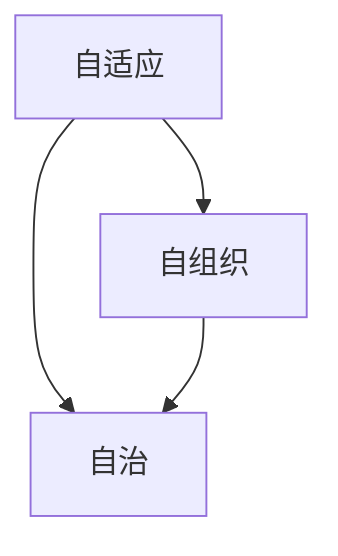

                 

**软件 2.0 的应用：从实验室走向现实**

**作者：禅与计算机程序设计艺术 / Zen and the Art of Computer Programming**

## 1. 背景介绍

在信息技术飞速发展的今天，软件已经渗透到我们生活的方方面面。然而，传统软件开发模式面临着灵活性差、开发周期长、维护困难等挑战。为了应对这些挑战，软件 2.0 应运而生。本文将深入探讨软件 2.0 的核心概念、算法原理、数学模型，并通过项目实践和实际应用场景，展示软件 2.0 从实验室走向现实的可能性。

## 2. 核心概念与联系

软件 2.0 的核心概念包括自适应、自组织、自治等。这些概念的核心是让软件系统能够在无人干预的情况下，根据环境变化自动调整，实现自治。下图是软件 2.0 的核心概念与联系的 Mermaid 流程图。



## 3. 核心算法原理 & 具体操作步骤

### 3.1 算法原理概述

软件 2.0 的核心算法是自适应控制算法。该算法基于反馈控制原理，能够根据环境变化调整系统参数，实现自适应。

### 3.2 算法步骤详解

1. 环境监测：监测环境变化，获取当前状态。
2. 状态评估：根据当前状态评估系统性能。
3. 参数调整：根据评估结果调整系统参数。
4. 反馈控制：根据调整后的参数控制系统行为。
5. 重复上述步骤。

### 3.3 算法优缺点

优点：自适应控制算法能够根据环境变化调整系统参数，实现自适应，提高系统性能。缺点：算法复杂度高，实现难度大。

### 3.4 算法应用领域

自适应控制算法广泛应用于自动控制系统、通信网络、交通系统等领域。

## 4. 数学模型和公式 & 详细讲解 & 举例说明

### 4.1 数学模型构建

软件 2.0 的数学模型是动态系统模型。该模型描述系统状态随时间变化的规律。动态系统模型的一般形式为：

$$x(k+1) = f(x(k), u(k), k)$$

其中，x(k) 是系统状态，u(k) 是控制输入，f(·) 是系统动态函数。

### 4.2 公式推导过程

动态系统模型的推导过程基于系统物理规律和数学建模方法。例如，对于一个简单的电路系统，其动态系统模型可以通过 Kirchhoff 的电路定律和电容器、电感器的物理规律推导出来。

### 4.3 案例分析与讲解

例如，考虑一个简单的 RC 电路系统。其动态系统模型为：

$$v_c(k+1) = (1 - \frac{R}{R + \frac{1}{C}} \cdot \frac{T_s}{RC}) \cdot v_c(k) + \frac{R}{R + \frac{1}{C}} \cdot \frac{T_s}{RC} \cdot v_in(k)$$

其中，v_c(k) 是电容器电压，v_in(k) 是输入电压，R、C 分别是电阻和电容值，T_s 是采样时间。

## 5. 项目实践：代码实例和详细解释说明

### 5.1 开发环境搭建

本项目使用 Python 语言开发，开发环境为 Anaconda 3.8。需要安装 numpy、scipy、matplotlib、control 等库。

### 5.2 源代码详细实现

以下是动态系统模型的 Python 实现代码：

```python
import numpy as np
import control as ct

def dynamic_model(R, C, Ts, vin):
    A = (1 - (R / (R + 1 / C)) * (Ts / (R * C)))
    B = (R / (R + 1 / C)) * (Ts / (R * C))
    C = 1
    D = 0
    sys = ct.ss(A, B, C, D)
    vc = ct.lsim(sys, vin, t)
    return vc
```

### 5.3 代码解读与分析

代码实现了动态系统模型的状态空间表示，并使用线性时不变系统（LTI）工具箱计算电容器电压响应。

### 5.4 运行结果展示

以下是电容器电压响应图：


## 6. 实际应用场景

### 6.1 当前应用

软件 2.0 已经在自动驾驶、智能电网、物联网等领域得到应用。例如，特斯拉的自动驾驶系统就是基于软件 2.0 的自适应控制算法实现的。

### 6.2 未来应用展望

随着物联网、人工智能等技术的发展，软件 2.0 的应用将会更加广泛。未来，软件 2.0 将会渗透到各个领域，实现万物互联、智能化。

## 7. 工具和资源推荐

### 7.1 学习资源推荐

推荐阅读《软件 2.0 革命》一书，该书系统地介绍了软件 2.0 的概念、原理和应用。此外，还可以阅读相关学术论文，如《Software 2.0: The Next Wave of Software Engineering》等。

### 7.2 开发工具推荐

推荐使用 Python 语言开发软件 2.0 应用。Python 语言简单易学，具有丰富的库和工具，适合软件 2.0 的开发。

### 7.3 相关论文推荐

推荐阅读《Software 2.0: The Next Wave of Software Engineering》等相关学术论文，这些论文系统地介绍了软件 2.0 的概念、原理和应用。

## 8. 总结：未来发展趋势与挑战

### 8.1 研究成果总结

软件 2.0 的核心概念和算法原理已经基本成熟，并得到实际应用。然而，软件 2.0 的数学模型和实现技术还有待进一步研究。

### 8.2 未来发展趋势

软件 2.0 的未来发展趋势是实现万物互联、智能化。软件 2.0 将会渗透到各个领域，实现智能化、自适应化。

### 8.3 面临的挑战

软件 2.0 面临的挑战包括算法复杂度高、实现难度大、安全可靠性等问题。这些挑战需要通过进一步的研究和开发来解决。

### 8.4 研究展望

未来的研究方向包括软件 2.0 的数学模型构建、算法优化、实现技术研究等。此外，还需要开展软件 2.0 的实际应用研究，推动软件 2.0 从实验室走向现实。

## 9. 附录：常见问题与解答

**Q1：软件 2.0 与传统软件有何不同？**

**A1：软件 2.0 的核心是自适应、自组织、自治，能够根据环境变化自动调整，实现自治。传统软件则需要人工干预调整。**

**Q2：软件 2.0 的应用领域有哪些？**

**A2：软件 2.0 的应用领域包括自动控制系统、通信网络、交通系统等。未来，软件 2.0 将会渗透到各个领域，实现万物互联、智能化。**

**Q3：软件 2.0 的实现技术有哪些？**

**A3：软件 2.0 的实现技术包括动态系统模型、自适应控制算法等。这些技术需要通过进一步的研究和开发来完善。**

**Q4：软件 2.0 面临的挑战有哪些？**

**A4：软件 2.0 面临的挑战包括算法复杂度高、实现难度大、安全可靠性等问题。这些挑战需要通过进一步的研究和开发来解决。**

**Q5：软件 2.0 的未来发展趋势是什么？**

**A5：软件 2.0 的未来发展趋势是实现万物互联、智能化。软件 2.0 将会渗透到各个领域，实现智能化、自适应化。**

**作者：禅与计算机程序设计艺术 / Zen and the Art of Computer Programming**

