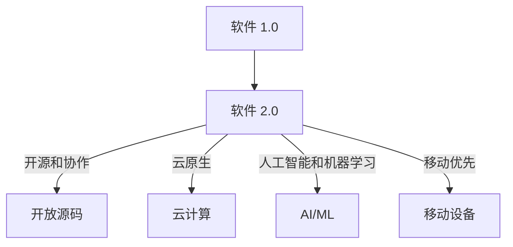

                 

**软件 2.0 的社会责任：科技向善**

**作者：禅与计算机程序设计艺术 / Zen and the Art of Computer Programming**

## 1. 背景介绍

在信息技术飞速发展的今天，软件已经渗透到我们生活的方方面面，从智能手机到自动驾驶汽车，从医疗设备到金融系统，软件无处不在。然而，随着软件的广泛应用，其对社会的影响也日益凸显。作为软件开发者，我们有责任思考软件的社会责任，确保我们的创造物真正造福于人类社会。

本文将探讨软件 2.0 的社会责任，讨论如何将科技向善，使其成为推动社会进步的工具。我们将从软件的本质、软件 2.0 的特点，到软件的社会影响，再到软件开发者的责任和未来发展趋势，进行全面的分析和讨论。

## 2. 核心概念与联系

### 2.1 软件的本质

软件是一组指令的集合，这些指令告诉计算机如何执行特定的任务。它是一种抽象的、无形的资产，但其影响却是实实在在的。软件的本质是帮助人们完成任务，提高效率，改善生活质量。

### 2.2 软件 2.0 的特点

软件 2.0 是指当今软件的发展阶段，其特点包括：

- **开源和协作**：软件 2.0 更加开放，鼓励协作开发。
- **云原生**：软件 2.0 更多地运行在云端，而不是本地计算机上。
- **人工智能和机器学习**：软件 2.0 更智能，能够学习和适应。
- **移动优先**：软件 2.0 更多地运行在移动设备上。

### 2.3 软件的社会影响

软件的社会影响是广泛和深远的。它可以改善人们的生活质量，提高生产效率，但也可能导致隐私泄露，加剧数字鸿沟。 Understanding these impacts is crucial for developing software responsibly.

## 3. 软件的社会责任

### 3.1 软件开发者的责任

作为软件开发者，我们有责任确保我们的软件是安全的，是有用的，是公平的，是尊重隐私的。我们应该：

- **遵循最佳实践**：编写高质量的代码，进行充分的测试，确保软件的安全性和可靠性。
- **考虑软件的影响**：思考软件的使用场景，预见其可能的影响，并采取措施减轻负面影响。
- **尊重用户**：尊重用户的隐私，提供用户友好的界面，并提供有效的支持。

### 3.2 软件的公平性和包容性

软件应该是公平的，应该为所有用户提供同样的体验，而不应歧视任何用户。软件应该是包容的，应该考虑到用户的多样性，提供多种选择和定制选项。

### 3.3 软件的可访问性

软件应该是可访问的，应该为残疾人提供便利。这包括提供屏幕阅读器支持，提供清晰的文本和图像，并提供简化的操作流程。

## 4. 实现软件的社会责任

### 4.1 设计原则

要实现软件的社会责任，我们需要遵循一系列设计原则。这些原则包括：

- **用户中心设计**：将用户置于设计的中心，理解用户的需求和期望。
- **安全设计**：从一开始就考虑安全，而不是作为最后一步。
- **隐私保护设计**：设计应该尊重用户的隐私，最小化数据收集，并提供用户控制。

### 4.2 标准和框架

要实现软件的社会责任，我们需要遵循相关的标准和框架。这些标准和框架包括：

- **信息安全标准**：如 ISO 27001，提供了信息安全管理体系的要求。
- **隐私保护框架**：如 GDPR，提供了保护个人数据的要求。
- **软件可访问性标准**：如 WCAG，提供了软件可访问性的要求。

### 4.3 监管和审计

要实现软件的社会责任，我们需要接受监管和审计。这包括：

- **软件审计**：由独立的第三方对软件进行审计，确保其符合相关标准和要求。
- **监管**：接受政府或行业组织的监管，确保软件符合相关法律和法规。

## 5. 项目实践：开发一款负责任的软件

### 5.1 开发环境搭建

要开发一款负责任的软件，我们需要搭建一个合适的开发环境。这包括：

- **集成开发环境（IDE）**：如 Visual Studio Code，提供了丰富的插件和功能，支持软件开发。
- **版本控制系统**：如 Git，提供了版本控制和协作开发的功能。
- **持续集成/持续交付（CI/CD）**：如 Jenkins，提供了自动化构建和部署的功能。

### 5.2 源代码详细实现

要实现一款负责任的软件，我们需要编写高质量的代码。这包括：

- **编写清晰的代码**：代码应该是清晰的，易于理解和维护。
- **进行单元测试**：单元测试可以确保代码的正确性和可靠性。
- **进行集成测试**：集成测试可以确保各个组件的正确集成。

### 5.3 代码解读与分析

要理解一款负责任的软件是如何实现的，我们需要对其代码进行解读和分析。这包括：

- **理解设计模式**：设计模式可以帮助我们理解代码的结构和行为。
- **分析代码复杂度**：代码复杂度可以帮助我们理解代码的可维护性。
- **分析性能**：性能分析可以帮助我们理解代码的性能特性。

### 5.4 运行结果展示

要展示一款负责任的软件的运行结果，我们需要进行测试和示例展示。这包括：

- **进行功能测试**：功能测试可以确保软件的功能正确性。
- **进行性能测试**：性能测试可以确保软件的性能满足要求。
- **示例展示**：示例展示可以帮助用户理解软件的使用方法和特性。

## 6. 实际应用场景

### 6.1 健康医疗

软件在健康医疗领域的应用日益广泛，从电子病历系统到人工智能辅助诊断，软件正在改变医疗保健的方式。然而，软件在医疗领域的应用也面临着严格的要求，必须确保软件的安全性、可靠性和有效性。

### 6.2 金融服务

软件在金融服务领域的应用也非常广泛，从在线银行到自动交易系统，软件正在改变金融服务的方式。然而，软件在金融领域的应用也面临着严格的要求，必须确保软件的安全性、可靠性和合规性。

### 6.3 未来应用展望

未来，软件的应用将会更加广泛，从自动驾驶汽车到人工智能助手，软件将会无处不在。然而，软件的应用也将面临更多的挑战，我们需要思考如何确保软件的安全性、可靠性、公平性和可访问性。

## 7. 工具和资源推荐

### 7.1 学习资源推荐

要学习软件的社会责任，我们需要阅读相关的文献和参考书。这包括：

- **学术论文**：如 "Software Engineering for Social Good"，提供了软件的社会责任的学术视角。
- **书籍**：如 "The Responsible Company"，提供了企业社会责任的实践指南。

### 7.2 开发工具推荐

要开发一款负责任的软件，我们需要使用合适的开发工具。这包括：

- **安全扫描工具**：如 OWASP ZAP，提供了 web 应用程序的安全扫描功能。
- **隐私保护工具**：如 PrivacyIDEA，提供了身份和访问管理的功能。

### 7.3 相关论文推荐

要了解软件的社会责任的最新进展，我们需要阅读相关的论文。这包括：

- **软件工程会议上的论文**：如 ICSE，提供了软件工程的最新进展。
- **人工智能会议上的论文**：如 NeurIPS，提供了人工智能的最新进展。

## 8. 总结：未来发展趋势与挑战

### 8.1 研究成果总结

软件的社会责任是一个新兴的研究领域，但已经取得了显著的成果。这些成果包括：

- **软件工程的新方法**：如 "Software Engineering for Social Good"，提供了软件工程的新方法。
- **软件的新标准**：如 ISO 25010，提供了软件质量模型的新标准。

### 8.2 未来发展趋势

未来，软件的社会责任将会成为软件开发的核心部分。这将会带来以下趋势：

- **更多的监管**：政府和行业组织将会对软件的社会责任进行更多的监管。
- **更多的协作**：软件开发者将会更多地协作，共同推动软件的社会责任。
- **更多的创新**：软件开发者将会开发出更多的创新，以实现软件的社会责任。

### 8.3 面临的挑战

然而，软件的社会责任也面临着挑战。这些挑战包括：

- **缺乏标准**：软件的社会责任缺乏统一的标准和框架。
- **缺乏意识**：软件开发者缺乏软件的社会责任的意识。
- **缺乏资源**：软件开发者缺乏实现软件的社会责任的资源。

### 8.4 研究展望

未来，软件的社会责任的研究将会朝着以下方向发展：

- **更多的实践**：软件开发者将会开展更多的实践，以实现软件的社会责任。
- **更多的理论**：软件的社会责任的理论将会得到进一步的发展。
- **更多的跨学科合作**：软件的社会责任的研究将会与其他学科，如伦理学和社会学，进行更多的跨学科合作。

## 9. 附录：常见问题与解答

### 9.1 软件的社会责任与企业社会责任有什么区别？

软件的社会责任是软件开发者的责任，而企业社会责任是企业的责任。软件的社会责任关注软件的影响，而企业社会责任关注企业的影响。

### 9.2 如何平衡软件的功能性和软件的社会责任？

平衡软件的功能性和软件的社会责任需要在设计和开发的早期就进行考虑。这需要软件开发者理解用户的需求，并将软件的社会责任纳入设计和开发的过程。

### 9.3 如何确保软件的安全性和隐私保护？

确保软件的安全性和隐私保护需要在设计和开发的早期就进行考虑。这需要软件开发者遵循安全设计原则，并使用安全工具和技术。

## 结束语

软件已经渗透到我们生活的方方面面，作为软件开发者，我们有责任思考软件的社会责任，确保我们的创造物真正造福于人类社会。软件的社会责任是一个新兴的研究领域，但已经取得了显著的成果。未来，软件的社会责任将会成为软件开发的核心部分，软件开发者需要思考如何平衡软件的功能性和软件的社会责任，如何确保软件的安全性和隐私保护，如何实现软件的公平性和包容性，如何确保软件的可访问性。我们期待着软件的社会责任的未来发展。

**作者：禅与计算机程序设计艺术 / Zen and the Art of Computer Programming**

