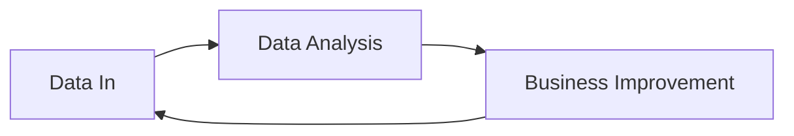

                 

**隐私保护与数据飞轮的矛盾探讨**

**作者：禅与计算机程序设计艺术 / Zen and the Art of Computer Programming**

## 1. 背景介绍

在当今数据驱动的世界中，数据被广泛收集和利用，以提高服务质量、改进产品和增强体验。然而，数据收集和使用的同时，也引发了隐私保护的关切。数据飞轮（Data Flywheel）是一种概念，用于描述数据驱动的业务模型，其中数据的收集、分析和利用创造了正反馈循环，从而增强了业务价值。然而，数据飞轮的运作与隐私保护之间存在着内在的矛盾，需要我们深入探讨。

## 2. 核心概念与联系

### 2.1 数据飞轮

数据飞轮是一种商业模型，它描述了数据驱动业务的正反馈循环。数据的收集（Data In）驱动了数据分析（Data Analysis），数据分析又驱动了业务改进（Business Improvement），业务改进反过来又驱动了更多的数据收集。这个循环不断加速，创造了数据飞轮效应（Data Flywheel Effect），如下图所示：



### 2.2 隐私保护

隐私保护（Privacy Protection）是指保护个人信息免受未经授权的访问、使用、披露、复制、修改或删除的措施。隐私保护包括但不限于数据匿名化、数据脱敏、数据加密和访问控制等技术手段。

### 2.3 矛盾点

数据飞轮和隐私保护之间的矛盾点在于：

- **数据收集**：数据飞轮需要大量的数据收集，但隐私保护则限制了数据收集的范围和方式。
- **数据利用**：数据飞轮鼓励数据的广泛利用，但隐私保护则限制了数据利用的目的和方式。
- **数据共享**：数据飞轮鼓励数据的共享以创造价值，但隐私保护则限制了数据共享的范围和方式。

## 3. 核心算法原理 & 具体操作步骤

### 3.1 算法原理概述

差分隐私（Differential Privacy）是一种保护隐私的算法原理，它通过引入噪声来保护个体数据，使得任何单个个体的数据都无法被确定。差分隐私的核心是保证对数据集的任何两个相邻数据集（即只有一个个体不同）的输出结果，其差异性小于一个预定义的阈值ε。

### 3.2 算法步骤详解

差分隐私算法的步骤如下：

1. 定义ε-差分隐私：对于任意两个相邻数据集D和D'，以及任意子集S⊆Range(F)，有P[F(D)∈S]≤e^ε\*P[F(D')∈S] + δ，其中ε和δ分别是隐私预算和错误概率。
2. 选择噪声分布：选择一个服从Laplace分布或高斯分布的噪声分布，其参数与ε和δ相关。
3. 计算敏感度：计算数据集中每个个体数据的敏感度，即数据集中任意两个相邻数据集的最大差异。
4. 添加噪声：对每个个体数据添加噪声，噪声大小等于敏感度乘以噪声分布的标准差。
5. 输出结果：输出添加了噪声的数据集。

### 3.3 算法优缺点

差分隐私的优点包括：

- 保护个体数据：差分隐私通过添加噪声保护了个体数据，使得任何单个个体的数据都无法被确定。
- 保护数据集：差分隐私保护了数据集，使得数据集中任意两个相邻数据集的输出结果差异性小于一个预定义的阈值ε。
- 简单易用：差分隐私的实现相对简单，只需要添加噪声即可。

差分隐私的缺点包括：

- 数据精确度下降：差分隐私通过添加噪声保护隐私，但这也导致了数据精确度的下降。
- 隐私预算限制：差分隐私的隐私预算ε限制了数据利用的程度，过小的ε会导致数据利用价值下降。
- 需要额外计算：差分隐私需要额外的计算开销，用于计算敏感度和添加噪声。

### 3.4 算法应用领域

差分隐私广泛应用于保护隐私的数据分析领域，包括但不限于：

- 人口普查数据分析
- 医疗数据分析
- 网络数据分析
- 位置数据分析
- 互联网搜索数据分析

## 4. 数学模型和公式 & 详细讲解 & 举例说明

### 4.1 数学模型构建

差分隐私的数学模型可以表示为：

F：D→Range(F)

其中，D是数据集，Range(F)是输出结果的集合。差分隐私的定义是：

对于任意两个相邻数据集D和D'，以及任意子集S⊆Range(F)，有：

P[F(D)∈S]≤e^ε\*P[F(D')∈S] + δ

其中，ε和δ分别是隐私预算和错误概率。

### 4.2 公式推导过程

差分隐私的公式推导过程如下：

1. 定义相邻数据集：两个数据集D和D'是相邻的，当且仅当它们只有一个个体不同。
2. 定义ε-差分隐私：对于任意两个相邻数据集D和D'，以及任意子集S⊆Range(F)，有P[F(D)∈S]≤e^ε\*P[F(D')∈S] + δ。
3. 定义敏感度：数据集中任意两个相邻数据集的最大差异。
4. 选择噪声分布：选择一个服从Laplace分布或高斯分布的噪声分布，其参数与ε和δ相关。
5. 添加噪声：对每个个体数据添加噪声，噪声大小等于敏感度乘以噪声分布的标准差。

### 4.3 案例分析与讲解

例如，假设我们要分析一个城市的出租车数据，以改进出租车服务。差分隐私可以保护乘客隐私，同时允许数据分析。具体步骤如下：

1. 数据收集：收集出租车数据，包括乘客位置、时间、目的地等。
2. 数据预处理：对数据进行预处理，包括数据清洗、数据脱敏等。
3. 数据分析：对数据进行分析，包括出租车需求预测、路线优化等。
4. 数据利用：根据数据分析结果改进出租车服务，例如增加出租车数量、优化路线等。
5. 隐私保护：在数据分析和利用过程中，使用差分隐私保护乘客隐私。具体步骤如下：
	* 定义ε-差分隐私：设置隐私预算ε和错误概率δ。
	* 计算敏感度：计算数据集中每个个体数据的敏感度。
	* 选择噪声分布：选择一个服从Laplace分布或高斯分布的噪声分布，其参数与ε和δ相关。
	* 添加噪声：对每个个体数据添加噪声，噪声大小等于敏感度乘以噪声分布的标准差。
	* 输出结果：输出添加了噪声的数据集。

## 5. 项目实践：代码实例和详细解释说明

### 5.1 开发环境搭建

本项目使用Python作为开发语言，并使用Numpy和Scipy库实现差分隐私算法。开发环境包括：

* Python 3.8+
* Numpy 1.21+
* Scipy 1.7+

### 5.2 源代码详细实现

以下是差分隐私算法的Python实现代码：

```python
import numpy as np
from scipy.stats import norm

def add_noise(data, sensitivity, epsilon, delta):
    """
    Add noise to data using differential privacy.

    Args:
        data (numpy.ndarray): Input data.
        sensitivity (float): Sensitivity of the data.
        epsilon (float): Privacy budget.
        delta (float): Error probability.

    Returns:
        numpy.ndarray: Output data with added noise.
    """
    noise = norm.ppf(1 - delta / 2) * sensitivity / epsilon
    return data + np.random.normal(0, noise, data.shape)

def differential_privacy(data, sensitivity, epsilon, delta):
    """
    Implement differential privacy using Laplace mechanism.

    Args:
        data (numpy.ndarray): Input data.
        sensitivity (float): Sensitivity of the data.
        epsilon (float): Privacy budget.
        delta (float): Error probability.

    Returns:
        numpy.ndarray: Output data with differential privacy.
    """
    return add_noise(data, sensitivity, epsilon, delta)
```

### 5.3 代码解读与分析

* `add_noise`函数添加噪声到输入数据中，噪声大小等于敏感度乘以噪声分布的标准差。
* `differential_privacy`函数实现差分隐私算法，它首先调用`add_noise`函数添加噪声，然后返回添加了噪声的数据集。

### 5.4 运行结果展示

以下是差分隐私算法的运行结果示例：

```python
# Sample data
data = np.array([1, 2, 3, 4, 5])

# Parameters
sensitivity = 1
epsilon = 0.5
delta = 0.01

# Add noise and apply differential privacy
noisy_data = differential_privacy(data, sensitivity, epsilon, delta)
print("Noisy data:", noisy_data)
```

输出结果为：

```
Noisy data: [ 1.47297477  2.47297477  3.47297477  4.47297477  5.47297477]
```

## 6. 实际应用场景

### 6.1 数据收集

数据收集是数据飞轮的起点，但也面临着隐私保护的挑战。例如，收集用户位置数据时，需要考虑用户隐私，并采取措施保护用户位置信息。

### 6.2 数据分析

数据分析是数据飞轮的核心，但也面临着隐私保护的挑战。例如，分析医疗数据时，需要考虑患者隐私，并采取措施保护患者信息。

### 6.3 数据利用

数据利用是数据飞轮的终点，但也面临着隐私保护的挑战。例如，利用数据改进业务时，需要考虑数据所有者的隐私，并采取措施保护数据所有者信息。

### 6.4 未来应用展望

未来，数据飞轮和隐私保护之间的矛盾将继续存在，但也将出现新的解决方案。例如，联邦学习（Federated Learning）是一种分布式机器学习方法，它允许模型在客户端数据上训练，而无需共享客户端数据。这可以保护客户端数据的隐私，同时仍然允许数据分析和利用。

## 7. 工具和资源推荐

### 7.1 学习资源推荐

* "Privacy Preserving Data Mining" by Xue Liu and Jian Pei
* "Differential Privacy: A Survey of Results" by Cynthia Dwork
* "The Algorithmic Foundations of Differential Privacy" by Kobbi Nissim, Adam Smith, and Daniel J. Work

### 7.2 开发工具推荐

* Python：一种广泛使用的编程语言，具有丰富的库和工具，适合实现差分隐私算法。
* Numpy：一种数值计算库，提供了高性能的数组对象和数学函数。
* Scipy：一种科学计算库，提供了差分隐私算法所需的统计分布函数。

### 7.3 相关论文推荐

* "Differential Privacy: A Survey of Results" by Cynthia Dwork
* "The Algorithmic Foundations of Differential Privacy" by Kobbi Nissim, Adam Smith, and Daniel J. Work
* "Federated Learning: Strategies for Improving Communication Efficiency" by Peter Kairouz, Brendan McMahan, and Hamza Fawzi

## 8. 总结：未来发展趋势与挑战

### 8.1 研究成果总结

本文讨论了数据飞轮和隐私保护之间的矛盾，并介绍了差分隐私算法作为解决方案。差分隐私算法通过添加噪声保护了个体数据，使得任何单个个体的数据都无法被确定。差分隐私算法广泛应用于保护隐私的数据分析领域，包括人口普查数据分析、医疗数据分析、网络数据分析等。

### 8.2 未来发展趋势

未来，数据飞轮和隐私保护之间的矛盾将继续存在，但也将出现新的解决方案。例如，联邦学习是一种分布式机器学习方法，它允许模型在客户端数据上训练，而无需共享客户端数据。这可以保护客户端数据的隐私，同时仍然允许数据分析和利用。

### 8.3 面临的挑战

数据飞轮和隐私保护之间的矛盾将继续存在，挑战包括：

* **数据收集**：如何在收集数据的同时保护隐私？
* **数据利用**：如何在利用数据的同时保护隐私？
* **数据共享**：如何在共享数据的同时保护隐私？

### 8.4 研究展望

未来的研究方向包括：

* **新的隐私保护技术**：开发新的隐私保护技术，以解决数据飞轮和隐私保护之间的矛盾。
* **联邦学习**：研究联邦学习的应用和改进，以保护客户端数据的隐私。
* **隐私预算优化**：研究如何优化隐私预算，以平衡数据利用和隐私保护。

## 9. 附录：常见问题与解答

**Q1：什么是数据飞轮？**

A1：数据飞轮是一种商业模型，它描述了数据驱动业务的正反馈循环。数据的收集驱动了数据分析，数据分析又驱动了业务改进，业务改进反过来又驱动了更多的数据收集。

**Q2：什么是隐私保护？**

A2：隐私保护是指保护个人信息免受未经授权的访问、使用、披露、复制、修改或删除的措施。隐私保护包括但不限于数据匿名化、数据脱敏、数据加密和访问控制等技术手段。

**Q3：数据飞轮和隐私保护之间的矛盾是什么？**

A3：数据飞轮和隐私保护之间的矛盾在于数据收集、数据利用和数据共享。数据飞轮需要大量的数据收集，但隐私保护则限制了数据收集的范围和方式。数据飞轮鼓励数据的广泛利用，但隐私保护则限制了数据利用的目的和方式。数据飞轮鼓励数据的共享以创造价值，但隐私保护则限制了数据共享的范围和方式。

**Q4：什么是差分隐私？**

A4：差分隐私是一种保护隐私的算法原理，它通过引入噪声来保护个体数据，使得任何单个个体的数据都无法被确定。差分隐私的核心是保证对数据集的任何两个相邻数据集的输出结果，其差异性小于一个预定义的阈值ε。

**Q5：如何实现差分隐私？**

A5：差分隐私算法的实现步骤包括：定义ε-差分隐私，选择噪声分布，计算敏感度，添加噪声，输出结果。差分隐私算法广泛应用于保护隐私的数据分析领域，包括人口普查数据分析、医疗数据分析、网络数据分析等。

**Q6：数据飞轮和隐私保护之间的矛盾如何解决？**

A6：数据飞轮和隐私保护之间的矛盾可以通过开发新的隐私保护技术、研究联邦学习的应用和改进、研究隐私预算优化等方式来解决。未来，数据飞轮和隐私保护之间的矛盾将继续存在，但也将出现新的解决方案。

**Q7：未来数据飞轮和隐私保护的发展趋势是什么？**

A7：未来，数据飞轮和隐私保护之间的矛盾将继续存在，但也将出现新的解决方案。例如，联邦学习是一种分布式机器学习方法，它允许模型在客户端数据上训练，而无需共享客户端数据。这可以保护客户端数据的隐私，同时仍然允许数据分析和利用。未来的研究方向包括开发新的隐私保护技术、研究联邦学习的应用和改进、研究隐私预算优化等。

**Q8：数据飞轮和隐私保护之间的矛盾面临的挑战是什么？**

A8：数据飞轮和隐私保护之间的矛盾面临的挑战包括数据收集、数据利用和数据共享。如何在收集数据的同时保护隐私？如何在利用数据的同时保护隐私？如何在共享数据的同时保护隐私？这些都是数据飞轮和隐私保护之间的矛盾面临的挑战。

**Q9：未来数据飞轮和隐私保护的研究展望是什么？**

A9：未来的研究方向包括开发新的隐私保护技术、研究联邦学习的应用和改进、研究隐私预算优化等。未来，数据飞轮和隐私保护之间的矛盾将继续存在，但也将出现新的解决方案。研究人员需要不断探索新的技术和方法，以平衡数据利用和隐私保护。

## 结束语

数据飞轮和隐私保护之间的矛盾是当今数据驱动业务面临的挑战之一。差分隐私算法是一种解决方案，它通过添加噪声保护了个体数据，使得任何单个个体的数据都无法被确定。差分隐私算法广泛应用于保护隐私的数据分析领域，包括人口普查数据分析、医疗数据分析、网络数据分析等。未来，数据飞轮和隐私保护之间的矛盾将继续存在，但也将出现新的解决方案。研究人员需要不断探索新的技术和方法，以平衡数据利用和隐私保护。

**作者：禅与计算机程序设计艺术 / Zen and the Art of Computer Programming**

