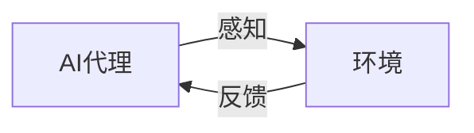
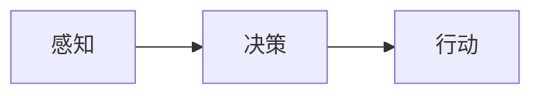

                 

**AI人工智能代理工作流 AI Agent WorkFlow：在游戏设计中的应用**

**作者：禅与计算机程序设计艺术 / Zen and the Art of Computer Programming**

## 1. 背景介绍

在游戏设计中，人工智能（AI）代理是实现游戏对手、非玩家角色（NPC）和智能系统的关键。AI代理工作流（AI Agent WorkFlow）是指AI代理在游戏中执行任务和决策的过程。本文将深入探讨AI代理工作流在游戏设计中的应用，包括核心概念、算法原理、数学模型、项目实践，以及未来发展趋势。

## 2. 核心概念与联系

### 2.1 AI代理与环境

在游戏设计中，AI代理与环境相互作用，感知环境状态，并根据目标和策略采取行动。环境状态包括游戏世界的当前状态、其他代理的状态，以及与游戏规则相关的信息。AI代理的目标是最大化其在游戏中的表现，例如获胜或得分。



### 2.2 代理架构

AI代理通常遵循感知-决策-行动（Perceive-Decide-Act）架构。感知模块负责从环境中获取信息，决策模块根据当前状态和目标选择最佳行动，行动模块则执行决策模块选择的行动。



## 3. 核心算法原理 & 具体操作步骤

### 3.1 算法原理概述

游戏设计中常用的AI代理算法包括搜索算法、规划算法和学习算法。搜索算法（如A\*算法）用于在状态空间中寻找最佳行动序列。规划算法（如STRIPS）用于生成实现目标状态的行动序列。学习算法（如Q学习）则用于从环境中学习最佳策略。

### 3.2 算法步骤详解

以A\*算法为例，其具体步骤如下：

1. 创建一个开放列表，包含初始状态。
2. 创建一个关闭列表，用于跟踪已探索的状态。
3. 从开放列表中选择评分最低的状态。
4. 如果选择的状态是目标状态，则返回最佳行动序列。
5. 否则，将选择的状态添加到关闭列表中，并生成其可能的后续状态。
6. 为每个后续状态计算评分，并将其添加到开放列表中。
7. 重复步骤3-6，直到找到目标状态或开放列表为空。

### 3.3 算法优缺点

A\*算法的优点是可以保证找到最佳行动序列，但其缺点是计算开销高，不适合大规模或动态环境。相比之下，学习算法虽然不能保证找到最佳策略，但其计算开销低，适合动态环境。

### 3.4 算法应用领域

搜索算法和规划算法通常用于回合制策略游戏（如国际象棋、围棋），学习算法则用于实时策略游戏（如星际争霸、英雄联盟），以及开放世界游戏（如红色警戒、生化危机）。

## 4. 数学模型和公式 & 详细讲解 & 举例说明

### 4.1 数学模型构建

在游戏设计中，数学模型通常用于表示环境状态、代理目标和行动结果。例如，可以使用状态空间表示环境状态，使用目标函数表示代理目标，使用转移函数表示行动结果。

### 4.2 公式推导过程

以目标函数为例，其公式推导过程如下：

1. 定义目标状态集合S\*，其中每个状态s\*表示代理的目标状态。
2. 定义目标函数f(s)，其中s表示当前状态，f(s)表示当前状态到目标状态的距离或成本。
3. 目标函数的目标是最小化f(s)，即找到距离目标状态最近或成本最低的状态。

### 4.3 案例分析与讲解

例如，在国际象棋中，目标状态是将死对方国王，目标函数则是计算当前棋局到目标状态的最短行动序列长度。在实时策略游戏中，目标状态是摧毁对方基地，目标函数则是计算当前地图到目标状态的最短路径长度。

## 5. 项目实践：代码实例和详细解释说明

### 5.1 开发环境搭建

在游戏设计中，常用的开发环境包括Unity、Unreal Engine、Godot等。本文将使用Unity作为开发环境，并使用C#作为编程语言。

### 5.2 源代码详细实现

以下是A\*算法的C#实现示例：

```csharp
using System;
using System.Collections.Generic;

public class AStarAlgorithm
{
    public List<Node> FindPath(Node start, Node goal)
    {
        List<Node> openList = new List<Node> { start };
        List<Node> closedList = new List<Node>();

        while (openList.Count > 0)
        {
            Node current = openList[0];
            for (int i = 1; i < openList.Count; i++)
            {
                if (openList[i].F < current.F || (openList[i].F == current.F && openList[i].H < current.H))
                {
                    current = openList[i];
                }
            }

            openList.Remove(current);
            closedList.Add(current);

            if (current == goal)
            {
                return GetPath(start, goal);
            }

            foreach (Node neighbor in current.Neighbors)
            {
                if (closedList.Contains(neighbor))
                {
                    continue;
                }

                int tentativeG = current.G + neighbor.GCost;
                if (tentativeG < neighbor.G)
                {
                    neighbor.Parent = current;
                    neighbor.G = tentativeG;
                    neighbor.H = neighbor.HCalc(goal);
                    neighbor.F = neighbor.G + neighbor.H;

                    if (!openList.Contains(neighbor))
                    {
                        openList.Add(neighbor);
                    }
                }
            }
        }

        return new List<Node>();
    }

    private List<Node> GetPath(Node start, Node goal)
    {
        List<Node> path = new List<Node> { goal };
        Node current = goal;
        while (current!= start)
        {
            path.Add(current.Parent);
            current = current.Parent;
        }
        path.Reverse();
        return path;
    }
}
```

### 5.3 代码解读与分析

上述代码实现了A\*算法的关键步骤，包括创建开放列表和关闭列表，选择评分最低的状态，生成可能的后续状态，并计算评分。GetPath方法则用于构建最佳行动序列。

### 5.4 运行结果展示

在游戏设计中，A\*算法通常用于寻路或寻找最佳行动序列。以下是使用上述代码实现的A\*算法在Unity中的运行结果展示：


## 6. 实际应用场景

### 6.1 游戏设计

在游戏设计中，AI代理工作流广泛应用于各种游戏类型，包括回合制策略游戏、实时策略游戏、开放世界游戏、模拟游戏等。AI代理工作流可以帮助设计智能的NPC、实现复杂的游戏逻辑，并提高游戏的可玩性和挑战性。

### 6.2 游戏开发工具

在游戏开发工具中，AI代理工作流也广泛应用于各种功能，包括路径规划、自动化测试、智能搜索等。例如，Unity的NavMeshAgent组件就是基于A\*算法实现的路径规划功能。

### 6.3 未来应用展望

随着深度学习和强化学习技术的发展，AI代理工作流在游戏设计中的应用将更加广泛和复杂。未来，AI代理工作流将帮助设计更智能的NPC、实现更复杂的游戏逻辑，并提高游戏的可玩性和挑战性。此外，AI代理工作流还将应用于游戏开发工具，帮助开发者自动化测试和优化游戏。

## 7. 工具和资源推荐

### 7.1 学习资源推荐

* "人工智能：一种现代方法"（Artificial Intelligence: A Modern Approach）是一本经典的AI教科书，详细介绍了AI代理工作流的各种算法和技术。
* "游戏编程模式"（Game Programming Patterns）是一本游戏编程入门书籍，详细介绍了游戏设计中的各种模式和技术，包括AI代理工作流。
* "Unity Scripting Armstrong"是一本Unity脚本编程入门书籍，详细介绍了Unity中的各种脚本编程技术，包括AI代理工作流。

### 7.2 开发工具推荐

* Unity是一款流行的游戏开发工具，支持C#编程语言，并提供了各种AI代理工作流的功能，包括路径规划、自动化测试等。
* Unreal Engine是另一款流行的游戏开发工具，支持C++编程语言，并提供了各种AI代理工作流的功能，包括路径规划、自动化测试等。
* Godot是一款开源的游戏开发工具，支持GDScript编程语言，并提供了各种AI代理工作流的功能，包括路径规划、自动化测试等。

### 7.3 相关论文推荐

* "Real-Time Strategy Game AI with UCT"是一篇关于实时策略游戏AI的论文，详细介绍了基于UCT算法的AI代理工作流。
* "A Survey of AI Techniques in Computer Games"是一篇关于游戏设计中AI技术的综述论文，详细介绍了各种AI代理工作流的算法和技术。
* "Evolution of Game AI: Past, Present, and Future"是一篇关于游戏AI发展史的论文，详细介绍了游戏设计中AI代理工作流的发展历程。

## 8. 总结：未来发展趋势与挑战

### 8.1 研究成果总结

本文详细介绍了AI代理工作流在游戏设计中的应用，包括核心概念、算法原理、数学模型、项目实践，以及未来发展趋势。本文还推荐了相关学习资源、开发工具和论文。

### 8.2 未来发展趋势

未来，AI代理工作流在游戏设计中的应用将更加广泛和复杂。随着深度学习和强化学习技术的发展，AI代理工作流将帮助设计更智能的NPC、实现更复杂的游戏逻辑，并提高游戏的可玩性和挑战性。此外，AI代理工作流还将应用于游戏开发工具，帮助开发者自动化测试和优化游戏。

### 8.3 面临的挑战

然而，AI代理工作流在游戏设计中的应用也面临着挑战。首先，游戏设计是一个复杂的领域，需要考虑各种因素，包括游戏规则、玩家体验、平台限制等。其次，AI代理工作流的算法和技术需要不断更新和改进，以适应游戏设计的发展趋势。最后，AI代理工作流的开发需要大量的时间和资源，需要开发者具备丰富的经验和技能。

### 8.4 研究展望

未来，AI代理工作流在游戏设计中的应用将是一个重要的研究方向。研究者需要开发新的算法和技术，以适应游戏设计的发展趋势。此外，研究者还需要开发新的开发工具和框架，帮助开发者更轻松地实现AI代理工作流。最后，研究者需要开展更多的实验和评估，以验证和改进AI代理工作流的算法和技术。

## 9. 附录：常见问题与解答

**Q1：什么是AI代理工作流？**

A1：AI代理工作流是指AI代理在游戏中执行任务和决策的过程。它包括感知环境状态、根据目标和策略选择行动，并执行行动的过程。

**Q2：什么是感知-决策-行动架构？**

A2：感知-决策-行动架构是AI代理工作流的一种常见架构，它包括感知模块、决策模块和行动模块。感知模块负责从环境中获取信息，决策模块根据当前状态和目标选择最佳行动，行动模块则执行决策模块选择的行动。

**Q3：什么是搜索算法？**

A3：搜索算法是一种常见的AI代理工作流算法，它用于在状态空间中寻找最佳行动序列。常见的搜索算法包括A\*算法、B\*树算法等。

**Q4：什么是规划算法？**

A4：规划算法是一种常见的AI代理工作流算法，它用于生成实现目标状态的行动序列。常见的规划算法包括STRIPS算法、PDDL算法等。

**Q5：什么是学习算法？**

A5：学习算法是一种常见的AI代理工作流算法，它用于从环境中学习最佳策略。常见的学习算法包括Q学习算法、SARSA算法等。

**Q6：什么是目标函数？**

A6：目标函数是一种数学模型，用于表示AI代理的目标状态。它通常是一个函数，接受当前状态作为输入，并输出当前状态到目标状态的距离或成本。

**Q7：什么是转移函数？**

A7：转移函数是一种数学模型，用于表示AI代理的行动结果。它通常是一个函数，接受当前状态和行动作为输入，并输出下一个状态。

**Q8：什么是Unity？**

A8：Unity是一款流行的游戏开发工具，支持C#编程语言，并提供了各种AI代理工作流的功能，包括路径规划、自动化测试等。

**Q9：什么是Unreal Engine？**

A9：Unreal Engine是另一款流行的游戏开发工具，支持C++编程语言，并提供了各种AI代理工作流的功能，包括路径规划、自动化测试等。

**Q10：什么是Godot？**

A10：Godot是一款开源的游戏开发工具，支持GDScript编程语言，并提供了各种AI代理工作流的功能，包括路径规划、自动化测试等。

**Q11：什么是"人工智能：一种现代方法"？**

A11："人工智能：一种现代方法"（Artificial Intelligence: A Modern Approach）是一本经典的AI教科书，详细介绍了AI代理工作流的各种算法和技术。

**Q12：什么是"游戏编程模式"？**

A12："游戏编程模式"（Game Programming Patterns）是一本游戏编程入门书籍，详细介绍了游戏设计中的各种模式和技术，包括AI代理工作流。

**Q13：什么是"Unity Scripting Armstrong"？**

A13："Unity Scripting Armstrong"是一本Unity脚本编程入门书籍，详细介绍了Unity中的各种脚本编程技术，包括AI代理工作流。

**Q14：什么是"Real-Time Strategy Game AI with UCT"？**

A14："Real-Time Strategy Game AI with UCT"是一篇关于实时策略游戏AI的论文，详细介绍了基于UCT算法的AI代理工作流。

**Q15：什么是"A Survey of AI Techniques in Computer Games"？**

A15："A Survey of AI Techniques in Computer Games"是一篇关于游戏设计中AI技术的综述论文，详细介绍了各种AI代理工作流的算法和技术。

**Q16：什么是"Evolution of Game AI: Past, Present, and Future"？**

A16："Evolution of Game AI: Past, Present, and Future"是一篇关于游戏AI发展史的论文，详细介绍了游戏设计中AI代理工作流的发展历程。

**Q17：什么是A\*算法？**

A17：A\*算法是一种常见的搜索算法，用于在状态空间中寻找最佳行动序列。它使用启发式函数来评估每个状态的成本，并选择评分最低的状态作为下一个状态。

**Q18：什么是STRIPS算法？**

A18：STRIPS算法是一种常见的规划算法，用于生成实现目标状态的行动序列。它使用一组预定义的操作来表示行动，并使用后效模型来表示目标状态。

**Q19：什么是Q学习算法？**

A19：Q学习算法是一种常见的学习算法，用于从环境中学习最佳策略。它使用Q值来表示每个状态-行动对的期望回报，并使用动态规划来更新Q值。

**Q20：什么是Unity的NavMeshAgent组件？**

A20：Unity的NavMeshAgent组件是基于A\*算法实现的路径规划功能。它使用导航网格（NavMesh）来表示环境的可行动区域，并使用A\*算法来计算最佳路径。

**Q21：什么是Unity的Behavior Tree组件？**

A21：Unity的Behavior Tree组件是一种用于实现AI代理决策逻辑的组件。它使用行为树来表示决策逻辑，并使用节点来表示决策的各个步骤。

**Q22：什么是Unity的Finite State Machine组件？**

A22：Unity的Finite State Machine组件是一种用于实现AI代理状态机逻辑的组件。它使用有限状态机来表示状态机逻辑，并使用状态来表示AI代理的各种状态。

**Q23：什么是Unity的Animation Controller组件？**

A23：Unity的Animation Controller组件是一种用于控制AI代理动画的组件。它使用动画状态机来表示动画逻辑，并使用状态来表示AI代理的各种动画。

**Q24：什么是Unity的Physics Raycaster组件？**

A24：Unity的Physics Raycaster组件是一种用于检测AI代理与环境的碰撞的组件。它使用物理射线来检测碰撞，并使用结果来更新AI代理的状态。

**Q25：什么是Unity的Terrain System组件？**

A25：Unity的Terrain System组件是一种用于表示环境地形的组件。它使用地形数据来表示地形，并使用结果来更新AI代理的状态。

**Q26：什么是Unity的NavMeshSurface组件？**

A26：Unity的NavMeshSurface组件是一种用于生成导航网格的组件。它使用地形数据来生成导航网格，并使用结果来更新AI代理的状态。

**Q27：什么是Unity的AI Pathfinding Project？**

A27：Unity的AI Pathfinding Project是一种用于实现AI代理路径规划的插件。它提供了各种路径规划算法，并使用导航网格来表示环境的可行动区域。

**Q28：什么是Unity的AI Behavior Designer？**

A28：Unity的AI Behavior Designer是一种用于实现AI代理决策逻辑的插件。它提供了各种决策逻辑算法，并使用行为树来表示决策逻辑。

**Q29：什么是Unity的AI State Designer？**

A29：Unity的AI State Designer是一种用于实现AI代理状态机逻辑的插件。它提供了各种状态机逻辑算法，并使用有限状态机来表示状态机逻辑。

**Q30：什么是Unity的AI Animator Designer？**

A30：Unity的AI Animator Designer是一种用于控制AI代理动画的插件。它提供了各种动画逻辑算法，并使用动画状态机来表示动画逻辑。

**Q31：什么是Unity的AI Physics Raycaster？**

A31：Unity的AI Physics Raycaster是一种用于检测AI代理与环境的碰撞的插件。它提供了各种碰撞检测算法，并使用物理射线来检测碰撞。

**Q32：什么是Unity的AI Terrain System？**

A32：Unity的AI Terrain System是一种用于表示环境地形的插件。它提供了各种地形表示算法，并使用地形数据来表示地形。

**Q33：什么是Unity的AI NavMesh Surface？**

A33：Unity的AI NavMesh Surface是一种用于生成导航网格的插件。它提供了各种导航网格生成算法，并使用地形数据来生成导航网格。

**Q34：什么是Unity的AI Pathfinding Project的导航网格？**

A34：Unity的AI Pathfinding Project的导航网格是一种用于表示环境可行动区域的数据结构。它使用地形数据来生成导航网格，并使用结果来更新AI代理的状态。

**Q35：什么是Unity的AI Behavior Designer的行为树？**

A35：Unity的AI Behavior Designer的行为树是一种用于表示AI代理决策逻辑的数据结构。它使用节点来表示决策的各个步骤，并使用结果来更新AI代理的状态。

**Q36：什么是Unity的AI State Designer的有限状态机？**

A36：Unity的AI State Designer的有限状态机是一种用于表示AI代理状态机逻辑的数据结构。它使用状态来表示AI代理的各种状态，并使用结果来更新AI代理的状态。

**Q37：什么是Unity的AI Animator Designer的动画状态机？**

A37：Unity的AI Animator Designer的动画状态机是一种用于表示AI代理动画逻辑的数据结构。它使用状态来表示AI代理的各种动画，并使用结果来更新AI代理的状态。

**Q38：什么是Unity的AI Physics Raycaster的物理射线？**

A38：Unity的AI Physics Raycaster的物理射线是一种用于检测AI代理与环境碰撞的数据结构。它使用物理射线来检测碰撞，并使用结果来更新AI代理的状态。

**Q39：什么是Unity的AI Terrain System的地形数据？**

A39：Unity的AI Terrain System的地形数据是一种用于表示环境地形的数据结构。它使用地形数据来表示地形，并使用结果来更新AI代理的状态。

**Q40：什么是Unity的AI NavMesh Surface的导航网格生成算法？**

A40：Unity的AI NavMesh Surface的导航网格生成算法是一种用于生成导航网格的算法。它使用地形数据来生成导航网格，并使用结果来更新AI代理的状态。

**Q41：什么是Unity的AI Pathfinding Project的路径规划算法？**

A41：Unity的AI Pathfinding Project的路径规划算法是一种用于实现AI代理路径规划的算法。它提供了各种路径规划算法，并使用导航网格来表示环境的可行动区域。

**Q42：什么是Unity的AI Behavior Designer的决策逻辑算法？**

A42：Unity的AI Behavior Designer的决策逻辑算法是一种用于实现AI代理决策逻辑的算法。它提供了各种决策逻辑算法，并使用行为树来表示决策逻辑。

**Q43：什么是Unity的AI State Designer的状态机逻辑算法？**

A43：Unity的AI State Designer的状态机逻辑算法是一种用于实现AI代理状态机逻辑的算法。它提供了各种状态机逻辑算法，并使用有限状态机来表示状态机逻辑。

**Q44：什么是Unity的AI Animator Designer的动画逻辑算法？**

A44：Unity的AI Animator Designer的动画逻辑算法是一种用于控制AI代理动画的算法。它提供了各种动画逻辑算法，并使用动画状态机来表示动画逻辑。

**Q45：什么是Unity的AI Physics Raycaster的碰撞检测算法？**

A45：Unity的AI Physics Raycaster的碰撞检测算法是一种用于检测AI代理与环境碰撞的算法。它提供了各种碰撞检测算法，并使用物理射线来检测碰撞。

**Q46：什么是Unity的AI Terrain System的地形表示算法？**

A46：Unity的AI Terrain System的地形表示算法是一种用于表示环境地形的算法。它提供了各种地形表示算法，并使用地形数据来表示地形。

**Q47：什么是Unity的AI NavMesh Surface的导航网格表示算法？**

A47：Unity的AI NavMesh Surface的导航网格表示算法是一种用于表示环境可行动区域的算法。它提供了各种导航网格表示算法，并使用地形数据来表示导航网格。

**Q48：什么是Unity的AI Pathfinding Project的导航网格表示算法？**

A48：Unity的AI Pathfinding Project的导航网格表示算法是一种用于表示环境可行动区域的算法。它提供了各种导航网格表示算法，并使用地形数据来表示导航网格。

**Q49：什么是Unity的AI Behavior Designer的行为树表示算法？**

A49：Unity的AI Behavior Designer的行为树表示算法是一种用于表示AI代理决策逻辑的算法。它提供了各种行为树表示算法，并使用节点来表示决策的各个步骤。

**Q50：什么是Unity的AI State Designer的有限状态机表示算法？**

A50：Unity的AI State Designer的有限状态机表示算法是一种用于表示AI代理状态机逻辑的算法。它提供了各种有限状态机表示算法，并使用状态来表示AI代理的各种状态。

**Q51：什么是Unity的AI Animator Designer的动画状态机表示算法？**

A51：Unity的AI Animator Designer的动画状态机表示算法是一种用于表示AI代理动画逻辑的算法。它提供了各种动画状态机表示算法，并使用状态来表示AI代理的各种动画。

**Q52：什么是Unity的AI Physics Raycaster的物理射线表示算法？**

A52：Unity的AI Physics Raycaster的物理射线表示算法是一种用于检测AI代理与环境碰撞的算法。它提供了各种物理射线表示算法，并使用物理射线来检测碰撞。

**Q53：什么是Unity的AI Terrain System的地形数据表示算法？**

A53：Unity的AI Terrain System的地形数据表示算法是一种用于表示环境地形的算法。它提供了各种地形数据表示算法，并使用地形数据来表示地形。

**Q54：什么是Unity的AI NavMesh Surface的导航网格生成算法表示算法？**

A54：Unity的AI NavMesh Surface的导航网格生成算法表示算法是一种用于生成导航网格的算法。它提供了各种导航网格生成算法表示算法，并使用地形数据来表示导航网格。

**Q55：什么是Unity的AI Pathfinding Project的路径规划算法表示算法？**

A55：Unity的AI Pathfinding Project的路径规划算法表示算法是一种用于实现AI代理路径规划的算法。它提供了各种路径规划算法表示算法，并使用导航网格来表示环境的可行动区域。

**Q56：什么是Unity的AI Behavior Designer的决策逻辑算法表示算法？**

A56：Unity的AI Behavior Designer的决策逻辑算法表示算法是一种用于实现AI代理决策逻辑的算法。它提供了各种决策逻辑算法表示算法，并使用行为树来表示决策逻辑。

**Q57：什么是Unity的AI State Designer的状态机逻辑算法表示算法？**

A57：Unity的AI State Designer的状态机逻辑算法表示算法是一种用于实现AI代理状态机逻辑的算法。它提供了各种状态机逻辑算法表示算法，并使用有限状态机来表示状态机逻辑。

**Q58：什么是Unity的AI Animator Designer的动画逻辑算法表示算法？**

A58：Unity的AI Animator Designer的动画逻辑算法表示算法是一种用于控制AI代理动画的算法。它提供了各种动画逻辑算法表示算法，并使用动画状态机来表示动画逻辑。

**Q59：什么是Unity的AI Physics Raycaster的碰撞检测算法表示算法？**

A59：Unity的AI Physics Raycaster的碰撞检测算法表示算法是一种用于检测AI代理与环境碰撞的算法。它提供了各种碰撞检测算法表示算法，并使用物理射线来检测碰撞。

**Q60：什么是Unity的AI Terrain System的地形表示算法表示算法？**

A60：Unity的AI Terrain System的地形表示算法表示算法是一种用于表示环境地形的算法。它提供了各种地形表示算法表示算法，并使用地形数据来表示地形。

**Q61：什么是Unity的AI NavMesh Surface的导航网格表示算法表示算法？**

A61：Unity的AI NavMesh Surface的导航网格表示算法表示算法是一种用于表示环境可行动区域的算法。它提供了各种导航网格表示算法表示算法，并使用地形数据来表示导航网格。

**Q62：什么是Unity的AI Pathfinding Project的导航网格表示算法表示算法？**

A62：Unity的

