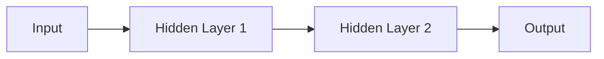

                 

**人工智能**, **深度学习**, **神经网络**, **机器学习**, **未来应用**, **算法原理**

## 1. 背景介绍

人工智能（AI）和深度学习（DL）是当今计算机科学领域最活跃和最有前途的研究领域之一。深度学习是一种机器学习方法，它模仿人类大脑的结构和功能，使用神经网络来学习和做出决策。自从2006年Hinton等人提出深度学习以来，它在图像识别、语音识别、自然语言处理等领域取得了显著的成功，并引发了AI领域的革命。

## 2. 核心概念与联系

### 2.1 核心概念

- **神经元（Neuron）**：神经网络的基本单位，模仿人类大脑中的神经元。
- **权重（Weight）**：神经元之间连接的强度，通过学习过程调整。
- **偏置（Bias）**：神经元的固有倾向，影响输出结果。
- **激活函数（Activation Function）**：用于引入非线性，使神经网络能够学习复杂的函数。

### 2.2 架构

深度学习模型通常由多个隐藏层组成，每层包含多个神经元。输入数据通过每层传递，直到输出层，产生最终的输出。下图是一个简单的全连接神经网络架构示例。



## 3. 核心算法原理 & 具体操作步骤

### 3.1 算法原理概述

深度学习算法的核心是反向传播（Backpropagation），它用于调整权重和偏置，以最小化预测误差。算法过程包括前向传播（计算输出）、计算误差、反向传播（计算梯度）和权重更新。

### 3.2 算法步骤详解

1. **前向传播**：输入数据通过每层神经元，计算每层的输出。
2. **计算误差**：比较网络输出和真实值，计算误差。
3. **反向传播**：计算每层神经元的梯度，用于更新权重和偏置。
4. **权重更新**：使用梯度下降法更新权重和偏置，以最小化误差。

### 3.3 算法优缺点

**优点**：自动特征提取、表达能力强、泛化能力好。

**缺点**：计算复杂度高、训练时间长、易陷入局部最小值。

### 3.4 算法应用领域

深度学习在图像识别、语音识别、自然语言处理等领域取得了显著成功。它还被广泛应用于推荐系统、自动驾驶、医疗影像分析等领域。

## 4. 数学模型和公式 & 详细讲解 & 举例说明

### 4.1 数学模型构建

设神经网络有L层，每层有n_l个神经元。输入数据为x，输出为y。则第l层的输出为：

z_l = σ(w_l * z_{l-1} + b_l)

其中，σ为激活函数，w_l为权重，b_l为偏置。

### 4.2 公式推导过程

误差函数为：

E = (y - ŷ)^2

梯度为：

∇E = (∂E/∂w_l) * (∂w_l/∂z_l) * (∂z_l/∂w_l)

### 4.3 案例分析与讲解

例如，在图像分类任务中，输入为图像特征向量，输出为类别标签。使用交叉熵损失函数，反向传播算法更新权重和偏置，以最小化损失。

## 5. 项目实践：代码实例和详细解释说明

### 5.1 开发环境搭建

使用Python、TensorFlow或PyTorch等深度学习框架，搭建开发环境。

### 5.2 源代码详细实现

```python
import tensorflow as tf

# 定义模型
model = tf.keras.models.Sequential([
    tf.keras.layers.Dense(64, activation='relu', input_shape=(input_dim,)),
    tf.keras.layers.Dense(10, activation='softmax')
])

# 编译模型
model.compile(optimizer='adam',
              loss='sparse_categorical_crossentropy',
              metrics=['accuracy'])

# 训练模型
model.fit(x_train, y_train, epochs=5)
```

### 5.3 代码解读与分析

代码定义了一个简单的全连接神经网络，使用ReLU激活函数和softmax输出。模型使用Adam优化器，交叉熵损失函数，并记录精确度指标。

### 5.4 运行结果展示

训练5个epoch后，模型的精确度应显著提高。

## 6. 实际应用场景

### 6.1 当前应用

深度学习广泛应用于图像识别、语音识别、自然语言处理等领域。例如，Facebook使用深度学习进行人脸识别，Amazon使用深度学习进行语音助手Alexa的语音识别。

### 6.2 未来应用展望

未来，深度学习有望在自动驾驶、医疗影像分析、生物信息学等领域取得更大成功。此外，生成式对抗网络（GAN）等新兴技术有望在数字艺术、虚拟现实等领域取得突破。

## 7. 工具和资源推荐

### 7.1 学习资源推荐

- 书籍：《深度学习》作者：Ian Goodfellow、Yoshua Bengio、Aaron Courville
- 课程：Stanford CS231n、Fast.ai Practical Deep Learning for Coders

### 7.2 开发工具推荐

- TensorFlow、PyTorch、Keras
- Jupyter Notebook、Google Colab

### 7.3 相关论文推荐

- Hinton, G. E., et al. (2006). "Reducing the Dimensionality of Data with Neural Networks." Science, 313(5786), 504-507.
- LeCun, Y., Bengio, Y., & Hinton, G. (2015). "Deep learning." Nature, 521(7553), 436-444.

## 8. 总结：未来发展趋势与挑战

### 8.1 研究成果总结

深度学习取得了显著成功，但仍面临许多挑战。

### 8.2 未来发展趋势

未来，深度学习有望在更复杂的任务上取得成功，并与其他人工智能技术（如强化学习）结合使用。

### 8.3 面临的挑战

- **计算资源**：深度学习模型需要大量计算资源。
- **数据需求**：深度学习需要大量数据进行训练。
- **解释性**：深度学习模型缺乏解释性，难以理解其决策过程。

### 8.4 研究展望

未来的研究方向包括自监督学习、对抗学习、生成式模型等。

## 9. 附录：常见问题与解答

**Q：深度学习需要大量数据吗？**

**A：**是的，深度学习需要大量数据进行训练。数据量越大，模型的泛化能力通常越好。

**Q：深度学习模型如何解释其决策过程？**

**A：**这是一个挑战，但有几种方法可以帮助理解模型的决策过程，如LIME、SHAP等。

**Q：深度学习模型如何处理小样本学习？**

**A：**自监督学习、对抗学习等技术有助于处理小样本学习问题。

**作者：禅与计算机程序设计艺术 / Zen and the Art of Computer Programming**

