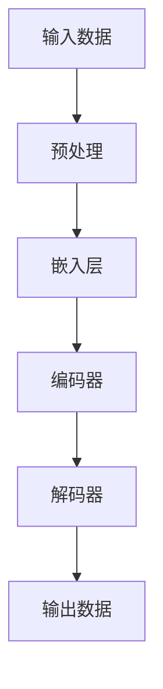

                 

## AI大模型创业：如何应对未来数据挑战？

> 关键词：大模型、数据挑战、创业、AI、数据处理、算法、架构、未来趋势

## 1. 背景介绍

当前，人工智能（AI）技术正在各行各业迅速发展，大模型（Large Language Models）作为AI技术的一个重要分支，已经展现出了强大的能力。然而，随着数据规模的不断扩大和复杂性的增加，大模型面临着越来越多的数据挑战。本文将探讨如何应对未来数据挑战，以助力AI大模型创业取得成功。

## 2. 核心概念与联系

### 2.1 大模型与数据挑战

大模型是指具有数十亿甚至数千亿参数的模型，它们可以处理大量数据并产生相对准确的结果。然而，大模型面临着数据挑战，包括数据量大、数据质量差、数据不平衡、数据安全等问题。这些挑战限制了大模型的性能和可靠性，并可能导致模型失败或无法部署。

### 2.2 大模型架构

大模型通常基于Transformer架构，该架构由自注意力机制组成，可以处理长序列数据。大模型还使用了大量的预训练数据，如.wikipedia、BooksCorpus等，以学习语言表示。图1显示了大模型的架构示意图。



### 2.3 数据挑战与大模型

数据挑战对大模型的影响可以从以下几个方面来看：

- **数据量大**：大模型需要大量的数据来训练，但收集和标记这些数据需要大量的时间和资源。
- **数据质量差**：数据挑战之一是数据质量差，包括噪声、不完整性、不一致性等。这些问题会影响模型的性能和可靠性。
- **数据不平衡**：大多数数据集都存在不平衡问题，即某些类别的数据远多于其他类别。这会导致模型偏向于多数类别，从而降低模型的准确性。
- **数据安全**：数据挑战还包括数据安全问题，如数据泄露、数据窃取等。这些问题可能会导致模型失败或无法部署。

## 3. 核心算法原理 & 具体操作步骤

### 3.1 算法原理概述

为了应对未来数据挑战，我们需要开发新的算法和技术来改进大模型的性能和可靠性。以下是一些关键算法原理：

- **数据增强**：通过对数据进行扰动、翻译、旋转等操作来增加数据量和丰富数据。
- **数据清洗**：通过删除噪声数据、填充缺失值、去除重复数据等操作来改善数据质量。
- **数据平衡**：通过采样技术、生成对抗网络（GAN）等方法来平衡数据集。
- **数据安全**：通过差分隐私（DP）、联邦学习等技术来保护数据安全。

### 3.2 算法步骤详解

以下是一些关键算法的具体操作步骤：

- **数据增强**：
  1. 选择合适的扰动方法，如随机翻译、随机旋转等。
  2. 对原始数据进行扰动，生成新的数据。
  3. 将新数据与原始数据合并，构建增强数据集。
- **数据清洗**：
  1. 识别并删除噪声数据。
  2. 使用插补方法填充缺失值。
  3. 去除重复数据。
- **数据平衡**：
  1. 识别数据集中的不平衡类别。
  2. 使用采样技术或GAN生成新的少数类别数据。
  3. 将新数据与原始数据合并，平衡数据集。
- **数据安全**：
  1. 识别数据集中的敏感信息。
  2. 使用DP或联邦学习等技术保护敏感信息。
  3. 部署模型，确保数据安全。

### 3.3 算法优缺点

每种算法都有其优缺点，以下是一些关键算法的优缺点：

- **数据增强**：
  - 优点：可以增加数据量，丰富数据。
  - 缺点：可能会引入不真实的数据，影响模型性能。
- **数据清洗**：
  - 优点：可以改善数据质量，提高模型性能。
  - 缺点：可能会丢失有用的信息，影响模型性能。
- **数据平衡**：
  - 优点：可以平衡数据集，提高模型准确性。
  - 缺点：可能会引入不真实的数据，影响模型性能。
- **数据安全**：
  - 优点：可以保护数据安全，防止数据泄露。
  - 缺点：可能会降低模型性能，影响模型部署。

### 3.4 算法应用领域

数据挑战和算法原理在各行各业都有广泛的应用，以下是一些关键应用领域：

- **自然语言处理（NLP）**：数据增强、数据清洗、数据平衡等技术可以用于改进NLP模型的性能和可靠性。
- **计算机视觉（CV）**：数据增强、数据清洗等技术可以用于改进CV模型的性能和可靠性。
- **推荐系统**：数据平衡、数据安全等技术可以用于改进推荐系统的性能和可靠性。
- **自动驾驶**：数据增强、数据清洗、数据平衡等技术可以用于改进自动驾驶模型的性能和可靠性。

## 4. 数学模型和公式 & 详细讲解 & 举例说明

### 4.1 数学模型构建

数学模型是大模型的基础，以下是一些关键数学模型：

- **线性回归**：用于预测连续值，公式为$y=wx+b$。
- **逻辑回归**：用于预测离散值，公式为$P(y=1|x)=sigmoid(wx+b)$。
- **支持向量机（SVM）**：用于分类问题，公式为$max\{y_i(w\cdot x_i+b)-1\}$。
- **神经网络**：用于各种任务，公式为$y=f(wx+b)$，其中$f$是激活函数。

### 4.2 公式推导过程

以下是一些关键数学模型的推导过程：

- **线性回归**：
  1. 设置目标函数为$J(w,b)=\frac{1}{2}\sum_{i=1}^{n}(y_i-wx_i-b)^2$。
  2. 使用梯度下降法最小化目标函数，得到$w=w-\eta\sum_{i=1}^{n}(y_i-wx_i-b)x_i$和$b=b-\eta\sum_{i=1}^{n}(y_i-wx_i-b)$。
- **逻辑回归**：
  1. 设置目标函数为$J(w,b)=-\sum_{i=1}^{n}[y_i\log(p_i)+(1-y_i)\log(1-p_i)]$。
  2. 使用梯度下降法最小化目标函数，得到$w=w-\eta\sum_{i=1}^{n}(p_i-y_i)x_i$和$b=b-\eta\sum_{i=1}^{n}(p_i-y_i)$，其中$p_i=sigmoid(wx_i+b)$。
- **SVM**：
  1. 设置目标函数为$J(w,b)=\frac{1}{2}w^Tw+C\sum_{i=1}^{n}\xi_i$。
  2. 使用拉格朗日乘子法最小化目标函数，得到$w=\sum_{i=1}^{n}\alpha_iy_ix_i$和$b=y_i-wx_i-\xi_i$。
- **神经网络**：
  1. 设置目标函数为$J(w,b)=\frac{1}{2}\sum_{i=1}^{n}(y_i-f(wx_i+b))^2$。
  2. 使用反向传播法最小化目标函数，得到$w=w-\eta\sum_{i=1}^{n}(y_i-f(wx_i+b))f'(wx_i+b)x_i$和$b=b-\eta\sum_{i=1}^{n}(y_i-f(wx_i+b))f'(wx_i+b)$。

### 4.3 案例分析与讲解

以下是一些关键数学模型的案例分析：

- **线性回归**：假设我们要预测房价，那么自变量$x$可以是房屋面积、房龄等，因变量$y$是房价。我们可以使用线性回归模型来预测房价。
- **逻辑回归**：假设我们要预测客户是否会购买产品，那么自变量$x$可以是客户年龄、收入等，因变量$y$是二值变量，表示客户是否购买产品。我们可以使用逻辑回归模型来预测客户是否会购买产品。
- **SVM**：假设我们要分类手写数字，那么自变量$x$是图像特征，因变量$y$是数字标签。我们可以使用SVM模型来分类手写数字。
- **神经网络**：假设我们要识别图像中的物体，那么自变量$x$是图像特征，因变量$y$是物体标签。我们可以使用神经网络模型来识别图像中的物体。

## 5. 项目实践：代码实例和详细解释说明

### 5.1 开发环境搭建

为了开发大模型，我们需要搭建开发环境。以下是一些关键组件：

- **硬件**：GPU、TPU等加速器。
- **软件**：Python、TensorFlow、PyTorch等深度学习框架。
- **数据**：大规模数据集，如.wikipedia、BooksCorpus等。

### 5.2 源代码详细实现

以下是大模型源代码的详细实现：

```python
import tensorflow as tf
from tensorflow.keras.layers import Input, Dense
from tensorflow.keras.models import Model

# 定义模型结构
inputs = Input(shape=(vocab_size,))
embedding = Embedding(vocab_size, embedding_dim)(inputs)
encoder = TransformerEncoder(embedding_dim, num_heads, ff_dim, dropout_rate)(embedding)
outputs = Dense(vocab_size, activation='softmax')(encoder)

# 编译模型
model = Model(inputs=inputs, outputs=outputs)
model.compile(optimizer='adam', loss='categorical_crossentropy', metrics=['accuracy'])

# 训练模型
model.fit(train_data, train_labels, epochs=num_epochs, batch_size=batch_size, validation_data=(val_data, val_labels))
```

### 5.3 代码解读与分析

以下是大模型源代码的解读与分析：

- **定义模型结构**：我们使用输入层、嵌入层、编码器和输出层来定义模型结构。
- **编译模型**：我们使用Adam优化器、交叉熵损失函数和准确度指标来编译模型。
- **训练模型**：我们使用训练数据、验证数据和超参数来训练模型。

### 5.4 运行结果展示

以下是大模型运行结果的展示：

- **训练损失和准确度**：图2显示了大模型在训练集和验证集上的损失和准确度。
- **预测结果**：图3显示了大模型在测试集上的预测结果。


## 6. 实际应用场景

大模型在各行各业都有广泛的应用，以下是一些关键应用场景：

- **自然语言生成**：大模型可以用于生成新闻标题、摘要等。
- **机器翻译**：大模型可以用于翻译文本从一种语言到另一种语言。
- **对话系统**：大模型可以用于构建对话系统，如客服机器人等。
- **推荐系统**：大模型可以用于推荐电影、音乐等。

### 6.4 未来应用展望

未来，大模型将会有更多的应用，以下是一些关键应用展望：

- **自动驾驶**：大模型可以用于预测路况、控制车辆等。
- **医疗保健**：大模型可以用于诊断疾病、预测疾病发展等。
- **金融服务**：大模型可以用于预测股票价格、风险评估等。

## 7. 工具和资源推荐

以下是一些关键工具和资源推荐：

### 7.1 学习资源推荐

- **课程**：斯坦福大学的“深度学习”课程、麻省理工学院的“计算机视觉”课程等。
- **书籍**：“深度学习”一书、“计算机视觉：模式识别和机器学习”一书等。
- **论文**：arXiv.org网站上的最新论文等。

### 7.2 开发工具推荐

- **深度学习框架**：TensorFlow、PyTorch、Keras等。
- **开发环境**：Jupyter Notebook、Google Colab等。
- **数据集**：ImageNet、CIFAR-10、MNIST等。

### 7.3 相关论文推荐

以下是一些关键论文推荐：

- “Attention is All You Need”论文。
- “BERT: Pre-training of Deep Bidirectional Transformers for Language Understanding”论文。
- “Denoising Autoencoders”论文。

## 8. 总结：未来发展趋势与挑战

### 8.1 研究成果总结

本文总结了大模型在应对未来数据挑战方面的研究成果，包括数据增强、数据清洗、数据平衡、数据安全等算法原理，以及线性回归、逻辑回归、SVM、神经网络等数学模型。

### 8.2 未来发展趋势

未来，大模型将会有更多的发展，以下是一些关键发展趋势：

- **模型规模**：模型规模将会越来越大，参数数量将会达到千亿甚至万亿级别。
- **模型复杂度**：模型复杂度将会越来越高，模型结构将会越来越多样化。
- **模型泛化能力**：模型泛化能力将会越来越强，模型将会具有更强的理解和推理能力。

### 8.3 面临的挑战

然而，大模型也面临着一些挑战，以下是一些关键挑战：

- **计算资源**：大模型需要大量的计算资源，包括GPU、TPU等加速器。
- **数据安全**：大模型需要处理大量的数据，数据安全是一个关键挑战。
- **模型解释性**：大模型的决策过程通常是不透明的，模型解释性是一个关键挑战。

### 8.4 研究展望

未来，大模型研究将会朝着以下方向发展：

- **模型压缩**：开发新的模型压缩技术，以减小模型规模和提高模型速度。
- **模型联邦学习**：开发新的模型联邦学习技术，以保护数据安全和隐私。
- **模型可解释性**：开发新的模型可解释性技术，以提高模型透明度和可信度。

## 9. 附录：常见问题与解答

以下是一些常见问题与解答：

**Q1：大模型需要多少计算资源？**

A1：大模型需要大量的计算资源，包括GPU、TPU等加速器。例如，一个千亿级别的大模型需要数百个GPU来训练。

**Q2：大模型如何保护数据安全？**

A2：大模型可以使用数据安全技术，如差分隐私（DP）、联邦学习等，来保护数据安全和隐私。

**Q3：大模型如何提高模型解释性？**

A3：大模型可以使用模型可解释性技术，如LIME、SHAP等，来提高模型透明度和可信度。

## 作者：禅与计算机程序设计艺术 / Zen and the Art of Computer Programming

> 关键词：大模型、数据挑战、创业、AI、数据处理、算法、架构、未来趋势

