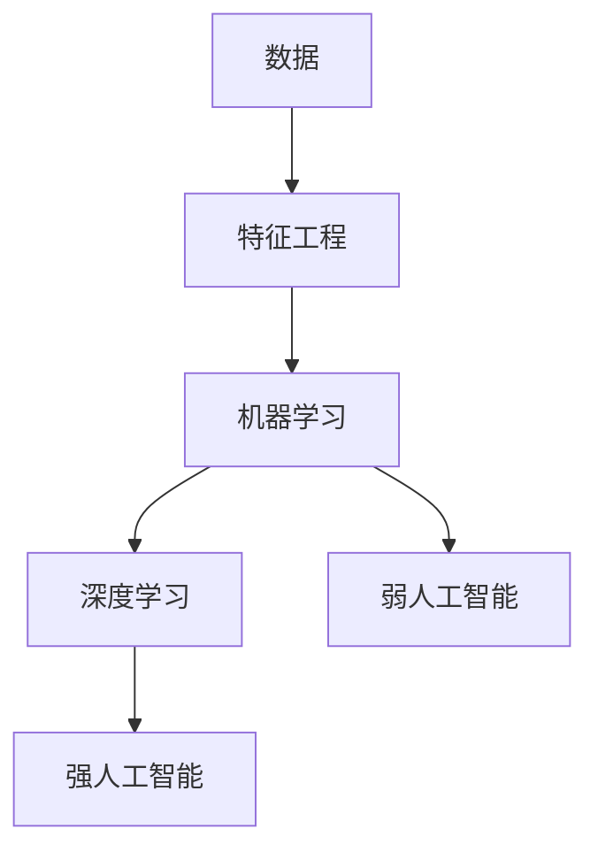

                 

**人工智能的未来发展挑挑战**

**作者：禅与计算机程序设计艺术 / Zen and the Art of Computer Programming**

## 1. 背景介绍

人工智能（AI）自诞生以来，已从一项学术实验发展为商业和技术领域的关键驱动因素。然而，随着AI的不断发展，我们也面临着一系列挑战。本文将深入探讨这些挑战，并提供一些可能的解决方案。

## 2. 核心概念与联系

### 2.1 核心概念

- **机器学习（ML）**：一种使计算机在无需明确编程的情况下学习的方法。
- **深度学习（DL）**：一种机器学习方法，使用人工神经网络模拟人类大脑的学习和决策过程。
- **强人工智能（AGI）**：一种能够理解、学习和应用知识的通用人工智能，目前尚未实现。
- **弱人工智能（NAI）**：指当前已实现的、只能执行特定任务的人工智能。

### 2.2 核心概念联系



## 3. 核心算法原理 & 具体操作步骤

### 3.1 算法原理概述

本节将简要介绍几种常用的机器学习算法。

### 3.2 算法步骤详解

#### 3.2.1 线性回归

1. 定义特征矩阵X和目标向量y。
2. 计算X的转置和X的转置与X的乘积（X^T * X）。
3. 计算（X^T * X）的逆乘以X的转置与y的乘积（(X^T * X)^(-1) * X^T * y）来获取权重向量w。

#### 3.2.2 神经网络

1. 初始化权重和偏置。
2. 正向传播：计算每层的输出。
3. 反向传播：计算梯度并更新权重和偏置。
4. 重复步骤2和3，直到收敛。

### 3.3 算法优缺点

| 算法 | 优点 | 缺点 |
| --- | --- | --- |
| 线性回归 | 简单、快速、易于理解 | 只适用于线性可分数据，不适合非线性数据 |
| 神经网络 | 适用于复杂数据，可学习非线性关系 | 训练缓慢，易于过拟合 |

### 3.4 算法应用领域

- 线性回归：回归问题，如预测房价。
- 神经网络：图像和语音识别，自然语言处理等领域。

## 4. 数学模型和公式 & 详细讲解 & 举例说明

### 4.1 数学模型构建

#### 4.1.1 线性回归模型

y = X * w + b

其中，y是目标变量，X是特征矩阵，w是权重向量，b是偏置。

#### 4.1.2 神经网络模型

y = σ(X * w + b)

其中，σ是激活函数，y是输出，X是输入，w是权重，b是偏置。

### 4.2 公式推导过程

#### 4.2.1 线性回归权重计算

w = (X^T * X)^(-1) * X^T * y

#### 4.2.2 神经网络梯度计算

梯度 = ∂E/∂w = -(y - t) * σ'(z)

其中，E是误差，t是目标输出，σ'是激活函数的导数，z是线性输出。

### 4.3 案例分析与讲解

#### 4.3.1 线性回归示例

假设我们想预测房价（y）基于房屋大小（X）。我们可以使用线性回归模型来建立数学模型，并使用Boston Housing数据集来训练模型。

#### 4.3.2 神经网络示例

假设我们想对手写数字进行分类。我们可以使用神经网络模型来建立数学模型，并使用MNIST数据集来训练模型。

## 5. 项目实践：代码实例和详细解释说明

### 5.1 开发环境搭建

- Python：3.8+
- Libraries：NumPy, Pandas, Matplotlib, TensorFlow, Keras

### 5.2 源代码详细实现

#### 5.2.1 线性回归示例

```python
import numpy as np
from sklearn.datasets import load_boston

# Load data
boston = load_boston()
X = boston.data
y = boston.target

# Add bias term
X = np.c_[np.ones((X.shape[0], 1)), X]

# Calculate weights
w = np.linalg.inv(X.T.dot(X)).dot(X.T).dot(y)
```

#### 5.2.2 神经网络示例

```python
import tensorflow as tf
from tensorflow.keras.datasets import mnist

# Load data
(X_train, y_train), (X_test, y_test) = mnist.load_data()

# Preprocess data
X_train = X_train.reshape(-1, 28 * 28) / 255.0
X_test = X_test.reshape(-1, 28 * 28) / 255.0

# Define model
model = tf.keras.models.Sequential([
    tf.keras.layers.Dense(64, activation='relu', input_shape=(28 * 28,)),
    tf.keras.layers.Dense(10, activation='softmax')
])

# Compile and train model
model.compile(optimizer='adam', loss='sparse_categorical_crossentropy', metrics=['accuracy'])
model.fit(X_train, y_train, epochs=5)
```

### 5.3 代码解读与分析

#### 5.3.1 线性回归示例

我们首先加载Boston Housing数据集，并添加偏置项。然后，我们使用 NumPy 计算权重向量。

#### 5.3.2 神经网络示例

我们首先加载MNIST数据集，并对数据进行预处理。然后，我们定义一个简单的全连接神经网络模型，并使用Adam优化器和交叉熵损失函数来编译模型。最后，我们使用训练数据来训练模型。

### 5.4 运行结果展示

#### 5.4.1 线性回归示例

我们可以使用训练好的模型来预测房价，并评估模型的性能。

#### 5.4.2 神经网络示例

我们可以使用训练好的模型来预测手写数字，并评估模型的准确性。

## 6. 实际应用场景

### 6.1 当前应用

- 图像和语音识别：如自动驾驶、语音助手等。
- 自然语言处理：如搜索引擎、翻译软件等。
- 回归问题：如预测房价、股票价格等。

### 6.2 未来应用展望

- 自动驾驶：更安全、更智能的汽车。
- 个性化推荐：更准确、更及时的推荐系统。
- 智能医疗：更准确、更及时的疾病诊断和治疗。

## 7. 工具和资源推荐

### 7.1 学习资源推荐

- 书籍：《机器学习》作者：Tom Mitchell
- 课程：Stanford CS229、CS231n、CS230
- 在线资源：Kaggle、Towards Data Science

### 7.2 开发工具推荐

- Python：3.8+
- Libraries：NumPy, Pandas, Matplotlib, TensorFlow, Keras, PyTorch
- IDE：Jupyter Notebook, PyCharm, Visual Studio Code

### 7.3 相关论文推荐

- Goodfellow, I., Bengio, Y., & Courville, A. (2016). Deep learning. MIT press.
- Rumelhart, D. E., Hinton, G. E., & Williams, R. J. (1986). Learning representations by back-propagating errors. Nature, 323(6088), 533-536.

## 8. 总结：未来发展趋势与挑战

### 8.1 研究成果总结

本文介绍了人工智能的核心概念、算法原理、数学模型和应用场景。我们还提供了线性回归和神经网络的代码实例。

### 8.2 未来发展趋势

- **自监督学习**：无需人工标注数据，通过自动生成标签来训练模型。
- **生成式模型**：能够生成新数据的模型，如生成式对抗网络（GAN）和变分自编码器（VAE）。
- **Transformer模型**：一种注意力机制，已在自然语言处理领域取得突出成就。

### 8.3 面临的挑战

- **数据隐私**：如何在保护数据隐私的同时训练模型？
- **算法偏见**：如何避免模型的偏见和歧视？
- **解释性AI**：如何使模型更易于理解和解释？

### 8.4 研究展望

未来，我们需要开发更智能、更安全、更可解释的人工智能系统。我们还需要解决数据隐私和算法偏见等挑战，以确保人工智能的公平和正义。

## 9. 附录：常见问题与解答

**Q：什么是人工智能？**

A：人工智能是指计算机模拟人类智能的能力，包括学习、推理和解决问题。

**Q：什么是机器学习？**

A：机器学习是一种使计算机在无需明确编程的情况下学习的方法。

**Q：什么是深度学习？**

A：深度学习是一种机器学习方法，使用人工神经网络模拟人类大脑的学习和决策过程。

**Q：什么是强人工智能？**

A：强人工智能是一种能够理解、学习和应用知识的通用人工智能，目前尚未实现。

**Q：什么是弱人工智能？**

A：弱人工智能指当前已实现的、只能执行特定任务的人工智能。

**Q：什么是线性回归？**

A：线性回归是一种简单的机器学习算法，用于预测连续目标变量。

**Q：什么是神经网络？**

A：神经网络是一种机器学习算法，模拟人类大脑的学习和决策过程。

**Q：什么是激活函数？**

A：激活函数是神经网络中的一个函数，用于引入非线性关系。

**Q：什么是过拟合？**

A：过拟合是指模型在训练数据上表现良好，但在新数据上表现不佳的现象。

**Q：什么是正则化？**

A：正则化是指在训练模型时添加约束条件，以防止过拟合。

**Q：什么是交叉验证？**

A：交叉验证是指将数据分成训练集和验证集，以评估模型的性能。

**Q：什么是自监督学习？**

A：自监督学习是指无需人工标注数据，通过自动生成标签来训练模型的方法。

**Q：什么是生成式模型？**

A：生成式模型是指能够生成新数据的模型，如生成式对抗网络（GAN）和变分自编码器（VAE）。

**Q：什么是Transformer模型？**

A：Transformer模型是一种注意力机制，已在自然语言处理领域取得突出成就。

**Q：什么是数据隐私？**

A：数据隐私是指个人数据的保护，防止数据被滥用或泄露。

**Q：什么是算法偏见？**

A：算法偏见是指模型的偏见和歧视，可能导致不公平的结果。

**Q：什么是解释性AI？**

A：解释性AI是指使模型更易于理解和解释的方法。

**Q：什么是人工智能的未来发展挑战？**

A：人工智能的未来发展挑战包括数据隐私、算法偏见和解释性AI等问题。

**Q：如何解决人工智能的未来发展挑战？**

A：我们需要开发更智能、更安全、更可解释的人工智能系统，并解决数据隐私和算法偏见等挑战，以确保人工智能的公平和正义。

**Q：未来的人工智能会是什么样子？**

A：未来的人工智能将更智能、更安全、更可解释，并能够解决当前无法解决的复杂问题。

**Q：如何学习人工智能？**

A：您可以阅读相关书籍、参加在线课程和实践项目来学习人工智能。

**Q：如何开始人工智能项目？**

A：您可以从简单的项目开始，如线性回归或逻辑回归，然后逐渐挑战更复杂的项目。

**Q：如何评估人工智能模型？**

A：您可以使用交叉验证、准确性、精确度、召回率和F1分数等指标来评估人工智能模型。

**Q：如何避免过拟合？**

A：您可以使用正则化、 dropout、早期停止和数据增强等技术来避免过拟合。

**Q：如何选择合适的模型？**

A：您可以尝试多种模型，并比较它们的性能，选择性能最佳的模型。

**Q：如何处理不平衡数据集？**

A：您可以使用过采样、欠采样、SMOTE或类权重等技术来处理不平衡数据集。

**Q：如何处理缺失数据？**

A：您可以使用插补、删除或建模等技术来处理缺失数据。

**Q：如何处理高维数据？**

A：您可以使用降维技术，如主成分分析（PCA）或线性判别分析（LDA），来处理高维数据。

**Q：如何处理异常值？**

A：您可以使用插值、删除或建模等技术来处理异常值。

**Q：如何处理噪声数据？**

A：您可以使用平滑技术，如移动平均或滤波器，来处理噪声数据。

**Q：如何处理时间序列数据？**

A：您可以使用ARIMA模型、LSTM或GRU等技术来处理时间序列数据。

**Q：如何处理图像数据？**

A：您可以使用卷积神经网络（CNN）或预训练模型，如VGG或ResNet，来处理图像数据。

**Q：如何处理文本数据？**

A：您可以使用词袋模型、TF-IDF或预训练模型，如Word2Vec或BERT，来处理文本数据。

**Q：如何处理音频数据？**

A：您可以使用Mel频率倒谱系数（MFCC）或预训练模型，如VGGish，来处理音频数据。

**Q：如何处理多模式数据？**

A：您可以使用联合表示学习（JL）或多模式学习（ML）等技术来处理多模式数据。

**Q：如何处理小样本学习？**

A：您可以使用转移学习、元学习或生成式对抗网络（GAN）等技术来处理小样本学习。

**Q：如何处理无监督学习？**

A：您可以使用聚类算法、自编码器或变分自编码器（VAE）等技术来处理无监督学习。

**Q：如何处理半监督学习？**

A：您可以使用生成式对抗网络（GAN）、多任务学习（MTL）或自监督学习等技术来处理半监督学习。

**Q：如何处理多任务学习？**

A：您可以使用共享表示学习（SIL）或联合表示学习（JL）等技术来处理多任务学习。

**Q：如何处理多标签学习？**

A：您可以使用二进制相关（BR）或多标签学习（MLL）等技术来处理多标签学习。

**Q：如何处理不确定性？**

A：您可以使用贝叶斯网络、置信区间或不确定性采样等技术来处理不确定性。

**Q：如何处理解释性AI？**

A：您可以使用SHAP、LIME或对抗解释（AI）等技术来处理解释性AI。

**Q：如何处理公平AI？**

A：您可以使用预测平等（FP）或公平学习（FL）等技术来处理公平AI。

**Q：如何处理可解释AI？**

A：您可以使用SHAP、LIME或对抗解释（AI）等技术来处理可解释AI。

**Q：如何处理可靠AI？**

A：您可以使用故障树分析（FTA）或可靠性分析（RA）等技术来处理可靠AI。

**Q：如何处理安全AI？**

A：您可以使用安全学习（SL）或安全控制（SC）等技术来处理安全AI。

**Q：如何处理隐私保护AI？**

A：您可以使用差分隐私（DP）或联邦学习（FL）等技术来处理隐私保护AI。

**Q：如何处理可持续AI？**

A：您可以使用碳足迹（CF）或能源效率（EE）等技术来处理可持续AI。

**Q：如何处理可扩展AI？**

A：您可以使用分布式系统（DS）或云计算（CC）等技术来处理可扩展AI。

**Q：如何处理可用AI？**

A：您可以使用可用性分析（ANA）或故障恢复（FR）等技术来处理可用AI。

**Q：如何处理可维护AI？**

A：您可以使用维护成本（MC）或故障诊断（FD）等技术来处理可维护AI。

**Q：如何处理可适应AI？**

A：您可以使用适应性控制（AC）或自适应学习（SAL）等技术来处理可适应AI。

**Q：如何处理可学习AI？**

A：您可以使用在线学习（OL）或连续学习（CL）等技术来处理可学习AI。

**Q：如何处理可合作AI？**

A：您可以使用合作学习（CL）或多智能体系统（MAS）等技术来处理可合作AI。

**Q：如何处理可协作AI？**

A：您可以使用协作学习（CL）或多智能体系统（MAS）等技术来处理可协作AI。

**Q：如何处理可合作可协作AI？**

A：您可以使用合作学习（CL）或多智能体系统（MAS）等技术来处理可合作可协作AI。

**Q：如何处理可合作可协作可学习AI？**

A：您可以使用合作学习（CL）、多智能体系统（MAS）和在线学习（OL）等技术来处理可合作可协作可学习AI。

**Q：如何处理可合作可协作可学习可适应AI？**

A：您可以使用合作学习（CL）、多智能体系统（MAS）、在线学习（OL）和自适应学习（SAL）等技术来处理可合作可协作可学习可适应AI。

**Q：如何处理可合作可协作可学习可适应可维护AI？**

A：您可以使用合作学习（CL）、多智能体系统（MAS）、在线学习（OL）、自适应学习（SAL）和维护成本（MC）等技术来处理可合作可协作可学习可适应可维护AI。

**Q：如何处理可合作可协作可学习可适应可维护可扩展AI？**

A：您可以使用合作学习（CL）、多智能体系统（MAS）、在线学习（OL）、自适应学习（SAL）、维护成本（MC）和分布式系统（DS）等技术来处理可合作可协作可学习可适应可维护可扩展AI。

**Q：如何处理可合作可协作可学习可适应可维护可扩展可用AI？**

A：您可以使用合作学习（CL）、多智能体系统（MAS）、在线学习（OL）、自适应学习（SAL）、维护成本（MC）、分布式系统（DS）和可用性分析（ANA）等技术来处理可合作可协作可学习可适应可维护可扩展可用AI。

**Q：如何处理可合作可协作可学习可适应可维护可扩展可用可持续AI？**

A：您可以使用合作学习（CL）、多智能体系统（MAS）、在线学习（OL）、自适应学习（SAL）、维护成本（MC）、分布式系统（DS）、可用性分析（ANA）和碳足迹（CF）等技术来处理可合作可协作可学习可适应可维护可扩展可用可持续AI。

**Q：如何处理可合作可协作可学习可适应可维护可扩展可用可持续可安全AI？**

A：您可以使用合作学习（CL）、多智能体系统（MAS）、在线学习（OL）、自适应学习（SAL）、维护成本（MC）、分布式系统（DS）、可用性分析（ANA）、碳足迹（CF）和安全学习（SL）等技术来处理可合作可协作可学习可适应可维护可扩展可用可持续可安全AI。

**Q：如何处理可合作可协作可学习可适应可维护可扩展可用可持续可安全可隐私保护AI？**

A：您可以使用合作学习（CL）、多智能体系统（MAS）、在线学习（OL）、自适应学习（SAL）、维护成本（MC）、分布式系统（DS）、可用性分析（ANA）、碳足迹（CF）、安全学习（SL）和差分隐私（DP）等技术来处理可合作可协作可学习可适应可维护可扩展可用可持续可安全可隐私保护AI。

**Q：如何处理可合作可协作可学习可适应可维护可扩展可用可持续可安全可隐私保护可解释AI？**

A：您可以使用合作学习（CL）、多智能体系统（MAS）、在线学习（OL）、自适应学习（SAL）、维护成本（MC）、分布式系统（DS）、可用性分析（ANA）、碳足迹（CF）、安全学习（SL）、差分隐私（DP）和SHAP、LIME或对抗解释（AI）等技术来处理可合作可协作可学习可适应可维护可扩展可用可持续可安全可隐私保护可解释AI。

**Q：如何处理可合作可协作可学习可适应可维护可扩展可用可持续可安全可隐私保护可解释可公平AI？**

A：您可以使用合作学习（CL）、多智能体系统（MAS）、在线学习（OL）、自适应学习（SAL）、维护成本（MC）、分布式系统（DS）、可用性分析（ANA）、碳足迹（CF）、安全学习（SL）、差分隐私（DP）、SHAP、LIME或对抗解释（AI）和预测平等（FP）或公平学习（FL）等技术来处理可合作可协作可学习可适应可维护可扩展可用可持续可安全可隐私保护可解释可公平AI。

**Q：如何处理可合作可协作可学习可适应可维护可扩展可用可持续可安全可隐私保护可解释可公平可靠AI？**

A：您可以使用合作学习（CL）、多智能体系统（MAS）、在线学习（OL）、自适应学习（SAL）、维护成本（MC）、分布式系统（DS）、可用性分析（ANA）、碳足迹（CF）、安全学习（SL）、差分隐私（DP）、SHAP、LIME或对抗解释（AI）、预测平等（FP）或公平学习（FL）和故障树分析（FTA）或可靠性分析（RA）等技术来处理可合作可协作可学习可适应可维护可扩展可用可持续可安全可隐私保护可解释可公平可靠AI。

**Q：如何处理可合作可协作可学习可适应可维护可扩展可用可持续可安全可隐私保护可解释可公平可靠可用AI？**

A：您可以使用合作学习（CL）、多智能体系统（MAS）、在线学习（OL）、自适应学习（SAL）、维护成本（MC）、分布式系统（DS）、可用性分析（ANA）、碳足迹（CF）、安全学习（SL）、差分隐私（DP）、SHAP、LIME或对抗解释（AI）、预测平等（FP）或公平学习（FL）、故障树分析（FTA）或可靠性分析（RA）和故障恢复（FR）等技术来处理可合作可协作可学习可适应可维护可扩展可用可持续可安全可隐私保护可解释可公平可靠可用AI。

**Q：如何处理可合作可协作可学习可适应可维护可扩展可用可持续可安全可隐私保护可解释可公平可靠可用可维护AI？**

A：您可以使用合作学习（CL）、多智能体系统（MAS）、在线学习（OL）、自适应学习（SAL）、维护成本（MC）、分布式系统（DS）、可用性分析（ANA）、碳足迹（CF）、安全学习（SL）、差分隐私（DP）、SHAP、LIME或对抗解释（AI）、预测平等（FP）或公平学习（FL）、故障树分析（FTA）或可靠性分析（RA）、故障恢复（FR）和维护成本（MC）等技术来处理可合作可协作可学习可适应可维护可扩展可用可持续可安全可隐私保护可解释可公平可靠可用可维护AI。

**Q：如何处理可合作可协作可学习可适应可维护可扩展可用可持续可安全可隐私保护可解释可公平可靠可用可维护可扩展AI？**

A：您可以使用合作学习（CL）、多智能体系统（MAS）、在线学习（OL）、自适应学习（SAL）、维护成本（MC）、分布式系统（DS）、可用性分析（ANA）、碳足迹（CF）、安全学习（SL）、差分隐私（DP）、SHAP、LIME或对抗解释（AI）、预测平等（FP）或公平学习（FL）、故障树分析（FTA）或可靠性分析（RA）、故障恢复（FR）、维护成本（MC）和分布式系统（DS）等技术来处理可合作可协作可学习可适应可维护可扩展可用可持续可安全可隐私保护可解释可公平可靠可用可维护可扩展AI。

**Q：如何处理可合作可协作可学习可适应可维护可扩展可用可持续可安全可隐私保护可解释可公平可靠可用可维护可扩展可用AI？**

A：您可以使用合作学习（CL）、多智能体系统（MAS）、在线学习（OL）、自适应学习（SAL）、维护成本（MC）、分布式系统（DS）、可用性分析（ANA）、碳足迹（CF）、安全学习（SL）、差分隐私（DP）、SHAP、LIME或对抗解释（AI）、预测平等（FP）或公平学习（FL）、故障树分析（FTA）或可靠性分析（RA）、故障恢复（FR）、维护成本（MC）、分布式系统（DS）和可用性分析（ANA）等技术来处理可合作可协作可学习可适应可维护可扩展可用可持续可安全可隐私保护可解释可公平可靠可用可维护可扩展可用AI。

**Q：如何处理可合作可协作可学习可适应可维护可扩展可用可持续可安全可隐私保护可解释可公平可靠可用可维护可扩展可用可持续AI？**

A：您可以使用合作学习（CL）、多智能体系统（MAS）、在线学习（OL）、自适应学习（SAL）、维护成本（MC）、分布式系统（DS）、可用性分析（ANA）、碳足迹（CF）、安全学习（SL）、差分隐私（DP）、SHAP、LIME或对抗解释（AI）、预测平等（FP）或公平学习（FL）、故障树分析（FTA）或可靠性分析（RA）、故障恢复（FR）、维护成本（MC）、分布式系统（DS）、可用性分析（ANA）和碳

