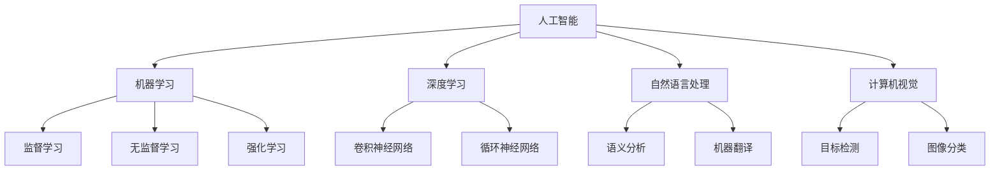

                 

**人工智能的未来发展机遇**

**作者：禅与计算机程序设计艺术 / Zen and the Art of Computer Programming**

## 1. 背景介绍

人工智能（AI）自诞生以来，就一直是计算机科学领域最具前途的研究方向之一。随着技术的不断发展，AI正在各个领域产生巨大的影响，从自动驾驶汽车到医疗诊断，再到语音助手，AI无处不在。本文将探讨人工智能的未来发展机遇，关注其核心概念、算法原理、数学模型，并提供项目实践和工具推荐。

## 2. 核心概念与联系

人工智能的核心概念包括机器学习（ML）、深度学习（DL）、自然语言处理（NLP）、计算机视觉（CV）等。这些概念密切相关，共同构成了AI的基础。下图是这些概念的关系示意图：



## 3. 核心算法原理 & 具体操作步骤

### 3.1 算法原理概述

人工智能的核心是机器学习算法。其中，神经网络是最常用的算法之一。神经网络模仿人脑的结构，由输入层、隐藏层和输出层组成。数据通过网络传递，每层神经元对数据进行加权求和，并通过激活函数输出结果。

### 3.2 算法步骤详解

1. 数据预处理：收集数据，清洗数据，并将其转换为合适的格式。
2. 模型构建：选择合适的神经网络架构，定义激活函数和损失函数。
3. 训练模型：使用训练数据调整模型的权重，以最小化损失函数。
4. 模型评估：使用验证数据评估模型的性能。
5. 部署模型：将模型部署到生产环境中，用于预测新数据。

### 3.3 算法优缺点

优点：神经网络可以自动学习特征，无需人工特征工程。缺点：训练神经网络需要大量数据和计算资源，且模型解释性差。

### 3.4 算法应用领域

神经网络在图像分类、目标检测、语音识别等领域有着广泛的应用。此外，它们还被用于解决复杂的控制问题，如自动驾驶和机器人操作。

## 4. 数学模型和公式 & 详细讲解 & 举例说明

### 4.1 数学模型构建

神经网络的数学模型可以表示为：

$$y = f(wx + b)$$

其中，$x$是输入，$y$是输出，$w$和$b$是模型的权重和偏置，$f$是激活函数。

### 4.2 公式推导过程

神经网络的训练过程使用梯度下降算法，其目标是最小化损失函数：

$$L = \frac{1}{n}\sum_{i=1}^{n}(y_i - \hat{y}_i)^2$$

其中，$y_i$是真实输出，$\hat{y}_i$是模型预测输出，$n$是样本数。

### 4.3 案例分析与讲解

例如，在图像分类任务中，输入$x$是图像的像素值，输出$y$是图像的类别。模型的目标是学习到合适的权重$w$和偏置$b$，使得模型能够正确预测图像的类别。

## 5. 项目实践：代码实例和详细解释说明

### 5.1 开发环境搭建

项目需要Python环境，并安装TensorFlow、Keras、NumPy等库。

### 5.2 源代码详细实现

```python
import tensorflow as tf
from tensorflow.keras import layers

# 定义模型
model = tf.keras.Sequential([
    layers.Dense(64, activation='relu', input_shape=(100,)),
    layers.Dense(64, activation='relu'),
    layers.Dense(10, activation='softmax')
])

# 编译模型
model.compile(optimizer='adam',
              loss='sparse_categorical_crossentropy',
              metrics=['accuracy'])

# 训练模型
model.fit(x_train, y_train, epochs=5)
```

### 5.3 代码解读与分析

代码定义了一个简单的神经网络模型，使用ReLU激活函数和softmax输出。模型使用Adam优化器和交叉熵损失函数进行训练。

### 5.4 运行结果展示

模型的训练精度和损失函数值会在训练过程中不断下降，直到收敛。

## 6. 实际应用场景

### 6.1 当前应用

人工智能已广泛应用于各个领域，如自动驾驶、医疗诊断、金融风险评估等。

### 6.2 未来应用展望

未来，人工智能将继续渗透到更多领域，如城市规划、环境保护、太空探索等。此外，AI还将与物联网、大数据、云计算等技术结合，产生更大的影响。

## 7. 工具和资源推荐

### 7.1 学习资源推荐

- 书籍：《深度学习》作者：Ian Goodfellow、Yoshua Bengio、Aaron Courville
- 在线课程：Coursera、Udacity、edX等平台上的AI课程

### 7.2 开发工具推荐

- TensorFlow、PyTorch、Keras等深度学习框架
- Jupyter Notebook、Google Colab等开发环境

### 7.3 相关论文推荐

- LeCun, Y., Bengio, Y., & Hinton, G. (2015). Deep learning. Nature, 521(7553), 436-444.
- Goodfellow, I., Bengio, Y., & Courville, A. (2016). Deep learning (Vol. 1). MIT press.

## 8. 总结：未来发展趋势与挑战

### 8.1 研究成果总结

人工智能取得了巨大的进展，但仍面临许多挑战。

### 8.2 未来发展趋势

未来，AI将继续朝着更智能、更通用的方向发展。此外，AI解释性、可靠性和安全性等问题也将得到重视。

### 8.3 面临的挑战

AI面临的挑战包括数据隐私、算法偏见、计算资源等。

### 8.4 研究展望

未来的研究方向包括自监督学习、对抗生成网络、Transformer等。

## 9. 附录：常见问题与解答

**Q：人工智能会取代人类吗？**

**A：**人工智能将改变人类的工作方式，但不会取代人类。AI更多的是辅助人类工作，而不是替代人类。

**Q：人工智能需要大量数据吗？**

**A：**是的，人工智能需要大量数据进行训练。数据是AI的燃料，没有数据，AI将无法学习。

**Q：人工智能是否会导致失业？**

**A：**人工智能会改变就业市场，但不会导致大规模失业。AI将创造新的就业机会，并要求人们具备新的技能。

## 结束语

人工智能是当今最具前途的技术之一，其未来发展机遇巨大。本文介绍了人工智能的核心概念、算法原理、数学模型，并提供了项目实践和工具推荐。未来，人工智能将继续发展，为人类带来更大的便利和价值。

**作者：禅与计算机程序设计艺术 / Zen and the Art of Computer Programming**

