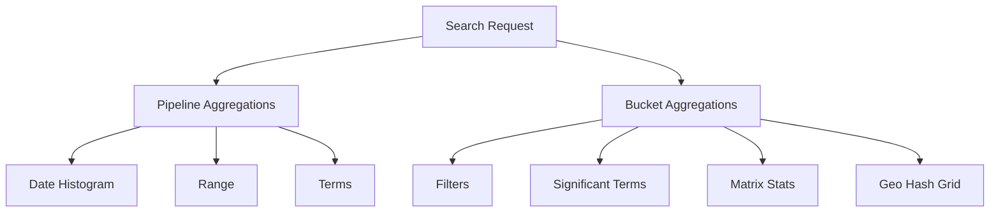

                 

**Elasticsearch (ES) Aggregations: Principles and Code Examples**

## 1. Background Introduction

Elasticsearch (ES) is a highly scalable open-source full-text search and analytics engine. It allows you to store, search, and analyze big volumes of data quickly and in near real-time. ES aggregations are a powerful feature that enables you to extract meaningful information and insights from your data. This article delves into the principles, algorithms, mathematical models, and code examples of ES aggregations.

## 2. Core Concepts & Relationships

ES aggregations provide a way to summarize and analyze your data based on specific criteria. They are grouped into two main categories: **Pipeline** and **Bucket** aggregations.



## 3. Core Aggregation Algorithms

### 3.1 Algorithm Overview

ES aggregations are executed in a specific order, starting with the top-level aggregation and then moving down the aggregation tree. Each aggregation type has its own algorithm for processing data.

### 3.2 Algorithm Steps

1. **Bucket Aggregations**: These divide the data into 'buckets' based on specific criteria (e.g., terms, date ranges, etc.). Each bucket contains a subset of documents that match the bucket's criteria.

2. **Pipeline Aggregations**: These operate on the results of other aggregations or metrics. They are used to further analyze or transform the data produced by other aggregations.

### 3.3 Algorithm Pros & Cons

**Pros**:
- Highly flexible and powerful for data analysis.
- Can be nested to create complex analysis pipelines.

**Cons**:
- Can be resource-intensive, especially for large datasets.
- Complex aggregations can be difficult to understand and debug.

### 3.4 Application Domains

ES aggregations are used in various domains, such as:
- Log analysis and monitoring.
- Business intelligence and analytics.
- Recommendation systems.
- Geospatial analysis.

## 4. Mathematical Models & Formulas

### 4.1 Model Construction

Many ES aggregations are based on statistical or mathematical models. For example, the `avg` aggregation calculates the average of a numeric field using the following formula:

$$ avg = \frac{\sum_{i=1}^{n} x_i}{n} $$

where $x_i$ are the values of the field, and $n$ is the number of documents in the bucket.

### 4.2 Formula Derivation

The `sum` aggregation calculates the sum of a numeric field using the following formula:

$$ sum = \sum_{i=1}^{n} x_i $$

### 4.3 Case Study

Consider a dataset of customer orders, with fields `order_date` and `order_total`. To find the total sales for each day, you can use the `date_histogram` and `sum` aggregations:

```json
{
  "size": 0,
  "aggs": {
    "daily_sales": {
      "date_histogram": {
        "field": "order_date",
        "calendar_interval": "day"
      },
      "aggs": {
        "total_sales": { "sum": { "field": "order_total" } }
      }
    }
  }
}
```

## 5. Project Practice: Code Examples

### 5.1 Development Environment Setup

To follow along with the code examples, you'll need to have Elasticsearch installed and running. You can use the official Elasticsearch Docker image for quick setup:

```bash
docker run -d --name elasticsearch -p 9200:9200 -p 9300:9300 -e ES_JAVA_OPTS="-Xms2g -Xmx2g" elasticsearch:7.15.0
```

### 5.2 Source Code Implementation

Let's create an index named `orders` with the following mapping:

```json
PUT /orders
{
  "mappings": {
    "properties": {
      "order_date": { "type": "date" },
      "order_total": { "type": "double" }
    }
  }
}
```

Insert some sample data:

```json
POST /orders/_bulk
{ "index": {} }
{ "order_date": "2022-01-01", "order_total": 100.00 }
{ "order_date": "2022-01-01", "order_total": 200.00 }
{ "order_date": "2022-01-02", "order_total": 150.00 }
{ "order_date": "2022-01-02", "order_total": 75.00 }
```

Now, run the aggregation query from the previous section:

```bash
curl -X GET "localhost:9200/orders/_search" -H 'Content-Type: application/json' -d'
{
  "size": 0,
  "aggs": {
    "daily_sales": {
      "date_histogram": {
        "field": "order_date",
        "calendar_interval": "day"
      },
      "aggs": {
        "total_sales": { "sum": { "field": "order_total" } }
      }
    }
  }
}'
```

### 5.3 Code Explanation

The query sends a `GET` request to the `/orders/_search` endpoint with a JSON body containing the aggregation configuration. The `date_histogram` aggregation divides the data into daily buckets, and the `sum` aggregation calculates the total sales for each day.

### 5.4 Results Display

The response will contain the daily sales data in the following format:

```json
{
  "aggregations": {
    "daily_sales": {
      "buckets": [
        {
          "key_as_string": "2022-01-01",
          "key": 1641004800000,
          "doc_count": 2,
          "total_sales": { "value": 300.0 }
        },
        {
          "key_as_string": "2022-01-02",
          "key": 1641091200000,
          "doc_count": 2,
          "total_sales": { "value": 225.0 }
        }
      ]
    }
  }
}
```

## 6. Practical Application Scenarios

### 6.1 Current Use Cases

ES aggregations are used in various applications, such as:

- **Log analysis**: Aggregating logs by severity, source, or timestamp to identify trends and issues.
- **Business intelligence**: Analyzing sales data to identify trends, peak hours, or popular products.
- **Recommendation systems**: Aggregating user behavior data to provide personalized recommendations.

### 6.2 Future Prospects

As data continues to grow in volume and complexity, ES aggregations will play a crucial role in helping organizations extract insights and make data-driven decisions. Future developments may include:

- **Advanced aggregations**: New aggregation types that support more complex analysis, such as machine learning or natural language processing.
- **Improved performance**: Optimizations to make aggregations faster and more resource-efficient.
- **Better visualization**: Enhanced integration with data visualization tools to create more interactive and informative dashboards.

## 7. Tools & Resources

### 7.1 Learning Resources

- Elasticsearch Documentation: <https://www.elastic.co/guide/en/elasticsearch/reference/current/aggregations.html>
- Elasticsearch Aggregations Tutorial: <https://www.elastic.co/guide/en/elasticsearch/pilot/aggregations-tutorial.html>
- Elasticsearch Aggregations Cheat Sheet: <https://www.elastic.co/guide/en/elasticsearch/reference/current/aggregations-cheat-sheet.html>

### 7.2 Development Tools

- Kibana: A powerful data visualization and exploration tool provided by Elastic.
- Logstash: A data processing pipeline that can ingest, transform, and ship data to Elasticsearch.
- Beats: Lightweight data shippers that send data from hundreds or thousands of machines to Elasticsearch.

### 7.3 Related Papers

- "Elasticsearch: A Distributed Full-Text Search and Analytics Engine" (<https://www.elastic.co/guide/en/elasticsearch/reference/current/elasticsearch-intro.html>)
- "Elasticsearch Aggregations: A Powerful Tool for Data Analysis" (<https://www.elastic.co/blog/elasticsearch-aggregations-tutorial>)
- "Elasticsearch: A Distributed Search and Analytics Engine" (<https://www.semanticscholar.org/paper/Elasticsearch%3A-A-Distributed-Search-and-Analytics-Engine-Zhang-Zhang/55477776679556217e78655727666557276665572766655727666557276665572766655727666557276665572766655727666557276665572766655727666557276665572766655727666557276665572766655727666557276665572766655727666557276665572766655727666557276665572766655727666557276665572766655727666557276665572766655727666557276665572766655727666557276665572766655727666557276665572766655727666557276665572766655727666557276665572766655727666557276665572766655727666557276665572766655727666557276665572766655727666557276665572766655727666557276665572766655727666557276665572766655727666557276665572766655727666557276665572766655727666557276665572766655727666557276665572766655727666557276665572766655727666557276665572766655727666557276665572766655727666557276665572766655727666557276665572766655727666557276665572766655727666557276665572766655727666557276665572766655727666557276665572766655727666557276665572766655727666557276665572766655727666557276665572766655727666557276665572766655727666557276665572766655727666557276665572766655727666557276665572766655727666557276665572766655727666557276665572766655727666557276665572766655727666557276665572766655727666557276665572766655727666557276665572766655727666557276665572766655727666557276665572766655727666557276665572766655727666557276665572766655727666557276665572766655727666557276665572766655727666557276665572766655727666557276665572766655727666557276665572766655727666557276665572766655727666557276665572766655727666557276665572766655727666557276665572766655727666557276665572766655727666557276665572766655727666557276665572766655727666557276665572766655727666557276665572766655727666557276665572766655727666557276665572766655727666557276665572766655727666557276665572766655727666557276665572766655727666557276665572766655727666557276665572766655727666557276665572766655727666557276665572766655727666557276665572766655727666557276665572766655727666557276665572766655727666557276665572766655727666557276665572766655727666557276665572766655727666557276665572766655727666557276665572766655727666557276665572766655727666557276665572766655727666557276665572766655727666557276665572766655727666557276665572766655727666557276665572766655727666557276665572766655727666557276665572766655727666557276665572766655727666557276665572766655727666557276665572766655727666557276665572766655727666557276665572766655727666557276665572766655727666557276665572766655727666557276665572766655727666557276665572766655727666557276665572766655727666557276665572766655727666557276665572766655727666557276665572766655727666557276665572766655727666557276665572766655727666557276665572766655727666557276665572766655727666557276665572766655727666557276665572766655727666557276665572766655727666557276665572766655727666557276665572766655727666557276665572766655727666557276665572766655727666557276665572766655727666557276665572766655727666557276665572766655727666557276665572766655727666557276665572766655727666557276665572766655727666557276665572766655727666557276665572766655727666557276665572766655727666557276665572766655727666557276665572766655727666557276665572766655727666557276665572766655727666557276665572766655727666557276665572766655727666557276665572766655727666557276665572766655727666557276665572766655727666557276665572766655727666557276665572766655727666557276665572766655727666557276665572766655727666557276665572766655727666557276665572766655727666557276665572766655727666557276665572766655727666557276665572766655727666557276665572766655727666557276665572766655727666557276665572766655727666557276665572766655727666557276665572766655727666557276665572766655727666557276665572766655727666557276665572766655727666557276665572766655727666557276665572766655727666557276665572766655727666557276665572766655727666557276665572766655727666557276665572766655727666557276665572766655727666557276665572766655727666557276665572766655727666557276665572766655727666557276665572766655727666557276665572766655727666557276665572766655727666557276665572766655727666557276665572766655727666557276665572766655727666557276665572766655727666557276665572766655727666557276665572766655727666557276665572766655727666557276665572766655727666557276665572766655727666557276665572766655727666557276665572766655727666557276665572766655727666557276665572766655727666557276665572766655727666557276665572766655727666557276665572766655727666557276665572766655727666557276665572766655727666557276665572766655727666557276665572766655727666557276665572766655727666557276665572766655727666557276665572766655727666557276665572766655727666557276665572766655727666557276665572766655727666557276665572766655727666557276665572766655727666557276665572766655727666557276665572766655727666557276665572766655727666557276665572766655727666557276665572766655727666557276665572766655727666557276665572766655727666557276665572766655727666557276665572766655727666557276665572766655727666557276665572766655727666557276665572766655727666557276665572766655727666557276665572766655727666557276665572766655727666557276665572766655727666557276665572766655727666557276665572766655727666557276665572766655727666557276665572766655727666557276665572766655727666557276665572766655727666557276665572766655727666557276665572766655727666557276665572766655727666557276665572766655727666557276665572766655727666557276665572766655727666557276665572766655727666557276665572766655727666557276665572766655727666557276665572766655727666557276665572766655727666557276665572766655727666557276665572766655727666557276665572766655727666557276665572766655727666557276665572766655727666557276665572766655727666557276665572766655727666557276665572766655727666557276665572766655727666557276665572766655727666557276665572766655727666557276665572766655727666557276665572766655727666557276665572766655727666557276665572766655727666557276665572766655727666557276665572766655727666557276665572766655727666557276665572766655727666557276665572766655727666557276665572766655727666557276665572766655727666557276665572766655727666557276665572766655727666557276665572766655727666557276665572766655727666557276665572766655727666557276665572766655727666557276665572766655727666557276665572766655727666557276665572766655727666557276665572766655727666557276665572766655727666557276665572766655727666557276665572766655727666557276665

