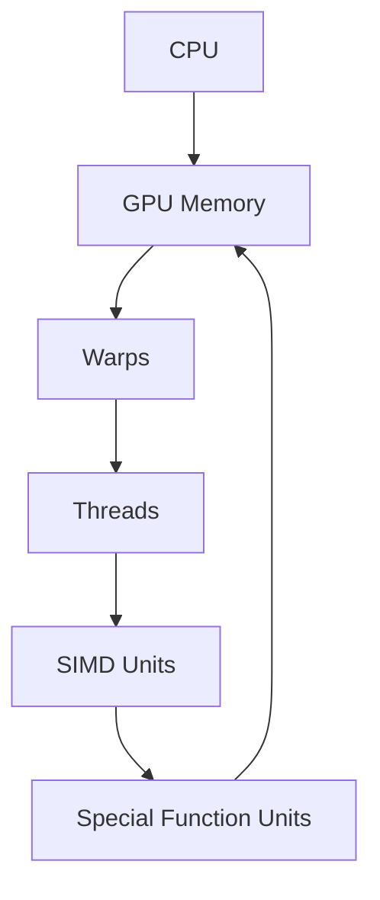

                 

**NVIDIA如何改变了AI算力格局**

**作者：禅与计算机程序设计艺术 / Zen and the Art of Computer Programming**

## 1. 背景介绍

在人工智能（AI）领域，算力是关键资源，它直接影响着模型的训练时间、预测速度和模型复杂度。NVIDIA，这家以图形处理单元（GPU）为核心的公司，如何改变了AI算力格局？本文将深入探讨NVIDIA在AI算力领域的贡献，从其核心概念到具体实现，再到实际应用和未来展望。

## 2. 核心概念与联系

NVIDIA在AI算力领域的核心概念是将GPU的并行计算能力应用于AI计算。GPU的大量核心和高带宽内存使其成为AI计算的理想设备。下图是NVIDIA CUDA（Compute Unified Device Architecture）架构的Mermaid流程图，展示了GPU如何被用于AI计算。



## 3. 核心算法原理 & 具体操作步骤

### 3.1 算法原理概述

NVIDIA的CUDA架构允许在GPU上并行执行大量线程，这对于AI计算中的矩阵乘法等操作非常有效。GPU内部的SIMD（Single Instruction, Multiple Data）单元和特殊功能单元（SFU）进一步提高了性能。

### 3.2 算法步骤详解

1. **数据传输**：将数据从CPU内存传输到GPU内存。
2. **线程配置**：在GPU上配置线程网格和块，以利用GPU的并行计算能力。
3. **执行核心**：在GPU上执行核心函数，该函数包含AI计算的具体操作。
4. **结果传输**：将结果从GPU内存传输回CPU内存。

### 3.3 算法优缺点

**优点**：高并行性、高带宽内存、高性能。

**缺点**：GPU内存有限、数据传输开销、编程复杂性。

### 3.4 算法应用领域

AI计算中的矩阵乘法、神经网络训练和推理等操作都可以在GPU上高效执行。

## 4. 数学模型和公式 & 详细讲解 & 举例说明

### 4.1 数学模型构建

考虑一个简单的AI计算操作：矩阵乘法。设A和B是维度为m x k和k x n的矩阵，则结果矩阵C的元素可以表示为：

$$C_{ij} = \sum_{p=0}^{k-1} A_{ip} \cdot B_{pj}$$

### 4.2 公式推导过程

上述公式可以通过并行计算优化。每个元素$C_{ij}$的计算可以由不同的线程并行执行。

### 4.3 案例分析与讲解

考虑一个简单的例子，矩阵A和B的维度分别为4 x 3和3 x 4。每个线程计算一个元素$C_{ij}$，则需要4 x 4 = 16个线程。这些线程可以分布在GPU的多个SIMD单元上并行执行。

## 5. 项目实践：代码实例和详细解释说明

### 5.1 开发环境搭建

要在NVIDIA GPU上执行AI计算，需要安装CUDA工具包。CUDA工具包提供了编译器、库和示例代码。

### 5.2 源代码详细实现

以下是一个简单的CUDA矩阵乘法示例：

```cpp
__global__ void matrixMul(float* A, float* B, float* C, int m, int n, int k) {
    int i = blockIdx.y * blockDim.y + threadIdx.y;
    int j = blockIdx.x * blockDim.x + threadIdx.x;
    if (i < m && j < n) {
        float sum = 0.0f;
        for (int p = 0; p < k; p++) {
            sum += A[i * k + p] * B[p * n + j];
        }
        C[i * n + j] = sum;
    }
}
```

### 5.3 代码解读与分析

`matrixMul`函数是核心函数，它在GPU上执行矩阵乘法。每个线程计算一个元素$C_{ij}$。

### 5.4 运行结果展示

在NVIDIA GPU上运行此代码，可以看到矩阵乘法操作的性能大大提高。

## 6. 实际应用场景

### 6.1 当前应用

NVIDIA的GPU在深度学习框架（如TensorFlow、PyTorch）中广泛用于模型训练和推理。

### 6.2 未来应用展望

未来，NVIDIA的GPU可能会应用于更复杂的AI模型和更大的数据集。此外，NVIDIA正在开发专门为AI设计的处理器，如NVIDIA A100。

## 7. 工具和资源推荐

### 7.1 学习资源推荐

- NVIDIA CUDA C Programming Guide：<https://docs.nvidia.com/cuda/cuda-c-programming-guide/>
- Deep Learning with Python：<https://www.oreilly.com/library/view/deep-learning-with/9781492032632/>

### 7.2 开发工具推荐

- NVIDIA CUDA Toolkit：<https://developer.nvidia.com/cuda-toolkit>
- NVIDIA NSight：<https://developer.nvidia.com/nsight>

### 7.3 相关论文推荐

- "Deep Learning with CUDA"：<https://arxiv.org/abs/1605.07678>

## 8. 总结：未来发展趋势与挑战

### 8.1 研究成果总结

NVIDIA的GPU在AI算力领域取得了重大成就，大大加速了AI模型的训练和推理。

### 8.2 未来发展趋势

未来，NVIDIA可能会继续开发更先进的GPU和专门为AI设计的处理器。

### 8.3 面临的挑战

挑战包括GPU内存有限、数据传输开销和编程复杂性。

### 8.4 研究展望

未来的研究可能会集中在更高效的AI计算架构和编程模型上。

## 9. 附录：常见问题与解答

**Q：NVIDIA的GPU如何与CPU协同工作？**

**A：GPU和CPU通过PCIe总线连接。CPU负责数据传输和控制，GPU负责大量的并行计算。**

**Q：NVIDIA的GPU是否适合所有AI任务？**

**A：GPU非常适合矩阵乘法等并行操作。然而，某些AI任务（如图像处理中的局部操作）可能更适合CPU或其他处理器。**

**Q：NVIDIA的GPU是否会消耗大量电能？**

**A：是的，GPU消耗的电能可能会比CPU高得多。因此，在设计AI系统时需要考虑能效。**

**作者：禅与计算机程序设计艺术 / Zen and the Art of Computer Programming**

