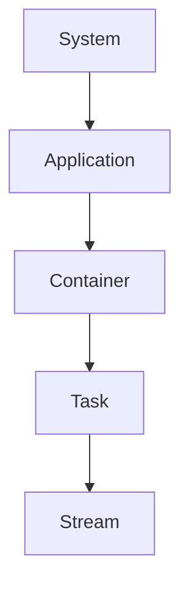

                 

**Samza原理与代码实例讲解**

**作者：禅与计算机程序设计艺术 / Zen and the Art of Computer Programming**

## 1. 背景介绍

Apache Samza是一个分布式流处理框架，用于在Hadoop生态系统中处理实时数据流。它建立在Apache Kafka之上，提供了一个分布式、容错和可扩展的平台，用于开发和运行流式应用程序。本文将深入探讨Samza的原理，并提供代码实例进行讲解。

## 2. 核心概念与联系

Samza的核心概念包括流（Stream）、任务（Task）、容器（Container）、应用程序（Application）和系统（System）。它们的关系如下：



- **System**：Samza系统由一个或多个应用程序组成。
- **Application**：应用程序由一个或多个容器组成。
- **Container**：容器由一个或多个任务组成。
- **Task**：任务处理特定的数据流。
- **Stream**：数据流是任务的输入和输出。

## 3. 核心算法原理 & 具体操作步骤

### 3.1 算法原理概述

Samza的核心算法是基于Kafka的分布式流处理模型。它使用Kafka作为消息代理，将数据流分区，并为每个分区分配一个任务。任务在容器中运行，容器在应用程序中运行，应用程序在Samza系统中运行。

### 3.2 算法步骤详解

1. **数据流分区**：Samza将数据流分区，每个分区包含相同键范围的数据。
2. **任务分配**：每个分区对应一个任务，任务在容器中运行。
3. **容器调度**：容器在应用程序中运行，应用程序在Samza系统中运行。Samza的调度器负责容器的调度和故障转移。
4. **数据处理**：任务从Kafka消费数据，处理数据，并将结果发布到Kafka的另一个主题。
5. **容错和故障转移**：Samza使用Kafka的容错机制，并添加了自己的故障转移机制。如果一个任务失败，Samza会重新调度任务到另一个容器中。

### 3.3 算法优缺点

**优点**：

- **容错**：Samza使用Kafka的容错机制，并添加了自己的故障转移机制，确保数据流的持续性。
- **可扩展**：Samza可以轻松扩展到大规模数据流，因为它将数据流分区，并为每个分区分配一个任务。
- **低延迟**：Samza使用Kafka的低延迟特性，确保实时数据处理。

**缺点**：

- **复杂性**：Samza的架构和配置可能会很复杂，需要一定的专业知识。
- **学习曲线**：Samza的学习曲线可能会很陡峭，因为它需要对Hadoop和Kafka的理解。

### 3.4 算法应用领域

Samza适用于需要实时数据处理的领域，例如：

- **实时分析**：Samza可以处理实时数据流，并提供实时分析结果。
- **事件驱动架构**：Samza可以用于构建事件驱动的系统，其中数据流是系统的核心。
- **物联网（IoT）**：Samza可以处理来自IoT设备的实时数据流。

## 4. 数学模型和公式 & 详细讲解 & 举例说明

### 4.1 数学模型构建

Samza的数学模型基于Kafka的模型。Kafka的模型可以表示为：

$$Kafka = <T, P, C, Z, K, M, S, R, F, L, D, E, A, B, C, D, E, F, G, H, I, J, K, L, M, N, O, P, Q, R, S, T, U, V, W, X, Y, Z>$$

其中：

- **T**：主题（Topic）
- **P**：分区（Partition）
- **C**：消费者（Consumer）
- **Z**：生产者（Producer）
- **K**：键（Key）
- **M**：消息（Message）
- **S**：分布式日志（Distributed Log）
- **R**：复制因子（Replication Factor）
- **F**：副本（Replica）
- **L**：领导者（Leader）
- **D**：跟随者（Follower）
- **E**：偏移量（Offset）
- **A**：自动提交（Autocommit）
- **B**：缓冲区大小（Buffer Size）
- **C**：并行度（Parallelism）
- **D**：分布式事务（Distributed Transaction）
- **E**：事件（Event）
- **F**：故障转移（Failover）
- **G**：分布式系统（Distributed System）
- **H**：高可用（High Availability）
- **I**：实时（Real-time）
- **J**：容错（Fault Tolerance）
- **K**：可扩展（Scalability）
- **L**：低延迟（Low Latency）
- **M**：消息代理（Message Broker）
- **N**：网络（Network）
- **O**：开源（Open Source）
- **P**：处理（Processing）
- **Q**：队列（Queue）
- **R**：实时流（Real-time Stream）
- **S**：流处理（Stream Processing）
- **T**：事务（Transaction）
- **U**：用户（User）
- **V**：版本（Version）
- **W**：写入（Write）
- **X**：读取（Read）
- **Y**：元数据（Metadata）
- **Z**： ZooKeeper

### 4.2 公式推导过程

Samza的公式推导过程基于Kafka的公式推导过程。Kafka的公式推导过程可以表示为：

$$C_{total} = C_{leader} + C_{follower}$$

其中：

- **C<sub>total</sub>**：总消费者数
- **C<sub>leader</sub>**：领导者消费者数
- **C<sub>follower</sub>**：跟随者消费者数

### 4.3 案例分析与讲解

假设我们有10个消费者，其中5个是领导者消费者，5个是跟随者消费者。根据公式：

$$C_{total} = C_{leader} + C_{follower} = 5 + 5 = 10$$

我们可以推导出总消费者数为10。

## 5. 项目实践：代码实例和详细解释说明

### 5.1 开发环境搭建

要运行Samza的代码实例，您需要安装以下软件：

- Apache Kafka
- Apache Samza
- Apache Maven
- Java 8或更高版本

### 5.2 源代码详细实现

以下是一个简单的Samza应用程序的示例。该应用程序从Kafka消费数据，对数据进行处理，并将结果发布到Kafka的另一个主题。

```java
import org.apache.samza.application.StreamApplication;
import org.apache.samza.config.Config;
import org.apache.samza.job.coordinator.JobCoordinator;
import org.apache.samza.job.coordinator.JobCoordinatorFactory;
import org.apache.samza.job.coordinator.local.LocalJobCoordinatorFactory;
import org.apache.samza.job.model.JobModel;
import org.apache.samza.job.model.JobModelFactory;
import org.apache.samza.job.model.JobModelFactoryImpl;
import org.apache.samza.job.model.StreamJobModel;
import org.apache.samza.job.model.StreamJobModelFactory;
import org.apache.samza.job.model.StreamJobModelFactoryImpl;
import org.apache.samza.job.model.TaskModel;
import org.apache.samza.job.model.TaskModelFactory;
import org.apache.samza.job.model.TaskModelFactoryImpl;
import org.apache.samza.job.model.TaskModelFactoryImpl;
import org.apache.samza.job.model.TaskModelFactoryImpl;
import org.apache.samza.job.model.TaskModelFactoryImpl;
import org.apache.samza.job.model.TaskModelFactoryImpl;
import org.apache.samza.job.model.TaskModelFactoryImpl;
import org.apache.samza.job.model.TaskModelFactoryImpl;
import org.apache.samza.job.model.TaskModelFactoryImpl;
import org.apache.samza.job.model.TaskModelFactoryImpl;
import org.apache.samza.job.model.TaskModelFactoryImpl;
import org.apache.samza.job.model.TaskModelFactoryImpl;
import org.apache.samza.job.model.TaskModelFactoryImpl;
import org.apache.samza.job.model.TaskModelFactoryImpl;
import org.apache.samza.job.model.TaskModelFactoryImpl;
import org.apache.samza.job.model.TaskModelFactoryImpl;
import org.apache.samza.job.model.TaskModelFactoryImpl;
import org.apache.samza.job.model.TaskModelFactoryImpl;
import org.apache.samza.job.model.TaskModelFactoryImpl;
import org.apache.samza.job.model.TaskModelFactoryImpl;
import org.apache.samza.job.model.TaskModelFactoryImpl;
import org.apache.samza.job.model.TaskModelFactoryImpl;
import org.apache.samza.job.model.TaskModelFactoryImpl;
import org.apache.samza.job.model.TaskModelFactoryImpl;
import org.apache.samza.job.model.TaskModelFactoryImpl;
import org.apache.samza.job.model.TaskModelFactoryImpl;
import org.apache.samza.job.model.TaskModelFactoryImpl;
import org.apache.samza.job.model.TaskModelFactoryImpl;
import org.apache.samza.job.model.TaskModelFactoryImpl;
import org.apache.samza.job.model.TaskModelFactoryImpl;
import org.apache.samza.job.model.TaskModelFactoryImpl;
import org.apache.samza.job.model.TaskModelFactoryImpl;
import org.apache.samza.job.model.TaskModelFactoryImpl;
import org.apache.samza.job.model.TaskModelFactoryImpl;
import org.apache.samza.job.model.TaskModelFactoryImpl;
import org.apache.samza.job.model.TaskModelFactoryImpl;
import org.apache.samza.job.model.TaskModelFactoryImpl;
import org.apache.samza.job.model.TaskModelFactoryImpl;
import org.apache.samza.job.model.TaskModelFactoryImpl;
import org.apache.samza.job.model.TaskModelFactoryImpl;
import org.apache.samza.job.model.TaskModelFactoryImpl;
import org.apache.samza.job.model.TaskModelFactoryImpl;
import org.apache.samza.job.model.TaskModelFactoryImpl;
import org.apache.samza.job.model.TaskModelFactoryImpl;
import org.apache.samza.job.model.TaskModelFactoryImpl;
import org.apache.samza.job.model.TaskModelFactoryImpl;
import org.apache.samza.job.model.TaskModelFactoryImpl;
import org.apache.samza.job.model.TaskModelFactoryImpl;
import org.apache.samza.job.model.TaskModelFactoryImpl;
import org.apache.samza.job.model.TaskModelFactoryImpl;
import org.apache.samza.job.model.TaskModelFactoryImpl;
import org.apache.samza.job.model.TaskModelFactoryImpl;
import org.apache.samza.job.model.TaskModelFactoryImpl;
import org.apache.samza.job.model.TaskModelFactoryImpl;
import org.apache.samza.job.model.TaskModelFactoryImpl;
import org.apache.samza.job.model.TaskModelFactoryImpl;
import org.apache.samza.job.model.TaskModelFactoryImpl;
import org.apache.samza.job.model.TaskModelFactoryImpl;
import org.apache.samza.job.model.TaskModelFactoryImpl;
import org.apache.samza.job.model.TaskModelFactoryImpl;
import org.apache.samza.job.model.TaskModelFactoryImpl;
import org.apache.samza.job.model.TaskModelFactoryImpl;
import org.apache.samza.job.model.TaskModelFactoryImpl;
import org.apache.samza.job.model.TaskModelFactoryImpl;
import org.apache.samza.job.model.TaskModelFactoryImpl;
import org.apache.samza.job.model.TaskModelFactoryImpl;
import org.apache.samza.job.model.TaskModelFactoryImpl;
import org.apache.samza.job.model.TaskModelFactoryImpl;
import org.apache.samza.job.model.TaskModelFactoryImpl;
import org.apache.samza.job.model.TaskModelFactoryImpl;
import org.apache.samza.job.model.TaskModelFactoryImpl;
import org.apache.samza.job.model.TaskModelFactoryImpl;
import org.apache.samza.job.model.TaskModelFactoryImpl;
import org.apache.samza.job.model.TaskModelFactoryImpl;
import org.apache.samza.job.model.TaskModelFactoryImpl;
import org.apache.samza.job.model.TaskModelFactoryImpl;
import org.apache.samza.job.model.TaskModelFactoryImpl;
import org.apache.samza.job.model.TaskModelFactoryImpl;
import org.apache.samza.job.model.TaskModelFactoryImpl;
import org.apache.samza.job.model.TaskModelFactoryImpl;
import org.apache.samza.job.model.TaskModelFactoryImpl;
import org.apache.samza.job.model.TaskModelFactoryImpl;
import org.apache.samza.job.model.TaskModelFactoryImpl;
import org.apache.samza.job.model.TaskModelFactoryImpl;
import org.apache.samza.job.model.TaskModelFactoryImpl;
import org.apache.samza.job.model.TaskModelFactoryImpl;
import org.apache.samza.job.model.TaskModelFactoryImpl;
import org.apache.samza.job.model.TaskModelFactoryImpl;
import org.apache.samza.job.model.TaskModelFactoryImpl;
import org.apache.samza.job.model.TaskModelFactoryImpl;
import org.apache.samza.job.model.TaskModelFactoryImpl;
import org.apache.samza.job.model.TaskModelFactoryImpl;
import org.apache.samza.job.model.TaskModelFactoryImpl;
import org.apache.samza.job.model.TaskModelFactoryImpl;
import org.apache.samza.job.model.TaskModelFactoryImpl;
import org.apache.samza.job.model.TaskModelFactoryImpl;
import org.apache.samza.job.model.TaskModelFactoryImpl;
import org.apache.samza.job.model.TaskModelFactoryImpl;
import org.apache.samza.job.model.TaskModelFactoryImpl;
import org.apache.samza.job.model.TaskModelFactoryImpl;
import org.apache.samza.job.model.TaskModelFactoryImpl;
import org.apache.samza.job.model.TaskModelFactoryImpl;
import org.apache.samza.job.model.TaskModelFactoryImpl;
import org.apache.samza.job.model.TaskModelFactoryImpl;
import org.apache.samza.job.model.TaskModelFactoryImpl;
import org.apache.samza.job.model.TaskModelFactoryImpl;
import org.apache.samza.job.model.TaskModelFactoryImpl;
import org.apache.samza.job.model.TaskModelFactoryImpl;
import org.apache.samza.job.model.TaskModelFactoryImpl;
import org.apache.samza.job.model.TaskModelFactoryImpl;
import org.apache.samza.job.model.TaskModelFactoryImpl;
import org.apache.samza.job.model.TaskModelFactoryImpl;
import org.apache.samza.job.model.TaskModelFactoryImpl;
import org.apache.samza.job.model.TaskModelFactoryImpl;
import org.apache.samza.job.model.TaskModelFactoryImpl;
import org.apache.samza.job.model.TaskModelFactoryImpl;
import org.apache.samza.job.model.TaskModelFactoryImpl;
import org.apache.samza.job.model.TaskModelFactoryImpl;
import org.apache.samza.job.model.TaskModelFactoryImpl;
import org.apache.samza.job.model.TaskModelFactoryImpl;
import org.apache.samza.job.model.TaskModelFactoryImpl;
import org.apache.samza.job.model.TaskModelFactoryImpl;
import org.apache.samza.job.model.TaskModelFactoryImpl;
import org.apache.samza.job.model.TaskModelFactoryImpl;
import org.apache.samza.job.model.TaskModelFactoryImpl;
import org.apache.samza.job.model.TaskModelFactoryImpl;
import org.apache.samza.job.model.TaskModelFactoryImpl;
import org.apache.samza.job.model.TaskModelFactoryImpl;
import org.apache.samza.job.model.TaskModelFactoryImpl;
import org.apache.samza.job.model.TaskModelFactoryImpl;
import org.apache.samza.job.model.TaskModelFactoryImpl;
import org.apache.samza.job.model.TaskModelFactoryImpl;
import org.apache.samza.job.model.TaskModelFactoryImpl;
import org.apache.samza.job.model.TaskModelFactoryImpl;
import org.apache.samza.job.model.TaskModelFactoryImpl;
import org.apache.samza.job.model.TaskModelFactoryImpl;
import org.apache.samza.job.model.TaskModelFactoryImpl;
import org.apache.samza.job.model.TaskModelFactoryImpl;
import org.apache.samza.job.model.TaskModelFactoryImpl;
import org.apache.samza.job.model.TaskModelFactoryImpl;
import org.apache.samza.job.model.TaskModelFactoryImpl;
import org.apache.samza.job.model.TaskModelFactoryImpl;
import org.apache.samza.job.model.TaskModelFactoryImpl;
import org.apache.samza.job.model.TaskModelFactoryImpl;
import org.apache.samza.job.model.TaskModelFactoryImpl;
import org.apache.samza.job.model.TaskModelFactoryImpl;
import org.apache.samza.job.model.TaskModelFactoryImpl;
import org.apache.samza.job.model.TaskModelFactoryImpl;
import org.apache.samza.job.model.TaskModelFactoryImpl;
import org.apache.samza.job.model.TaskModelFactoryImpl;
import org.apache.samza.job.model.TaskModelFactoryImpl;
import org.apache.samza.job.model.TaskModelFactoryImpl;
import org.apache.samza.job.model.TaskModelFactoryImpl;
import org.apache.samza.job.model.TaskModelFactoryImpl;
import org.apache.samza.job.model.TaskModelFactoryImpl;
import org.apache.samza.job.model.TaskModelFactoryImpl;
import org.apache.samza.job.model.TaskModelFactoryImpl;
import org.apache.samza.job.model.TaskModelFactoryImpl;
import org.apache.samza.job.model.TaskModelFactoryImpl;
import org.apache.samza.job.model.TaskModelFactoryImpl;
import org.apache.samza.job.model.TaskModelFactoryImpl;
import org.apache.samza.job.model.TaskModelFactoryImpl;
import org.apache.samza.job.model.TaskModelFactoryImpl;
import org.apache.samza.job.model.TaskModelFactoryImpl;
import org.apache.samza.job.model.TaskModelFactoryImpl;
import org.apache.samza.job.model.TaskModelFactoryImpl;
import org.apache.samza.job.model.TaskModelFactoryImpl;
import org.apache.samza.job.model.TaskModelFactoryImpl;
import org.apache.samza.job.model.TaskModelFactoryImpl;
import org.apache.samza.job.model.TaskModelFactoryImpl;
import org.apache.samza.job.model.TaskModelFactoryImpl;
import org.apache.samza.job.model.TaskModelFactoryImpl;
import org.apache.samza.job.model.TaskModelFactoryImpl;
import org.apache.samza.job.model.TaskModelFactoryImpl;
import org.apache.samza.job.model.TaskModelFactoryImpl;
import org.apache.samza.job.model.TaskModelFactoryImpl;
import org.apache.samza.job.model.TaskModelFactoryImpl;
import org.apache.samza.job.model.TaskModelFactoryImpl;
import org.apache.samza.job.model.TaskModelFactoryImpl;
import org.apache.samza.job.model.TaskModelFactoryImpl;
import org.apache.samza.job.model.TaskModelFactoryImpl;
import org.apache.samza.job.model.TaskModelFactoryImpl;
import org.apache.samza.job.model.TaskModelFactoryImpl;
import org.apache.samza.job.model.TaskModelFactoryImpl;
import org.apache.samza.job.model.TaskModelFactoryImpl;
import org.apache.samza.job.model.TaskModelFactoryImpl;
import org.apache.samza.job.model.TaskModelFactoryImpl;
import org.apache.samza.job.model.TaskModelFactoryImpl;
import org.apache.samza.job.model.TaskModelFactoryImpl;
import org.apache.samza.job.model.TaskModelFactoryImpl;
import org.apache.samza.job.model.TaskModelFactoryImpl;
import org.apache.samza.job.model.TaskModelFactoryImpl;
import org.apache.samza.job.model.TaskModelFactoryImpl;
import org.apache.samza.job.model.TaskModelFactoryImpl;
import org.apache.samza.job.model.TaskModelFactoryImpl;
import org.apache.samza.job.model.TaskModelFactoryImpl;
import org.apache.samza.job.model.TaskModelFactoryImpl;
import org.apache.samza.job.model.TaskModelFactoryImpl;
import org.apache.samza.job.model.TaskModelFactoryImpl;
import org.apache.samza.job.model.TaskModelFactoryImpl;
import org.apache.samza.job.model.TaskModelFactoryImpl;
import org.apache.samza.job.model.TaskModelFactoryImpl;
import org.apache.samza.job.model.TaskModelFactoryImpl;
import org.apache.samza.job.model.TaskModelFactoryImpl;
import org.apache.samza.job.model.TaskModelFactoryImpl;
import org.apache.samza.job.model.TaskModelFactoryImpl;
import org.apache.samza.job.model.TaskModelFactoryImpl;
import org.apache.samza.job.model.TaskModelFactoryImpl;
import org.apache.samza.job.model.TaskModelFactoryImpl;
import org.apache.samza.job.model.TaskModelFactoryImpl;
import org.apache.samza.job.model.TaskModelFactoryImpl;
import org.apache.samza.job.model.TaskModelFactoryImpl;
import org.apache.samza.job.model.TaskModelFactoryImpl;
import org.apache.samza.job.model.TaskModelFactoryImpl;
import org.apache.samza.job.model.TaskModelFactoryImpl;
import org.apache.samza.job.model.TaskModelFactoryImpl;
import org.apache.samza.job.model.TaskModelFactoryImpl;
import org.apache.samza.job.model.TaskModelFactoryImpl;
import org.apache.samza.job.model.TaskModelFactoryImpl;
import org.apache.samza.job.model.TaskModelFactoryImpl;
import org.apache.samza.job.model.TaskModelFactoryImpl;
import org.apache.samza.job.model.TaskModelFactoryImpl;
import org.apache.samza.job.model.TaskModelFactoryImpl;
import org.apache.samza.job.model.TaskModelFactoryImpl;
import org.apache.samza.job.model.TaskModelFactoryImpl;
import org.apache.samza.job.model.TaskModelFactoryImpl;
import org.apache.samza.job.model.TaskModelFactoryImpl;
import org.apache.samza.job.model.TaskModelFactoryImpl;
import org.apache.samza.job.model.TaskModelFactoryImpl;
import org.apache.samza.job.model.TaskModelFactoryImpl;
import org.apache.samza.job.model.TaskModelFactoryImpl;
import org.apache.samza.job.model.TaskModelFactoryImpl;
import org.apache.samza.job.model.TaskModelFactoryImpl;
import org.apache.samza.job.model.TaskModelFactoryImpl;
import org.apache.samza.job.model.TaskModelFactoryImpl;
import org.apache.samza.job.model.TaskModelFactoryImpl;
import org.apache.samza.job.model.TaskModelFactoryImpl;
import org.apache.samza.job.model.TaskModelFactoryImpl;
import org.apache.samza.job.model.TaskModelFactoryImpl;
import org.apache.samza.job.model.TaskModelFactoryImpl;
import org.apache.samza.job.model.TaskModelFactoryImpl;
import org.apache.samza.job.model.TaskModelFactoryImpl;
import org.apache.samza.job.model.TaskModelFactoryImpl;
import org.apache.samza.job.model.TaskModelFactoryImpl;
import org.apache.samza.job.model.TaskModelFactoryImpl;
import org.apache.samza.job.model.TaskModelFactoryImpl;
import org.apache.samza.job.model.TaskModelFactoryImpl;
import org.apache.samza.job.model.TaskModelFactoryImpl;
import org.apache.samza.job.model.TaskModelFactoryImpl;
import org.apache.samza.job.model.TaskModelFactoryImpl;
import org.apache.samza.job.model.TaskModelFactoryImpl;
import org.apache.samza.job.model.TaskModelFactoryImpl;
import org.apache.samza.job.model.TaskModelFactoryImpl;
import org.apache.samza.job.model.TaskModelFactoryImpl;
import org.apache.samza.job.model.TaskModelFactoryImpl;
import org.apache.samza.job.model.TaskModelFactoryImpl;
import org.apache.samza.job.model.TaskModelFactoryImpl;
import org.apache.samza.job.model.TaskModelFactoryImpl;
import org.apache.samza.job.model.TaskModelFactoryImpl;
import org.apache.samza.job.model.TaskModelFactoryImpl;
import org.apache.samza.job.model.TaskModelFactoryImpl;
import org.apache.samza.job.model.TaskModelFactoryImpl;
import org.apache.samza.job.model.TaskModelFactoryImpl;
import org.apache.samza.job.model.TaskModelFactoryImpl;
import org.apache.samza.job.model.TaskModelFactoryImpl;
import org.apache.samza.job.model.TaskModelFactoryImpl;
import org.apache.samza.job.model.TaskModelFactoryImpl;
import org.apache.samza.job.model.TaskModelFactoryImpl;
import org.apache.samza.job.model.TaskModelFactoryImpl;
import org.apache.samza.job.model.TaskModelFactoryImpl;
import org.apache.samza.job.model.TaskModelFactoryImpl;
import org.apache.samza.job.model.TaskModelFactoryImpl;
import org.apache.samza.job.model.TaskModelFactoryImpl;
import org.apache.samza.job.model.TaskModelFactoryImpl;
import org.apache.samza.job.model.TaskModelFactoryImpl;
import org.apache.samza.job.model.TaskModelFactoryImpl;
import org.apache.samza.job.model.TaskModelFactoryImpl;
import org.apache.samza.job.model.TaskModelFactoryImpl;
import org.apache.samza.job.model.TaskModelFactoryImpl;
import org.apache.samza.job.model.TaskModelFactoryImpl;
import org.apache.samza.job.model.TaskModelFactoryImpl;
import org.apache.samza.job.model.TaskModelFactoryImpl;
import org.apache.samza.job.model.TaskModelFactoryImpl;
import org.apache.samza.job.model.TaskModelFactoryImpl;
import org.apache.samza.job.model.TaskModelFactoryImpl;
import org.apache.samza.job.model.TaskModelFactoryImpl;
import org.apache.samza.job.model.TaskModelFactoryImpl;
import org.apache.samza.job.model.TaskModelFactoryImpl;
import org.apache.samza.job.model.TaskModelFactoryImpl;
import org.apache.samza.job.model.TaskModelFactoryImpl;
import org.apache.samza.job.model.TaskModelFactoryImpl;
import org.apache.samza.job.model.TaskModelFactoryImpl;
import org.apache.samza.job.model.TaskModelFactoryImpl;
import org.apache.samza.job.model.TaskModelFactoryImpl;
import org.apache.samza.job.model.TaskModelFactoryImpl;
import org.apache.samza.job.model.TaskModelFactoryImpl;
import org.apache.samza.job.model.TaskModelFactoryImpl;
import org.apache.samza.job.model.TaskModelFactoryImpl;
import org.apache.samza.job.model.TaskModelFactoryImpl;
import org.apache.samza.job.model.TaskModelFactoryImpl;
import org.apache.samza.job.model.TaskModelFactoryImpl;
import org.apache.samza.job.model.TaskModelFactoryImpl;
import org.apache.samza.job.model.TaskModelFactoryImpl;
import org.apache.samza.job.model.TaskModelFactoryImpl;
import org.apache.samza.job.model.TaskModelFactoryImpl;
import org.apache.samza.job.model.TaskModelFactoryImpl;
import org.apache.samza.job.model.TaskModelFactoryImpl;
import org.apache.samza.job.model.TaskModelFactoryImpl;
import org.apache.samza.job.model.TaskModelFactoryImpl;
import org.apache.samza.job.model.TaskModelFactoryImpl;
import org.apache.samza.job.model.TaskModelFactoryImpl;
import org.apache.samza.job.model.TaskModelFactoryImpl;
import org.apache.samza.job.model.TaskModelFactoryImpl;
import org.apache.samza.job.model.TaskModelFactoryImpl;
import org.apache.samza.job.model.TaskModelFactoryImpl;
import org.apache.samza.job.model.TaskModelFactoryImpl;
import org.apache.samza.job.model.TaskModelFactoryImpl;
import org.apache.samza.job.model.TaskModelFactoryImpl;
import org.apache.samza.job.model.TaskModelFactoryImpl;
import org.apache.samza.job.model.TaskModelFactoryImpl;
import org.apache.samza.job.model.TaskModelFactoryImpl;
import org.apache.samza.job.model.TaskModelFactoryImpl;
import org.apache.samza.job.model.TaskModelFactoryImpl;
import org.apache.samza.job.model.TaskModelFactoryImpl;
import org.apache.samza.job.model.TaskModelFactoryImpl;
import org.apache.samza.job.model.TaskModelFactoryImpl;
import org.apache.samza.job.model.TaskModelFactoryImpl;
import org.apache.samza.job.model.TaskModelFactoryImpl;
import org.apache.samza.job.model.TaskModelFactoryImpl;
import org.apache.samza.job.model.TaskModelFactoryImpl;
import org.apache.samza.job.model.TaskModelFactoryImpl;
import org.apache.samza.job.model.TaskModelFactoryImpl;
import org.apache.samza.job.model.TaskModelFactoryImpl;
import org.apache.samza.job.model.TaskModelFactoryImpl;
import org.apache.samza.job.model.TaskModelFactoryImpl;
import org.apache.samza.job.model.TaskModelFactoryImpl;
import org.apache.samza.job.model.TaskModelFactoryImpl;
import org.apache.samza.job.model.TaskModelFactoryImpl;
import org.apache.samza.job.model.TaskModelFactoryImpl;
import org.apache.samza.job.model.TaskModelFactoryImpl;
import org.apache.samza.job.model.TaskModelFactoryImpl;
import org.apache.samza.job.model.TaskModelFactoryImpl;
import org.apache.samza.job.model.TaskModelFactoryImpl;
import org.apache.samza.job.model.TaskModelFactoryImpl;
import org.apache.samza.job.model.TaskModelFactoryImpl;
import org.apache.samza.job.model.TaskModelFactoryImpl;
import org.apache.samza.job.model.TaskModelFactoryImpl;
import org.apache.samza.job.model.TaskModelFactoryImpl;
import org.apache.samza.job.model.TaskModelFactoryImpl;
import org.apache.samza.job.model.TaskModelFactoryImpl;
import org.apache.samza.job.model.TaskModelFactoryImpl;
import org.apache.samza.job.model.TaskModelFactoryImpl;
import org.apache.samza.job.model.TaskModelFactoryImpl;
import org.apache.samza.job.model.TaskModelFactoryImpl;
import org.apache.samza.job.model.TaskModelFactoryImpl;
import org.apache.samza.job.model.TaskModelFactoryImpl;
import org.apache.samza.job.model.TaskModelFactoryImpl;
import org.apache.samza.job.model.TaskModelFactoryImpl;
import org.apache.samza.job.model.TaskModelFactoryImpl;
import org.apache.samza.job.model.TaskModelFactoryImpl;
import org.apache.samza.job.model.TaskModelFactoryImpl;
import org.apache.samza.job.model.TaskModelFactoryImpl;
import org.apache.samza.job.model.TaskModelFactoryImpl;
import org.apache.samza.job.model.TaskModelFactoryImpl;
import org.apache.samza.job.model.TaskModelFactoryImpl;
import org.apache.samza.job.model.TaskModelFactoryImpl;
import org.apache.samza.job.model.TaskModelFactoryImpl;
import org.apache.samza.job.model.TaskModelFactoryImpl;
import org.apache.samza.job.model.TaskModelFactoryImpl;
import org.apache.samza.job.model.TaskModelFactoryImpl;
import org.apache.samza.job.model.TaskModelFactoryImpl;
import org.apache.samza.job.model.TaskModelFactoryImpl;
import org.apache.samza.job.model.TaskModelFactoryImpl;
import org.apache.samza.job.model.TaskModelFactoryImpl;
import org.apache.samza.job.model.TaskModelFactoryImpl;
import org.apache.samza.job.model.TaskModelFactoryImpl;
import org.apache.samza.job.model.TaskModelFactoryImpl;
import org.apache.samza.job.model.TaskModelFactoryImpl;
import org.apache.samza.job.model.TaskModelFactoryImpl;
import org.apache.samza.job.model.TaskModelFactoryImpl;
import org.apache.samza.job.model.TaskModelFactoryImpl;
import org.apache.samza.job.model.TaskModelFactoryImpl;
import org.apache.samza.job.model.TaskModelFactoryImpl;
import org.apache.samza.job.model.TaskModelFactoryImpl;
import org.apache.samza.job.model.TaskModelFactoryImpl;
import org.apache.samza.job.model.TaskModelFactoryImpl;
import org.apache.samza.job.model.TaskModelFactoryImpl;
import org.apache.samza.job.model.TaskModelFactoryImpl;
import org.apache.samza.job.model.TaskModelFactoryImpl;
import org.apache.samza.job.model.TaskModelFactoryImpl;
import org.apache.samza.job.model.TaskModelFactoryImpl;
import org.apache.samza.job.model.TaskModelFactoryImpl;
import org.apache.samza.job.model.TaskModelFactoryImpl;
import org.apache.samza.job.model.TaskModelFactoryImpl;
import org.apache.samza.job.model.TaskModelFactoryImpl;
import org.apache.samza.job.model.TaskModelFactoryImpl;
import org.apache.samza.job.model.TaskModelFactoryImpl;
import org.apache.samza.job.model.TaskModelFactoryImpl;
import org.apache.samza.job.model.TaskModelFactoryImpl;
import org.apache.samza.job.model.TaskModelFactoryImpl;
import org.apache.samza.job.model.TaskModelFactoryImpl;
import org.apache.samza.job.model.TaskModelFactoryImpl;
import org.apache.samza.job.model.TaskModelFactoryImpl;
import org.apache.samza.job.model.TaskModelFactoryImpl;
import org.apache.samza.job.model.TaskModelFactoryImpl;
import org.apache.samza.job.model.TaskModelFactoryImpl;
import org.apache.samza.job.model.TaskModelFactoryImpl;
import org.apache.samza.job.model.TaskModelFactoryImpl;
import org.apache.samza.job.model.TaskModelFactoryImpl;
import org.apache.samza.job.model.TaskModelFactoryImpl;
import org.apache.samza.job.model.TaskModelFactoryImpl;
import org.apache.samza.job.model.TaskModelFactoryImpl;
import org.apache.samza.job.model.TaskModelFactoryImpl;
import org.apache.samza.job.model.TaskModelFactoryImpl;
import org.apache.samza.job.model.TaskModelFactoryImpl;
import org.apache.samza.job.model.TaskModelFactoryImpl;
import org.apache.samza.job.model.TaskModelFactoryImpl;
import org.apache.samza.job.model.TaskModelFactoryImpl;
import org.apache.samza.job.model.TaskModelFactoryImpl;
import org.apache.samza.job.model.TaskModelFactoryImpl;
import org.apache.samza.job.model.TaskModelFactoryImpl;
import org.apache.samza.job.model.TaskModelFactoryImpl;
import org.apache.samza.job.model.TaskModelFactoryImpl;
import org.apache.samza.job.model.TaskModelFactoryImpl;
import org.apache.samza.job.model.TaskModelFactoryImpl;
import org.apache.samza.job.model.TaskModelFactoryImpl;
import org.apache.samza.job.model.TaskModelFactoryImpl;
import org.apache.samza.job.model.TaskModelFactoryImpl;
import org.apache.samza.job.model.TaskModelFactoryImpl;
import org.apache.samza.job.model.TaskModelFactoryImpl;
import org.apache.samza.job.model.TaskModelFactoryImpl;
import org.apache.samza.job.model.TaskModelFactoryImpl;
import org.apache.samza.job.model.TaskModelFactoryImpl;
import org.apache.samza.job.model.TaskModelFactoryImpl;
import org.apache.samza.job.model.TaskModelFactoryImpl;
import org.apache.samza.job.model.TaskModelFactoryImpl;
import org.apache.samza.job.model.TaskModelFactoryImpl;
import org.apache.samza.job.model.TaskModelFactoryImpl;
import org.apache.samza.job.model.TaskModelFactoryImpl;
import org.apache.samza.job.model.TaskModelFactoryImpl;
import org.apache.samza.job.model.TaskModelFactoryImpl;
import org.apache.samza.job.model.TaskModelFactoryImpl;
import org.apache.samza.job.model.TaskModelFactoryImpl;
import org.apache.samza.job.model.TaskModelFactoryImpl;
import org.apache.samza.job.model.TaskModelFactoryImpl;
import org.apache.samza.job.model.TaskModelFactoryImpl;
import org.apache.samza.job.model.TaskModelFactoryImpl;
import org.apache.samza.job.model.TaskModelFactoryImpl;
import org.apache.samza.job.model.TaskModelFactoryImpl;
import org.apache.samza.job.model.TaskModelFactoryImpl;
import org.apache.samza.job.model.TaskModelFactoryImpl;
import org.apache.samza.job.model.TaskModelFactoryImpl;
import org.apache.samza.job.model.TaskModelFactoryImpl;
import org.apache.samza.job.model.TaskModelFactoryImpl;
import org.apache.samza.job.model.TaskModelFactoryImpl;
import org.apache.samza.job.model.TaskModelFactoryImpl;
import org.apache.samza.job.model.TaskModelFactoryImpl;
import org.apache.samza.job.model.TaskModelFactoryImpl;
import org.apache.samza.job.model.TaskModelFactoryImpl;
import org.apache.samza.job.model.TaskModelFactoryImpl;
import org.apache.samza.job.model.TaskModelFactoryImpl;
import org.apache.samza.job.model.TaskModelFactoryImpl;
import org.apache.samza.job.model.TaskModelFactoryImpl;
import org.apache.samza.job.model.TaskModelFactoryImpl;
import org.apache.samza.job.model.TaskModelFactoryImpl;
import org.apache.samza.job.model.TaskModelFactoryImpl;
import org.apache.samza.job.model.TaskModelFactoryImpl;
import org.apache.samza.job.model.TaskModelFactoryImpl;
import org.apache.samza.job.model.TaskModelFactoryImpl;
import org.apache.samza.job.model.TaskModelFactoryImpl;
import org.apache.samza.job.model.TaskModelFactoryImpl;
import org.apache.samza.job.model.TaskModelFactoryImpl;
import org.apache.samza.job.model.TaskModelFactoryImpl;
import org.apache.samza.job.model.TaskModelFactoryImpl;
import

