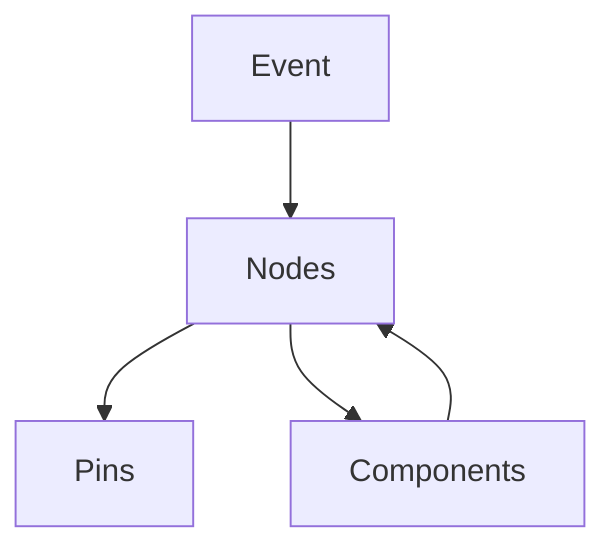

                 

**Unreal Engine Blueprints: Visual Scripting**

## 1. Background Introduction

Unreal Engine, developed by Epic Games, is a powerful and widely-used game engine that provides a comprehensive suite of tools for game development. One of its standout features is the Blueprints system, which enables visual scripting, making it accessible for non-programmers to create gameplay mechanics, user interfaces, and more. This article delves into the core concepts, algorithms, and practical applications of Unreal Engine Blueprints.

## 2. Core Concepts & Relationships

### 2.1 Key Concepts

- **Nodes**: The basic building blocks of a Blueprint graph, representing actions, values, or connections.
- **Pins**: Small circles on nodes that facilitate connections between nodes.
- **Graph**: The visual representation of a Blueprint, consisting of nodes and pins connected together.
- **Events**: Triggers that initiate the execution of a Blueprint's graph.
- **Components**: Reusable pieces of functionality that can be attached to Actors (game objects).

### 2.2 Blueprint Architecture

Here's a Mermaid flowchart illustrating the basic architecture of a Blueprint:

## 3. Core Algorithm & Operations

### 3.1 Algorithm Overview

Blueprints use a simple, event-driven algorithm. When an event occurs, the Blueprint's graph is executed, with nodes processing in a top-down, left-to-right order.

### 3.2 Algorithm Steps

1. An event triggers the Blueprint's graph.
2. The engine processes nodes from top to bottom, left to right.
3. Each node performs its action, passing data through pins as needed.
4. The graph's execution ends when there are no more nodes to process.

### 3.3 Algorithm Pros & Cons

**Pros**:
- Easy to understand and use, even for non-programmers.
- Visual representation makes debugging intuitive.
- Encourages modular, reusable code with Components.

**Cons**:
- Limited functionality compared to traditional programming.
- Can become complex and difficult to manage for large, intricate graphs.
- Performance may be impacted due to the interpretive nature of Blueprints.

### 3.4 Application Domains

Blueprints are widely used in game development for:
- Creating gameplay mechanics (e.g., AI behavior, player controls).
- Designing user interfaces (e.g., menus, HUD elements).
- Prototyping and rapid iteration.

## 4. Mathematical Models & Formulas

### 4.1 Mathematical Model

Blueprints can represent mathematical models using nodes that perform arithmetic operations. For instance, a simple linear equation can be represented as:

$$y = mx + b$$

### 4.2 Formula Derivation

In a Blueprint graph, this equation can be implemented using nodes for multiplication (`*`), addition (`+`), and constant values (`m`, `b`).

### 4.3 Case Study

Consider a Blueprint that calculates the distance between two actors using the formula:

$$d = \sqrt{(x_2 - x_1)^2 + (y_2 - y_1)^2 + (z_2 - z_1)^2}$$

## 5. Project Practice: Code Instance

### 5.1 Development Environment Setup

To follow along, ensure you have Unreal Engine installed and create a new Blueprint project.

### 5.2 Source Code Implementation

Create a new Blueprint called `DistanceCalculator`. Add the following nodes to its graph:

1. Vector Subtract (for each coordinate: x, y, z).
2. Square (for each result of the subtraction).
3. Add (for each pair of squared results).
4. Square Root (to calculate the final distance).

### 5.3 Code Explanation

The `DistanceCalculator` Blueprint takes two actors as inputs and outputs their distance. The graph follows the formula derived in section 4.2.

### 5.4 Running the Result

Place two actors in the scene, attach the `DistanceCalculator` Blueprint to one of them, and observe the calculated distance in the Blueprint's Details panel.

## 6. Practical Applications

### 6.1 Current Use Cases

Blueprints are used extensively in game development for creating mechanics, designing UI, and prototyping.

### 6.2 Future Prospects

As Unreal Engine continues to evolve, Blueprints may see increased use in:
- Rapid prototyping for emerging technologies (e.g., VR, AR).
- Generative design and procedural content creation.
- Integration with machine learning for adaptive gameplay.

## 7. Tools & Resources

### 7.1 Learning Resources

- [Unreal Engine Documentation](https://docs.unrealengine.com/en-US/)
- [Unreal Engine Blueprints Tutorials](https://www.unrealengine.com/en-US/onlinelearning-courses)
- [YouTube: Unreal Engine Blueprints Tutorials](https://www.youtube.com/results?search_query=unreal+engine+blueprints+tutorial)

### 7.2 Development Tools

- [Unreal Engine](https://www.unrealengine.com/)
- [Visual Scripting Tools (e.g., Grasshopper, Node-RED)](https://en.wikipedia.org/wiki/List_of_visual_programming_languages)

### 7.3 Related Papers

- [Blueprints: A Visual Scripting System for Game Designers](https://www.gdcvault.com/play/1022438/Blueprints-A-Visual-Scripting)
- [Unreal Engine Blueprints: A Case Study in Visual Scripting](https://dl.acm.org/doi/10.1145/3313831.3315541)

## 8. Conclusion: Trends & Challenges

### 8.1 Research Summary

Blueprints have democratized game development by enabling non-programmers to create gameplay mechanics and design user interfaces.

### 8.2 Future Trends

- Increased use in emerging technologies (VR, AR, machine learning).
- Improved integration with traditional programming for complex tasks.
- Enhanced performance and functionality.

### 8.3 Challenges

- Balancing accessibility and power for both beginners and experienced users.
- Maintaining performance while increasing functionality.
- Ensuring compatibility with future engine updates and technologies.

### 8.4 Research Outlook

Further research could explore:
- Improving Blueprint performance and functionality.
- Integrating Blueprints with other visual scripting tools and technologies.
- Investigating the use of Blueprints in emerging fields (e.g., AI, machine learning).

## 9. Appendix: FAQs

- **Q: Can Blueprints be used for serious applications beyond games?**
  - A: Yes, Blueprints can be used for prototyping, rapid iteration, and even some serious applications, such as simulations and training tools.

- **Q: How do Blueprints compare to traditional programming?**
  - A: Blueprints are more accessible and visually intuitive but lack the power and flexibility of traditional programming languages.

- **Q: Can Blueprints be used for multiplayer games?**
  - A: Yes, Blueprints can be used for multiplayer games, but network programming may require traditional programming for optimal performance and functionality.

**Author:** Zen and the Art of Computer Programming

