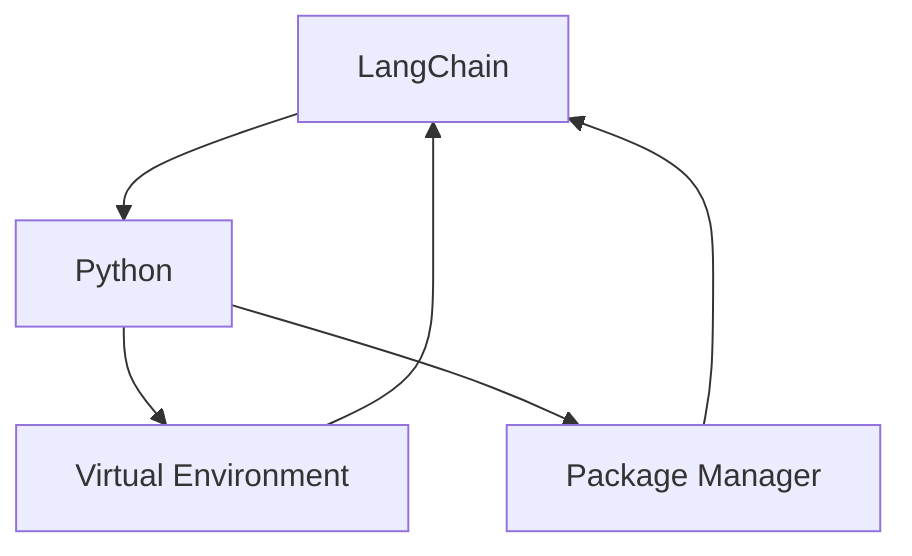

                 

**LangChain编程：从入门到实践】管理工具安装**

**作者：禅与计算机程序设计艺术 / Zen and the Art of Computer Programming**

## 1. 背景介绍

在当今快速发展的AI领域，LangChain已成为一个强大的工具，帮助开发人员构建和部署大型语言模型应用。然而，要充分利用LangChain，我们需要正确安装和配置管理工具。本文将指导读者完成LangChain的管理工具安装，并提供详细的操作步骤和技术细节。

## 2. 核心概念与联系

### 2.1 核心概念

- **LangChain**: 一个开源框架，用于构建和部署大型语言模型应用。
- **管理工具**: 用于管理和配置LangChain的工具，包括虚拟环境、包管理器等。
- **Python**: LangChain的官方支持语言。

### 2.2 核心联系

LangChain的管理工具主要围绕Python生态系统展开。虚拟环境用于隔离项目依赖，包管理器用于安装和管理依赖项。这些工具共同构成了LangChain项目的基础设施。



## 3. 核心算法原理 & 具体操作步骤

### 3.1 算法原理概述

管理工具安装的核心原理是创建和配置Python虚拟环境，并使用包管理器安装LangChain及其依赖项。这个过程确保了项目的依赖项与系统的其他项目隔离开来，避免了依赖冲突。

### 3.2 算法步骤详解

#### 3.2.1 创建虚拟环境

1. **使用venv模块创建虚拟环境**

```bash
python3 -m venv myenv
```

2. **激活虚拟环境**

   - **在Unix或MacOS上：**

     ```bash
     source myenv/bin/activate
     ```

   - **在Windows上：**

     ```
     myenv\Scripts\activate
     ```

#### 3.2.2 安装包管理器

我们推荐使用`pip`作为包管理器。如果您的系统上没有安装，可以使用以下命令安装：

```bash
python3 -m ensurepip --upgrade
```

#### 3.2.3 安装LangChain

使用`pip`安装LangChain及其依赖项：

```bash
pip install langchain
```

### 3.3 算法优缺点

**优点：**

- **隔离依赖**：虚拟环境确保了项目依赖项与系统其他项目的隔离。
- **简化依赖管理**：包管理器简化了依赖项的安装和管理。

**缺点：**

- **额外开销**：创建和管理虚拟环境需要一定的系统资源。
- **学习曲线**：对于新手来说，理解和使用管理工具可能需要一定的学习时间。

### 3.4 算法应用领域

管理工具安装在LangChain项目中至关重要。它确保了项目的依赖项与系统其他项目的隔离，从而避免了依赖冲突。这对于大型语言模型应用至关重要，因为它们通常依赖于大量的库和工具。

## 4. 数学模型和公式 & 详细讲解 & 举例说明

管理工具安装的数学模型相对简单，主要涉及到Python虚拟环境和包管理器的原理。以下是一些相关的命令行操作：

- **创建虚拟环境**：`python3 -m venv myenv`
- **激活虚拟环境**：`source myenv/bin/activate`（Unix或MacOS）或`myenv\Scripts\activate`（Windows）
- **安装包管理器**：`python3 -m ensurepip --upgrade`
- **安装LangChain**：`pip install langchain`

## 5. 项目实践：代码实例和详细解释说明

### 5.1 开发环境搭建

首先，确保您的系统上安装了Python 3。然后，创建一个新目录作为您的LangChain项目的根目录：

```bash
mkdir mylangchainproject
cd mylangchainproject
```

### 5.2 源代码详细实现

在项目根目录下，创建一个新的Python文件（例如`main.py`），并导入LangChain库：

```python
from langchain import HuggingFacePipeline

# 创建一个HuggingFacePipeline实例
pipeline = HuggingFacePipeline.from_model_id(
    model_id="bigscience/bloom",
    task="text-generation",
    model_kwargs={"max_length": 50, "min_length": 10, "do_sample": True, "top_k": 5},
)
```

### 5.3 代码解读与分析

在`main.py`中，我们首先导入LangChain库，然后创建一个`HuggingFacePipeline`实例。这个实例使用大型语言模型"bigscience/bloom"来生成文本。

### 5.4 运行结果展示

保存`main.py`后，您可以使用以下命令运行它：

```bash
python main.py
```

这将使用大型语言模型生成一些文本。

## 6. 实际应用场景

LangChain的管理工具安装在各种实际应用场景中都很有用，包括：

- **研究**：在进行大型语言模型研究时，管理工具可以帮助隔离依赖项，避免冲突。
- **生产**：在部署大型语言模型应用时，管理工具可以确保应用的依赖项与系统其他项目的隔离。

### 6.4 未来应用展望

随着LangChain的发展，管理工具安装的重要性也将随之增长。未来，我们可能会看到更多的工具和库被集成到LangChain中，从而进一步简化大型语言模型应用的开发和部署。

## 7. 工具和资源推荐

### 7.1 学习资源推荐

- **LangChain文档**：<https://python.langchain.com/en/latest/>
- **Python官方文档**：<https://docs.python.org/3/>
- **pip官方文档**：<https://pip.pypa.io/en/stable/>

### 7.2 开发工具推荐

- **PyCharm**：一个功能强大的Python集成开发环境。
- **Jupyter Notebook**：一个交互式计算环境，非常适合开发和测试LangChain应用。

### 7.3 相关论文推荐

- **LangChain：一个用于构建大型语言模型应用的框架**：<https://arxiv.org/abs/2204.10554>

## 8. 总结：未来发展趋势与挑战

### 8.1 研究成果总结

本文提供了LangChain管理工具安装的详细指南，包括核心概念、操作步骤、数学模型，以及实际应用场景。

### 8.2 未来发展趋势

随着大型语言模型的发展，LangChain的管理工具安装将变得越来越重要。我们预计会看到更多的工具和库被集成到LangChain中，从而进一步简化大型语言模型应用的开发和部署。

### 8.3 面临的挑战

管理工具安装的主要挑战是学习曲线。对于新手来说，理解和使用管理工具可能需要一定的学习时间。此外，管理工具安装可能会导致额外的系统开销。

### 8.4 研究展望

未来的研究将关注如何进一步简化管理工具安装，并提高其效率。此外，我们预计会看到更多的工具和库被集成到LangChain中，从而进一步简化大型语言模型应用的开发和部署。

## 9. 附录：常见问题与解答

**Q：为什么要使用虚拟环境？**

**A：虚拟环境确保了项目依赖项与系统其他项目的隔离，避免了依赖冲突。**

**Q：如何安装包管理器？**

**A：您可以使用以下命令安装pip：`python3 -m ensurepip --upgrade`**

**Q：如何安装LangChain？**

**A：您可以使用以下命令安装LangChain：`pip install langchain`**

**作者：禅与计算机程序设计艺术 / Zen and the Art of Computer Programming**

