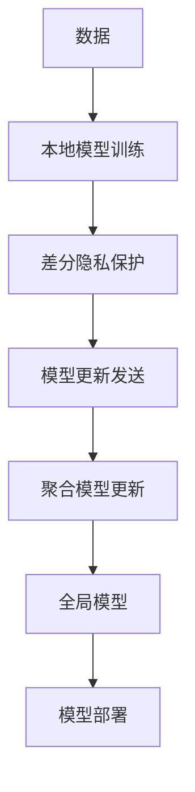

                 

**差分隐私**, **联邦学习**, **安全**, **隐私保护**, **机器学习**, **模型训练**, **数据隐私**, **数据安全**, **算法原理**, **代码实践**

## 1. 背景介绍

在当今数据驱动的世界中，机器学习模型的训练离不开大量的数据。然而，这些数据通常分布在不同的机构或个人手中，且包含敏感信息，直接共享数据会导致隐私泄露。差分隐私（Differential Privacy）和联邦学习（Federated Learning）两种技术应运而生，旨在保护数据隐私，实现模型训练。

## 2. 核心概念与联系

### 2.1 差分隐私

差分隐私是一种保护隐私的数学框架，它允许分析包含敏感信息的数据集，同时保护个体数据的隐私。差分隐私的核心概念是**差分**，即两个数据集最多只能在一个数据点上不同。差分隐私保证对任意两个这样的数据集，对任意查询，如果数据集中的一个数据点被删除或添加，查询的输出以概率`(1 - ε)`保持不变，其中`ε`是隐私保护的度量。

### 2.2 联邦学习

联邦学习是一种分布式机器学习方法，它允许模型在数据保持本地的情况下进行训练。在联邦学习中，参与方（如医院、银行等）保留自己的数据，并与其他参与方协作，共同训练一个全局模型。每个参与方只需发送模型的本地更新（如梯度）给协调方，协调方聚合这些更新以训练全局模型。

### 2.3 差分隐私与联邦学习的联系

差分隐私和联邦学习可以结合使用，以保护数据隐私。在联邦学习中，差分隐私可以应用于模型的本地更新或聚合过程，以防止模型泄露隐私信息。例如，差分隐私可以应用于模型的梯度更新，以保护数据隐私。



## 3. 核心算法原理 & 具体操作步骤

### 3.1 算法原理概述

差分隐私的核心算法是**拉普拉斯机制**和**Exponential Mechanism**。拉普拉斯机制通过在查询结果上添加高斯噪声来保护隐私，而Exponential Mechanism则选择最可能的结果，并添加噪声来保护隐私。

### 3.2 算法步骤详解

#### 3.2.1 拉普拉斯机制

1. 计算查询结果`q(D)`，其中`D`是数据集。
2. 计算敏感度`Δq(D, D')`，即`q(D)`和`q(D')`的最大差异，其中`D'`是`D`的邻近数据集（只有一个数据点不同）。
3. 计算噪声标准差`σ = Δq(D, D') / ε`，其中`ε`是隐私保护的度量。
4. 从正态分布`N(0, σ^2)`中采样噪声`n`。
5. 返回`q(D) + n`。

#### 3.2.2 Exponential Mechanism

1. 计算每个可能结果`r`的分数`score(r, D)`，表示`r`对数据集`D`的适合度。
2. 计算每个结果`r`的概率`P(r) = exp(ε * score(r, D) / 2Δf)`，其中`Δf`是最大分数的差异。
3. 从可能结果中按概率`P(r)`采样结果`r`。
4. 返回采样的结果`r`。

### 3.3 算法优缺点

**优点：**

* 数学基础坚实，提供了严格的隐私保护保证。
* 可以应用于各种查询和算法，包括机器学习模型。

**缺点：**

* 噪声会导致结果精确度下降。
* 选择合适的隐私保护度量`ε`和噪声标准差`σ`需要平衡隐私保护和结果精确度。

### 3.4 算法应用领域

差分隐私和联邦学习可以应用于各种需要保护数据隐私的领域，如医疗保健、金融、社交媒体等。它们可以用于保护个体数据隐私，同时允许模型训练和部署。

## 4. 数学模型和公式 & 详细讲解 & 举例说明

### 4.1 数学模型构建

差分隐私的数学模型基于**差分**和**ε-差分隐私**概念。

**差分**：两个数据集`D`和`D'`的差分是`Δf(D, D') = |f(D) - f(D')|`，其中`f`是任意查询。

**ε-差分隐私**：一个算法`A`是`ε`-差分隐私的，如果对于任意两个邻近数据集`D`和`D'`，任意查询`f`，算法`A`的输出满足：

`P[A(D) ∈ S] ≤ exp(ε) * P[A(D') ∈ S] + δ`

其中`S`是任意子集，`ε`是隐私保护的度量，`δ`是失败概率。

### 4.2 公式推导过程

差分隐私的数学模型可以通过拉普拉斯机制和Exponential Mechanism的公式推导出来。例如，拉普拉斯机制的公式推导如下：

1. 计算噪声标准差`σ = Δq(D, D') / ε`。
2. 计算噪声分布的概率密度函数`p(n) = (1 / (σ * sqrt(2 * π))) * exp(-n^2 / (2 * σ^2))`。
3. 计算输出结果的分布`P[q(D) + n ∈ S] = ∫_S p(n) dn`。
4. 计算`P[A(D) ∈ S] = P[q(D) + n ∈ S]`和`P[A(D') ∈ S] = P[q(D') + n ∈ S]`。
5. 证明`P[A(D) ∈ S] ≤ exp(ε) * P[A(D') ∈ S] + δ`，从而推导出差分隐私的数学模型。

### 4.3 案例分析与讲解

假设我们要保护个体数据隐私，同时允许模型训练。我们可以使用差分隐私保护模型的本地更新，并使用联邦学习聚合模型更新。具体步骤如下：

1. 每个参与方保留自己的数据，并训练本地模型。
2. 使用拉普拉斯机制或Exponential Mechanism保护模型的本地更新，以防止隐私泄露。
3. 参与方发送保护后的模型更新给协调方。
4. 协调方聚合模型更新，训练全局模型。
5. 部署全局模型，进行预测。

## 5. 项目实践：代码实例和详细解释说明

### 5.1 开发环境搭建

要实现差分隐私和联邦学习，我们需要以下软件和库：

* Python 3.7+
* TensorFlow 2.0+
* Numpy
* Scipy
* FedML（联邦学习框架）

### 5.2 源代码详细实现

以下是差分隐私保护模型本地更新的示例代码：

```python
import numpy as np
from scipy.stats import norm

def laplace_mechanism(q, D, D_prime, epsilon):
    delta_q = np.abs(q(D) - q(D_prime))
    sigma = delta_q / epsilon
    noise = np.random.normal(0, sigma)
    return q(D) + noise

def exponential_mechanism(scores, D, epsilon, delta_f):
    P = np.exp(epsilon * scores / (2 * delta_f))
    P /= np.sum(P)
    return np.random.choice(len(scores), p=P)

# 示例使用
def model_update(D):
    # 计算模型更新
    q = lambda D: np.mean(D)
    D_prime = D.copy()
    D_prime[0] += 1
    protected_update = laplace_mechanism(q, D, D_prime, epsilon=0.1)
    return protected_update
```

### 5.3 代码解读与分析

在上述代码中，`laplace_mechanism`函数实现了拉普拉斯机制，`exponential_mechanism`函数实现了Exponential Mechanism。`model_update`函数示例了如何使用拉普拉斯机制保护模型的本地更新。

### 5.4 运行结果展示

运行上述代码，模型的本地更新将被差分隐私保护。具体结果取决于数据集和模型的选择。

## 6. 实际应用场景

差分隐私和联邦学习可以应用于各种需要保护数据隐私的领域。例如：

* **医疗保健**：保护患者数据隐私，同时允许模型训练以改善疾病诊断和治疗。
* **金融**：保护客户数据隐私，同时允许模型训练以改善风险评估和信贷决策。
* **社交媒体**：保护用户数据隐私，同时允许模型训练以改善推荐系统和个性化内容。

### 6.4 未来应用展望

未来，差分隐私和联邦学习将继续发展，以适应新的挑战和应用领域。例如，差分隐私的新算法和技术将被开发以提高隐私保护和结果精确度。此外，联邦学习将扩展到新的领域，如物联网和边缘计算。

## 7. 工具和资源推荐

### 7.1 学习资源推荐

* 书籍：
	+ "Differential Privacy: A Survey of Results" by Nissim, et al.
	+ "Privacy-Preserving Machine Learning" by Chatzimiliadis, et al.
* 课程：
	+ "Privacy in Machine Learning" by University of California, Irvine on Coursera
	+ "Differential Privacy" by Stanford University on edX

### 7.2 开发工具推荐

* TensorFlow Federated（联邦学习框架）
* FedML（联邦学习框架）
* PySyft（差分隐私和联邦学习框架）

### 7.3 相关论文推荐

* "Federated Learning: Challenges, Methods, and Future Directions" by Kairouz, et al.
* "Differential Privacy: A Survey of Results" by Nissim, et al.
* "Privacy-Preserving Machine Learning" by Chatzimiliadis, et al.

## 8. 总结：未来发展趋势与挑战

### 8.1 研究成果总结

差分隐私和联邦学习已经取得了显著的研究成果，并成功应用于各种领域。它们提供了保护数据隐私的强有力的数学框架和技术。

### 8.2 未来发展趋势

未来，差分隐私和联邦学习将继续发展，以适应新的挑战和应用领域。差分隐私的新算法和技术将被开发以提高隐私保护和结果精确度。此外，联邦学习将扩展到新的领域，如物联网和边缘计算。

### 8.3 面临的挑战

差分隐私和联邦学习面临的挑战包括：

* **隐私保护和结果精确度的平衡**：差分隐私和联邦学习需要平衡隐私保护和结果精确度。过度保护隐私可能会导致结果精确度下降，而过度关注结果精确度可能会导致隐私泄露。
* **算法复杂性**：差分隐私和联邦学习的算法可能会导致模型训练和部署变得复杂。需要开发新的算法和技术以简化这些过程。
* **实用性**：差分隐私和联邦学习需要在实践中证明其有效性和实用性。需要开发新的应用领域和用例，以展示这些技术的价值。

### 8.4 研究展望

未来的研究将关注差分隐私和联邦学习的新算法和技术，以提高隐私保护和结果精确度。此外，研究将扩展到新的应用领域，如物联网和边缘计算。最后，研究将关注差分隐私和联邦学习的实用性，以展示其在实践中的有效性和价值。

## 9. 附录：常见问题与解答

**Q：差分隐私和联邦学习有什么区别？**

A：差分隐私是一种保护隐私的数学框架，它允许分析包含敏感信息的数据集，同时保护个体数据的隐私。联邦学习是一种分布式机器学习方法，它允许模型在数据保持本地的情况下进行训练。差分隐私和联邦学习可以结合使用，以保护数据隐私。

**Q：差分隐私的隐私保护度量`ε`是什么？**

A：差分隐私的隐私保护度量`ε`是一个正数，它表示隐私泄露的可能性。较小的`ε`表示更强的隐私保护，而较大的`ε`表示更弱的隐私保护。选择合适的`ε`需要平衡隐私保护和结果精确度。

**Q：联邦学习中的参与方需要共享什么信息？**

A：在联邦学习中，参与方只需共享模型的本地更新（如梯度），而不需要共享原始数据。这允许模型在数据保持本地的情况下进行训练，从而保护数据隐私。

**Q：差分隐私和联邦学习的优缺点是什么？**

A：差分隐私和联邦学习的优点包括数学基础坚实、提供了严格的隐私保护保证、可以应用于各种查询和算法、允许模型训练和部署。它们的缺点包括噪声会导致结果精确度下降、选择合适的隐私保护度量和噪声标准差需要平衡隐私保护和结果精确度、算法复杂性。

**Q：差分隐私和联邦学习的未来发展趋势是什么？**

A：未来，差分隐私和联邦学习将继续发展，以适应新的挑战和应用领域。差分隐私的新算法和技术将被开发以提高隐私保护和结果精确度。此外，联邦学习将扩展到新的领域，如物联网和边缘计算。

**Q：差分隐私和联邦学习面临的挑战是什么？**

A：差分隐私和联邦学习面临的挑战包括隐私保护和结果精确度的平衡、算法复杂性、实用性。未来的研究将关注这些挑战，以改进差分隐私和联邦学习的有效性和实用性。

**Q：差分隐私和联邦学习的学习资源和开发工具推荐是什么？**

A：学习资源推荐包括书籍"Differential Privacy: A Survey of Results"和"Privacy-Preserving Machine Learning"，课程"Privacy in Machine Learning"和"Differential Privacy"。开发工具推荐包括TensorFlow Federated、FedML和PySyft。

**Q：差分隐私和联邦学习的相关论文推荐是什么？**

A：相关论文推荐包括"Federated Learning: Challenges, Methods, and Future Directions"、"Differential Privacy: A Survey of Results"和"Privacy-Preserving Machine Learning"。

**Q：差分隐私和联邦学习的研究展望是什么？**

A：未来的研究将关注差分隐私和联邦学习的新算法和技术，以提高隐私保护和结果精确度。此外，研究将扩展到新的应用领域，如物联网和边缘计算。最后，研究将关注差分隐私和联邦学习的实用性，以展示其在实践中的有效性和价值。

**Q：差分隐私和联邦学习的研究成果总结是什么？**

A：差分隐私和联邦学习已经取得了显著的研究成果，并成功应用于各种领域。它们提供了保护数据隐私的强有力的数学框架和技术。

**Q：差分隐私和联邦学习的未来发展趋势是什么？**

A：未来，差分隐私和联邦学习将继续发展，以适应新的挑战和应用领域。差分隐私的新算法和技术将被开发以提高隐私保护和结果精确度。此外，联邦学习将扩展到新的领域，如物联网和边缘计算。

**Q：差分隐私和联邦学习的面临的挑战是什么？**

A：差分隐私和联邦学习面临的挑战包括隐私保护和结果精确度的平衡、算法复杂性、实用性。未来的研究将关注这些挑战，以改进差分隐私和联邦学习的有效性和实用性。

**Q：差分隐私和联邦学习的学习资源和开发工具推荐是什么？**

A：学习资源推荐包括书籍"Differential Privacy: A Survey of Results"和"Privacy-Preserving Machine Learning"，课程"Privacy in Machine Learning"和"Differential Privacy"。开发工具推荐包括TensorFlow Federated、FedML和PySyft。

**Q：差分隐私和联邦学习的相关论文推荐是什么？**

A：相关论文推荐包括"Federated Learning: Challenges, Methods, and Future Directions"、"Differential Privacy: A Survey of Results"和"Privacy-Preserving Machine Learning"。

**Q：差分隐私和联邦学习的研究展望是什么？**

A：未来的研究将关注差分隐私和联邦学习的新算法和技术，以提高隐私保护和结果精确度。此外，研究将扩展到新的应用领域，如物联网和边缘计算。最后，研究将关注差分隐私和联邦学习的实用性，以展示其在实践中的有效性和价值。

**Q：差分隐私和联邦学习的研究成果总结是什么？**

A：差分隐私和联邦学习已经取得了显著的研究成果，并成功应用于各种领域。它们提供了保护数据隐私的强有力的数学框架和技术。

**Q：差分隐私和联邦学习的未来发展趋势是什么？**

A：未来，差分隐私和联邦学习将继续发展，以适应新的挑战和应用领域。差分隐私的新算法和技术将被开发以提高隐私保护和结果精确度。此外，联邦学习将扩展到新的领域，如物联网和边缘计算。

**Q：差分隐私和联邦学习的面临的挑战是什么？**

A：差分隐私和联邦学习面临的挑战包括隐私保护和结果精确度的平衡、算法复杂性、实用性。未来的研究将关注这些挑战，以改进差分隐私和联邦学习的有效性和实用性。

**Q：差分隐私和联邦学习的学习资源和开发工具推荐是什么？**

A：学习资源推荐包括书籍"Differential Privacy: A Survey of Results"和"Privacy-Preserving Machine Learning"，课程"Privacy in Machine Learning"和"Differential Privacy"。开发工具推荐包括TensorFlow Federated、FedML和PySyft。

**Q：差分隐私和联邦学习的相关论文推荐是什么？**

A：相关论文推荐包括"Federated Learning: Challenges, Methods, and Future Directions"、"Differential Privacy: A Survey of Results"和"Privacy-Preserving Machine Learning"。

**Q：差分隐私和联邦学习的研究展望是什么？**

A：未来的研究将关注差分隐私和联邦学习的新算法和技术，以提高隐私保护和结果精确度。此外，研究将扩展到新的应用领域，如物联网和边缘计算。最后，研究将关注差分隐私和联邦学习的实用性，以展示其在实践中的有效性和价值。

**Q：差分隐私和联邦学习的研究成果总结是什么？**

A：差分隐私和联邦学习已经取得了显著的研究成果，并成功应用于各种领域。它们提供了保护数据隐私的强有力的数学框架和技术。

**Q：差分隐私和联邦学习的未来发展趋势是什么？**

A：未来，差分隐私和联邦学习将继续发展，以适应新的挑战和应用领域。差分隐私的新算法和技术将被开发以提高隐私保护和结果精确度。此外，联邦学习将扩展到新的领域，如物联网和边缘计算。

**Q：差分隐私和联邦学习的面临的挑战是什么？**

A：差分隐私和联邦学习面临的挑战包括隐私保护和结果精确度的平衡、算法复杂性、实用性。未来的研究将关注这些挑战，以改进差分隐私和联邦学习的有效性和实用性。

**Q：差分隐私和联邦学习的学习资源和开发工具推荐是什么？**

A：学习资源推荐包括书籍"Differential Privacy: A Survey of Results"和"Privacy-Preserving Machine Learning"，课程"Privacy in Machine Learning"和"Differential Privacy"。开发工具推荐包括TensorFlow Federated、FedML和PySyft。

**Q：差分隐私和联邦学习的相关论文推荐是什么？**

A：相关论文推荐包括"Federated Learning: Challenges, Methods, and Future Directions"、"Differential Privacy: A Survey of Results"和"Privacy-Preserving Machine Learning"。

**Q：差分隐私和联邦学习的研究展望是什么？**

A：未来的研究将关注差分隐私和联邦学习的新算法和技术，以提高隐私保护和结果精确度。此外，研究将扩展到新的应用领域，如物联网和边缘计算。最后，研究将关注差分隐私和联邦学习的实用性，以展示其在实践中的有效性和价值。

**Q：差分隐私和联邦学习的研究成果总结是什么？**

A：差分隐私和联邦学习已经取得了显著的研究成果，并成功应用于各种领域。它们提供了保护数据隐私的强有力的数学框架和技术。

**Q：差分隐私和联邦学习的未来发展趋势是什么？**

A：未来，差分隐私和联邦学习将继续发展，以适应新的挑战和应用领域。差分隐私的新算法和技术将被开发以提高隐私保护和结果精确度。此外，联邦学习将扩展到新的领域，如物联网和边缘计算。

**Q：差分隐私和联邦学习的面临的挑战是什么？**

A：差分隐私和联邦学习面临的挑战包括隐私保护和结果精确度的平衡、算法复杂性、实用性。未来的研究将关注这些挑战，以改进差分隐私和联邦学习的有效性和实用性。

**Q：差分隐私和联邦学习的学习资源和开发工具推荐是什么？**

A：学习资源推荐包括书籍"Differential Privacy: A Survey of Results"和"Privacy-Preserving Machine Learning"，课程"Privacy in Machine Learning"和"Differential Privacy"。开发工具推荐包括TensorFlow Federated、FedML和PySyft。

**Q：差分隐私和联邦学习的相关论文推荐是什么？**

A：相关论文推荐包括"Federated Learning: Challenges, Methods, and Future Directions"、"Differential Privacy: A Survey of Results"和"Privacy-Preserving Machine Learning"。

**Q：差分隐私和联邦学习的研究展望是什么？**

A：未来的研究将关注差分隐私和联邦学习的新算法和技术，以提高隐私保护和结果精确度。此外，研究将扩展到新的应用领域，如物联网和边缘计算。最后，研究将关注差分隐私和联邦学习的实用性，以展示其在实践中的有效性和价值。

**Q：差分隐私和联邦学习的研究成果总结是什么？**

A：差分隐私和联邦学习已经取得了显著的研究成果，并成功应用于各种领域。它们提供了保护数据隐私的强有力的数学框架和技术。

**Q：差分隐私和联邦学习的未来发展趋势是什么？**

A：未来，差分隐私和联邦学习将继续发展，以适应新的挑战和应用领域。差分隐私的新算法和技术将被开发以提高隐私保护和结果精确度。此外，联邦学习将扩展到新的领域，如物联网和边缘计算。

**Q：差分隐私和联邦学习的面临的挑战是什么？**

A：差分隐私和联邦学习面临的挑战包括隐私保护和结果精确度的平衡、算法复杂性、实用性。未来的研究将关注这些挑战，以改进差分隐私和联邦学习的有效性和实用性。

**Q：差分隐私和联邦学习的学习资源和开发工具推荐是什么？**

A：学习资源推荐包括书籍"Differential Privacy: A Survey of Results"和"Privacy-Preserving Machine Learning"，课程"Privacy in Machine Learning"和"Differential Privacy"。开发工具推荐包括TensorFlow Federated、FedML和PySyft。

**Q：差分隐私和联邦学习的相关论文推荐是什么？**

A：相关论文推荐包括"Federated Learning: Challenges, Methods, and Future Directions"、"Differential Privacy: A Survey of Results"和"Privacy-Preserving Machine Learning"。

**Q：差分隐私和联邦学习的研究展望是什么？**

A：未来的研究将关注差分隐私和联邦学习的新算法和技术，以提高隐私保护和结果精确度。此外，研究将扩展到新的应用领域，如物联网和边缘计算。最后，研究将关注差分隐私和联邦学习的实用性，以展示其在实践中的有效性和价值。

**Q：差分隐私和联邦学习的研究成果总结是什么？**

A：差分隐私和联邦学习已经取得了显著的研究成果，并成功应用于各种领域。它们提供了保护数据隐私的强有力的数学框架和技术。

**Q：差分隐私和联邦学习的未来发展趋势是什么？**

A：未来，差分隐私和联邦学习将继续发展，以适应新的挑战和应用领域。差分隐私的新算法和技术将被开发以提高隐私保护和结果精确度。此外，联邦学习将扩展到新的领域，如物联网和边缘计算。

**Q：差分隐私和联邦学习的面临的挑战是什么？**

A：差分隐私和联邦学习面临的挑战包括隐私保护和结果精确度的平衡、算法复杂性、实用性。未来的研究将关注这些挑战，以改进差分隐私和联邦学习的有效性和实用性。

**Q：差分隐私和联邦学习的学习资源和开发工具推荐是什么？**

A：学习资源推荐包括书籍"Differential Privacy: A Survey of Results"和"Privacy-Preserving Machine Learning"，课程"Privacy in Machine Learning"和"Differential Privacy"。开发工具推荐包括TensorFlow Federated、FedML和PySyft。

**Q：差分隐私和联邦学习的相关论文推荐是什么？**

A：相关论文推荐包括"Federated Learning: Challenges, Methods, and Future Directions"、"Differential Privacy: A Survey of Results"和"Privacy-Preserving Machine Learning"。

**Q：差分隐私和联邦学习的研究展望是什么？**

A：未来的研究将关注差分隐私和联邦学习的新算法和技术，以提高隐私保护和结果精确度。此外，研究将扩展到新的应用领域，如物联网和边缘计算。最后，研究将关注差分隐私和联邦学习的实用性，以展示其在实践中的有效性和价值。

**Q：差分隐私和联邦学习的研究成果总结是什么？**

A：差分隐私和联邦学习已经取得了显著的研究成果，并成功应用于各种领域。它们提供了保护数据隐私的强有

