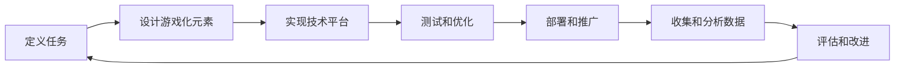

                 

**人类计算 (Human Computation), 众包 (Crowdsourcing), 可玩性 (Playability), 互动 (Interactivity), 任务设计 (Task Design), 奖励机制 (Reward Mechanism), 社交因素 (Social Factors)**

## 1. 背景介绍

在当今信息爆炸的时代，人类面临着海量数据和复杂问题。传统的计算机算法和人工智能虽然强大，但仍然存在一些问题无法解决，或者需要大量时间和资源。此时，人类计算应运而生，它将人类的智慧和创造力与计算机技术结合起来，共同解决复杂问题。

人类计算的一个关键因素是如何激励和吸引人类参与者。简单的任务指南和金钱奖励往往不足以维持参与者的兴趣和动力。因此，引入游戏化设计，将任务转化为有趣的游戏，是提高参与者参与度和满意度的有效途径。

## 2. 核心概念与联系

### 2.1 游戏化参与的定义

游戏化参与是指将游戏的设计理念和机制应用于非游戏环境，以提高参与者的参与度、满意度和效率。它将任务转化为游戏，通过设置目标、提供反馈、建立进度跟踪系统、设计挑战和奖励机制，激励参与者主动参与。

### 2.2 游戏化参与的架构

游戏化参与的架构可以用下面的 Mermaid 流程图表示：

### 2.3 游戏化参与的关键因素

游戏化参与的关键因素包括：

- **可玩性 (Playability)**: 任务是否有趣、挑战性和易于理解。
- **互动 (Interactivity)**: 参与者是否能够与任务和其他参与者互动。
- **任务设计 (Task Design)**: 任务是否清晰、明确、有意义和有吸引力。
- **奖励机制 (Reward Mechanism)**: 奖励是否公平、及时、多样化和有吸引力。
- **社交因素 (Social Factors)**: 参与者是否能够与他人合作、竞争或分享经验。

## 3. 核心算法原理 & 具体操作步骤

### 3.1 算法原理概述

游戏化参与的核心是任务设计和游戏化元素的设计。任务设计需要考虑任务的复杂性、可分解性和可理解性。游戏化元素的设计需要考虑可玩性、互动性、任务设计、奖励机制和社交因素。

### 3.2 算法步骤详解

1. **定义任务**: 明确任务的目标、范围和要求。
2. **设计游戏化元素**: 设计目标、反馈机制、进度跟踪系统、挑战和奖励机制。
3. **实现技术平台**: 选择合适的技术平台，实现游戏化参与系统。
4. **测试和优化**: 测试系统的可用性、可靠性和性能，并根据测试结果进行优化。
5. **部署和推广**: 部署系统，并通过各种渠道推广系统。
6. **收集和分析数据**: 收集参与者的行为数据，并分析数据以评估系统的有效性。
7. **评估和改进**: 根据数据分析结果，评估系统的有效性，并进行改进。

### 3.3 算法优缺点

**优点**:

- 提高参与者的参与度和满意度。
- 吸引更多的人参与任务。
- 降低任务的复杂性和难度。
- 提高任务的可理解性和可分解性。

**缺点**:

- 设计和实现游戏化参与系统需要大量的时间和资源。
- 任务设计和游戏化元素设计需要专业的知识和技能。
- 系统的有效性取决于参与者的兴趣和动机。

### 3.4 算法应用领域

游戏化参participation可以应用于各种领域，包括：

- **科学研究**: 例如，设计游戏化参与系统帮助研究人员收集和分析大量数据。
- **公共服务**: 例如，设计游戏化参与系统帮助公共服务机构收集公众意见和建议。
- **商业**: 例如，设计游戏化参与系统帮助企业收集市场信息和客户反馈。

## 4. 数学模型和公式 & 详细讲解 & 举例说明

### 4.1 数学模型构建

游戏化参与的数学模型可以用以下公式表示：

$$S = f(T, G, P, R, S)$$

其中，$S$表示系统的有效性，$T$表示任务设计，$G$表示游戏化元素设计，$P$表示参与者的特性，$R$表示奖励机制，$S$表示社交因素。

### 4.2 公式推导过程

推导过程如下：

1. 任务设计 ($T$) 和游戏化元素设计 ($G$) 影响参与者的参与度和满意度。
2. 参与者的特性 ($P$) 影响参与者的动机和能力。
3. 奖励机制 ($R$) 和社交因素 ($S$) 影响参与者的动机和满意度。
4. 系统的有效性 ($S$) 是任务设计、游戏化元素设计、参与者的特性、奖励机制和社交因素的函数。

### 4.3 案例分析与讲解

例如，在设计一个帮助研究人员收集和分析大量数据的游戏化参与系统时，任务设计 ($T$) 可以是数据分类任务，游戏化元素设计 ($G$) 可以是提供反馈和进度跟踪系统，参与者的特性 ($P$) 可以是参与者的年龄和教育水平，奖励机制 ($R$) 可以是提供积分和徽章，社交因素 ($S$) 可以是提供排行榜和社交平台。通过优化这些因素，可以提高系统的有效性 ($S$)。

## 5. 项目实践：代码实例和详细解释说明

### 5.1 开发环境搭建

开发环境包括：

- **编程语言**: Python
- **框架**: Flask
- **数据库**: MongoDB
- **前端**: HTML, CSS, JavaScript

### 5.2 源代码详细实现

源代码详细实现包括：

- **任务设计**: 使用 Flask 实现任务管理系统，允许研究人员定义任务。
- **游戏化元素设计**: 使用 MongoDB 实现参与者数据库，记录参与者的行为数据。使用 JavaScript 实现反馈和进度跟踪系统。
- **奖励机制**: 使用 JavaScript 实现积分和徽章系统。
- **社交因素**: 使用 JavaScript 实现排行榜和社交平台。

### 5.3 代码解读与分析

代码解读与分析包括：

- **任务设计**: 任务管理系统允许研究人员定义任务，并提供任务的详细描述和要求。
- **游戏化元素设

