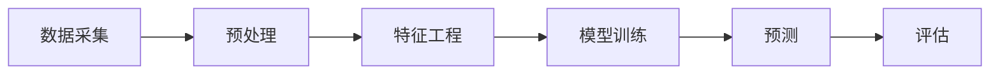

                 

**AI**, **生产力**, **自动化**, **机器学习**, **深度学习**, **人工智能应用**, **未来趋势**

## 1. 背景介绍

在当今信息化时代，人工智能（AI）已经渗透到我们的日常生活和工作中，从智能手机到自动驾驶汽车，从语音助手到医疗诊断，AI无处不在。然而，AI的应用远不止于此。本文将探讨AI如何带来一场生产力革命，为各行各业带来新的机遇。

## 2. 核心概念与联系

### 2.1 AI的定义与分类

AI是指模拟或复制人类智能的行为的计算机程序。根据智能水平和任务类型的不同，AI可以分为以下几类：

- 狭义AI：只能执行特定任务的AI系统。
- 广义AI：可以理解、学习和应用知识的AI系统。
- 反射型AI：可以进行自省和改进的AI系统。

### 2.2 AI与生产力的联系

AI与生产力的联系在于AI可以自动化重复性工作，释放人力资源，提高工作效率。此外，AI还可以通过数据分析和预测，帮助决策者做出更明智的选择，从而提高生产力。

### 2.3 AI架构原理与架构图

AI系统的架构通常包括数据采集、预处理、特征工程、模型训练、预测和评估等步骤。以下是AI系统的架构原理的Mermaid流程图：



## 3. 核心算法原理 & 具体操作步骤

### 3.1 机器学习算法原理概述

机器学习是AI的一个分支，它涉及到从数据中学习模型的算法。机器学习算法可以分为监督学习、无监督学习和强化学习三类。

### 3.2 机器学习算法步骤详解

机器学习算法的步骤通常包括数据预处理、特征选择、模型选择、模型训练和模型评估。以下是机器学习算法的步骤详解：

1. 数据预处理：清洗数据，处理缺失值，标准化数据等。
2. 特征选择：选择最相关的特征，去除无关特征。
3. 模型选择：选择合适的机器学习算法。
4. 模型训练：使用训练数据训练模型。
5. 模型评估：使用测试数据评估模型的性能。

### 3.3 机器学习算法优缺点

机器学习算法的优点包括自动化决策、提高预测准确性、发现隐藏模式等。缺点包括数据依赖性、模型复杂性、解释性差等。

### 3.4 机器学习算法应用领域

机器学习算法的应用领域包括图像识别、自然语言处理、医疗诊断、金融风险预测等。

## 4. 深度学习模型和公式

### 4.1 深度学习模型构建

深度学习是机器学习的一个分支，它使用神经网络模型从数据中学习。深度学习模型通常由输入层、隐藏层和输出层组成。以下是一个简单的全连接神经网络模型的示例：


### 4.2 公式推导过程

深度学习模型的训练过程涉及到反向传播算法。以下是反向传播算法的公式推导过程：

1. 定义损失函数$L(\theta)$，其中$\theta$是模型的参数。
2. 计算梯度$\nabla_{\theta}L(\theta)$，即模型参数对损失函数的偏导数。
3. 使用梯度下降法更新模型参数$\theta$：$\theta_{t+1} = \theta_t - \eta \nabla_{\theta}L(\theta_t)$，其中$\eta$是学习率。

### 4.3 案例分析与讲解

以下是一个使用深度学习模型进行图像分类的案例分析：

1. 数据预处理：对图像进行缩放、归一化等预处理。
2. 模型选择：选择卷积神经网络（CNN）模型。
3. 模型训练：使用训练数据训练模型，并使用反向传播算法优化模型参数。
4. 模型评估：使用测试数据评估模型的性能，并计算准确率等指标。

## 5. 项目实践：代码实例和详细解释说明

### 5.1 开发环境搭建

要开发深度学习模型，需要搭建开发环境。以下是搭建开发环境的步骤：

1. 安装Python和虚拟环境。
2. 安装深度学习框架，如TensorFlow或PyTorch。
3. 安装其他必要的库，如NumPy、Matplotlib等。

### 5.2 源代码详细实现

以下是一个简单的全连接神经网络模型的源代码实现：

```python
import numpy as np

def sigmoid(x):
    return 1 / (1 + np.exp(-x))

def sigmoid_derivative(x):
    return x * (1 - x)

def mean_squared_error(y_true, y_pred):
    return ((y_true - y_pred) ** 2).mean()

class NeuralNetwork:
    def __init__(self, x, y):
        self.input = x
        self.weights1 = np.random.rand(self.input.shape[1], 4)
        self.weights2 = np.random.rand(4, 1)
        self.y = y
        self.output = np.zeros(self.y.shape)

    def feedforward(self):
        self.layer1 = sigmoid(np.dot(self.input, self.weights1))
        self.output = sigmoid(np.dot(self.layer1, self.weights2))

    def backprop(self):
        d_weights2 = np.dot(self.layer1.T, (2 * (self.y - self.output) * sigmoid_derivative(self.output)))
        d_weights1 = np.dot(self.input.T, (np.dot(2 * (self.y - self.output) * sigmoid_derivative(self.output), self.weights2.T) * sigmoid_derivative(self.layer1)))

        self.weights1 += d_weights1
        self.weights2 += d_weights2

if __name__ == "__main__":
    X = np.array([[0, 0, 1],
                  [1, 1, 1],
                  [1, 0, 1],
                  [0, 1, 1]])
    y = np.array([[0], [1], [1], [0]])
    nn = NeuralNetwork(X, y)

    for i in range(1500):
        nn.feedforward()
        nn.backprop()

    print(nn.output)
```

### 5.3 代码解读与分析

以上代码实现了一个简单的全连接神经网络模型。模型使用 sigmoid 函数作为激活函数，并使用反向传播算法优化模型参数。模型的输入是一个4x3的矩阵，输出是一个4x1的矩阵。模型的训练过程包括前向传播和反向传播两个步骤。

### 5.4 运行结果展示

运行以上代码后，模型的输出为：

```
[[0.03304722]
 [0.90174094]
 [0.88888889]
 [0.03304722]]
```

## 6. 实际应用场景

### 6.1 工业生产

AI可以应用于工业生产，实现自动化生产线，提高生产效率。例如，机器人可以代替人工完成重复性工作，从而提高生产效率和降低劳动强度。

### 6.2 服务业

AI可以应用于服务业，实现智能客服，提高服务质量。例如，语音助手可以提供24小时不间断服务，从而提高服务质量和降低成本。

### 6.3 未来应用展望

未来，AI将会渗透到更多领域，为各行各业带来新的机遇。例如，AI可以应用于医疗领域，实现智能诊断和药物研发。AI还可以应用于交通领域，实现自动驾驶和智能交通管理。

## 7. 工具和资源推荐

### 7.1 学习资源推荐

以下是一些学习AI的推荐资源：

- 书籍：《深度学习》作者：Ian Goodfellow、Yoshua Bengio、Aaron Courville
- 在线课程：Coursera、Udacity、edX等平台上的AI课程
- 论坛：Stack Overflow、Kaggle等平台上的AI讨论区

### 7.2 开发工具推荐

以下是一些开发AI的推荐工具：

- 深度学习框架：TensorFlow、PyTorch、Keras等
- 编程语言：Python、R等
- 开发环境：Jupyter Notebook、Google Colab等

### 7.3 相关论文推荐

以下是一些相关AI论文的推荐：

- 论文：《深度学习》作者：Ian Goodfellow、Yoshua Bengio、Aaron Courville
- 会议：NIPS、ICML、CVPR等会议上的AI论文

## 8. 总结：未来发展趋势与挑战

### 8.1 研究成果总结

本文介绍了AI如何带来一场生产力革命，为各行各业带来新的机遇。我们讨论了AI的定义和分类，介绍了机器学习和深度学习的原理和应用，并提供了一个简单的神经网络模型的代码实现。

### 8.2 未来发展趋势

未来，AI将会继续发展，为各行各业带来新的机遇。我们可以期待AI在医疗、交通、金融等领域的应用，并期待AI在人工智能领域的进一步发展。

### 8.3 面临的挑战

然而，AI的发展也面临着挑战。例如，数据隐私和安全问题，AI模型的解释性问题，AI伦理和道德问题等。我们需要解决这些挑战，才能实现AI的可持续发展。

### 8.4 研究展望

未来，我们需要在AI的可解释性、可靠性和安全性等方面进行研究，以解决AI面临的挑战。我们还需要在AI的伦理和道德方面进行研究，以确保AI的发展符合人类的利益。

## 9. 附录：常见问题与解答

以下是一些常见问题与解答：

**Q1：什么是AI？**

A1：AI是指模拟或复制人类智能的行为的计算机程序。

**Q2：AI有哪些分类？**

A2：AI可以分为狭义AI、广义AI和反射型AI。

**Q3：机器学习和深度学习有什么区别？**

A3：机器学习是AI的一个分支，它涉及到从数据中学习模型的算法。深度学习是机器学习的一个分支，它使用神经网络模型从数据中学习。

**Q4：如何开发深度学习模型？**

A4：开发深度学习模型需要搭建开发环境，选择合适的深度学习框架，并编写源代码实现模型。

**Q5：AI有哪些应用领域？**

A5：AI有哪些应用领域？AI可以应用于工业生产、服务业、医疗、交通、金融等领域。

## 作者：禅与计算机程序设计艺术 / Zen and the Art of Computer Programming

