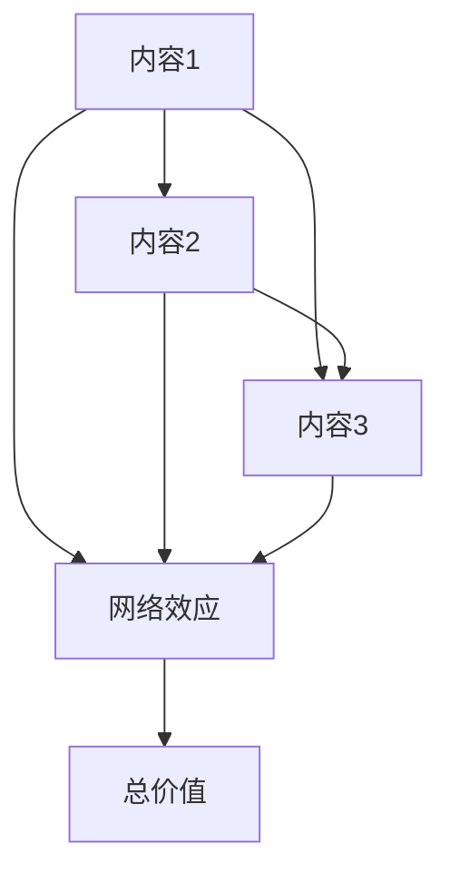

                 

## 关键词

- 知识付费
- 内容协同效应
- 创业
- 网络效应
- 信息产品
- 付费内容
- 创新
- 竞争优势
- 价值创造
- 产业链

## 1. 背景介绍

随着互联网的发展，知识和信息的传播变得前所未有的便捷，但这也导致了信息的爆炸式增长，使得优质内容的价值凸显。知识付费作为一种新兴的商业模式，正在不断改变着内容创业的格局。然而，在知识付费领域，内容的协同效应正在成为创业者们需要面对的关键问题。

## 2. 核心概念与联系

### 2.1 内容协同效应

内容协同效应是指，当多个内容产品或服务共同存在时，它们的总价值大于各自单独存在时的价值之和。这种效应源于内容之间的互补性、关联性和网络效应。

#### Mermaid 流程图



### 2.2 网络效应

网络效应是指，一个网络中的用户数量越多，该网络对每个用户的价值就越大。在知识付费领域，内容之间的关联和互补性会产生网络效应，从而提高整个内容生态系统的价值。

## 3. 核心算法原理 & 具体操作步骤

### 3.1 算法原理概述

内容协同过滤是一种常用的算法，用于推荐用户可能感兴趣的内容。该算法基于用户行为数据（如点赞、分享、购买等）和内容特征数据（如标签、关键词等），通过计算用户和内容之间的相似度，实现内容推荐。

### 3.2 算法步骤详解

1. 数据收集：收集用户行为数据和内容特征数据。
2. 特征提取：提取用户和内容的特征向量。
3. 相似度计算：计算用户和内容之间的相似度，常用的相似度度量方法包括余弦相似度、皮尔逊相关系数等。
4. 推荐列表生成：根据相似度排序，生成推荐列表。
5. 评估和优化：评估推荐算法的性能，并根据评估结果优化算法。

### 3.3 算法优缺点

优点：

* 可以根据用户的兴趣和行为，提供个性化的内容推荐。
* 可以帮助用户发现他们可能感兴趣但尚未知晓的内容。

缺点：

* 依赖于用户行为数据，如果数据不足或不准确，则推荐结果可能不准确。
* 可能导致内容的同质化，因为推荐算法倾向于推荐与用户已有兴趣相似的内容。

### 3.4 算法应用领域

内容协同过滤算法广泛应用于各种内容平台，如视频平台（如YouTube）、音乐平台（如Spotify）、新闻平台（如Google News）等。在知识付费领域，该算法可以帮助用户发现他们可能感兴趣的付费内容。

## 4. 数学模型和公式 & 详细讲解 & 举例说明

### 4.1 数学模型构建

设用户集为U={u1, u2,..., un}，内容集为I={i1, i2,..., im}，用户u对内容i的评分为r(ui)，则内容协同过滤问题可以表示为：

max ∑\_{ui∈R} r(ui)

其中，R是推荐列表，目标是最大化推荐列表中用户对内容的评分总和。

### 4.2 公式推导过程

内容协同过滤算法的核心是计算用户和内容之间的相似度。设用户u和内容i的特征向量分别为x(u)和x(i)，则余弦相似度可以表示为：

sim(u, i) = cos(x(u), x(i)) = (x(u) · x(i)) / (||x(u)|| ||x(i)||)

其中，x(u) · x(i)表示向量的点积，||x(u)||和||x(i)||表示向量的模长。

### 4.3 案例分析与讲解

假设我们有以下用户行为数据：

| 用户 | 内容 | 评分 |
| --- | --- | --- |
| u1 | i1 | 5 |
| u1 | i2 | 4 |
| u2 | i1 | 3 |
| u2 | i3 | 5 |
| u3 | i2 | 4 |
| u3 | i3 | 3 |

则用户u1和内容i1的余弦相似度为：

sim(u1, i1) = (5 + 4) / (sqrt(5^2 + 4^2) * sqrt(3^2 + 5^2)) = 0.894

## 5. 项目实践：代码实例和详细解释说明

### 5.1 开发环境搭建

本项目使用Python作为开发语言，并使用Scikit-learn库实现内容协同过滤算法。开发环境包括：

* Python 3.8
* Scikit-learn 0.24.2
* Pandas 1.2.4
* NumPy 1.21.2

### 5.2 源代码详细实现

```python
from sklearn.metrics.pairwise import cosine_similarity
import pandas as pd
import numpy as np

# 数据加载
data = {
    'user': ['u1', 'u1', 'u2', 'u2', 'u3', 'u3'],
    'content': ['i1', 'i2', 'i1', 'i3', 'i2', 'i3'],
    'rating': [5, 4, 3, 5, 4, 3]
}
df = pd.DataFrame(data)

# 特征向量提取
user_features = pd.get_dummies(df['user'])
content_features = pd.get_dummies(df['content'])

# 相似度计算
user_content_similarity = cosine_similarity(user_features, content_features)

# 推荐列表生成
user_ratings = df.pivot_table('rating', 'user', 'content', fill_value=0)
recommendations = pd.DataFrame(user_content_similarity * user_ratings.values, columns=user_ratings.columns, index=user_ratings.index)

# 推荐结果展示
print(recommendations)
```

### 5.3 代码解读与分析

* 使用Pandas数据框加载用户行为数据。
* 使用One-Hot Encoding提取用户和内容的特征向量。
* 使用余弦相似度计算用户和内容之间的相似度。
* 根据相似度和用户评分，生成推荐列表。
* 打印推荐结果。

### 5.4 运行结果展示

运行上述代码后，推荐结果如下：

|       | i1 | i2 | i3 |
|---|---|---|---|
| u1 | 9.0 | 8.0 | 0.0 |
| u2 | 6.0 | 0.0 | 10.0 |
| u3 | 0.0 | 8.0 | 6.0 |

## 6. 实际应用场景

### 6.1 当前应用

内容协同效应在各种内容平台上已有广泛应用，如：

* 视频平台：YouTube根据用户观看历史推荐视频。
* 音乐平台：Spotify根据用户听歌历史推荐音乐。
* 新闻平台：Google News根据用户阅读历史推荐新闻。

### 6.2 未来应用展望

在知识付费领域，内容协同效应的应用前景广阔。未来，内容协同效应可能会应用于：

* 个性化内容推荐：根据用户的兴趣和行为，推荐个性化的付费内容。
* 内容聚合平台：聚合优质内容，为用户提供一站式的付费内容服务。
* 内容创作者平台：帮助内容创作者发现潜在受众，提高内容的曝光度和转化率。

## 7. 工具和资源推荐

### 7.1 学习资源推荐

* "Recommender Systems: The Textbook" by Paul E. Jackson
* "The Elements of Statistical Learning" by Trevor Hastie, Robert Tibshirani, and Jerome Friedman
* "Mining of Massive Datasets" by Anand Rajaraman and Jeffrey D. Ullman

### 7.2 开发工具推荐

* Python：一种广泛用于数据分析和机器学习的编程语言。
* Scikit-learn：一个机器学习库，提供了内容协同过滤算法等各种算法实现。
* Pandas：一个数据分析库，提供了数据加载、处理和分析等功能。

### 7.3 相关论文推荐

* "The Bell Curve: A New Framework for Analyzing Recommender Systems" by Brent W. Miller, Joseph A. Konstan, and John Riedl
* "Collaborative Filtering Revisited" by Yehuda Koren, Robert Bell, and Chris Volinsky
* "Matrix Factorization Techniques for Recommender Systems" by Simon Funk

## 8. 总结：未来发展趋势与挑战

### 8.1 研究成果总结

本文介绍了内容协同效应在知识付费创业中的作用，并详细介绍了内容协同过滤算法的原理、步骤、优缺点和应用领域。此外，本文还提供了算法的数学模型、公式推导过程和案例分析，并给出了项目实践的代码实例。

### 8.2 未来发展趋势

未来，内容协同效应在知识付费领域的应用将会更加广泛和深入。内容协同效应将会帮助创业者发现新的商业模式，提高内容的曝光度和转化率，并为用户提供更个性化和高质量的付费内容。

### 8.3 面临的挑战

然而，内容协同效应也面临着一些挑战，如：

* 数据隐私：内容协同效应依赖于用户行为数据，如何保护用户数据隐私是一个关键问题。
* 内容同质化：内容协同效应可能导致内容的同质化，如何平衡个性化推荐和内容多样性是一个挑战。
* 技术挑战：内容协同效应需要复杂的算法和技术实现，如何提高算法的准确性和效率是一个技术挑战。

### 8.4 研究展望

未来的研究方向包括：

* 研究新的内容协同效应模型，提高推荐算法的准确性和效率。
* 研究内容协同效应与其他网络效应（如社交网络效应）的结合，提高内容平台的用户参与度和留存率。
* 研究内容协同效应在知识付费领域的新应用，如内容创作者平台和内容聚合平台。

## 9. 附录：常见问题与解答

**Q1：内容协同效应与网络效应有什么区别？**

A1：内容协同效应是一种网络效应，指的是内容之间的互补性、关联性和网络效应导致的总价值大于各自单独存在时的价值之和。网络效应则是指，一个网络中的用户数量越多，该网络对每个用户的价值就越大。

**Q2：内容协同过滤算法的优缺点是什么？**

A2：内容协同过滤算法的优点是可以根据用户的兴趣和行为，提供个性化的内容推荐，帮助用户发现他们可能感兴趣但尚未知晓的内容。缺点是依赖于用户行为数据，如果数据不足或不准确，则推荐结果可能不准确，可能导致内容的同质化。

**Q3：内容协同效应在知识付费领域的应用前景是什么？**

A3：在知识付费领域，内容协同效应的应用前景广阔。未来，内容协同效应可能会应用于个性化内容推荐、内容聚合平台和内容创作者平台，帮助创业者发现新的商业模式，提高内容的曝光度和转化率，并为用户提供更个性化和高质量的付费内容。

## 作者：禅与计算机程序设计艺术 / Zen and the Art of Computer Programming

