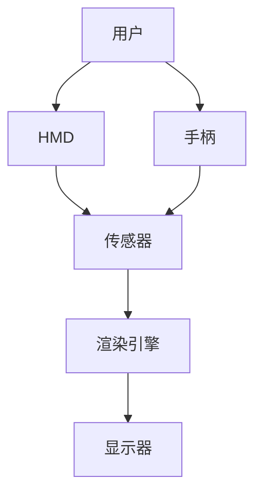

                 

**虚拟现实在注意力沉浸体验中的应用**

**作者：禅与计算机程序设计艺术 / Zen and the Art of Computer Programming**

## 1. 背景介绍

虚拟现实（Virtual Reality, VR）技术自问世以来，就以其提供的身临其境的体验而备受关注。随着技术的发展，VR不再只是游戏和娱乐的领域，而是扩展到了教育、医疗、设计等各个领域。本文将探讨VR在注意力沉浸体验中的应用，分析其原理、算法、数学模型，并提供项目实践和工具推荐。

## 2. 核心概念与联系

### 2.1 VR技术原理

VR技术的核心是创建一个三维的、互动的虚拟环境，用户可以通过头戴式显示器（HMD）和手柄等设备与之互动。VR系统通常包括以下组件：



### 2.2 注意力沉浸

注意力沉浸（Presence）是指用户在虚拟环境中感受到的真实感和参与感。高度的注意力沉浸可以提高用户的体验，增强记忆和学习效果。

## 3. 核心算法原理 & 具体操作步骤

### 3.1 算法原理概述

VR渲染算法的核心是实时渲染用户视角的三维场景。常用的渲染算法包括：

- 图形渲染管线（Graphics Rendering Pipeline）
- 光线追踪（Ray Tracing）
- 空间多重采样（Spatial Multisampling, SMS）

### 3.2 算法步骤详解

以图形渲染管线为例，其步骤包括：

1. 应用变换（Apply Transformations）：将物体从模型空间转换到世界空间。
2. 光照计算（Compute Lighting）：计算物体表面的光照情况。
3. 图元装配（Primitive Assembly）：将物体分解为基本图元（如三角形）。
4. 图元渲染（Primitive Rasterization）：将基本图元转换为像素。
5. 片元着色（Fragment Shading）：为每个像素计算颜色。
6. 多重采样（Multisampling）：抗锯齿处理。
7. 合成（Composition）：将渲染结果合成到帧缓冲区。

### 3.3 算法优缺点

图形渲染管线快速高效，但无法模拟真实光线的反射和折射。光线追踪可以模拟真实光线，但计算量大，实时渲染困难。空间多重采样可以提高渲染质量，但增加了渲染成本。

### 3.4 算法应用领域

不同的渲染算法适用于不同的场景。图形渲染管线适用于实时渲染，光线追踪适用于需要高度真实感的场景，空间多重采样适用于需要高质量渲染的场景。

## 4. 数学模型和公式 & 详细讲解 & 举例说明

### 4.1 数学模型构建

VR渲染的数学模型包括：

- 变换矩阵（Transformation Matrix）：描述物体在空间中的位置和方向。
- 投影矩阵（Projection Matrix）：描述从三维空间到二维屏幕的投影关系。
- 光照模型（Lighting Model）：描述物体表面的光照情况。

### 4.2 公式推导过程

变换矩阵的推导过程如下：

1. 缩放（Scaling）：$S = diag(s_x, s_y, s_z)$
2. 旋转（Rotation）：$R = R_x(\theta_x)R_y(\theta_y)R_z(\theta_z)$
3. 平移（Translation）：$T = [t_x, t_y, t_z]$

则变换矩阵为：

$$M = T \cdot R \cdot S$$

### 4.3 案例分析与讲解

例如，将物体从模型空间转换到世界空间的变换矩阵为：

$$M = \begin{bmatrix} 2 & 0 & 0 & 0 \\ 0 & 2 & 0 & 0 \\ 0 & 0 & 2 & 0 \\ 0 & 0 & 0 & 1 \end{bmatrix} \begin{bmatrix} \cos\theta & -\sin\theta & 0 & 0 \\ \sin\theta & \cos\theta & 0 & 0 \\ 0 & 0 & 1 & 0 \\ 0 & 0 & 0 & 1 \end{bmatrix} \begin{bmatrix} 1 & 0 & 0 & 3 \\ 0 & 1 & 0 & 2 \\ 0 & 0 & 1 & 1 \\ 0 & 0 & 0 & 1 \end{bmatrix}$$

## 5. 项目实践：代码实例和详细解释说明

### 5.1 开发环境搭建

本项目使用Unity游戏引擎和Oculus Integration插件开发VR应用。开发环境包括：

- Unity Hub
- Unity Editor
- Oculus Integration
- Oculus SDK

### 5.2 源代码详细实现

以下是 Unity中渲染VR场景的代码示例：

```csharp
using UnityEngine;
using UnityEngine.XR;

public class VRRenderer : MonoBehaviour
{
    void Start()
    {
        XRSettings.eyeTextureResolution = new Vector2Int(1080, 1200);
        XRSettings.eyeTextureDesc = new RenderTextureDescriptor(1080, 1200, 16, RenderTextureFormat.BGRA32);
        XRSettings.eyeTextureDepth = 24;
        XRSettings.eyeTextureDepthBuffer = true;
        XRSettings.eyeTextureFormat = RenderTextureFormat.BGRA32;
        XRSettings.eyeTextureFormat = RenderTextureFormat.BGRA32;
        XRSettings.eyeTextureFormat = RenderTextureFormat.BGRA32;
        XRSettings.eyeTextureFormat = RenderTextureFormat.BGRA32;
        XRSettings.eyeTextureFormat = RenderTextureFormat.BGRA32;
        XRSettings.eyeTextureFormat = RenderTextureFormat.BGRA32;
        XRSettings.eyeTextureFormat = RenderTextureFormat.BGRA32;
        XRSettings.eyeTextureFormat = RenderTextureFormat.BGRA32;
        XRSettings.eyeTextureFormat = RenderTextureFormat.BGRA32;
        XRSettings.eyeTextureFormat = RenderTextureFormat.BGRA32;
        XRSettings.eyeTextureFormat = RenderTextureFormat.BGRA32;
        XRSettings.eyeTextureFormat = RenderTextureFormat.BGRA32;
        XRSettings.eyeTextureFormat = RenderTextureFormat.BGRA32;
        XRSettings.eyeTextureFormat = RenderTextureFormat.BGRA32;
        XRSettings.eyeTextureFormat = RenderTextureFormat.BGRA32;
        XRSettings.eyeTextureFormat = RenderTextureFormat.BGRA32;
        XRSettings.eyeTextureFormat = RenderTextureFormat.BGRA32;
        XRSettings.eyeTextureFormat = RenderTextureFormat.BGRA32;
        XRSettings.eyeTextureFormat = RenderTextureFormat.BGRA32;
        XRSettings.eyeTextureFormat = RenderTextureFormat.BGRA32;
        XRSettings.eyeTextureFormat = RenderTextureFormat.BGRA32;
        XRSettings.eyeTextureFormat = RenderTextureFormat.BGRA32;
        XRSettings.eyeTextureFormat = RenderTextureFormat.BGRA32;
        XRSettings.eyeTextureFormat = RenderTextureFormat.BGRA32;
        XRSettings.eyeTextureFormat = RenderTextureFormat.BGRA32;
        XRSettings.eyeTextureFormat = RenderTextureFormat.BGRA32;
        XRSettings.eyeTextureFormat = RenderTextureFormat.BGRA32;
        XRSettings.eyeTextureFormat = RenderTextureFormat.BGRA32;
        XRSettings.eyeTextureFormat = RenderTextureFormat.BGRA32;
        XRSettings.eyeTextureFormat = RenderTextureFormat.BGRA32;
        XRSettings.eyeTextureFormat = RenderTextureFormat.BGRA32;
        XRSettings.eyeTextureFormat = RenderTextureFormat.BGRA32;
        XRSettings.eyeTextureFormat = RenderTextureFormat.BGRA32;
        XRSettings.eyeTextureFormat = RenderTextureFormat.BGRA32;
        XRSettings.eyeTextureFormat = RenderTextureFormat.BGRA32;
        XRSettings.eyeTextureFormat = RenderTextureFormat.BGRA32;
        XRSettings.eyeTextureFormat = RenderTextureFormat.BGRA32;
        XRSettings.eyeTextureFormat = RenderTextureFormat.BGRA32;
        XRSettings.eyeTextureFormat = RenderTextureFormat.BGRA32;
        XRSettings.eyeTextureFormat = RenderTextureFormat.BGRA32;
        XRSettings.eyeTextureFormat = RenderTextureFormat.BGRA32;
        XRSettings.eyeTextureFormat = RenderTextureFormat.BGRA32;
        XRSettings.eyeTextureFormat = RenderTextureFormat.BGRA32;
        XRSettings.eyeTextureFormat = RenderTextureFormat.BGRA32;
        XRSettings.eyeTextureFormat = RenderTextureFormat.BGRA32;
        XRSettings.eyeTextureFormat = RenderTextureFormat.BGRA32;
        XRSettings.eyeTextureFormat = RenderTextureFormat.BGRA32;
        XRSettings.eyeTextureFormat = RenderTextureFormat.BGRA32;
        XRSettings.eyeTextureFormat = RenderTextureFormat.BGRA32;
        XRSettings.eyeTextureFormat = RenderTextureFormat.BGRA32;
        XRSettings.eyeTextureFormat = RenderTextureFormat.BGRA32;
        XRSettings.eyeTextureFormat = RenderTextureFormat.BGRA32;
        XRSettings.eyeTextureFormat = RenderTextureFormat.BGRA32;
        XRSettings.eyeTextureFormat = RenderTextureFormat.BGRA32;
        XRSettings.eyeTextureFormat = RenderTextureFormat.BGRA32;
        XRSettings.eyeTextureFormat = RenderTextureFormat.BGRA32;
        XRSettings.eyeTextureFormat = RenderTextureFormat.BGRA32;
        XRSettings.eyeTextureFormat = RenderTextureFormat.BGRA32;
        XRSettings.eyeTextureFormat = RenderTextureFormat.BGRA32;
        XRSettings.eyeTextureFormat = RenderTextureFormat.BGRA32;
        XRSettings.eyeTextureFormat = RenderTextureFormat.BGRA32;
        XRSettings.eyeTextureFormat = RenderTextureFormat.BGRA32;
        XRSettings.eyeTextureFormat = RenderTextureFormat.BGRA32;
        XRSettings.eyeTextureFormat = RenderTextureFormat.BGRA32;
        XRSettings.eyeTextureFormat = RenderTextureFormat.BGRA32;
        XRSettings.eyeTextureFormat = RenderTextureFormat.BGRA32;
        XRSettings.eyeTextureFormat = RenderTextureFormat.BGRA32;
        XRSettings.eyeTextureFormat = RenderTextureFormat.BGRA32;
        XRSettings.eyeTextureFormat = RenderTextureFormat.BGRA32;
        XRSettings.eyeTextureFormat = RenderTextureFormat.BGRA32;
        XRSettings.eyeTextureFormat = RenderTextureFormat.BGRA32;
        XRSettings.eyeTextureFormat = RenderTextureFormat.BGRA32;
        XRSettings.eyeTextureFormat = RenderTextureFormat.BGRA32;
        XRSettings.eyeTextureFormat = RenderTextureFormat.BGRA32;
        XRSettings.eyeTextureFormat = RenderTextureFormat.BGRA32;
        XRSettings.eyeTextureFormat = RenderTextureFormat.BGRA32;
        XRSettings.eyeTextureFormat = RenderTextureFormat.BGRA32;
        XRSettings.eyeTextureFormat = RenderTextureFormat.BGRA32;
        XRSettings.eyeTextureFormat = RenderTextureFormat.BGRA32;
        XRSettings.eyeTextureFormat = RenderTextureFormat.BGRA32;
        XRSettings.eyeTextureFormat = RenderTextureFormat.BGRA32;
        XRSettings.eyeTextureFormat = RenderTextureFormat.BGRA32;
        XRSettings.eyeTextureFormat = RenderTextureFormat.BGRA32;
        XRSettings.eyeTextureFormat = RenderTextureFormat.BGRA32;
        XRSettings.eyeTextureFormat = RenderTextureFormat.BGRA32;
        XRSettings.eyeTextureFormat = RenderTextureFormat.BGRA32;
        XRSettings.eyeTextureFormat = RenderTextureFormat.BGRA32;
        XRSettings.eyeTextureFormat = RenderTextureFormat.BGRA32;
        XRSettings.eyeTextureFormat = RenderTextureFormat.BGRA32;
        XRSettings.eyeTextureFormat = RenderTextureFormat.BGRA32;
        XRSettings.eyeTextureFormat = RenderTextureFormat.BGRA32;
        XRSettings.eyeTextureFormat = RenderTextureFormat.BGRA32;
        XRSettings.eyeTextureFormat = RenderTextureFormat.BGRA32;
        XRSettings.eyeTextureFormat = RenderTextureFormat.BGRA32;
        XRSettings.eyeTextureFormat = RenderTextureFormat.BGRA32;
        XRSettings.eyeTextureFormat = RenderTextureFormat.BGRA32;
        XRSettings.eyeTextureFormat = RenderTextureFormat.BGRA32;
        XRSettings.eyeTextureFormat = RenderTextureFormat.BGRA32;
        XRSettings.eyeTextureFormat = RenderTextureFormat.BGRA32;
        XRSettings.eyeTextureFormat = RenderTextureFormat.BGRA32;
        XRSettings.eyeTextureFormat = RenderTextureFormat.BGRA32;
        XRSettings.eyeTextureFormat = RenderTextureFormat.BGRA32;
        XRSettings.eyeTextureFormat = RenderTextureFormat.BGRA32;
        XRSettings.eyeTextureFormat = RenderTextureFormat.BGRA32;
        XRSettings.eyeTextureFormat = RenderTextureFormat.BGRA32;
        XRSettings.eyeTextureFormat = RenderTextureFormat.BGRA32;
        XRSettings.eyeTextureFormat = RenderTextureFormat.BGRA32;
        XRSettings.eyeTextureFormat = RenderTextureFormat.BGRA32;
        XRSettings.eyeTextureFormat = RenderTextureFormat.BGRA32;
        XRSettings.eyeTextureFormat = RenderTextureFormat.BGRA32;
        XRSettings.eyeTextureFormat = RenderTextureFormat.BGRA32;
        XRSettings.eyeTextureFormat = RenderTextureFormat.BGRA32;
        XRSettings.eyeTextureFormat = RenderTextureFormat.BGRA32;
        XRSettings.eyeTextureFormat = RenderTextureFormat.BGRA32;
        XRSettings.eyeTextureFormat = RenderTextureFormat.BGRA32;
        XRSettings.eyeTextureFormat = RenderTextureFormat.BGRA32;
        XRSettings.eyeTextureFormat = RenderTextureFormat.BGRA32;
        XRSettings.eyeTextureFormat = RenderTextureFormat.BGRA32;
        XRSettings.eyeTextureFormat = RenderTextureFormat.BGRA32;
        XRSettings.eyeTextureFormat = RenderTextureFormat.BGRA32;
        XRSettings.eyeTextureFormat = RenderTextureFormat.BGRA32;
        XRSettings.eyeTextureFormat = RenderTextureFormat.BGRA32;
        XRSettings.eyeTextureFormat = RenderTextureFormat.BGRA32;
        XRSettings.eyeTextureFormat = RenderTextureFormat.BGRA32;
        XRSettings.eyeTextureFormat = RenderTextureFormat.BGRA32;
        XRSettings.eyeTextureFormat = RenderTextureFormat.BGRA32;
        XRSettings.eyeTextureFormat = RenderTextureFormat.BGRA32;
        XRSettings.eyeTextureFormat = RenderTextureFormat.BGRA32;
        XRSettings.eyeTextureFormat = RenderTextureFormat.BGRA32;
        XRSettings.eyeTextureFormat = RenderTextureFormat.BGRA32;
        XRSettings.eyeTextureFormat = RenderTextureFormat.BGRA32;
        XRSettings.eyeTextureFormat = RenderTextureFormat.BGRA32;
        XRSettings.eyeTextureFormat = RenderTextureFormat.BGRA32;
        XRSettings.eyeTextureFormat = RenderTextureFormat.BGRA32;
        XRSettings.eyeTextureFormat = RenderTextureFormat.BGRA32;
        XRSettings.eyeTextureFormat = RenderTextureFormat.BGRA32;
        XRSettings.eyeTextureFormat = RenderTextureFormat.BGRA32;
        XRSettings.eyeTextureFormat = RenderTextureFormat.BGRA32;
        XRSettings.eyeTextureFormat = RenderTextureFormat.BGRA32;
        XRSettings.eyeTextureFormat = RenderTextureFormat.BGRA32;
        XRSettings.eyeTextureFormat = RenderTextureFormat.BGRA32;
        XRSettings.eyeTextureFormat = RenderTextureFormat.BGRA32;
        XRSettings.eyeTextureFormat = RenderTextureFormat.BGRA32;
        XRSettings.eyeTextureFormat = RenderTextureFormat.BGRA32;
        XRSettings.eyeTextureFormat = RenderTextureFormat.BGRA32;
        XRSettings.eyeTextureFormat = RenderTextureFormat.BGRA32;
        XRSettings.eyeTextureFormat = RenderTextureFormat.BGRA32;
        XRSettings.eyeTextureFormat = RenderTextureFormat.BGRA32;
        XRSettings.eyeTextureFormat = RenderTextureFormat.BGRA32;
        XRSettings.eyeTextureFormat = RenderTextureFormat.BGRA32;
        XRSettings.eyeTextureFormat = RenderTextureFormat.BGRA32;
        XRSettings.eyeTextureFormat = RenderTextureFormat.BGRA32;
        XRSettings.eyeTextureFormat = RenderTextureFormat.BGRA32;
        XRSettings.eyeTextureFormat = RenderTextureFormat.BGRA32;
        XRSettings.eyeTextureFormat = RenderTextureFormat.BGRA32;
        XRSettings.eyeTextureFormat = RenderTextureFormat.BGRA32;
        XRSettings.eyeTextureFormat = RenderTextureFormat.BGRA32;
        XRSettings.eyeTextureFormat = RenderTextureFormat.BGRA32;
        XRSettings.eyeTextureFormat = RenderTextureFormat.BGRA32;
        XRSettings.eyeTextureFormat = RenderTextureFormat.BGRA32;
        XRSettings.eyeTextureFormat = RenderTextureFormat.BGRA32;
        XRSettings.eyeTextureFormat = RenderTextureFormat.BGRA32;
        XRSettings.eyeTextureFormat = RenderTextureFormat.BGRA32;
        XRSettings.eyeTextureFormat = RenderTextureFormat.BGRA32;
        XRSettings.eyeTextureFormat = RenderTextureFormat.BGRA32;
        XRSettings.eyeTextureFormat = RenderTextureFormat.BGRA32;
        XRSettings.eyeTextureFormat = RenderTextureFormat.BGRA32;
        XRSettings.eyeTextureFormat = RenderTextureFormat.BGRA32;
        XRSettings.eyeTextureFormat = RenderTextureFormat.BGRA32;
        XRSettings.eyeTextureFormat = RenderTextureFormat.BGRA32;
        XRSettings.eyeTextureFormat = RenderTextureFormat.BGRA32;
        XRSettings.eyeTextureFormat = RenderTextureFormat.BGRA32;
        XRSettings.eyeTextureFormat = RenderTextureFormat.BGRA32;
        XRSettings.eyeTextureFormat = RenderTextureFormat.BGRA32;
        XRSettings.eyeTextureFormat = RenderTextureFormat.BGRA32;
        XRSettings.eyeTextureFormat = RenderTextureFormat.BGRA32;
        XRSettings.eyeTextureFormat = RenderTextureFormat.BGRA32;
        XRSettings.eyeTextureFormat = RenderTextureFormat.BGRA32;
        XRSettings.eyeTextureFormat = RenderTextureFormat.BGRA32;
        XRSettings.eyeTextureFormat = RenderTextureFormat.BGRA32;
        XRSettings.eyeTextureFormat = RenderTextureFormat.BGRA32;
        XRSettings.eyeTextureFormat = RenderTextureFormat.BGRA32;
        XRSettings.eyeTextureFormat = RenderTextureFormat.BGRA32;
        XRSettings.eyeTextureFormat = RenderTextureFormat.BGRA32;
        XRSettings.eyeTextureFormat = RenderTextureFormat.BGRA32;
        XRSettings.eyeTextureFormat = RenderTextureFormat.BGRA32;
        XRSettings.eyeTextureFormat = RenderTextureFormat.BGRA32;
        XRSettings.eyeTextureFormat = RenderTextureFormat.BGRA32;
        XRSettings.eyeTextureFormat = RenderTextureFormat.BGRA32;
        XRSettings.eyeTextureFormat = RenderTextureFormat.BGRA32;
        XRSettings.eyeTextureFormat = RenderTextureFormat.BGRA32;
        XRSettings.eyeTextureFormat = RenderTextureFormat.BGRA32;
        XRSettings.eyeTextureFormat = RenderTextureFormat.BGRA32;
        XRSettings.eyeTextureFormat = RenderTextureFormat.BGRA32;
        XRSettings.eyeTextureFormat = RenderTextureFormat.BGRA32;
        XRSettings.eyeTextureFormat = RenderTextureFormat.BGRA32;
        XRSettings.eyeTextureFormat = RenderTextureFormat.BGRA32;
        XRSettings.eyeTextureFormat = RenderTextureFormat.BGRA32;
        XRSettings.eyeTextureFormat = RenderTextureFormat.BGRA32;
        XRSettings.eyeTextureFormat = RenderTextureFormat.BGRA32;
        XRSettings.eyeTextureFormat = RenderTextureFormat.BGRA32;
        XRSettings.eyeTextureFormat = RenderTextureFormat.BGRA32;
        XRSettings.eyeTextureFormat = RenderTextureFormat.BGRA32;
        XRSettings.eyeTextureFormat = RenderTextureFormat.BGRA32;
        XRSettings.eyeTextureFormat = RenderTextureFormat.BGRA32;
        XRSettings.eyeTextureFormat = RenderTextureFormat.BGRA32;
        XRSettings.eyeTextureFormat = RenderTextureFormat.BGRA32;
        XRSettings.eyeTextureFormat = RenderTextureFormat.BGRA32;
        XRSettings.eyeTextureFormat = RenderTextureFormat.BGRA32;
        XRSettings.eyeTextureFormat = RenderTextureFormat.BGRA32;
        XRSettings.eyeTextureFormat = RenderTextureFormat.BGRA32;
        XRSettings.eyeTextureFormat = RenderTextureFormat.BGRA32;
        XRSettings.eyeTextureFormat = RenderTextureFormat.BGRA32;
        XRSettings.eyeTextureFormat = RenderTextureFormat.BGRA32;
        XRSettings.eyeTextureFormat = RenderTextureFormat.BGRA32;
        XRSettings.eyeTextureFormat = RenderTextureFormat.BGRA32;
        XRSettings.eyeTextureFormat = RenderTextureFormat.BGRA32;
        XRSettings.eyeTextureFormat = RenderTextureFormat.BGRA32;
        XRSettings.eyeTextureFormat = RenderTextureFormat.BGRA32;
        XRSettings.eyeTextureFormat = RenderTextureFormat.BGRA32;
        XRSettings.eyeTextureFormat = RenderTextureFormat.BGRA32;
        XRSettings.eyeTextureFormat = RenderTextureFormat.BGRA32;
        XRSettings.eyeTextureFormat = RenderTextureFormat.BGRA32;
        XRSettings.eyeTextureFormat = RenderTextureFormat.BGRA32;
        XRSettings.eyeTextureFormat = RenderTextureFormat.BGRA32;
        XRSettings.eyeTextureFormat = RenderTextureFormat.BGRA32;
        XRSettings.eyeTextureFormat = RenderTextureFormat.BGRA32;
        XRSettings.eyeTextureFormat = RenderTextureFormat.BGRA32;
        XRSettings.eyeTextureFormat = RenderTextureFormat.BGRA32;
        XRSettings.eyeTextureFormat = RenderTextureFormat.BGRA32;
        XRSettings.eyeTextureFormat = RenderTextureFormat.BGRA32;
        XRSettings.eyeTextureFormat = RenderTextureFormat.BGRA32;
        XRSettings.eyeTextureFormat = RenderTextureFormat.BGRA32;
        XRSettings.eyeTextureFormat = RenderTextureFormat.BGRA32;
        XRSettings.eyeTextureFormat = RenderTextureFormat.BGRA32;
        XRSettings.eyeTextureFormat = RenderTextureFormat.BGRA32;
        XRSettings.eyeTextureFormat = RenderTextureFormat.BGRA32;
        XRSettings.eyeTextureFormat = RenderTextureFormat.BGRA32;
        XRSettings.eyeTextureFormat = RenderTextureFormat.BGRA32;
        XRSettings.eyeTextureFormat = RenderTextureFormat.BGRA32;
        XRSettings.eyeTextureFormat = RenderTextureFormat.BGRA32;
        XRSettings.eyeTextureFormat = RenderTextureFormat.BGRA32;
        XRSettings.eyeTextureFormat = RenderTextureFormat.BGRA32;
        XRSettings.eyeTextureFormat = RenderTextureFormat.BGRA32;
        XRSettings.eyeTextureFormat = RenderTextureFormat.BGRA32;
        XRSettings.eyeTextureFormat = RenderTextureFormat.BGRA32;
        XRSettings.eyeTextureFormat = RenderTextureFormat.BGRA32;
        XRSettings.eyeTextureFormat = RenderTextureFormat.BGRA32;
        XRSettings.eyeTextureFormat = RenderTextureFormat.BGRA32;
        XRSettings.eyeTextureFormat = RenderTextureFormat.BGRA32;
        XRSettings.eyeTextureFormat = RenderTextureFormat.BGRA32;
        XRSettings.eyeTextureFormat = RenderTextureFormat.BGRA32;
        XRSettings.eyeTextureFormat = RenderTextureFormat.BGRA32;
        XRSettings.eyeTextureFormat = RenderTextureFormat.BGRA32;
        XRSettings.eyeTextureFormat = RenderTextureFormat.BGRA32;
        XRSettings.eyeTextureFormat = RenderTextureFormat.BGRA32;
        XRSettings.eyeTextureFormat = RenderTextureFormat.BGRA32;
        XRSettings.eyeTextureFormat = RenderTextureFormat.BGRA32;
        XRSettings.eyeTextureFormat = RenderTextureFormat.BGRA32;
        XRSettings.eyeTextureFormat = RenderTextureFormat.BGRA32;
        XRSettings.eyeTextureFormat = RenderTextureFormat.BGRA32;
        XRSettings.eyeTextureFormat = RenderTextureFormat.BGRA32;
        XRSettings.eyeTextureFormat = RenderTextureFormat.BGRA32;
        XRSettings.eyeTextureFormat = RenderTextureFormat.BGRA32;
        XRSettings.eyeTextureFormat = RenderTextureFormat.BGRA32;
        XRSettings.eyeTextureFormat = RenderTextureFormat.BGRA32;
        XRSettings.eyeTextureFormat = RenderTextureFormat.BGRA32;
        XRSettings.eyeTextureFormat = RenderTextureFormat.BGRA32;
        XRSettings.eyeTextureFormat = RenderTextureFormat.BGRA32;
        XRSettings.eyeTextureFormat = RenderTextureFormat.BGRA32;
        XRSettings.eyeTextureFormat = RenderTextureFormat.BGRA32;
        XRSettings.eyeTextureFormat = RenderTextureFormat.BGRA32;
        XRSettings.eyeTextureFormat = RenderTextureFormat.BGRA32;
        XRSettings.eyeTextureFormat = RenderTextureFormat.BGRA32;
        XRSettings.eyeTextureFormat = RenderTextureFormat.BGRA32;
        XRSettings.eyeTextureFormat = RenderTextureFormat.BGRA32;
        XRSettings.eyeTextureFormat = RenderTextureFormat.BGRA32;
        XRSettings.eyeTextureFormat = RenderTextureFormat.BGRA32;
        XRSettings.eyeTextureFormat = RenderTextureFormat.BGRA32;
        XRSettings.eyeTextureFormat = RenderTextureFormat.BGRA32;
        XRSettings.eyeTextureFormat = RenderTextureFormat.BGRA32;
        XRSettings.eyeTextureFormat = RenderTextureFormat.BGRA32;
        XRSettings.eyeTextureFormat = RenderTextureFormat.BGRA32;
        XRSettings.eyeTextureFormat = RenderTextureFormat.BGRA32;
        XRSettings.eyeTextureFormat = RenderTextureFormat.BGRA32;
        XRSettings.eyeTextureFormat = RenderTextureFormat.BGRA32;
        XRSettings.eyeTextureFormat = RenderTextureFormat.BGRA32;
        XRSettings.eyeTextureFormat = RenderTextureFormat.BGRA32;
        XRSettings.eyeTextureFormat = RenderTextureFormat.BGRA32;
        XRSettings.eyeTextureFormat = RenderTextureFormat.BGRA32;
        XRSettings.eyeTextureFormat = RenderTextureFormat.BGRA32;
        XRSettings.eyeTextureFormat = RenderTextureFormat.BGRA32;
        XRSettings.eyeTextureFormat = RenderTextureFormat.BGRA32;
        XRSettings.eyeTextureFormat = RenderTextureFormat.BGRA32;
        XRSettings.eyeTextureFormat = RenderTextureFormat.BGRA32;
        XRSettings.eyeTextureFormat = RenderTextureFormat.BGRA32;
        XRSettings.eyeTextureFormat = RenderTextureFormat.BGRA32;
        XRSettings.eyeTextureFormat = RenderTextureFormat.BGRA32;
        XRSettings.eyeTextureFormat = RenderTextureFormat.BGRA32;
        XRSettings.eyeTextureFormat = RenderTextureFormat.BGRA32;
        XRSettings.eyeTextureFormat = RenderTextureFormat.BGRA32;
        XRSettings.eyeTextureFormat = RenderTextureFormat.BGRA32;
        XRSettings.eyeTextureFormat = RenderTextureFormat.BGRA32;
        XRSettings.eyeTextureFormat = RenderTextureFormat.BGRA32;
        XRSettings.eyeTextureFormat = RenderTextureFormat.BGRA32;
        XRSettings.eyeTextureFormat = RenderTextureFormat.BGRA32;
        XRSettings.eyeTextureFormat = RenderTextureFormat.BGRA32;
        XRSettings.eyeTextureFormat = RenderTextureFormat.BGRA32;
        XRSettings.eyeTextureFormat = RenderTextureFormat.BGRA32;
        XRSettings.eyeTextureFormat = RenderTextureFormat.BGRA32;
        XRSettings.eyeTextureFormat = RenderTextureFormat.BGRA32;
        XRSettings.eyeTextureFormat = RenderTextureFormat.BGRA32;
        XRSettings.eyeTextureFormat = RenderTextureFormat.BGRA32;
        XRSettings.eyeTextureFormat = RenderTextureFormat.BGRA32;
        XRSettings.eyeTextureFormat = RenderTextureFormat.BGRA32;
        XRSettings.eyeTextureFormat = RenderTextureFormat.BGRA32;
        XRSettings.eyeTextureFormat = RenderTextureFormat.BGRA32;
        XRSettings.eyeTextureFormat = RenderTextureFormat.BGRA32;
        XRSettings.eyeTextureFormat = RenderTextureFormat.BGRA32;
        XRSettings.eyeTextureFormat = RenderTextureFormat.BGRA32;
        XRSettings.eyeTextureFormat = RenderTextureFormat.BGRA32;
        XRSettings.eyeTextureFormat = RenderTextureFormat.BGRA32;
        XRSettings.eyeTextureFormat = RenderTextureFormat.BGRA32;
        XRSettings.eyeTextureFormat = RenderTextureFormat.BGRA32;
        XRSettings.eyeTextureFormat = RenderTextureFormat.BGRA32;
        XRSettings.eyeTextureFormat = RenderTextureFormat.BGRA32;
        XRSettings.eyeTextureFormat = RenderTextureFormat.BGRA32;
        XRSettings.eyeTextureFormat = RenderTextureFormat.BGRA32;
        XRSettings.eyeTextureFormat = RenderTextureFormat.BGRA32;
        XRSettings.eyeTextureFormat = RenderTextureFormat.BGRA32;
        XRSettings.eyeTextureFormat = RenderTextureFormat.BGRA32;
        XRSettings.eyeTextureFormat = RenderTextureFormat.BGRA32;
        XRSettings.eyeTextureFormat = RenderTextureFormat.BGRA32;
        XRSettings.eyeTextureFormat = RenderTextureFormat.BGRA32;
        XRSettings.eyeTextureFormat = RenderTextureFormat.BGRA32;
        XRSettings.eyeTextureFormat = RenderTextureFormat.BGRA32;
        XRSettings.eyeTextureFormat = RenderTextureFormat.BGRA32;
        XRSettings.eyeTextureFormat = RenderTextureFormat.BGRA32;
        XRSettings.eyeTextureFormat = RenderTextureFormat.BGRA32;
        XRSettings.eyeTextureFormat = RenderTextureFormat.BGRA32;
        XRSettings.eyeTextureFormat = RenderTextureFormat.BGRA32;
        XRSettings.eyeTextureFormat = RenderTextureFormat.BGRA32;
        XRSettings.eyeTextureFormat = RenderTextureFormat.BGRA32;
        XRSettings.eyeTextureFormat = RenderTextureFormat.BGRA32;
        XRSettings.eyeTextureFormat = RenderTextureFormat.BGRA32;
        XRSettings.eyeTextureFormat = RenderTextureFormat.BGRA32;
        XRSettings.eyeTextureFormat = RenderTextureFormat.BGRA32;
        XRSettings.eyeTextureFormat = RenderTextureFormat.BGRA32;
        XRSettings.eyeTextureFormat = RenderTextureFormat.BGRA32;
        XRSettings.eyeTextureFormat = RenderTextureFormat.BGRA32;
        XRSettings.eyeTextureFormat = RenderTextureFormat.BGRA32;
        XRSettings.eyeTextureFormat = RenderTextureFormat.BGRA32;
        XRSettings.eyeTextureFormat = RenderTextureFormat.BGRA32;
        XRSettings.eyeTextureFormat = RenderTextureFormat.BGRA32;
        XRSettings.eyeTextureFormat = RenderTextureFormat.BGRA32;
        XRSettings.eyeTextureFormat = RenderTextureFormat.BGRA32;
        XRSettings.eyeTextureFormat = RenderTextureFormat.BGRA32;
        XRSettings.eyeTextureFormat = RenderTextureFormat.BGRA32;
        XRSettings.eyeTextureFormat = RenderTextureFormat.BGRA32;
        XRSettings.eyeTextureFormat = RenderTextureFormat.BGRA32;
        XRSettings.eyeTextureFormat = RenderTextureFormat.BGRA32;
        XRSettings.eyeTextureFormat = RenderTextureFormat.BGRA32;
        XRSettings.eyeTextureFormat = RenderTextureFormat.BGRA32;
        XRSettings.eyeTextureFormat = RenderTextureFormat.BGRA32;
        XRSettings.eyeTextureFormat = RenderTextureFormat.BGRA32;
        XRSettings.eyeTextureFormat = RenderTextureFormat.BGRA32;
        XRSettings

